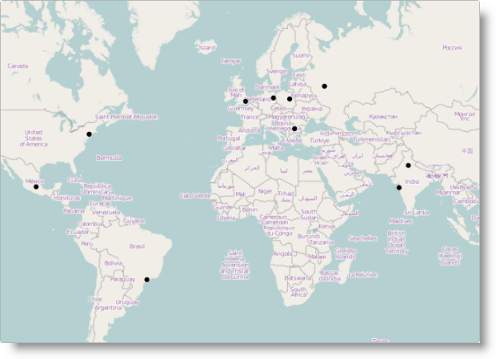

# igMap の追加

## トピックの概要


### 目的

このトピックは、基本的な機能を備えた簡易 `igMap`™ コントロールを Web ページに追加するためのチュートリアルです。

### 前提条件

以下の表は、このトピックを理解するための前提条件として必要なトピックと外部記事の一覧です。


**トピック**

-	[&#123;environment:ProductName&#125; の概要](/igniteui-for-jquery-overview): &#123;environment:ProductName&#125;™ ライブラリにつぃての一般的情報

-	[&#123;environment:ProductName&#125; で JavaScript リソースの使用](/deployment-guide-javascript-resources): このトピックは、必要な JavaScript リソースを追加して &#123;environment:ProductName&#125; ライブラリからコントロールを使用する場合の全般的なガイダンスを提供します。

-	[igMap の概要](/overview-igmap): このトピックは、`igMap` コントロールについて、その主要機能、最小要件、ユーザー インタラクションといった事項の概念的情報を提供します。


**外部リソース**

-   [jQuery](http://docs.jquery.com/Main_Page)、[jQuery UI](http://jqueryui.com)
-   [ASP.NET MVC](http://www.asp.net/mvc)


### このトピックの内容

このトピックは、以下のセクションで構成されます。

-   [igMap の Web ページへの追加](#addig-igMap-html)
    -   [概要](#html-introduction)
    -   [要件](#html-requirements)
    -   [プレビュー](#html-preview)
    -   [前提条件](#html-prerequisites)
    -   [概要](#html-overview)
    -   [手順](#html-steps)
-   [ASP.NET MVC ビューへの igMap の追加](#adding-igMap-mvc)
    -   [概要](#mvc-introduction)
    -   [要件](#mvc-requirements)
    -   [プレビュー](#mvc-preview)
    -   [前提条件](#mvc-prerequisites)
    -   [概要](#mvc-overview)
    -   [手順](#mvc-steps)
-   [関連コンテンツ](#related-content)
    -   [トピック](#topics)
    -   [サンプル](#samples)


## igMap の Web ページへの追加


### 概要

この手順は、マップ上にポイントをプロットする地理シンボル シリーズのコンテキストで、基本的な機能を備えたマップを Web ページに追加する方法を示します。これらのプロットされたポイントは、コントロールにバインドされたデータ内の地理座標によって指定されます。この例は、HTML/jQuery の実装を示しています。適切な `igLoader`™ 構成が含まれており、それにより `igMap` コントロールを使用したり、ローカル JavaScript 配列へのバインディングをしたり、コントロールの操作に不可欠なオプションを構成をします。

### 要件

以下に、Web ページにマップを追加するための要件を示します。

-   必要なリソースを参照します。必要なリソースは次のとおりです。
    -   jQuery、jQueryUI、および Modernizer JavaScript リソース (Web サイトまたは Web アプリケーションのスクリプト フォルダーに格納されている必要があります)
    -   &#123;environment:ProductName&#125; CSS ファイル (Web サイトまたは Web アプリケーションの Infragistics® コンテンツ フォルダーに格納されている必要があります。詳細に関するトピックは [&#123;environment:ProductName&#125; のスタイルとテーマの設定](/deployment-guide-styling-and-theming)を参照)
    -   &#123;environment:ProductName&#125; JavaScript ファイル (Web サイトまたは Web アプリケーションの Infragistics スクリプト フォルダーに格納されている必要があります。詳細は [&#123;environment:ProductName&#125; で JavaScript リソースを使用](/deployment-guide-javascript-resources)トピックを参照)

参照は、手動でまたは [Infragistics Loader](/using-infragistics-loader) (推奨) を使用して追加できます。

ローダーを使用してリソースをロードするには、以下のコードを使用して、ページに `igLoader` スクリプトを含めます。

**HTML の場合:**

```html
<script type="text/javascript" src="/Scripts/ig/js/infragistics.loader.js"></script>
```

さらに HTML ビュー向けにローダーをインスタンス化します。

**HTML の場合:**

```html
<script type="text/javascript">
    $.ig.loader({
        scriptPath: "/Scripts/ig/",
        cssPath: "/Content/ig/",
        resources: "igMap"
    });
</script>
```

リソースを静的にロードする場合は、[概要 (igMap)、最小要件](/overview-igmap#min-requirements)トピックを参照して、マップを使用するためにリンクする必要があるリソース ファイルを確認してください。

-   データ ソース。例示する目的で、この手順では以下のローカル JavaScript 配列が使用されています。

**HTML の場合:**

```html
<script type="text/javascript">
    var data = [
        { Name: "Warsaw", Country: "Poland", Latitude: 52.21, Longitude: 21 },
        { Name: "London", Country: "England", Latitude: 51.50, Longitude: 0.12 },
        { Name: "Berlin", Country: "Germany", Latitude: 52.50, Longitude: 13.33 },
        { Name: "Moscow", Country: "Russia", Latitude: 55.75, Longitude: 37.51 },
        { Name: "Sydney", Country: "Australia", Latitude: -33.83, Longitude: 151.2 },
        { Name: "Tokyo", Country: "Japan", Latitude: 35.6895, Longitude: 139.6917 },
        { Name: "Seoul", Country: "South Korea", Latitude: 37.5665, Longitude: 126.9780 },
        { Name: "Delhi", Country: "India", Latitude: 28.6353, Longitude: 77.2250 },
        { Name: "Mumbai", Country: "India", Latitude: 19.0177, Longitude: 72.8562 },
        { Name: "Manila", Country: "Philippines", Latitude: 14.6010, Longitude: 120.9762 },
        { Name: "Shanghai", Country: "China", Latitude: 31.2244, Longitude: 121.4759 },
        { Name: "Mexico City", Country: "Mexico", Latitude: 19.4270, Longitude: -99.1276 },
        { Name: "New York", Country: "United States", Latitude: 40.7561, Longitude: -73.9870 },
        { Name: "Sao Paulo", Country: "Brasil", Latitude: -23.5489, Longitude: -46.6388 },
        { Name: "Los Angeles", Country: "United States", Latitude: 34.0522, Longitude: -118.2434 },
        { Name: "Sofia", Country: "Bulgaria", Latitude: 42.697845, Longitude: 23.321925 }
    ];
</script>
```

### プレビュー

以下のスクリーンショットは結果のプレビューです。



### 前提条件

手順を実行するには、HTML5 Web ページが必要です。

### 概要

以下はプロセスの概念的概要です。

1.  [igMap コントロールが必要とする HTML マークアップの追加](#html-adding-igMap)
2.  [マップのインスタンス化](#html-instantiating-igMap)
3.  [(オプション) 結果の検証](#html-verifying-result)

### 手順

以下の手順は、基本的な `igMap` コントロール インスタンスを Web ページに追加する方法を示します。

1. <a id="html-adding-igMap"></a>`igMap` コントロールが必要とする HTML マークアップを追加します。

	`igMap` コントロールでは、div 要素をページに追加する必要があります。このコントロールは、ページにマップを表示するためのすべてのマークアップと合わせて div 要素を更新します。

	**HTML の場合:**

```html
	<div id="map"></div>
```

2. <a id="html-instantiating-igMap"></a>マップをインスタンス化します。

	`igMap` コントロールは、HTML ページのスクリプト タグ内でインスタンス化され、手順 [1. igMap コントロールが必要とする HTML マークアップを追加します](/adding-igmap#html-adding-igMap) で作成した div 要素をラップできるようにする必要があります。このコードはマップをインスタンス化します。コード スニペットに続いて追加情報が提供されます。

	**HTML の場合:**

```html
	<script type="text/javascript">
	    $.ig.loader(function () {
	        $("#map").igMap({
	            width: "700px",
	            height: "500px",
	            backgroundContent: {
	                type: "openStreet"
	            },
	            series: [{
	                type: "geographicSymbol",
	                name: "worldCities",
	                dataSource: data,
	                latitudeMemberPath: "Latitude",
	                longitudeMemberPath: "Longitude",
	                markerType: "automatic"
	            }],
	            windowRect: {
	                left: 0.27,
	                top: 0.20,
	                height: 0.45,
	                width: 0.45 
	            }
	        });
	    });
	</script>
```

	width および height オプションは、ページ上のマップのサイズを設定します。マップ ウィンドウの位置と縦横比が緊密に連動しているため、ワールド マップの特定の領域を表示する場合には、(アプリケーションに適した) 縦横比を設定することが重要です。

	`backgroundContent` オプションは、使用するマップ プロバイダーを設定します。この例では OpenStreetMap® プロバイダーを使用しています。これがデフォルトのプロバイダーです。backgroundContent オプションを省略する場合に使用します。Bing® Maps と OpenStreetMap マップの使用方法の詳細は、[マップ プロバイダーの構成](./03_Configuring/00_igMap_Configuring_Map Provider.mdx)トピックを参照してください。

	geographicSymbol シリーズの定義は、 視覚エフェクトデータ シリーズ オプションを構成します。シリーズの name と、視覚エフェクト データが含まれた dataSource を指定する必要があります。さらに、`latitudeMemberPath` および `longitudeMemberPath` オプションを使用して、着信データのどの属性が地理座標であるかを指定する必要があります。最後に、`markerType` によって、地理ポイントを表示する場合に使用するマーカーが自動的に選択されるようにコントロールを構成します。他のシリーズ タイプの構成の詳細は、[各種のマップの作成](/igmap-creating-different-kinds-maps)ランディング ページとリンク先のトピックを参照してください。

	windowRect オプションは、コントロールによって最初にレンダリングされたワールド マップの正確な長方形領域を指定します。指定される値は、0 と 1 の間の相対ユニットです。0 は、ワールド マップの最も北 (上端) または西 (左端) のポイントです。詳細は、[ナビゲーション機能の構成](/igmap-configuring-navigation-features) トピックを参照してください。

3. <a id="html-verifying-result"></a>(オプション) 結果を確認します。

	結果を検証するには、ページを保存し、Web ブラウザーで最終結果を確認します。手順を正しく実行した場合、マップは[プレビュー](/adding-igmap#html-preview)のように表示されます。


## ASP.NET MVC ビューへの igMap の追加


### 概要

この手順は、基本的な機能を備えたマップを ASP.NET MVC ビューに追加する方法を示します。コントロールにバインドされた地理座標のデータによって指定されたマップにポイントをプロットする、地理シンボル シリーズのコンテキストで実行されます。この例では、必要なローダー構成とともに ASP.NET MVC 構文を使用して、コントローラー アクション メソッドによって渡されたデータ モデル オブジェクトにバインドし、コントロールの操作でこれを実行するのに不可欠なオプションを設定しています。

### 要件

以下に、ASP.NET MVC ビューにマップを追加する要件を示します。

-   必要なリソースを参照します。必要なリソースは次のとおりです。
   -   jQuery、jQueryUI、および Modernizer JavaScript リソース (Web サイトまたは Web アプリケーションのスクリプト フォルダーに格納されている必要があります)
    -   &#123;environment:ProductName&#125; CSS ファイル (Web サイトまたは Web アプリケーションの Infragistics® コンテンツ フォルダーに格納されている必要があります。詳細に関するトピックは [&#123;environment:ProductName&#125; のスタイルとテーマの設定](/deployment-guide-styling-and-theming)を参照)
    -   &#123;environment:ProductName&#125; JavaScript ファイル (Web サイトまたは Web アプリケーションの Infragistics スクリプト フォルダーに格納されている必要があります。詳細は [&#123;environment:ProductName&#125; で JavaScript リソースを使用](/deployment-guide-javascript-resources)トピックを参照)

参照は、手動でまたは [Infragistics Loader](/using-infragistics-loader) (推奨) を使用して追加できます。

ローダーを使用してリソースをロードするには、以下のコードを使用して、ページに `igLoader` スクリプトを含めます。

**HTML の場合:**

```html
<script type="text/javascript" src="/Scripts/ig/js/infragistics.loader.js"></script>
```

次に ASP.NET MVC プロジェクトで `Infragistics.Web.Mvc` アセンブリを参照し、`Infragistics.Web.Mvc` 名前空間をビューで参照します。詳細は、[&#123;environment:ProductName&#125; での JavaScript リソースの使用](/deployment-guide-javascript-resources)を参照してください。明確にするために、名前空間を参照するコードを以下に示します。

**ASPX の場合:**

```csharp
<%@ Import Namespace="Infragistics.Web.Mvc" %>
. . .
<%= Html.Infragistics().Loader()
        .ScriptPath(Url.Content("~/Scripts/ig/")
        .CssPath(Url.Content("~/Content/ig/")
        .Render()
%>
```

リソースを静的にロードする場合は、[概要 (igMap)、最小要件](/overview-igmap)トピックを参照して、マップを使用するためにリンクする必要があるリソース ファイルを確認してください。

-   **データ ソース。**例示する目的で、手順の Index メソッドでは以下のコードが使用されています。

    **C# の場合:**

```csharp
    public ActionResult Index()
    {
        List<WorldCity> worldCities = new List<WorldCity>
        {
            new WorldCity { Name = "Warsaw", Country = "Poland", 
                Latitude = 52.21, Longitude = 21 },
            new WorldCity { Name = "London", Country = "England", 
                Latitude = 51.50, Longitude = 0.12 },
            new WorldCity { Name = "Berlin", Country = "Germany", 
                Latitude = 52.50, Longitude = 13.33 },
            new WorldCity { Name = "Moscow", Country = "Russia", 
                Latitude = 55.75, Longitude = 37.51 },
            new WorldCity { Name = "Sydney", Country = "Australia", 
                Latitude = -33.83, Longitude = 151.2 },
            new WorldCity { Name = "Tokyo", Country = "Japan", 
                Latitude = 35.6895, Longitude = 139.6917 },
            new WorldCity { Name = "Seoul", Country = "South Korea", 
                Latitude = 37.5665, Longitude = 126.9780 },
            new WorldCity { Name = "Delhi", Country = "India", 
                Latitude = 28.6353, Longitude = 77.2250 },
            new WorldCity { Name = "Mumbai", Country = "India", 
                Latitude = 19.0177, Longitude = 72.8562 },
            new WorldCity { Name = "Manila", Country = "Philippines", 
                Latitude = 14.6010, Longitude = 120.9762 },
            new WorldCity { Name = "Shanghai", Country = "China", 
                Latitude = 31.2244, Longitude = 121.4759 },
            new WorldCity { Name = "Mexico City", Country = "Mexico", 
                Latitude = 19.4270, Longitude = -99.1276 },
            new WorldCity { Name = "New York", Country = "United States", 
                Latitude = 40.7561, Longitude = -73.9870 },
            new WorldCity { Name = "Sao Paulo", Country = "Brasil", 
                Latitude = -23.5489, Longitude = -46.6388 },
            new WorldCity { Name = "Los Angeles", Country = "United States", 
                Latitude = 34.0522, Longitude = -118.2434 },
            new WorldCity { Name = "Sofia", Country = "Bulgaria", 
                Latitude = 42.697845, Longitude = 23.321925 }
        };
        return View(worldCities.AsQueryable());
    }
```

### プレビュー

以下のスクリーンショットは結果のプレビューです。


### 前提条件

手順を完了実行するには、Visual Studio の ASP.NET MVC Web アプリケーションが必要です。

### 概要

以下はプロセスの概念的概要です。

1.  [データ モデルの追加](#mvc-adding-data-model)
2.  [コントローラー アクション メソッドの追加](#mvc-adding-controller-action)
3.  [ASP.NET ビューの作成](#mvc-view)
4.  [igMap コントロールのインスタンス化](#mvc-instantiating-igMap)
5.  [*(オプション)* 結果の検証](#mvc-verifying-result)

### 手順

以下の手順では、基本的な `igMap` コントロール インスタンスを MVC アプリケーションに追加する方法を示します。

1. <a id="mvc-adding-data-model"></a>データ モデルを追加します。

	ASP.NET MVC ビューのデータは、Controller メソッドと適切なデータ モデル定義により提供されます。以下のコードはデータ モデル部分を示します。新しい空のクラスを作成し、WorldCity という名前を付け、ASP.NET MVC アプリケーションの Models フォルダーに保存し、以下のコードを追加します。

	**C# の場合:**

```csharp
	namespace SampleMvcApp.Models
	{
	    public class WorldCity
	    {
	        public string Name { get; set; }
	        public string Country { get; set; }
	        public double Latitude { get; set; }
	        public double Longitude { get; set; }
	    }
	}
```

	モデル クラスには、ワールド マップ上の都市の場所に関するデータが Name、Country、地理座標 (Latitude および Longitude) とともに保存されます。

2. <a id="mvc-adding-controller-action"></a>コントローラー アクション メソッドを追加します。

	ASP.NET MVC アプリケーションの Controllers フォルダーに空のコントローラー クラスを追加します。

	コントローラー アクションでは、データベースまたは外部のデータ サービスから提供されたデータによってアプリケーション内の WorldCity オブジェクトのリストが初期化され、そのデータによってコントローラーのデフォルトのビューが呼び出されます。

3. <a id="mvc-view"></a>ASP.NET ビューを作成します。

	コントローラー アクション メソッドに対応するビューを作成します。以下のコードを追加してビューを厳密に型指定されたものにし、すでに上で作成したデータ モデル クラスをポイントします。

	**ASPX の場合:**

```csharp
	<%@ Page Language="C#" Inherits="IQueryable<SampleMvcApp.Models.WorldCity>"
	    MasterPageFile="~/Views/Shared/MvcSite.Master" %>
```

4. <a id="mvc-instantiating-igMap"></a>`igMap` コントロールをインスタンス化します。

	ここに示すコードを使用してマップをインスタンス化します。以下のコード スニペットを使用することで、追加情報が得られます。

	**ASPX の場合:**

```csharp
	<%= Html.Infragistics().Map(Model)
	        .ID("map")
	        .Width("700px")
	        .Height("500px")
	        .BackgroundContent(bgr => bgr.OpenStreetMaps())
	        .Series(series => {
	            series.GeographicSymbol("worldCities")
	                .LatitudeMemberPath(item => item.Latitude)
	                .LongitudeMemberPath(item => item.Longitude)
	                .MarkerType(MarkerType.Automatic)
	        })
	        .WindowRect(0.27, 0.20, 0.5, 0.5)
	        .DataBind()
	        .Render()
	%>
```

	Map(Model) の呼び出しでは、ビューに対して宣言されたデータ モデル オブジェクトがコントロールに割り当てられます。モデルのメンバーはマップ シリーズの定義で参照されます。

	Width および Height  呼び出しによって、ページ上のマップのサイズが設定されます。マップ ウィンドウの位置と縦横比が緊密に連動しているため、ワールド マップの特定の領域を表示する場合には、(アプリケーションに適した) 縦横比を設定することが重要です。

	BackgroundContent 呼び出しは、アプリケーションで使用するマップ プロバイダーを指定します。この例では OpenStreetMap プロバイダーを使用します。これが、`BackgroundContent()` 呼び出しを省略した場合に使用されるデフォルトのプロバイダーです。Bing Maps と OpenStreetMap の使用方法の詳細は、[マップ プロバイダーの構成](./03_Configuring/00_igMap_Configuring_Map Provider.mdx)トピックを参照してください。

	Series 呼び出しは、 `GeographicSymbol` シリーズの定義を構成します。呼び出しでは、シリーズで使用する名前 「worldCities」 を指定します。`LatitudeMemberPath` および `LongitudeMemberPath` オプションを使用して、着信データのどの属性が地理座標であるかを指定する必要があります。最後に、`MarkerType` 呼び出しは、表示される地理ポイントに対して使用するマーカーを自動的に選択するコントロールを構成します。他のシリーズ タイプの構成の詳細は、[各種のマップの作成](/igmap-creating-different-kinds-maps)ランディング ページとリンク先のトピックを参照してください。

	WindowRect 呼び出しは、コントロールによって最初にレンダリングされたワールド マップの正確な長方形領域を指定します。指定される値は、0 と 1 の間の相対ユニットです。0 は、ワールド マップの最も北 (上端) または 西 (左端) のポイントです。詳細は、[ナビゲーション機能の構成](/igmap-configuring-navigation-features) トピックを参照してください。

5. <a id="mvc-verifying-result"></a>(オプション) 結果を確認します。

	結果を検証するには、ページを保存し、Web ブラウザーで結果を確認します。手順を正しく実行した場合、マップは[プレビュー](#mvc-preview)のように表示されます。


## 関連コンテンツ


### トピック

このトピックの追加情報については、以下のトピックも合わせてご参照ください。

-	[データ バインディング (igMap)](/data-binding-igmap): このトピックは、視覚化されたマップ シリーズに応じて `igMap` コントロールをさまざまなデータ ソースにバインドする方法を説明します。

-	[マップのスタイル設定 (igMap)](/styling-igmap): このトピックでは、テーマを使用して `igMap` コントロールのルック アンド フィールをカスタマイズする方法を説明します。

-	[機能の構成 (igMap)](/igmap-configuring-features): このグループのトピックでは、`igMap` コントロールのさまざまな機能の構成方法を説明します。対応する機能としては、特定の地理領域へのナビゲーション、Overview Plus Detail パネルの有効または無効化、表示中の領域をマップ上で取得、パンとズームに関するユーザー インタラクションの構成、ツールチップ テンプレートの構成、カスタム マーカーの設定などがあります。

-	[マップ シリーズの構成 (igMap)](/igmap-creating-different-kinds-maps): このグループのトピックでは、`igMap` コントロールによってサポートされているすべてのマップ タイプ (マップ シリーズ) を構成し、各種のマップを生成する方法を説明します。

-	[API リンク (igMap)](/igmap-api-links):このトピックでは、`igMap` コントロールの jQuery および ASP.NET MVC ヘルパー クラスの API ドキュメントへのリンクを提供します。


### サンプル

このトピックについては、以下のサンプルも参照してください。

-	[マップのツールチップ](/igmap-configuring-visual-features#map-tooltips-sample): このサンプルでは、マップ コントロールでマップ ツールチップを設定し、ビュー モデルをコントロールにバインドする方法を紹介します。

-	[地理記号シリーズ](&#123;environment:SamplesUrl&#125;/map/geo-symbol-series): このサンプルは、マップを作成し、地理シンボル シリーズを表示する方法を示します。


 

 


