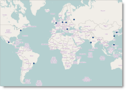
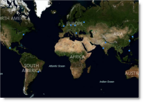
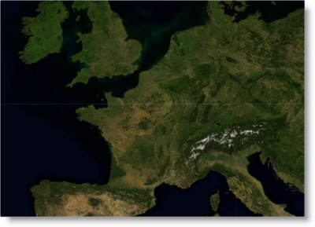
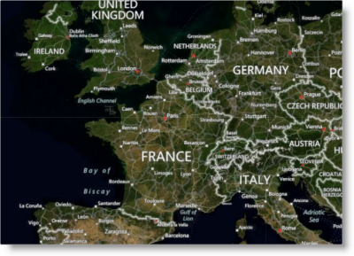
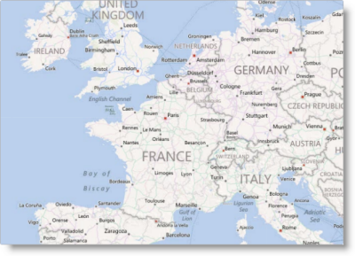

---
title: "マップ プロバイダーの構成 (igMap)"
slug: igmap-configuring-map-provider
---

# マップ プロバイダーの構成 (igMap)


##トピックの概要

### 目的

このトピックでは、コード例を使用して、`igMap`™ コントロールを構成して、サポートされるマップ プロバイダーとその画像セットを使用する方法について説明します。

### 前提条件

このトピックを理解するために、以下のトピックを参照することをお勧めします。

-	[igMap の概要](/controls/igmap/overview-igmap): このトピックは、`igMap` コントロールについて、その主要機能、最小要件、ユーザー インタラクションといった事項の概念的情報を提供します。

-	[igMap の追加](/controls/igmap/adding-igmap): このトピックでは、基本的な機能を備えた簡易マップを Web ページに追加する方法を示します。


#### このトピックの内容

このトピックは、以下のセクションで構成されます。

-   [概要](#introduction)
-   [背景コンテンツの構成](#background-config)
-   [マップ画像の参照](#map-reference)
    -   [マップ 画像の概要](#map-imagery-summary)
    -   [Bing Maps の画像セット](#bing-maps-imagery)
-   [コード例](#code-examples)
    -   [OpenStreetMaps 背景コンテンツの構成](#config-open-street-maps)
    -   [画像セットを使用した Bing Maps 背景コンテンツの構成](#config-bing-maps)
-   [関連コンテンツ](#related-content)
    -   [トピック](#topics)
    -   [サンプル](#samples)
    -   [リソース](#resources)


##<a id="introduction"></a>概要

### igMap のマップ プロバイダーの概要

`igMap` コントロールは以下のマップ プロバイダーを使用できます。

-   [OpenStreetMap](http://www.openstreetmap.org/)
-   [Bing® Maps](http://www.bing.com/maps/)

マップ プロバイダーはマップ画像を提供し、マップ シリーズはこの背景コンテンツを介してオーバーレイとして描画されます。このコントロールは、任意の背景コンテンツの任意の地理シリーズの描画をサポートしています。マップ プロバイダーを選択できるだけでなく、プロバイダーが提供するさまざまな画像セットから選ぶことができます。画像セットは、衛星写真、名前ラベル付きの衛星写真または道路網などのテーマ化されたマップのセットです。

>**注:** Bing Maps では、コンテンツにアクセスするには、カスタム アクセス キーを提供する必要があります。

以下の表は、利用可能な 3 つのマップ プロバイダーを使用して、同じマップ領域と地理シンボル シリーズを示しています。

OpenStreetMap|Bing Maps
---|---
|


##<a id="background-config"></a>背景コンテンツの構成

### コントロール構成の要点チャート

以下の表に、マップ プロバイダーおよび画像セットに関連する igMap コントロールの構成可能な要素の一覧を示します。このメソッドについては、表の下にある解説も参照してください。


|  |  |  |
| --- | --- | --- |
| 構成可能な項目 | 詳細 | プロパティ |
| 背景コンテンツ | このコントロールを構成して、特定のプロバイダーからの背景タイルを使用することができます。 | JavaScript の場合 [backgroundContent.type](environment:jQueryApiUrl/ui.igMap#options) ASP.NET MVC の場合 [BackgroundContent()](Infragistics.Web.Mvc~Infragistics.Web.Mvc.BackgroundContent`1.html) [BackgroundContentBuilder.OpenStreetMaps()](Infragistics.Web.Mvc~Infragistics.Web.Mvc.BackgroundContentBuilder~OpenStreetMaps.html) [BackgroundContentBuilder.BingMaps()](Infragistics.Web.Mvc~Infragistics.Web.Mvc.BackgroundContentBuilder~BingMaps.html) |
| Bing Maps の画像セット | 背景コンテンツ プロバイダーを Bing Maps に設定した場合、画像セットは構成可能です。 | JavaScript の場合 [backgroundContent.imagerySet](environment:jQueryApiUrl/ui.igMap#options:backgroundContent.imagerySet) ASP.NET MVC の場合 [BingMaps.ImagerySet()](Infragistics.Web.Mvc~Infragistics.Web.Mvc.BingMaps~ImagerySet.html) |
| マップ プロバイダー用の構成可能なキー | プロバイダーからのマップ コンテンツにアクセスするための開発者/カスタマー キーを構成します。 | JavaScript の場合 [backgroundContent.key](environment:jQueryApiUrl/ui.igMap#options:backgroundContent.key) ASP.NET MVC の場合 [BackgroundContentBuilder.BingMaps()](Infragistics.Web.Mvc~Infragistics.Web.Mvc.BackgroundContentBuilder~BingMaps.html) |


##<a id="map-reference"></a>マップ画像の参照

### <a id="map-imagery-summary"></a>マップ 画像の概要

一部のマップ プロバイダーは、マップの複数の画像セットを提供しています。画像セットは、さまざまなコンテンツまたはスタイルを提供する、さまざまなマップ画像です。

### <a id="bing-maps-imagery"></a>Bing Maps の画像セット

以下の表は、`igMap` コントロールがサポートする **Bing Maps** の画像セットをまとめたものです。スタイル コードを [backgroundContent.imagerySet](&#123;environment:jQueryApiUrl&#125;/ui.igMap#options:backgroundContent.imagerySet) オプションに割り当てることによって、選択したスタイルを構成します。


Aerial



AerialWithLabels



Road



collinsBart


##<a id="code-examples"></a>コード例

### コード例の概要

以下の表は、このトピックで使用したコード例をまとめたものです。

例|説明
---|---
[](#config-open-street-maps)[OpenStreetMaps 背景コンテンツの構成](#config-open-street-maps)|この例では、OpenStreetMaps 背景を使用してマップ コントロールを構成する方法を示しています。
[画像セットを使用した Bing Maps 背景コンテンツの構成](#config-bing-maps)|この例では、Bing Maps 背景および画像を使用してマップ コントロールを構成する方法を示しています。


##<a id="config-open-street-maps"></a>コード例: OpenStreetMaps 背景コンテンツの構成


### 説明

この例では、OpenStreetMaps 背景を使用してマップ コントロールを構成する方法を示しています。

### コード

以下の JavaScript のコードでは、マップ コントロールを構成して OpenStreetMaps を使用しています。`backgroundContent` オプションを、`type` に対して「`openStreet`」が指定されたオブジェクトに割り当てます。

**JavaScript の場合:**

```js
$("#map").igMap({
    ...
    backgroundContent: {
        type: "openStreet"
    },
    ...
});
```

以下の ASP.NET MVC のコードでは、マップ コントロールを構成して OpenStreetMaps を使用しています。`BackgroundContent()` 関数は、 `BackgroundContentBuilder` を実行するラムダ式に渡されます。`OpenStreetMaps()` 静的メソッド。このアクションは、上記の例に似た JavaScript コードを生成する **OpenStreetMaps** クラス インスタンスを作成します。

**ASPX の場合:**

```csharp
<%= Html.Infragistics().Map(Model)
        .ID("map")
        ...
        .BackgroundContent(bgr => bgr.OpenStreetMaps())
        ...
        .DataBind()
        .Render()
%>
```


##<a id="config-bing-maps"></a>コード例: 画像セットを使用した Bing Maps 背景コンテンツの構成

### 説明

この例では、Bing Maps 背景を使用してマップ コントロールを構成する方法を示しています。これはまた、画像セットを使用して Road を表示します。

### コード

以下の JavaScript のコードでは、マップ コントロールを構成して Bing Maps を使用しています。`backgroundContent` オプションは、`type` および `key` に対して「**bing**」が指定されたオブジェクトに割り当てられ、Bing Maps サービスへのアクセスを可能にします。`imagerySet` オプションで設定された `Road` 画像セットを指定します。

**JavaScript の場合:**

```js
$("#map").igMap({
    ...
    backgroundContent: {
        type: "bing",
        key: "123456789abcdef",
        imagerySet: "Road"
    },
    ...
});
```

以下の ASP.NET MVC のコードでは、マップ コントロールを構成して Bing Maps を使用しています。`BackgroundContent()` 関数がラムダ式に渡され、パラメーターとして渡された Bing Maps サービスのアクセス キーを使用して、`BackgroundContentBuilder.BingMaps()` 静的メソッドを実行します。このアクションは、上記の例に似た JavaScript コードを生成する BingMaps クラス インスタンスを作成します。

**ASPX の場合:**

```csharp
<%= Html.Infragistics().Map(Model)
        .ID("map")
        ...
        .BackgroundContent(bgr => bgr.BingMaps("123456789abcdef")
                .ImagerySet(ImagerySet.Road))
        ...
        .DataBind()
        .Render()
%>
```


##<a id="related-content"></a>関連コンテンツ

### <a id="topics"></a>トピック

このトピックの追加情報については、以下のトピックも合わせてご参照ください。

-	[データ バインディング (igMap)](/controls/igmap/data-binding-igmap): このトピックは、視覚化されたマップ シリーズに応じて `igMap` コントロールをさまざまなデータ ソースにバインドする方法を説明します。

-	[機能の構成 (igMap)](/controls/igmap/configuring/features/configuring-features): このトピックは、`igMap` コントロールのさまざまな機能を構成する方法を説明するトピックのリンクがあるランディング ページです。


### <a id="samples"></a>サンプル

このトピックについては、以下のサンプルも参照してください。

-	[Bing Maps](&#123;environment:SamplesUrl&#125;/map/bing-maps): このサンプルでは、Bing Maps を使用してマップ コントロールで地理シリーズを描画する方法を紹介します。


### <a id="resources"></a>リソース

以下の資料 (Infragistics のコンテンツ ファミリー以外でもご利用いただけます) は、このトピックに関連する追加情報を提供します。

-	[OpenStreetMap](http://www.openstreetmap.org/): OpenStreetMap のホーム ページ。

-	[Bing Maps](http://www.bing.com/maps/): Bing Maps のホーム ページ。


 

 


