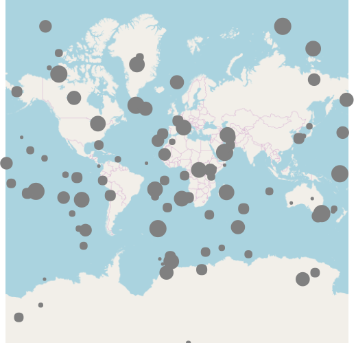
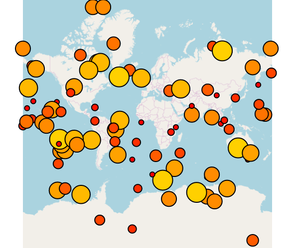

import ApiLink from 'docs-template/components/mdx/ApiLink.astro';

# 地理比例シンボル シリーズの構成 (igMap)

## トピックの概要

### 目的

このトピックでは、`igMap`™ コントロールを使用して地理比例シンボル シリーズを構成する方法について説明します。

### 前提条件

本トピックの理解を深めるために、以下のトピックを参照することをお勧めします。

- [igMap の概要](/overview-igmap): このトピックは、`igMap` コントロールについて、その主要機能、最小要件、ユーザー インタラクションといった事項の概念的情報を提供します。

- [igMap の追加](/adding-igmap): このトピックは、基本的な機能を備えた簡易 `igMap` コントロールを Web ページに追加する方法を示すチュートリアルです。


### このトピックの内容

このトピックは、以下のセクションで構成されます。

-   [概要](#introduction)
-   [地理シンボル シリーズ構成の概要](#config-summary)
-   [コード例の概要](#code-example-summary)
    -   [JavaScript における地理シンボル シリーズの構成](#config-series-js)
-   [関連コンテンツ](#related-content)
    -   [トピック](#topics)
    -   [サンプル](#samples)


##<a id="introduction"></a> 概要


### 地理シンボル シリーズの概要

`igMap` の地理シンボル シリーズでは、アプリケーション内のデータによって指定された地理ポイントにマーカーをプロットします。このマップ シリーズは、百貨店、倉庫、オフィスなど、特定のビジネス ケースに応じたポイントを強調表示する場合に役立ちます。このマップ シリーズのその他の用途としては、動的な車両追跡を行うフリート管理システムまたは GPS システムなどが挙げられます。

以下の画像は `igMap` コントロールで地理シンボル シリーズのプレビューです。記号の RadiusScale は、比例半径スケールを使用して、データ ポイントの値のサイズを表示します。



## <a id="config-summary"></a>地理比例シンボル シリーズ構成の概要

### 地理比例シンボル シリーズ構成の概要表

以下の表は、地理比例シンボル シリーズに関する `igMap` コントロールの構成可能な要素を示しています。


| 構成可能な項目 | 詳細 | プロパティ |
| --- | --- | --- |
| 地理比例シンボル シリーズの設定 | これらの必須設定を使用して、地理比例シンボルにマップ シリーズのタイプを構成し、シリーズ名を設定します。 | JavaScript の場合: <ApiLink type="igMap" member="series.type" section="options" label="series.type" /> <ApiLink type="igMap" member="series.name" section="options" label="series.name" /> 値: ```js series.type: "geographicProportionalSymbol", series.type: "seriesName" ``` ASP.NET MVC の場合: [MapSeriesBuilder Class](Infragistics.Web.Mvc~Infragistics.Web.Mvc.MapSeriesBuilder`1.html) [.GeographicProportionalSymbol()](Infragistics.Web.Mvc~Infragistics.Web.Mvc.MapSeriesBuilder`1~GeographicProportionalSymbol.html) 値: ```js series.GeographicProportionalSymbol("seriesName") ``` |
| 地理比例シンボル シリーズのデータ バインディング オプション | これらの必須設定を使用して、マップ上にポイントを描画するための地理座標が入力データのどのプロパティに含まれるかを構成します。 | JavaScript の場合: <ApiLink type="igMap" member="series.latitudeMemberPath" section="options" label="series.latitudeMemberPath" /> <ApiLink type="igMap" member="series.longitudeMemberPath" section="options" label="series.longitudeMemberPath" /> ASP.NET MVC の場合: [GeographicProportionalSymbol Class](Infragistics.Web.Mvc~Infragistics.Web.Mvc.GeographicSymbolSeries`1.html) [.LatitudeMemberPath()](Infragistics.Web.Mvc~Infragistics.Web.Mvc.GeographicProportionalSymbol`1~LatitudeMemberPath.html) [.LongitudeMemberPath()](Infragistics.Web.Mvc~Infragistics.Web.Mvc.GeographicProportionalSymbol`1~LongitudeMemberPath.html) |
| ツールチップの表示/非表示 | これらの設定を使用して、ツールチップのレンダリングを有効または無効にします。このコントロールのデフォルト設定では、ツールチップはレンダリングされません。 | JavaScript の場合: <ApiLink type="igMap" member="series.showTooltip" section="options" label="series.showTooltip" /> ASP.NET MVC の場合: [GeographicProportionalSymbol Class](Infragistics.Web.Mvc~Infragistics.Web.Mvc.GeographicProportionalSymbol`1.html) [.ShowTooltip()](Infragistics.Web.Mvc~Infragistics.Web.Mvc.Series`3~ShowTooltip.html) |
| ツールチップ テンプレート | この設定を使用して、ツールチップのレンダリングに使用するテンプレートを構成します。 | JavaScript の場合: <ApiLink type="igMap" member="series.tooltipTemplate" section="options" label="series.tooltipTemplate" /> ASP.NET MVC の場合: [GeographicProportionalSymbol Class](Infragistics.Web.Mvc~Infragistics.Web.Mvc.GeographicProportionalSymbol`1.html) [.TooltipTemplate()](Infragistics.Web.Mvc~Infragistics.Web.Mvc.Series`3~TooltipTemplate.html) |
| マーカー アウトライン | この必須設定は、値のアウトラインに対してカラー パレットを構成します。この設定にデフォルト値はありません。 | JavaScript の場合: <ApiLink type="igMap" member="series.markerOutline.brushes" section="options" label="series.markerOutline.brushes" /> ASP.NET MVC の場合: [MarkerOutline.Brushes()](Infragistics.Web.Mvc~Infragistics.Web.Mvc.MarkerOutline`1~Brushes.html) |
| カラーパレット | この必須設定は、値に対してカラー パレットを構成します。この設定にデフォルト値はありません。 | JavaScript の場合: <ApiLink type="igMap" member="series.fillScale.brushes" section="options" label="series.fillScale.brushes" /> ASP.NET MVC の場合: [FillScale.Brushes()](Infragistics.Web.Mvc~Infragistics.Web.Mvc.FillScale`1~Brushes.html) |
| カラー パレットの最小値 | 値のサブ範囲を計算する最小値を構成します。 | JavaScript の場合: <ApiLink type="igMap" member="series.fillScale.minimumValue" section="options" label="series.fillScale.minimumValue" /> ASP.NET MVC の場合: [FillScale.MinimumValue()](Infragistics.Web.Mvc~Infragistics.Web.Mvc.ValueBrushScale~MinimumValue.html) |
| カラー パレットの最大値 | 値のサブ範囲を計算する最大値を構成します。 | JavaScript の場合: <ApiLink type="igMap" member="series.fillScale.maximumValue" section="options" label="series.fillScale.maximumValue" /> ASP.NET MVC の場合: [FillScale.MaximumValue()](Infragistics.Web.Mvc~Infragistics.Web.Mvc.ValueBrushScale~MaximumValue.html) |
| 半径スケール | この必須設定は、バブルの値に対して半径スケールを構成します。この設定にデフォルト値はありません。 | JavaScript の場合: <ApiLink type="igMap" member="series.radiusScale.brushes" section="options" label="series.radiusScale.brushes" /> ASP.NET MVC の場合: [RadiusScale.Brushes()](Infragistics.Web.Mvc~Infragistics.Web.Mvc.RadiusScale`1~Brushes.html) |
| バブルの最小値 | 値のサブ範囲を計算する最小値を構成します。 | JavaScript の場合: <ApiLink type="igMap" member="series.radiusScale.minimumValue" section="options" label="series.radiusScale.minimumValue" /> ASP.NET MVC の場合: [RadiusScale.MinimumValue()](Infragistics.Web.Mvc~Infragistics.Web.Mvc.ValueBrushScale~MinimumValue.html) |
| バブルの最大値 | 値のサブ範囲を計算する最大値を構成します。 | JavaScript の場合: <ApiLink type="igMap" member="series.radiusScale.maximumValue" section="options" label="series.radiusScale.maximumValue" /> ASP.NET MVC の場合: [RadiusScale.MaximumValue()](Infragistics.Web.Mvc~Infragistics.Web.Mvc.ValueBrushScale~MaximumValue.html) |


##<a id="code-example-summary"></a> コード例の概要

### コード例の概要表

以下の表は、このトピックで使用したコード例をまとめたものです。

例|説明
---|---
[JavaScript における地理シンボル シリーズの構成](#config-series-js)|このコード例は、`igMap` コントロールを構成して、地理シンボル シリーズを JavaScript で表示する方法を示しています。
[ASP.NET MVC における地理シンボル シリーズの構成](#config-series-mvc)|このコード例は、`igMap` コントロールを構成して、地理シンボル シリーズを ASP.NET MVC で表示する方法を示しています。


##<a id="config-series-js"></a> コード例: JavaScript における地理シンボルシリーズの構成

### 説明

このコード例は、`igMap` コントロールを構成して、地理シンボル シリーズを JavaScript で表示する方法を示しています。この例は、シリーズのデータ バインディング オプションを指定する方法を示しています。予定表連動マーカー選択は、マーカー競合回避ロジックと合わせて構成され、マーカー アウトラインと塗りつぶしの色も指定されます。

### コード

**JavaScript の場合:**

```js
 $("#map").igMap({
    ...
    series: [{
    name: "series1",
    type: "geographicProportionalSymbol", 
    dataSource: data,
    markerType: "circle", 
    markerOutline: "black",
    longitudeMemberPath: "Longitude",
    latitudeMemberPath: "Latitude",
    radiusMemberPath: "Magnitude",
    radiusScale: {
        minimumValue: 10,
        maximumValue: 40, 
    },
    fillMemberPath: "Magnitude",
    fillScale: {
         type: "value",
         brushes: ["red", "yellow"],
         minimumValue: 1,
         maximumValue: 12
     }
    }],
    ...
});
```

以下の画像は上記のコードの結果です。`igMap` コントロールで radiusScale、markerOutline、および fillScale が定義された地理シンボル シリーズを表示します。



##<a id="related-content"></a> 関連コンテンツ

### <a id="topics"></a>トピック

このトピックに関連する追加情報については、以下のトピックを参照してください。

-	[マップ シリーズの構成 (igMap)](/igmap-creating-different-kinds-maps): このトピックは、`igMap` コントロールでサポートされているすべてのマップ視覚エフェクトを構成し、さまざまな背景コンテンツ (マップ プロバイダー) を使用する方法を説明するトピックのリンクがあるランディング ページです。

-	[機能の構成 (igMap)](/igmap-configuring-features): このトピックは、`igMap` コントロールのさまざまな機能を構成する方法を説明するトピックのリンクがあるランディング ページです。

-	[データ バインディング (igMap)](/data-binding-igmap): このトピックは、可視化されたマップ シリーズに応じて `igMap` コントロールをさまざまなデータ ソースにバインドする方法を説明します。

-	[マップのスタイル設定 (igMap)](/styling-igmap): このトピックは、ビジュアル スタイル設定に関連して igMap コントロールを構成する方法を説明しています。


### <a id="samples"></a>サンプル

このトピックについては、以下のサンプルも参照してください。

-	[地理記号シリーズ](&#123;environment:SamplesUrl&#125;/map/geo-symbol-series): このサンプルは、マップを作成し、地理シンボル シリーズを表示する方法を示します。