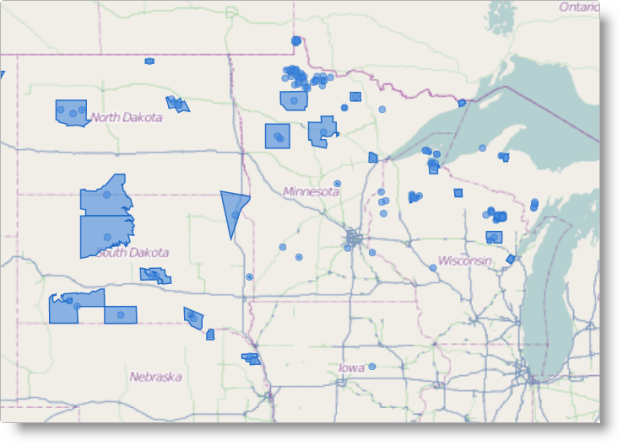

---
title: "地理図形シリーズの構成 (igMap)"
slug: igmap-configuring-geographic-shapes
---

# 地理図形シリーズの構成 (igMap)


##トピックの概要

### 目的

このトピックでは、`igMap`™ コントロールを使用して地理図形シリーズを構成する方法を説明します。

### 前提条件

このトピックを理解するために、以下のトピックを参照することをお勧めします。

-	[igMap の概要](/controls/igmap/overview-igmap): このトピックは、`igMap` コントロールについて、その主要機能、最小要件、ユーザー インタラクションといった事項の概念的情報を提供します。

- [igMap の追加](/controls/igmap/adding-igmap): このトピックは、基本的な機能を備えた簡易 `igMap` コントロールを Web ページに追加する方法を示すチュートリアルです。

### このトピックの内容

このトピックは、以下のセクションで構成されます。

-   [概要](#introduction)
-   [地理図形シリーズの構成の概要](#config-summary)
-   [コード例の概要](#code-example)
    -   [JavaScript における地理図形シリーズの構成](#config-series-js)
    -   [ASP.NET MVC における地理図形シリーズの構成](#config-series-mvc)
    -   [カスタム図形データ ソースの構成](#config-custom-datasource)
-   [関連コンテンツ](#related-content)
    -   [トピック](#topics)
    -   [サンプル](#samples)


##<a id="introduction"></a>概要

### 地理図形シリーズの概要

`igMap` コントロールの地理図形シリーズを実際に適用するには、シェープ ファイル、またはアプリケーションが提供するカスタム図形データ ソースで指定された地理領域の図形 (またはクローズド パス) を描画します。シェープ ファイルは、各図形に関連する情報が含まれた対応するデータベースの DBF ファイルと常にペアになっています。カスタム図形データ ソースは、プロパティの形で、または内部構造の一部としてのデータ オブジェクトの形で、各図形に関連する情報を提供します。

地理図形シリーズは、ワールド マップ上で目的のエリアを強調表示する場合に役立ちます。これは、国または行政区域を示すマップ、市場地域、またはその他の地理領域を描画する場合に適しています。



`igMap` コントロールを構成して、図形と合わせてマーカーを描画し、またカスタム マーカーを作成することができます。詳細は、[ビジュアル機能の構成 (igMap)](/controls/igmap/configuring/features/configuring-visual-features) のトピックを参照してください。

CSS スタイルまたはシリーズ オブジェクトのオプションを使用して、図形やマーカーのアウトラインや色を制御できます。詳細については、トピック[マップのスタイル設定 (igMap)](/controls/igmap/styling-igmap) を参照してください。

>**注:** モバイル デバイスを対象にする場合には、小さい図形データ セットを使用することをお勧めします。地理空間データをレンダリングするにはより多くのコンピューティング リソースが必要になり、ほとんどのモバイル デバイスの場合、デスクトップ PC やノート PC と比較してパフォーマンスが低くなります。


##<a id="config-summary"></a>地理図形シリーズの構成の概要

### 地理図形シリーズの構成の概要図

以下の表は、`igMap` コントロールの地理図形シリーズの構成可能な要素を示しています。


|  |  |  |
| --- | --- | --- |
| 構成可能な項目 | 詳細 | プロパティ |
| 地理図形シリーズの設定 | これらの必須設定では、地理図形にマップ シリーズのタイプを構成し、シリーズの名前を設定します。 | JavaScript の場合: [series.type](environment:jQueryApiUrl/ui.igMap#options) [series.name](environment:jQueryApiUrl/ui.igMap#options), 値:, **series.type: “geographicShape”**, **series.type: "seriesName"**, ASP.NET MVC の場合:, [MapSeriesBuilder&lt;T&gt; クラス](Infragistics.Web.Mvc~Infragistics.Web.Mvc.MapSeriesBuilder`1.html) [.GeographicShape()](Infragistics.Web.Mvc~Infragistics.Web.Mvc.MapSeriesBuilder`1~GeographicShape.html), 値:, **series.GeographicShape(“seriesName”)** |
| 地理図形シリーズのデータ バインディング オプション | これらの必須設定では、図形とデータベース ファイルの URL、またはカスタム図形データ ソースを構成します。 | JavaScript の場合: [series.shapeDataSource](environment:jQueryApiUrl/ui.igMap#options) [series.databaseSource](environment:jQueryApiUrl/ui.igMap#options) ASP.NET MVC の場合: [GeographicShapeSeries&lt;T&gt; クラス](Infragistics.Web.Mvc~Infragistics.Web.Mvc.GeographicShapeSeries`1.html) [.ShapeDataSource()](Infragistics.Web.Mvc~Infragistics.Web.Mvc.GeographicShapeSeriesBase`3~ShapeDataSource.html) [.DatabaseSource()](Infragistics.Web.Mvc~Infragistics.Web.Mvc.GeographicShapeSeriesBase`3~DatabaseSource.html) |
| ツールチップの表示/非表示 | ツールチップのレンダリングを有効に設定します。 デフォルトでは、ツールチップは無効になっています。 | JavaScript の場合: [series.showTooltip](environment:jQueryApiUrl/ui.igMap#options) ASP.NET MVC の場合: [GeographicShapeSeries&lt;T&gt; クラス](Infragistics.Web.Mvc~Infragistics.Web.Mvc.GeographicShapeSeries`1.html) [.ShowTooltip()](Infragistics.Web.Mvc~Infragistics.Web.Mvc.Series`3~ShowTooltip.html) |
| ツールチップ テンプレート | ツールチップのレンダリングに使用するテンプレートを指定するように構成します。 | JavaScript の場合: [series.tooltipTemplate](environment:jQueryApiUrl/ui.igMap#options) ASP.NET MVC の場合: [GeographicShapeSeries&lt;T&gt; クラス](Infragistics.Web.Mvc~Infragistics.Web.Mvc.GeographicShapeSeries`1.html) [.TooltipTemplate()](Infragistics.Web.Mvc~Infragistics.Web.Mvc.Series`3~TooltipTemplate.html) |
| 図形のアウトライン | 図形のアウトラインの色を構成します。 図形のアウトラインのデフォルトの色は黒です。 | JavaScript の場合: [series.outline](environment:jQueryApiUrl/ui.igMap#options) [series.shapeStyle.stroke](environment:jQueryApiUrl/ui.igMap#options) ASP.NET MVC の場合: [GeographicShapeSeries&lt;T&gt; クラス](Infragistics.Web.Mvc~Infragistics.Web.Mvc.GeographicShapeSeries`1.html) [.Outline()](Infragistics.Web.Mvc~Infragistics.Web.Mvc.Series`3~Outline.html) |
| 図形のアウトラインの太さ | 図形のアウトラインの太さを構成します。 デフォルトの太さは 0 です。 | JavaScript の場合: [series.thickness](environment:jQueryApiUrl/ui.igMap#options) [series.shapeStyle.thickness](environment:jQueryApiUrl/ui.igMap#options) ASP.NET MVC の場合: [GeographicShapeSeries&lt;T&gt; クラス](Infragistics.Web.Mvc~Infragistics.Web.Mvc.GeographicShapeSeries`1.html) [.Thickness()](Infragistics.Web.Mvc~Infragistics.Web.Mvc.Series`3~Thickness.html) [.ShapeStyle()](Infragistics.Web.Mvc~Infragistics.Web.Mvc.GeographicShapeSeriesBase`3~ShapeStyle.html) |
| 図形の塗りつぶし | 図形の塗りつぶし色を構成します。 図形のデフォルトの塗りつぶし色は黒です。 | JavaScript の場合: [series.brush](environment:jQueryApiUrl/ui.igMap#options) [series.shapeStyle.fill](environment:jQueryApiUrl/ui.igMap#options) ASP.NET MVC の場合: [GeographicShapeSeries&lt;T&gt; クラス](Infragistics.Web.Mvc~Infragistics.Web.Mvc.GeographicShapeSeries`1.html) [.Brush()](Infragistics.Web.Mvc~Infragistics.Web.Mvc.Series`3~Brush.html) [.ShapeStyle()](Infragistics.Web.Mvc~Infragistics.Web.Mvc.GeographicShapeSeriesBase`3~ShapeStyle.html) |
| マーカー タイプ | コントロールを構成して、レンダリングのためのマーカー選択を指定します。 デフォルトでは、コントロールによって、レンダリングするタイプとマーカーが選択されます。 | JavaScript の場合: [series.markerType](environment:jQueryApiUrl/ui.igMap#options) ASP.NET MVC の場合: [GeographicShapeSeries&lt;T&gt; クラス](Infragistics.Web.Mvc~Infragistics.Web.Mvc.GeographicShapeSeries`1.html) [.MarkerType()](Infragistics.Web.Mvc~Infragistics.Web.Mvc.GeographicShapeSeries`1~MarkerType.html) |
| カスタム マーカー テンプレート | マップに使用する キャンバス 要素にコンテンツを直接レンダリングするコールバック関数で、オブジェクトを構成します。 | JavaScript の場合: [series.markerTemplate](environment:jQueryApiUrl/ui.igMap#options) ASP.NET MVC の場合: [GeographicShapeSeries&lt;T&gt; クラス](Infragistics.Web.Mvc~Infragistics.Web.Mvc.GeographicShapeSeries`1.html) [.MarkerTemplate()](Infragistics.Web.Mvc~Infragistics.Web.Mvc.GeographicShapeSeries`1~MarkerTemplate.html) |
| マーカー アウトライン | マーカーの色付きアウトラインを構成します。 デフォルトでは、アウトラインの色は黒です。 | JavaScript の場合: [series.markerOutline](environment:jQueryApiUrl/ui.igMap#options) ASP.NET MVC の場合: [GeographicShapeSeries&lt;T&gt; クラス](Infragistics.Web.Mvc~Infragistics.Web.Mvc.GeographicShapeSeries`1.html) [.MarkerOutline()](Infragistics.Web.Mvc~Infragistics.Web.Mvc.GeographicSymbolSeries`1~MarkerOutline.html) |
| マーカーの塗りつぶし | マーカーの塗りつぶしの色を構成します。 デフォルトでは、塗りつぶしの色は黒です。 | JavaScript の場合: [series.markerBrush](environment:jQueryApiUrl/ui.igMap#options) ASP.NET MVC の場合: [GeographicShapeSeries&lt;T&gt; クラス](Infragistics.Web.Mvc~Infragistics.Web.Mvc.GeographicShapeSeries`1.html) [.MarkerBrush()](Infragistics.Web.Mvc~Infragistics.Web.Mvc.GeographicSymbolSeries`1~MarkerBrush.html) |


##<a id="code-example"></a>コード例の概要

### コード例の概要表

以下の表は、このトピックで使用したコード例をまとめたものです。

例|説明
---|---
[JavaScript における地理図形シリーズの構成](#config-series-js)|このコード例は、`igMap` コントロールを構成して、地理図形シリーズを JavaScript で表示する方法を示しています。
[ASP.NET MVC における地理図形シリーズの構成](#config-series-mvc)|このコード例は、`igMap` コントロールを構成して、地理図形シリーズを ASP.NET MVC で表示する方法を示しています。
[カスタム図形データ ソースの構成](#config-custom-datasource)|このコード例は、`igMap` コントロールを構成して、カスタム図形データ ソースを使用して地理図形シリーズを表示する方法を示しています。


##<a id="config-series-js"></a>コード例: JavaScript における地理図形シリーズの構成

### 説明

このコード例は、`igMap` コントロールを構成して、地理図形シリーズを JavaScript で表示する方法を示しています。この例は、図形とデータベース ファイルの URL を指定する方法を示しています。図形のアウトラインと色の塗りつぶし範囲、自動マーカー選択、マーカーのアウトラインと塗りつぶし色を構成します。

### コード

**JavaScript の場合:**

```js
Code
$("#map").igMap({
    ...
    series: [{
        type: "geographicShape",
        name: "seriesName",
        markerType: "automatic",
        shapeMemberPath: "points",
        shapeDataSource: '/Data/geoshapes.shp',
        databaseSource: '/Data/geoshapes.dbf',
        brush: "rgba(68,138,223,.6)",
        outline: "blue",
        markerBrush: "rgba(50,100,100,0.7)", 
        markerOutline: "blue"
    }],
    ...
});
```


##<a id="config-series-mvc"></a>コード例: ASP.NET MVC における地理図形シリーズの構成

### 説明

このコード例は、`igMap` コントロールを構成して、地理図形シリーズを ASP.NET MVC で表示する方法を示しています。この例は、図形とデータベース ファイルの URL を指定する方法を示しています。図形のアウトライン、色の塗りつぶし領域、自動マーカー選択、マーカーのアウトラインと塗りつぶし色を構成します。

### コード

**ASPX の場合:**

```csharp
Code
<%= Html.Infragistics().Map()
        ...
        .Series(series => {
            series.GeographicShape("seriesName")
                .ShapeDataSource(Url.Content("~/Data/geoshapes.shp"))
                .DatabaseSource(Url.Content("~/Data/geoshapes.dbf"))
                .ShapeMemberPath("points")
                .MarkerType(MarkerType.Automatic)
                .Brush("rgba(68,138,223,.6)")
                .Outline("blue");
                .MarkerBrush("rgba(50,100,100,0.7)")
                .MarkerOutline("blue");
        })
        ...
        .DataBind()
        .Render()
%>
```


##<a id="config-custom-datasource"></a>コード例: カスタム図形データ ソースの構成

### 説明

このコード例は、`igMap` コントロールを構成して、カスタム図形データ ソースを使用して地理図形シリーズを表示する方法を示しています。図形ソースには、個々の図形とそのデータ属性の場所に関する地理空間データが含まれています。

### コード

以下のコード スニペットは、2 つの図形に関する情報が含まれている JavaScript 配列を定義しています。各図形には、図形の配列を保存する points というメンバーが含まれています。各図形は、地理ポイントの配列です。配列内の 2 つのオブジェクトには、data というデータ メンバーが含まれており、図形関連のデータを持つ任意の数のフィールドを保持できます。これらのデータ オブジェクトは、コントロールによって対応する図形にバインドされ、ツールチップ テンプレートとイベント受け渡し関数で使用可能になります。

**JavaScript の場合:**

```js
var data = [
    {
        data: {
            attribute1: "String value 1",
            attribute2: 3.1415,
            attribute3: "12/21/2012"
        },
        points: [
            [
                { x: 0, y: 0 },
                { x: 30, y: 0 },
                { x: 30, y: 30 },
                { x: 0, y: 30 }
            ],
            [
                { x: 5, y: 5 },
                { x: 35, y: 5 },
                { x: 35, y: 35 }
            ]
        ]
    }, 
    {
        data: {
            attribute1: "String value 2",
            attribute2: 2.71828,
            attribute3: "03/14/2001"
        },
        points: [
            [
                { x: 40, y: 0 },
                { x: 70, y: 0 },
                { x: 70, y: 30 },
                { x: 40, y: 30 }
            ]
        ]
    }
];
```

以下のコード スニペットは、上記で指定したカスタム データ ソースを使用して地理図形シリーズを構成しています。このコードでは、`shapeMemberPath` オプションを図形オブジェクトの points データ メンバーの名前に明示的に設定しています。この方法で、メンバー名が異なる任意のオブジェクトに図形データを保存できます。

**JavaScript の場合:**

```js
$("#map").igMap({
    ...
    series: [{
        type: 'geographicShape',
        name: 'customShapeSource',
        dataSource: data,
        shapeMemberPath: "points",
        outline: "black",
        markerType: 'automatic',
        shapeStyle: {
            fill: "lightblue",
            stroke: "black",
            thickness: 8.0
        }
    }],
    ...
});
```


##<a id="related-content"></a>関連コンテンツ


### <a id="topics"></a>トピック

このトピックの追加情報については、以下のトピックも合わせてご参照ください。

-	[マップ シリーズの構成 (igMap)](/controls/igmap/configuring/series/creating-different-kinds-maps): このトピックは、`igMap` コントロールでサポートされているすべてのマップ視覚エフェクトを構成し、さまざまな背景コンテンツ (マップ プロバイダー) を使用する方法を説明するトピックのリンクがあるランディング ページです。

-	[機能の構成 (igMap)](/controls/igmap/configuring/features/configuring-features): このトピックは、`igMap` コントロールのさまざまな機能を構成する方法を説明するトピックのリンクがあるランディング ページです。

-	[データ バインディング (igMap)](/controls/igmap/data-binding-igmap): このトピックは、視覚化されたマップ シリーズに応じて `igMap` コントロールをさまざまなデータ ソースにバインドする方法を説明します。

-	[マップのスタイル設定 (igMap)](/controls/igmap/styling-igmap): このトピックは、ビジュアル スタイル設定に関連して `igMap` コントロールを構成する方法を説明しています。

### <a id="samples"></a>サンプル

このトピックについては、以下のサンプルも参照してください。

-	[地理図形シリーズ](&#123;environment:SamplesUrl&#125;/map/geo-shapes-series): このサンプルでは、シェープ ファイルおよびデータベース ファイルをマップ コントロールにバインドし、地理図形を視覚化する方法を紹介します。


 

 


