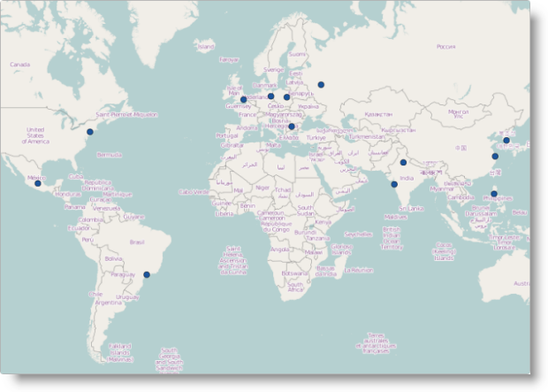

---
title: "地理シンボル シリーズの構成 (igMap)"
slug: igmap-configuring-geographic-symbol-series
---

# 地理シンボル シリーズの構成 (igMap)


##トピックの概要

### 目的

このトピックでは、`igMap`™ コントロールを使用して地理シンボル シリーズを構成する方法を説明します。

### 前提条件

このトピックを理解するために、以下のトピックを参照することをお勧めします。

- [igMap の概要](/controls/igmap/overview-igmap): このトピックは、`igMap` コントロールについて、その主要機能、最小要件、ユーザー インタラクションといった事項の概念的情報を提供します。

- [igMap の追加](/controls/igmap/adding-igmap): このトピックは、基本的な機能を備えた簡易 `igMap` コントロールを Web ページに追加する方法を示すチュートリアルです。


### このトピックの内容

このトピックは、以下のセクションで構成されます。

-   [概要](#introduction)
-   [地理シンボル シリーズ構成の概要](#config-summary)
-   [コード例の概要](#code-example-summary)
    -   [JavaScript における地理シンボル シリーズの構成](#config-series-js)
    -   [ASP.NET MVC における地理シンボル シリーズの構成](#config-series-mvc)
-   [関連コンテンツ](#related-content)
    -   [トピック](#topics)
    -   [サンプル](#samples)


##<a id="introduction"></a>概要


### 地理シンボル シリーズの概要

`igMap` の地理シンボル シリーズでは、アプリケーション内のデータによって指定された地理ポイントにマーカーをプロットします。このマップ シリーズは、百貨店、倉庫、オフィスなど、特定のビジネス ケースに応じたポイントを強調表示する場合に役立ちます。このマップ シリーズのその他の用途としては、動的な車両追跡を行うフリート管理システムまたは GPS システムなどが挙げられます。



カスタム マーカー機能により、独自のマーカーを使用して別の方法で、情報を伝達することができます。詳細は、[ビジュアル機能の構成 (igMap)](/controls/igmap/configuring/features/configuring-visual-features) のトピックを参照してください。

シリーズ オブジェクトの CSS スタイルまたはオプションを使用して、マーカーのアウトラインと色をコントロールすることができます詳細については、トピック[マップのスタイル設定 (igMap)](/controls/igmap/styling-igmap) を参照してください。


##  <a id="config-summary"></a> 地理シンボル シリーズ構成の概要

### 地理シンボル シリーズ構成の概要図

以下の表は、地理シンボル シリーズに関する `igMap` コントロールの構成可能な要素を示しています。


| 構成可能な項目 | 詳細 | プロパティ |
| --- | --- | --- |
| 地理シンボル シリーズの設定 | これらの必須設定を使用して、地理シンボルのマップ シリーズのタイプを構成し、シリーズ名を設定します。 | JavaScript の場合: [series.type](environment:jQueryApiUrl/ui.igMap#options:series.type) [series.name](environment:jQueryApiUrl/ui.igMap#options:series.name) ** 値: **series.type: “geographicSymbol”**, **series.type: "seriesName"** ASP.NET MVC の場合: [MapSeriesBuilder クラス](Infragistics.Web.Mvc~Infragistics.Web.Mvc.MapSeriesBuilder`1.html) [.GeographicSymbol()](Infragistics.Web.Mvc~Infragistics.Web.Mvc.MapSeriesBuilder`1~GeographicSymbol.html) 値: **series.GeographicSymbol(“seriesName”)** ** |
| 地理シンボル シリーズのデータ バインディング オプション | これらの必須設定を使用して、マップ上にポイントを描画するための地理座標が入力データのどのプロパティに含まれるかを構成します。 | JavaScript の場合: [series.latitudeMemberPath](environment:jQueryApiUrl/ui.igMap#options:series.latitudeMemberPath) [series.longitudeMemberPath](environment:jQueryApiUrl/ui.igMap#options:series.longitudeMemberPath) ASP.NET MVC の場合: [GeographicSymbolSeries クラス](Infragistics.Web.Mvc~Infragistics.Web.Mvc.GeographicSymbolSeries`1.html) [.LatitudeMemberPath()](Infragistics.Web.Mvc~Infragistics.Web.Mvc.GeographicSymbolSeries`1~LatitudeMemberPath.html) [.LongitudeMemberPath()](Infragistics.Web.Mvc~Infragistics.Web.Mvc.GeographicSymbolSeries`1~LongitudeMemberPath.html) |
| ツールチップの表示/非表示 | これらの設定を使用して、ツールチップのレンダリングを有効または無効にします。 このコントロールのデフォルト設定では、ツールチップはレンダリングされません。 | JavaScript の場合: [series.showTooltip](environment:jQueryApiUrl/ui.igMap#options:series.showTooltip) ASP.NET MVC の場合: [GeographicSymbolSeries クラス](Infragistics.Web.Mvc~Infragistics.Web.Mvc.GeographicSymbolSeries`1.html) [.ShowTooltip()](Infragistics.Web.Mvc~Infragistics.Web.Mvc.Series`3~ShowTooltip.html) |
| ツールチップ テンプレート | この設定を使用して、ツールチップのレンダリングに使用するテンプレートを構成します。 | JavaScript の場合: [series.tooltipTemplate](environment:jQueryApiUrl/ui.igMap#options:series.tooltipTemplate) ASP.NET MVC の場合: [GeographicSymbolSeries クラス](Infragistics.Web.Mvc~Infragistics.Web.Mvc.GeographicSymbolSeries`1.html) [.TooltipTemplate()](Infragistics.Web.Mvc~Infragistics.Web.Mvc.Series`3~TooltipTemplate.html) |
| マーカー タイプ | この設定を使用して、コントロールによってレンダリングされるマーカーを構成します。 デフォルトではマーカーがレンダリングされ、コントロールによってタイプが選択されます。 | JavaScript の場合: [series.markerType](environment:jQueryApiUrl/ui.igMap#options:series.markerType) ASP.NET MVC の場合: [GeographicSymbolSeries クラス](Infragistics.Web.Mvc~Infragistics.Web.Mvc.GeographicSymbolSeries`1.html) [.MarkerType() ](Infragistics.Web.Mvc~Infragistics.Web.Mvc.GeographicSymbolSeries`1~MarkerType.html) |
| カスタム マーカー テンプレート | コールバック関数によって、マップで使用するキャンバス要素にコンテンツを直接レンダリングするオブジェクトを構成します。 | JavaScript の場合: [series.markerTemplate](environment:jQueryApiUrl/ui.igMap#options:series.markerTemplate) ASP.NET MVC の場合: [GeographicSymbolSeries クラス](Infragistics.Web.Mvc~Infragistics.Web.Mvc.GeographicSymbolSeries`1.html) [.MarkerTemplate()](Infragistics.Web.Mvc~Infragistics.Web.Mvc.GeographicSymbolSeries`1~MarkerTemplate.html) |
| マーカー競合の回避ロジック | 複数のマーカーが重複する場合のコントロールの動作を構成します。 デフォルトでは、重複するマーカーは重ねて描画されます。 | JavaScript の場合: [series.markerCollisionAvoidance](environment:jQueryApiUrl/ui.igMap#options:series.markerCollisionAvoidance) ASP.NET MVC の場合: [GeographicSymbolSeries クラス](Infragistics.Web.Mvc~Infragistics.Web.Mvc.GeographicSymbolSeries`1.html) [.MarkerCollisionAvoidance()](Infragistics.Web.Mvc~Infragistics.Web.Mvc.GeographicSymbolSeries`1~MarkerCollisionAvoidance.html) |
| マーカー アウトライン | マーカー アウトラインの色を構成します。 デフォルトではアウトラインの色は黒です。 | JavaScript の場合: [series.markerOutline](environment:jQueryApiUrl/ui.igMap#options:series.markerOutline) ASP.NET MVC の場合: [GeographicSymbolSeries クラス](Infragistics.Web.Mvc~Infragistics.Web.Mvc.GeographicSymbolSeries`1.html) [.MarkerOutline()](Infragistics.Web.Mvc~Infragistics.Web.Mvc.GeographicSymbolSeries`1~MarkerOutline.html) |
| マーカーの塗りつぶし | マーカーの塗りつぶしの色を構成します。 デフォルトの塗りつぶしの色は黒です。 | JavaScript の場合: [series.markerBrush](environment:jQueryApiUrl/ui.igMap#options:series.markerBrush) ASP.NET MVC の場合: [GeographicSymbolSeries クラス](Infragistics.Web.Mvc~Infragistics.Web.Mvc.GeographicSymbolSeries`1.html) [.MarkerBrush()](Infragistics.Web.Mvc~Infragistics.Web.Mvc.GeographicSymbolSeries`1~MarkerBrush.html) |


##<a id="code-example-summary"></a>コード例の概要

### コード例の概要表

以下の表は、このトピックで使用したコード例をまとめたものです。

例|説明
---|---
[JavaScript における地理シンボル シリーズの構成](#config-series-js)|このコード例は、`igMap` コントロールを構成して、地理シンボル シリーズを JavaScript で表示する方法を示しています。
[ASP.NET MVC における地理シンボル シリーズの構成](#config-series-mvc)|このコード例は、`igMap` コントロールを構成して、地理シンボル シリーズを ASP.NET MVC で表示する方法を示しています。


##<a id="config-series-js"></a>コード例: JavaScript における地理シンボルシリーズの構成

### 説明

このコード例は、`igMap` コントロールを構成して、地理シンボル シリーズを JavaScript で表示する方法を示しています。この例は、シリーズのデータ バインディング オプションを指定する方法を示しています。予定表連動マーカー選択は、マーカー競合回避ロジックと合わせて構成され、マーカー アウトラインと塗りつぶしの色も指定されます。

### コード

**JavaScript の場合:**

```js
$("#map").igMap({
    ...
    series: [{
        type: "geographicSymbol",
        name: "seriesName",
        dataSource: data,
        latitudeMemberPath: "Latitude",
        longitudeMemberPath: "Longitude",
        markerType: "automatic",
        markerCollisionAvoidance: "fade", 
        markerBrush: "rgba(50,100,100,0.7)", 
        markerOutline: "black"
    }],
    ...
    }
});
```


##<a id="config-series-mvc"></a>コード例: ASP.NET MVC における地理シンボル シリーズの構成

### 説明

このコード例は、`igMap` コントロールを構成して、地理シンボル シリーズを ASP.NET MVC で表示する方法を示しています。この例は、レギュラー ビューと厳密に型指定されたビューで使用するデータ モデルを指定する方法を示しています。マーカー競合回避ロジックと合わせて予定表連動マーカーの選択を構成すると、マーカーのアウトラインと塗りつぶし色も指定されます。

### コード

このコード スニペットは、レギュラー ビューの地理シンボル シリーズを構成しています。

**ASPX の場合:**

```csharp
<%= Html.Infragistics().Map<SampleApp.Models.GeoSymbols>()
        .ID("map")
        ...
        .Series(series => {
            series.GeographicSymbol("seriesName")
                .LatitudeMemberPath(item => item.Latitude)
                .LongitudeMemberPath(item => item.Longitude)
                .MarkerType(MarkerType.Automatic)
                .MarkerCollisionAvoidance(CollisionAvoidanceType.Fade)
                .MarkerBrush("rgba(50,100,100,0.7)")
                .MarkerOutline("black");
        })
        ...
        .DataBind()
        .Render()
%>
```

このコード スニペットは、厳密に型指定されたビューの地理シンボル シリーズを構成しています。

**ASPX の場合:**

```csharp
<%= Html.Infragistics().Map(Model)
        .ID("map")
        ...
        .Series(series => {
            series.GeographicSymbol("seriesName")
                .LatitudeMemberPath(item => item.Latitude)
                .LongitudeMemberPath(item => item.Longitude)
                .MarkerType(MarkerType.Automatic)
                .MarkerCollisionAvoidance(CollisionAvoidanceType.Fade)
                .MarkerBrush("rgba(50,100,100,0.7)")
                .MarkerOutline("black");
        })
        ...
        .DataBind()
        .Render()
%>
```

##<a id="related-content"></a>関連コンテンツ

### <a id="topics"></a>トピック

このトピックの追加情報については、以下のトピックも合わせてご参照ください。

-	[マップ シリーズの構成 (igMap)](/controls/igmap/configuring/series/creating-different-kinds-maps): このトピックは、`igMap` コントロールでサポートされているすべてのマップ視覚エフェクトを構成し、さまざまな背景コンテンツ (マップ プロバイダー) を使用する方法を説明するトピックのリンクがあるランディング ページです。

-	[機能の構成 (igMap)](/controls/igmap/configuring/features/configuring-features): このトピックは、`igMap` コントロールのさまざまな機能を構成する方法を説明するトピックのリンクがあるランディング ページです。

-	[データ バインディング (igMap)](/controls/igmap/data-binding-igmap): このトピックは、視覚化されたマップ シリーズに応じて `igMap` コントロールをさまざまなデータ ソースにバインドする方法を説明します。

-	[マップのスタイル設定 (igMap)](/controls/igmap/styling-igmap): このトピックは、ビジュアル スタイル設定に関連して igMap コントロールを構成する方法を説明しています。


### <a id="samples"></a>サンプル

このトピックについては、以下のサンプルも参照してください。

-	[地理記号シリーズ](&#123;environment:SamplesUrl&#125;/map/geo-symbol-series): このサンプルは、マップを作成し、地理記号シリーズを表示する方法を示します。


 

 


