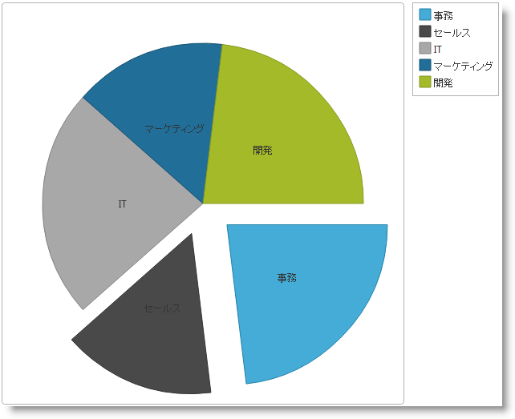

# igPieChart の追加


### 目的

このトピックは、`igPieChart`™ コントロールをウェブ ページに追加し、それをデータにバインドする方法を説明します。

### 前提条件

以下の表に、このトピックを理解するための前提条件として求められる素材をリストします。

**概念**

-   [jQuery](http://docs.jquery.com/Main_Page)、[jQuery UI](http://jqueryui.com/)
-   [ASP.NET MVC](http://www.asp.net/mvc)

**トピック**


- [&#123;environment:ProductName&#125; の概要](/igniteui-for-jquery-overview): &#123;environment:ProductName&#125;™ ライブラリにつぃての一般的情報

- [&#123;environment:ProductName&#125; で JavaScript リソースを使用](/deployment-guide-javascript-resources): このトピックは、必要な JavaScript リソースを追加して &#123;environment:ProductName&#125; ライブラリからコントロールを使用する場合の全般的なガイダンスを提供します。

- [igPieChart の概要](/igpiechart-overview): このトピックでは、`igPieChart` コントロールについての概念情報を提供します。これには、その主な機能、チャートとユーザー機能を使用するための最低要件が含まれます。

### このトピックの内容

このトピックは、以下のセクションで構成されます。

-   [円チャートの Web ページへの追加](#add-pie-chart)
-   -   [概要](#introduction)
    -   [プレビュー](#preview)
    -   [前提条件](#prerequisites)
    -   [概要](#overview)
    -   [手順](#steps)
-   [関連コンテンツ](#related-content)
-   -   [トピック](#topics)
    -   [サンプル](#samples)
    -   [リソース](#resources)


##<a id="add-pie-chart"></a>円チャートの Web ページへの追加

### <a id="introduction"></a>概要

この手順は、凡例の付いた Pie Chart コントロールを Web ページに追加するプロセスを説明します。例にあるグラフのデータは JavaScript 配列に提供されています。

### <a id="preview"></a>プレビュー

以下のスクリーンショットは最終結果のプレビューです。



### <a id="prerequisites"></a>前提条件

この手順を実行するには、以下のリソースが必要です。

-   MVC の例: Visual Studio の ASP.NET MVC Web アプリケーション
-   HTTP の例: HTML5 Web ページ

### <a id="overview"></a>概要

このトピックでは、円チャートを Web ページに追加する方法を順を追って説明します。以下はプロセスの概念的概要です。

1.  必要なリソースへの参照の追加
    -   概要
    -   `igLoader` を使用した JavaScript のリソースの参照
    -   MVC Loader を使用した MVC でのリソースの参照
    -   手動によるリソースの参照
2.  `igPieChart` で必要な HTML マークアップを追加
3.  データ ソースを追加
4.  円チャートのインスタンスを作成
5.  (オプション) 結果の検証

### <a id="steps"></a>手順

以下のステップは、`igPieChart` コントロールを Web ページに追加する方法を示します。


1. 必要なリソースへの参照を追加します。

	**概要**

	必要なリソースを参照します。リソースの参照には以下のものがあります。

	-   jQuery、jQueryUI、Modernizr JavaScript リソースの Web サイトまたは Web アプリケーションの Scripts という名前のフォルダーへの追加。
	-   Web サイトまたは Web アプリケーションの Content/ig という名前のフォルダーへの &#123;environment:ProductName&#125; CSS ファイルの追加 (詳細は、[&#123;environment:ProductName&#125; のスタイルとテーマの設定](/deployment-guide-styling-and-theming)のトピックを参照してください)。
	-   Web サイトまたは Web アプリケーションの Scripts/ig という名前のフォルダーへの &#123;environment:ProductName&#125; JavaScript ファイルの追加 (詳細は、[&#123;environment:ProductName&#125; での JavaScript リソースの使用](/deployment-guide-javascript-resources)のトピックを参照してください)。

	リソースは手動またはローダー (推奨) を使用して追加できます。

	**`igLoader` を使用した JavaScript のリソースの参照**

	&#123;environment:ProductName&#125; ライブラリのコントロールで必要な JavaScript および CSS リソースの読み込みには、`igLoader`™ コントロールを使用することをお勧めします。最初に、`igLoader` スクリプトをページに追加します。

	**HTML の場合:**

```html
	<script  type="text/javascript" src="Content/ig/infragistics.loader.js"></script>
```

	HTML ビューでは、以下のように `igLoader` のインスタンスを作成する必要があります。

	**HTML の場合:**

```html
	<script type="text/javascript">
	    $.ig.loader({
	        scriptPath: "Scripts/ig/",
	        cssPath: "Content/ig/",
	        resources: "igPieChart,igChartLegend"
	    });
	<script>
```

	resources オプションを `igPieChart` コントロールが描画されるように指定します。

	**MVC Loader を使用した MVC でのリソースの参照**

	`Infragistics.Web.Mvc` アセンブリを ASP.NET MVC プロジェクトで参照し、対応する名前空間をビューで参照する必要があります。詳細については、[&#123;environment:ProductName&#125; で JavaScript リソースを使用](/deployment-guide-javascript-resources)をご覧ください。ただし、明確にするため、名前空間を参照するコードはここに記載します。

	MVC ビューでは、&#123;environment:ProductNameMVC&#125; Loader を使用する必要があります。

	**ASPX の場合:**

```csharp
	<%@ Import Namespace="Infragistics.Web.Mvc" %>
	<%= Html.Infragistics().Loader()
	        .ScriptPath(Url.Content("~/Scripts/ig/"))
	        .CssPath(Url.Content("~/Content/ig/"))
	        .Render()
	%>
```

	&#123;environment:ProductNameMVC&#125; Loader は必要なリソースを自動的に検出するため、リソースを指定する必要はありません。

	**手動によるリソースの参照**

	手動で読み込む場合は、[igPieChart の概要](/igpiechart-overview)トピックの[最低要件](/igpiechart-overview#min-requirements)ブロックを参照し、円チャートを使用するにはどのリソース ファイルをリンクする必要があるか確認してください。

2. `igPieChart` で必要な HTML マークアップを追加

	HTML の例

	グラフの `DIV` 要素とグラフ インスタンス コードで参照される凡例を追加します。

	**HTML の場合:**

```html
	<div id="chart" class="chartContainer"></div>
	<div id="legend" class="chartContainer"></div>
```

	**ASP.NET の例**

	ASP.NET MVC の場合、&#123;environment:ProductNameMVC&#125; は必要なマークアップを自動的に追加するため、コンテナー要素が必要です。

3. データ ソースを追加します。

	**HTML の例**

	**HTML の例については、企業の予算データのデータ レコードによる配列を定義する JavaScript コードを追加する必要があります。**他のデータ ソースへのバインドに関する情報を取得するには、[データ バインディング (igPieChart)](/igpiechart-databinding)のトピックを参照してください。

	以下のコードを HTML 文書の巻頭に組み込みます。

	**HTML の場合:**

```html
	<script type="text/javascript">
	    var data = [
	            { "Budget": 950000, "Department": "Accounting" },
	            { "Budget": 1500000, "Department": "Sales" },
	            { "Budget": 1400000, "Department": "Marketing" },
	            { "Budget": 2000000, "Department": "Logistics" },
	            { "Budget": 800000, "Department": "IT" }
	        ];
	</script>
```

	**ASP.NET の例**

	**ASP.NET MVC ビューのデータは、Controller メソッドと適切なデータ モデル定義により提供されます。**データ モデル部分を以下に示します。新しい空のクラスを ASP.NET MVC アプリケーションの Models フォルダーに作成し、以下のコードを追加します。

	**C# の場合:**

```csharp
	public class DepartmentSpending
	{
	    public string Department { get; set; }
	    public decimal Budget { get; set; }
	}
```

	Controllers フォルダーに空のコントローラー クラスを追加し、Index (または、ビューに付けられた任意の名前) メソッドの以下のコードを追加します。

	**C# の場合:**

```csharp
	public ActionResult Index()
	{
	    List<DepartmentSpending> companyBudget = new List<DepartmentSpending>
	    {
	        new DepartmentSpending { Budget = 950000, Department = "Accounting" },
	        new DepartmentSpending { Budget = 1500000, Department = "Sales" },
	        new DepartmentSpending { Budget = 1400000, Department = "Marketing" },
	        new DepartmentSpending { Budget = 2000000, Department = "Logistics" },
	        new DepartmentSpending { Budget = 500000, Department = "IT" }
	    };
	    return View(companyBudget.AsQueryable());
	}
```

	ASP.NET MVC ビューに以下のコードを追加して強く定型化し、上記で作成されたデータ モデル クラスをポイントします。

	**ASPX の場合:**

```csharp
	<%@ Page Language="C#" Inherits="System.Web.Mvc.ViewPage<IQueryable<PieChartSample.Models.DepartmentSpending>>" %>
```

4. 円チャートのインスタンスを作成します。

	**HTML の例**

	 ラップするチャートおよび凡例の DIV タグと描画されたグラフについて、`igPieChart` コントロールのインスタンスを作成し、そのメイン オプションを設定する必要があります。以下のコードを、データ配列定義について上記で使用された `<script>` タグの既存のコードに追加します。

	**JavaScript の場合:**

```js
	$(function () {
	    $("#chart").igPieChart({
	        width: "450px",
	        height: "450px",
	        dataSource: data,
	        dataValue: "Budget",
	        dataLabel: "Department",
	        radiusFactor: 0.8,
	        explodedSlices: '0 1 2',
	        legend: { element: "legend", type: "item"}
	    });
	});
```

	幅と高さのオプションにより、グラフ コンテナーのサイズは明示的に設定されますが、省略できます。コントロールは自動的に適切なサイズを計算します。

	`radiusFactor` オプションは、幅および高さで設定されたコンテナー要素のサイズに対する円のサイズを設定し、デフォルト値は 0.9 です。`explodedSlices` オプションは、スペースで区切られたスライスのインデックスの一覧で、主な円から切り離されたどのスライスを表示するか決定します。スライスは頭の中で思い描いた線を円の中央から右側に移動し、時計回りにカウントされます。

	以前定義された配列 data がチャート コントロールの `dataSource` オプションにどのように割り当てられているか注意してください。入力データのどのメンバーがグラフに表示されるか構成するため、`dataValue` オプションと `dataLabel` オプションは必須です。`dataValue` オプションは、スライスという形で視覚化されています。たとえば、すべてのメンバーの合計に対するこのメンバーの相対値 (またはパーセンテージ) がスライスのサイズを決定します。`dataLabel` オプションは、各スライスを表すスライス ラベルという形、また凡例がある場合は凡例という形で視覚化されています。

	凡例について重要な設定は、legend オブジェクトの type オプションで指定された凡例の型です。item 型は円チャートを使用するときは必ず指定する必要があります。示したデータ ソースの各データ項目について凡例項目が作成されるためです。

	**ASP.NET の例**

	以下のコードは、`Infragistics.Web.Mvc` アセンブリで提供された &#123;environment:ProductNameMVC&#125; PieChart を使用して、`igPieChart` の主な機能のインスタンスを作成し、設定しています。データ モデル は、PieChart(Model) 呼び出しでコントロールに関連付けられ、残りの呼び出しは HTML の例と似た振る舞いをします。

	**ASPX の場合:**

```csharp
	<%= Html.Infragistics().PieChart(Model)
	        .ID("chart")
	        .Height("450px")
	        .Width("450px")
	        .DataValue(item => item.Budget)
	        .DataLabel(item => item.Department)
	        .RadiusFactor(0.8)
	        .ExplodedSlices("0 1 2")
	        .Legend(legend => legend.ID("legend").LegendType(LegendType.Item))
	        .DataBind()
	        .Render()
	%>
```
5. (オプション) 結果を確認します。

結果を検証するには、ページを保存し、Web ブラウザーで最終結果を確認します。円チャートは[プレビュー](#preview)に示すように描画されます。

##<a id="related-content"></a>関連コンテンツ

### <a id="topics"></a>トピック

このトピックの追加情報については、以下のトピックも合わせてご参照ください。

- [データ バインディング (igPieChart)](/igpiechart-databinding): このトピックでは、さまざまなデータ ソースを `igPieChart`™ コントロールにバインドする方法を説明します。

- [jQuery および MVC API リファレンス リンク (igPieChart)](/igpiechart-api-links): このトピックは、`igDataChart`™ の jQuery および &#123;environment:ProductNameMVC&#125; クラスのたえの API マニュアルへのリンクを提供します。

- [igPieChart にテーマを設定する](/igpiechart-styling-themes): スタイルを用い、`igPieChart`™ にテーマを適用する方法を説明します。

### <a id="samples"></a>サンプル

このトピックについては、以下のサンプルも参照してください。

- [JSON のバインド](&#123;environment:SamplesUrl&#125;/pie-chart/json-binding): このサンプルは、JSON データにバインドされた円チャートを表示します。


### <a id="resources"></a>リソース

以下の資料 (Infragistics のコンテンツ ファミリー以外でもご利用いただけます) は、このトピックに関連する追加情報を提供します。

- [jQuery ホーム ページ](http://jquery.com/): ライブラリのインストールと機能の詳細情報が記載された jQuery ライブラリのホーム ページです。

- [ASP.NET MVC ホーム ページ](http://www.asp.net/mvc): ASP.NET MVC のインストールと使用についての詳細情報が記載された jQuery ライブラリのホーム ページです。


 

 


