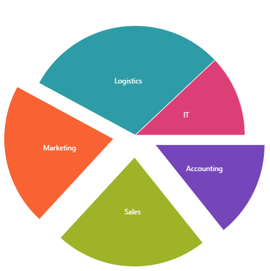
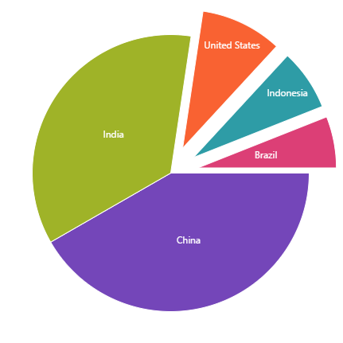

---
title: "データ バインディング (igPieChart)"
slug: igpiechart-databinding
---

# データ バインディング (igPieChart)

### 目的

このトピックでは、さまざまなデータ ソースを igPieChart™ コントロールにバインドする方法を説明します。

### 必要な背景

**概念**

-   データ バインディング
-   JSON
-   XML
-   Web サービス
-   WCF サービス
-   [ASP.NET MVC](http://www.asp.net/mvc)

**トピック**

- [igDataSource](/data-sources/igdatasource/igdatasource): これは、`igDataSource`™ に関連するすべてのトピックへリンクする参照ページです。

- [igDataSource の概要](/data-sources/igdatasource/igdatasource-overview): このトピックは、`igDataSource` コントロールについて説明し、その基本的な使用方法と機能を紹介します。

- [igPieChart の概要](/controls/igpiechart/overview): Web ページに円チャートを表示する `igPieChart` コントロールについての基本情報が含まれています。

- [igPieChart の追加](/controls/igpiechart/adding): `igPieChart` を Web ページに 追加する方法を順に説明します。


### このトピックの構成

このトピックは、以下のセクションで構成されます。

-   [**データ ソースにバインド**](#bind-data-source)
   -   [サポートされるデータ ソース](#supported-data-source)
    -   [バインドの要件](#requirements-for-binding)
    -   [データソースの概要](#data-source-summary)
-   [**JavaScript 配列へのバインド**](#bind-js)
   -   [概要](#js-introduction)
    -   [プレビュー](#js-preview)
    -   [手順](#js-steps)
-   [**XML にバインド**](#bind-xml)
   -   [概要](#xml-introduction)
    -   [プレビュー](#xml-preview)
    -   [手順](#xml-steps)
-   [**ASP.NET MVC での `IQueryable<T>` へのバインド**](#bind-iqueryable-mvc)
  -   [概要](#mvc-introduction)
    -   [プレビュー](#mvc-preview)
    -   [手順](#mvc-steps)
-   [**WCF サービスへのバインド**](#bind-wcf-service)
   -   [概要](#wcf-introduction)
    -   [プレビュー](#wcf-preview)
    -   [手順](#wcf-steps)
-   [**関連コンテンツ**](#related-content)
   -   [トピック](#topics)
    -   [サンプル](#samples)


##<a id="bind-data-source"></a>データ ソースにバインド

### <a id="supported-data-source"></a>サポートされるデータ ソース

`igPieChart` コントロールは以下のデータ ソースをサポートしています。

データ ソース|バインディング
---|---
igDataSource|データ操作を管理するために、コントロールで内部で使用されます。 
`IQueryable<T>`|MVC コントローラー メソッドからデータを提供するために使用されます。


### <a id="requirements-for-binding"></a>バインドの要件

各データ ソースには、`igDataSource` コントロールへのデータ バインディングの異なる要件があります。以下の表に、各要件カテゴリを示します。

要件のカテゴリ|要件の一覧
---|---
データ構造|<ul><li>JSON (クライアント側、あるいは Web または WCF サービスから)</li> <li>XML (クライアント側、あるいは Web または WCF サービスから)</li><li>JavaScript 配列</li><li>ASP.NET MVC の `IQueryable<T>`</li></ul>
データ型|<ul><li>文字列: カテゴリ軸のみに使用</li><li>数値</li><li>日付</li></ul>


### <a id="data-source-summary"></a>データソースの概要

`igPieChart` のデータ バインディングは、&#123;environment:ProductName&#125;™ ライブラリから他のコントロールへのバインドと同様に実行されます。データをバインドするには、`dataSource` オプションにデータ ソースを割り当てる、または、データが Web または WCF サービスによって提供される場合は `dataSourceUrl` に URL を提供します。


##<a id="bind-js"></a>JavaScript 配列へのバインド

### <a id="js-introduction"></a>概要

この手順は、JavaScript のデータ配列を `igPieChart` コントロールにバインドする方法を、簡単な手順で説明します。

### 前提条件

この手順を実行するには、以下のリソースが必要です。

-   HTML5 Web ページ
-   Web サイトまたは Web アプリケーション プロジェクトに追加された、必要なすべての JavaScript および CSS ファイル。`igPieChart` のインスタンス化と構成の詳細情報は、[igPieChart を追加する](/controls/igpiechart/adding)を参照してください。

### <a id="js-preview"></a>プレビュー

以下のスクリーンショットは最終結果のプレビューです。



### <a id="js-steps"></a>手順

以下の手順は、JavaScript データ配列を `igPieChart` コントロールにバインドする方法を示しています。


1. JavaScript データ配列を定義します。

	例として、以下の JavaScript 配列を使用します。

	**HTML の場合:**

```html
	<script type="text/javascript">
	    var data = [
	            { "Budget": 950000, "Department": "Accounting" },
	            { "Budget": 1500000, "Department": "Sales" },
	            { "Budget": 1400000, "Department": "Marketing" },
	            { "Budget": 2000000, "Department": "Logistics" },
	            { "Budget": 800000, "Department": "IT" }
	        ];
	</script>
```

2. チャート コントロールのインスタンスを作成し、データ ソースを設定します。

	1. チャートの div 要素を Web ページに追加します。

		以下のコードを使用して、div 要素を Web ページの body 部分に追加します。

		**HTML の場合:**

```html
		<body>
		    ...
		    <div id="chart"></div>
		    ...
		</body>
```

	2. igPieChart コントロールのインスタンスを作成し、データ ソースを構成します。

		以下のコードをスクリプト タグに追加して、`igPieChart` のインスタンスを作成し、構成します。前の手順で定義した data 配列を、`igPieChart` コントロールの `dataSource` オプションに割り当てる方法に注意してください。

		**HTML の場合:**

```html
		<script type="text/javascript">
		    $(function () {
		        $("#chart").igPieChart({
		            width: "450px",
		            height: "450px",
		            dataSource: data,
		            valueMemberPath: "Budget",
		            labelMemberPath: "Department",
		            radiusFactor: 0.8,
		            explodedSlices: "[0,1,2]",
		            legend: { element: "legend", type: "item" }
		        });
		    });
		</script>
```

### <a id="data-source-summary"></a>データソースの概要

`igPieChart` のデータ バインディングは、&#123;environment:ProductName&#125;™ ライブラリから他のコントロールへのバインドと同様に実行されます。データをバインドするには、`dataSource` オプションにデータ ソースを割り当てる、または、データが Web または WCF サービスによって提供される場合は `dataSourceUrl` に URL を提供します。


##<a id="bind-xml"></a> XML にバインド

### <a id="xml-introduction"></a>概要

XML 文字列を `igPieChart` コントロールにバインドする方法を手順を追って説明します。

### 前提条件

この手順を実行するには、以下が必要です。

-   HTML5 Web ページ
-   Web サイトまたは Web アプリケーション プロジェクトに追加された、必要なすべての JavaScript および CSS ファイル。`igPieChart` のインスタンス化と構成の詳細情報は、[igPieChart の追加](/controls/igpiechart/adding)を参照してください。

## <a id="xml-preview"></a>プレビュー

以下のスクリーンショットは最終結果のプレビューです。



### <a id="xml-steps"></a>手順

以下の手順は、XML 文字列を `igPieChart` コントロールにバインドする方法を示しています。XML データをチャートにリンクするには、`DataSchema` を指定し、両方を `igDataSource` のインスタンスに渡す必要があります。このデータ コンポーネントのメイン ロールは、&#123;environment:ProductName&#125; ウィジェットに有効な形式でデータを出力することです。

1. データを `igPieChart` に有効な形式で準備します。 
	
	1. XML データ文字列を定義します。この例は以下の XML データを使用します。

		**HTML の場合:**

```html
		<script type="text/javascript">
			//Sample XML Data
			var xmlDoc = '<Countries>' +
				'<Country Name="China" Population="1333" />' +
				'<Country Name="India" Population="1140" />' +
				'<Country Name="United States" Population="304" />' +
				'<Country Name="Indonesia" Population="228" />' +
				'<Country Name="Brazil" Population="192" />' +
			'</Countries>';
		</script>
```

	2. [XML へのバインド](/data-sources/igdatasource/binding-to-xml)は、データ フィールドを定義する [igDataSchema](&#123;environment:jQueryApiUrl&#125;/ig.dataschema) が必要です。このコンポーネントは、[igDataSource](&#123;environment:jQueryApiUrl&#125;/ig.datasource) の Array、JSON、および XML データ オブジェクトの変換を処理します。[searchField](&#123;environment:jQueryApiUrl&#125;/ig.dataschema#options:schema.searchField) オプションを使用して、データ ソースのレコードが検索された場所を指定します。すべてのフィールド定義に `xpath` プロパティを指定することによって、[fields](&#123;environment:jQueryApiUrl&#125;/ig.dataschema#options:schema.fields) がどのように定義されるかに注意してください。これは、XML データソースに特有です。このようにして、リストにあるすべての階層オブジェクトにおいて、バインドするプロパティへのパスをデータ ソースに伝えます。

```html
		<script type="text/javascript">
			var xmlSchema = new $.ig.DataSchema("xml",
				{ 
					//searchField serves as the base node(s) for the XPaths
					searchField: "//Country", 
					fields: [
						{ name: "Name", xpath: "./@Name" },
						{ name: "Population", xpath: "./@Population", type: "number" },
					]
				}
			);
		</script>
```

	3. 構成した XML データおよび `igDataSchema` からチャートで使用可能な [Infragistics データソース](/data-sources/igdatasource/igdatasource-overview)を作成します。

```html
		<script type="text/javascript">
			var ds = new $.ig.DataSource({
				type: "xml",
				dataSource: xmlDoc,
				schema: xmlSchema 
			});
		</script>
```

2. チャート コントロールのインスタンスを作成し、データ ソースを設定します。

	1. チャートの div 要素を Web ページに追加します。

		以下のコードを使用して、div 要素を Web ページの body 部分に追加します。

		**HTML の場合:**

```html
		<body>
		    ...
		    <div id="chart"></div>
		    ...
		</body>
```

	2. igPieChart コントロールのインスタンスを作成し、データ ソースを構成します。

		**HTML の場合:**

```html
		<script type="text/javascript">
		    $(function () {
		        $("#chart").igPieChart({
					width: "435px",
					height: "435px",
					dataSource: ds, //$.ig.DataSource defined above
					valueMemberPath: "Population",
					labelMemberPath: "Name",
					labelsPosition: "bestFit",
					explodedSlices: [0,2,3,4]
		        });
		    });
		</script>
```

以下のサンプルは以上の手順を実装します。
<div class="embed-sample">
   [&#123;environment:SamplesEmbedUrl&#125;/pie-chart/xml-binding](&#123;environment:SamplesEmbedUrl&#125;/pie-chart/xml-binding)
</div>


##<a id="bind-iqueryable-mvc"></a>ASP.NET MVC での `IQueryable<T>` へのバインド

### <a id="mvc-introduction"></a>概要

ここでは、&#123;environment:ProductName&#125; ライブラリにある ASP.NET ヘルパーを使用して一連のデータ オブジェクトをバックエンド コントローラー メソッドから円チャートにバインドする手順を示します。

### 前提条件

この手順を実行するには、以下のリソースが必要です。

-   ASP.NET MVC アプリケーション
-   Web サイトまたは Web アプリケーション プロジェクトに追加された、必要なすべての JavaScript および CSS ファイル。`igPieChart` のインスタンス化と構成の詳細情報は、[igPieChart を追加する](/controls/igpiechart/adding)を参照してください。

### <a id="mvc-preview"></a>プレビュー

以下のスクリーンショットは最終結果のプレビューです。


### <a id="mvc-steps"></a>手順

次の手順では、データ オブジェクトのリストを、厳密に型指定されたビューに提供することによって ASP.NET MVC の `igPieChart` コントロールのインスタンスを作成してバインドする方法、および &#123;environment:ProductNameMVC&#125; DataChart を使用する方法を説明します。

1. データ モデルを定義します。

	以下のデータ モデル クラスを追加します。

	**C# の場合:**

```csharp
	public class DepartmentSpending
	{
	    public string Department { get; set; }
	    public decimal Budget { get; set; }
	}
```

2. コントローラー メソッドを定義します。

	以下のロジックをコントローラー メソッドに追加し、`DepartmentSpending` オブジェクトの配列のインスタンスを作成します。ここで、たとえば、データ ベースからデータを取得するカスタム ロジックを追加できることに注意してください。

	**C# の場合:**

```csharp
	public ActionResult Index()
	{
	    List<DepartmentSpending> companyBudget = new List<DepartmentSpending>
	    {
	        new DepartmentSpending { Budget = 950000, Department = "Accounting" },
	        new DepartmentSpending { Budget = 1500000, Department = "Sales" },
	        new DepartmentSpending { Budget = 1400000, Department = "Marketing" },
	        new DepartmentSpending { Budget = 2000000, Department = "Logistics" },
	        new DepartmentSpending { Budget = 500000, Department = "IT" }
	    };
	    return View(companyBudget.AsQueryable());
	}
```

	ビューに送信する前に、`DepartmentSpending` オブジェクトのリストを `IQueryable< DepartmentSpending>` に変換する方法に注意してください。これは、ビュー内で &#123;environment:ProductNameMVC&#125; PieChart を呼び出しても実現できますが、提供した実装方法がより適切です。

3. チャート コントロールのインスタンスを作成し、データ ソースを設定します。

	以下のコードを ASP.NET MVC ビューに追加して、`igPieChart` のインスタンスを作成し、そのリストを割り当てます。厳密に型指定されたビューのデータ モデルが `PieChart(Model)` の呼び出しによってチャートにマップされる仕組みに注目してください。さらに、`DataValue()` メソッドが item.Budget プロパティをスライスのサイズにマップし、`DataLabel()` メソッドが各データ項目の item.Department プロパティをスライス名にマップします。`DataBind()` メソッドが実際のデータ バインディングを実行し、最後に、`Render()` メソッドが、クライアント側で実行される最終的な JavaScript コードを発行します。

	**ASPX の場合:**

```csharp
	<%@ Page Language="C#" Inherits="System.Web.Mvc.ViewPage<IQueryable<PieChartSample.Models.DepartmentSpending>>" %>
	<%@ Import Namespace="Infragistics.Web.Mvc" %>
	...
	<%= Html.Infragistics().PieChart(Model)
	        .ID("chart")
	        .ValueMemberPath(item => item.Budget)
	        .LabelMemberPath(item => item.Department)
	        .DataBind()
	        .Render()
	%>
```

##<a id="bind-wcf-service"></a>WCF サービスへのバインド


### <a id="wcf-introduction"></a>概要

この手順は、`dataSourceUrl` オプションを利用して `igPieChart` を WCF サービスにバインドする方法を示します。Web サービスへのバインドも同様です。

### 前提条件

この手順を実行するには、以下のリソースが必要です。

-   HTML5 Web ページ
-   Web サイトまたは Web アプリケーション プロジェクトに追加された、必要なすべての JavaScript および CSS ファイル。`igPieChart` のインスタンス化と構成の詳細情報は、[igPieChart を追加する](/controls/igpiechart/adding)を参照してください。

### <a id="wcf-preview"></a>プレビュー

以下のスクリーンショットは最終結果のプレビューです。


### <a id="wcf-steps"></a>手順

以下の手順は、`igPieChart` コントロールを WCF サービスにバインドする方法を示しています。


1. WCF サービスのインターフェイス。

	WCF サービスの完全な実装は、この例とは関連がないので省略します。以下に、GET HTTP 要求に応じてクライアントにデータを提供するサービス コントラクト クラスおよび操作コントラクト メソッドのサンプルを示します。データ モデル クラスは、前の手順 [ASP.NET MVC での `IQueryable<T>` へのバインド](#bind-iqueryable-mvc)で指定したものと同じです。

	以下に、サンプル BudgetData WCF サービスのインターフェイスを示します。これは、`DepartmentSpending` オブジェクトの `List` の形式でクライアントに財務データを提供します。

	**C# の場合:**

```csharp
	[ServiceContract]
	[AspNetCompatibilityRequirements(RequirementsMode = AspNetCompatibilityRequirementsMode.Allowed)]
	public class BudgetData
	{
	    [OperationContract]
	    [WebGet(BodyStyle = WebMessageBodyStyle.Bare, ResponseFormat = WebMessageFormat.Json)]
	    public List<DepartmentSpending> GetCompanyBudget()
	    {
	        return CompanyBudgetDB.GetBudgetsByDepartment();
	    }
	}
```

	ここで重要な点は、サーバー メソッド `GetCompanyBudget()` に適用される WebGet 属性です。これは、このメソッドが GET 要求に応答し、その応答がむき出しの（ラップされていない）JSON エンコード データ配列であることを宣言します。

2. チャート コントロールのインスタンスを作成し、データ ソースを設定します。

	**HTML/jQuery**

	以下のコードを HTML5 ページの先頭部分に追加して、`igPieChart` のインスタンスを作成します。WCF サービス アドレスは、アドレスを `dataSourceUrl` オプションに割り当てることによって、データ ソースとして設定されます。

	オプション `valueMemberPath` は、サーバーが提供するデータの Budget プロパティをポイントするように設定され、`labelMemberPath` は、Department プロパティをポイントするように設定されます。

	このサンプルでは、WCF サービスがインストール/実行されている場所のアドレスを http://www.example.com/Services/BudgetData.svc/GetCompanyBudget とします。

	**JavaScript の場合:**

```js
	$(function () {
	    $("#chart").igPieChart({
	        dataSourceUrl: "http://www.example.com/Services/BudgetData.svc/GetCompanyBudget",
	        valueMemberPath: "Budget",
	        labelMemberPath: "Department"
	    });
	});
```

	**ASP.NET MVC**

	以下のコードを ASP.NET MVC ビューに追加して、`igPieChart` のインスタンスを作成し、WCF サービスのアドレスを設定します。コードの意味は HTML の例と同じです。

	**ASPX の場合:**

```csharp
	<%@ Page Language="C#" Inherits="System.Web.Mvc.ViewPage<dynamic>" %>
	<%@ Import Namespace="Infragistics.Web.Mvc" %>
	...
	<%= Html.Infragistics().PieChart()
	        .ID("chart")
	        .ValueMemberPath("Budget")
	        .LabelMemberPath("Department")
	        .DataSourceUrl("http://www.example.com/Services/BudgetData.svc/GetCompanyBudget")
	        .DataBind()
	        .Render()
	%>
```


##<a id="related-content"></a>関連コンテンツ

### <a id="topics"></a>トピック

このトピックの追加情報については、以下のトピックも合わせてご参照ください。

- [igDataSource のクライアント側データへのバインド](/data-sources/igdatasource/binding-igdatasource-to-client-side-data): このトピックでは、`igDataSource` をクライアント側の JavaScript 配列および JSON データにバインドする方法を説明します。

- [igDataSource を REST サービスへバインド](/data-sources/igdatasource/binding-to-rest-services): このトピックでは、`igDataSource` コントロールを REST サービスにバインドする方法を説明します。

- [igDataSource を WCF データ サービスへバインド](/data-sources/igdatasource/binding-to-wcf-data-services): このトピックでは、`igDataSource` コンポーネントを WCF サービスにバインドする方法を説明します。


### <a id="samples"></a>サンプル

このトピックについては、以下のサンプルも参照してください。

- [円チャートの概要](&#123;environment:SamplesUrl&#125;/pie-chart/overview): このサンプルでは簡単な円チャートを作成し、そのいくつかの機能を構成する方法を紹介しています。


 

 


