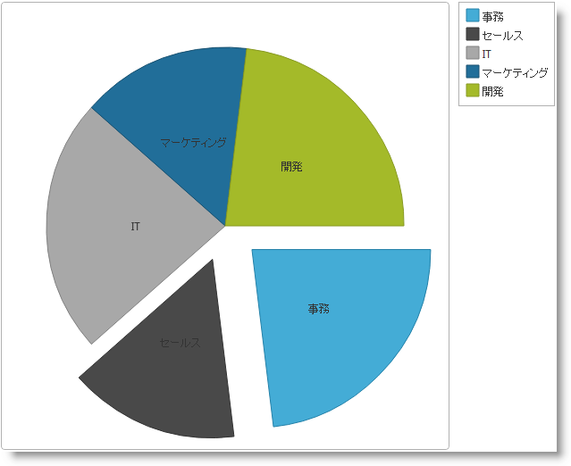

---
title: "igPieChart"
slug: igpiechart
---

# igPieChart

##このグループのトピックについて

### 概要

`igPieChart`™ コントロールは、HTML5 Canvas 要素に基づいて Web アプリケーションで各種のチャートを表示する機能を提供します。

### トピック

このセクションのトピックでは、 `igPieChart` コントロールの詳細情報を提供します。

- [igPieChart の概要](/controls/igpiechart/overview): このトピックは、 `igPieChart` コントロールについて、その主要機能、最低必須事項、ユーザー機能といった事項の概念的情報を提供します。

- [igPieChart の追加](/controls/igpiechart/adding): このトピックでは、`igPieChart` をコントロールを作成して追加し、データにバインドする方法を紹介します。

- [データ バインディング (igPieChart)](/controls/igpiechart/databinding): このトピックでは、各種のデータ ソースを `igPieChart` コントロールにバインドする方法を説明します。

- [igPieChart にテーマを設定する](/controls/igpiechart/styling-themes): このトピックでは、スタイル設定を使用して `igPieChart` にテーマを適用する方法を説明します。

- [アクセシビリティ準拠 (igPieChart)](/controls/igpiechart/accessibility): このトピックでは、`igPieChart`™ のアクセシビリティ機能について説明し、チャートを含むページのアクセシビリティ準拠を実現する方法についての助言を示します。

- [jQuery および MVC API リファレンス リンク (igPieChart)](/controls/igpiechart/api-links): このトピックでは、`igPieChart` の jQuery および &#123;environment:ProductNameMVC&#125; クラスの API ドキュメンテーションへのリンクを提供します。

##関連コンテンツ

### トピック

このトピックの追加情報については、以下のトピックも合わせてご参照ください。

- [&#123;environment:ProductName&#125; の概要](/igniteui-for-jquery-overview): このトピックでは、&#123;environment:ProductName&#125;™ ライブラリの一般情報を提供します。

- [igDataChart の概要](/controls/igbulletgraph/overview): このトピックでは、`igDataChart` コントロールについての概念情報を提供します。これには、その主な機能、チャートとユーザー機能を使用するための最低要件が含まれます。

 

 

