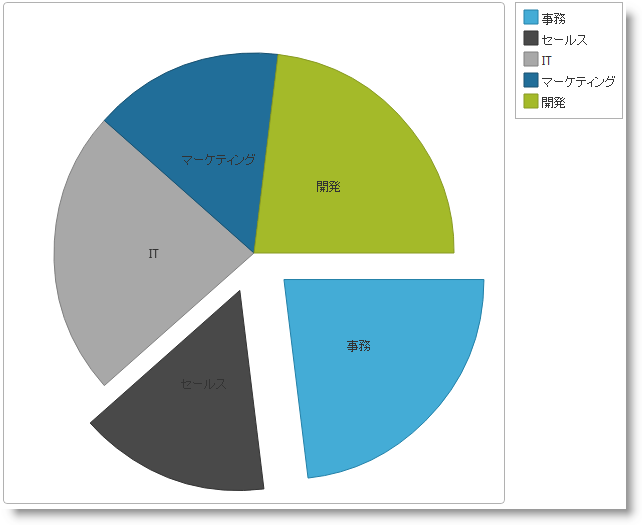
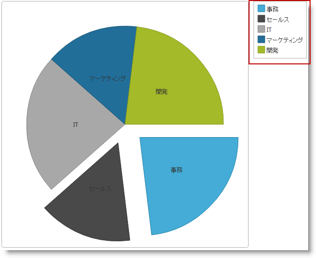
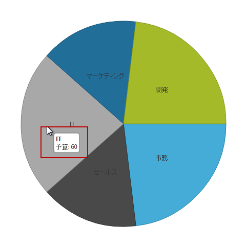
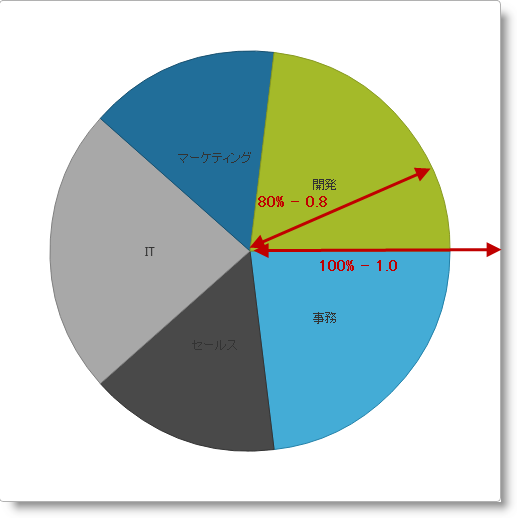
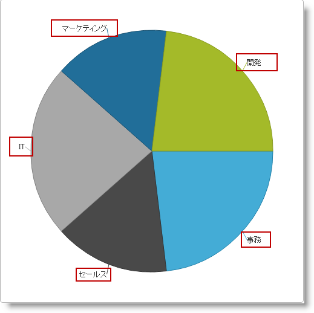
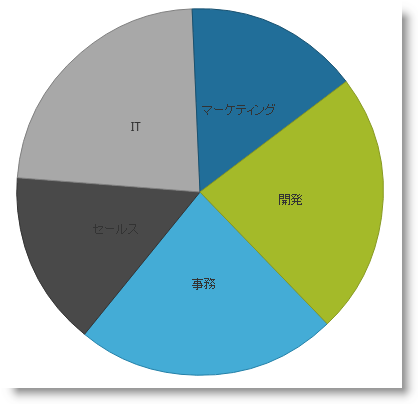
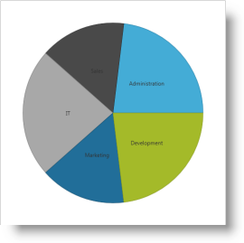
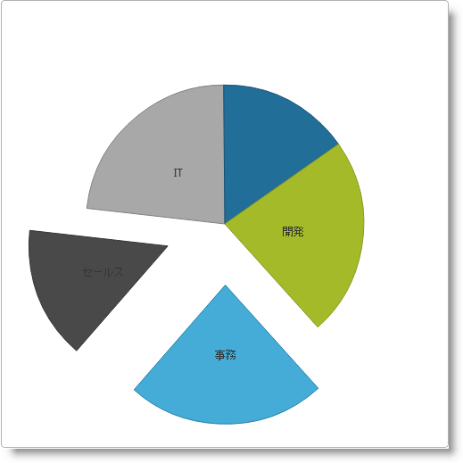

# igPieChart の概要

##トピックの概要

### 目的

このトピックは、`igPieChart`™ コントロールについて、その主要機能、最低必須事項、ユーザー機能といった事項の概念的情報を提供します。

### 前提条件

以下の表に、このトピックを理解するための前提条件として求められる素材をリストします。

**概念**

-   チャート作成
-   円チャート
-   データの可視化

**トピック**

- [&#123;environment:ProductName&#125; の概要](/igniteui-for-jquery-overview): &#123;environment:ProductName&#125;™ ライブラリにつぃての一般的情報

### このトピックの内容

このトピックは、以下のセクションで構成されます。

-   [**概要**](#introduction)
-   [**最低必要条件**](#min-requirements)
    -   [概要](#min-requirements-introduction)
    -   [要件の概要表](#requirements-summary-chart)
	-   [主要機能](#main-features)
-   [**ユーザー相互作用と操作性**](#user-interaction)
-   [**関連コンテンツ**](#related-content)

##概要

### igPieChart の概要

`igPieChart` は、HTML5 によるウェブ アプリケーションで円グラフを描画するチャート作成用コントロールです。これはウェブ ページに円グラフをプロットする際に新しい HTML5 Canvas タグを使用します。

`igPieChart` の主な機能には、凡例、テンプレートに従ったツール チップ、円の大きさのコントロール、ラベル位置のコントロール、開始角度、拡がりの方向、飛び出たスライスとその中心からの位置といったものがあります。それぞれの機能については[主な機能](#main-features)を参照してください。

##最低必要条件

### 概要

igPieChart コントロールは jQuery UI ウィジェットであるため、jQuery ライブラリと jQuery UI ライブラリに依存します。Modernzr ライブラリは、内部的にブラウザーと装置の機能を検出するためにも使用されています。コントロールは、機能とデータのバインド用の &#123;environment:ProductName&#125;™ の共有リソースのいくつかを使用します。これらのリソースへの参照は、実際の jQuery または ProductNameMVC%% が使用されているとしても必要となります。コントロールが ASP.NET MVC のコンテクスト内で使用されている場合、`Infragistics.Web.Mvc` アセンブリが必要です。

### 要件の概要表

次の表は、`igPieChart` コントロールを使用する際に必要な事項を要約したものです。

| 要件 | 説明 |
| --- | --- |
| HTML5 キャンバス API | チャート用ライブラリの機能は、HTML5 Canvas タグとそれに関する API に基づきます。それらをサポートするウェブ ブラウザであれば、igPieChart コントロールが生成するチャートの描画と表示ができます。igPieChart コントロールの操作にはその他の HTML5 機能は必要ありません。[Wikipedia™](http://en.wikipedia.org/wiki/Main_Page) の[キャンバス 要素: サポート](http://en.wikipedia.org/wiki/Canvas_element#Support)のトピックには、HTML5 キャンバス API をサポートしている、最も一般的なデスクトップとモバイル Web ブラウザのバージョンがが詳述されています。 |
| jQuery および jQuery UI JavaScript リソース | environment:ProductName は、これらのフレームワークの最上位にビルドされます。 [jQuery](http://docs.jquery.com/Main_Page) [jQuery UI](http://jqueryui.com/) |
| Modernizr | Modernizr ライブラリは、ブラウザおよびデバイス機能を検出するために igPieChart で使用されます。これは必須ではなく、含まれていない場合、コントロールは HTML5 をサポートするブラウザーが動作する通常のデスクトップ環境であるように動作します。 [Modernizr](http://modernizr.com/docs/) |
| JavaScript リソースのチャート表示 | environment:ProductName ライブラリのチャート表示機能は、シリーズ タイプに応じて複数のファイルに渡って配布されます。また、HTML または MVC ビューにリンクされる必要のある別個の円グラフ JavaScript もあります。 手動でリソースを含めたい場合には、次の表に示された依存関係を使用する必要があります。 JS リソース |
| `infragistics.util.js`, `infragistics.util.jquery.js` | environment:ProductName ユーティリティ |
| `infragistics.datasource.js` | igDataSource™ コントロール |
| `infragistics.ui.widget.js` | すべての environment:ProductName ウィジェットの基本 igWidget。 |
| `infragistics.ext_core.js`, `infragistics.ext_collections.js`, `infragistics.ext_ui.js`, `infragistics.dv_jquerydom.js`, `infragistics.dv_core.js`, `infragistics.dv_geometry.js` | データ可視化コア機能 |
| `infragistics.dvcommonwidget.js` | チャートおよびマップの共通ウィジェット |
| `infragistics.dv_interactivity.js` | パンニング、ズーム、ドラッグなどのユーザー インタラクションのサポートを提供します。 |
| `infragistics.ui.chart.js` | チャート基盤機能 |
| `infragistics.piechart.js` | igPieChart コントロール |
 
			&lt;/td&gt;
&lt;/tr&gt;

		&lt;tr&gt;
			&lt;td&gt;IG テーマ&lt;/td&gt;
			&lt;td&gt;このテーマには、&#123;environment:ProductName&#125; ライブラリ向けに作成されたカスタム ビジュアル スタイルが含まれます。これは次のファイルに含まれます。 `{IG CSS root}/themes/Infragistics/infragistics.theme.css`&lt;/td&gt;
&lt;/tr&gt;

		&lt;tr&gt;
			&lt;td&gt;チャート構造&lt;/td&gt;
			&lt;td&gt;この CSS リソースは、コントロールのさまざまな要素を描画するためにチャート コンポーネントによって使用されます。 `{IG CSS root}/structure/modules/infragistics.ui.chart.css`&lt;/td&gt;
&lt;/tr&gt;
	&lt;/tbody&gt;
&lt;/table&gt;

##主要機能

### 機能の概要

次の表は、`igPieChart` コントロールの主な機能を要約したものです。その他の詳細は、以下の概要表に続くテキスト ブロックで紹介されています。

機能|説明
---|---
[凡例](#legend)|円グラフは、可視化された各データ項目のタイトルが表示されるように構成された凡例を含みます。
[ツールチップ](#tooltips)|ツールチップはチャートの上に浮かぶように表示されます。ツールチップは、ツールチップ内に表示される特定の構造とデータを定義するテンプレートに基づいています。
[円の半径](#pie-radius)|円の半径機能は、円グラフの大きさをコントロールします。
[円ラベル](#pie-label)|円ラベル機能は、各スライスにつけられるラベルの表示とコントロールを担うものです。円グラフの個々の部分のらベルは、対応するスライスに関連した別個の場所に表示されるよう構成されます。
[開始角度](#start-angle)|この機能は、チャートの先頭スライスの位置をコントロールします。
[スイープの方向](#sweep-direction)|この機能は、連続するスライスがチャートにプロットされる方向をコントロールするものです。
[飛び出たスライスとその距離](#explode-slices)|このコントロールは、スライスを分離させる、つまり他と離れて描くもので、その離れる距離もコントロールできます。

### 凡例

凡例 (Legend) は、チャート中の各データ シリーズに対するアイコンとタイトルを示すビジュアル パネルです。

凡例は `igChartLegend`™ という &#123;environment:ProductName&#125; ライブラリとは異なるコントロールで実装されており、ページに異なる div 要素が必要です。この div 要素は、円グラフから参照され、 `labelMemberPath` オプションで指定される各データ項目に対するラベルを表示します。`igChartLegend` は、以下で記述するトピックでカバーされる非常にシンプルなコントロールです。

デフォルトでは、円グラフの legend オプションは null で、凡例は描画されません。

### ツールチップ

ツールチップは、チャート項目上にマウスを置いた時にその位置に現れる小さなパネルで、あらかじめツールチップ テンプレートで定義された情報が表示されます。通常それは特定のスライスに関して円グラフに表示される数値やその他の関連情報です。

ツールチップ テンプレートは、jQuery テンプレート構文に従い、 `igTemplate` エンジンで描画されます。一般に、ツールチップ テンプレートは、`igPieChart` コントロールの `tooltipTemplate` オプションに割り当てられた HTML 文字列で、コントロールによって内部的に描画され、表示されます。置き換える値は `${department.Expenses}` などの jQuery テンプレート構文で定義します。

デフォルトでは、円のスライス上にマウスを置いた時にツールチップは表示されず、tooltipTemplate は null です。

### 円の半径

`igPieChart` コントロールは、円の半径を幅と高さのオプションで指定されるチャート コントロールの長方形枠の一部分として設定します。円の中心は枠の中心にあり、100% または 1.0 の半径は中心から四角形の側面までの最短距離となります。100% または 1.0 の半径は、円の端が四角形の側面に触れた時であり、50% または 0.5 の半径は円の端が四角形の側面から半分の距離に来た時となります。

デフォルトでは、チャートの `radiusFactor` オプションは 0.9 です。

### 円ラベル

円ラベルは、個々のスライスによって表されるエンティティまたはデータ項目を指定するのに使用されます。

スライス ラベルは、対応するスライスに関連した別の場所に置かれます。取り得る設定は、ラベルなし、ラベルをスライスの中央に置く、スライスの中か外に置く、自動的に最適な位置に置くのいずれかです。

デフォルトでは、ラベルはスライスの中央に表示され、`labelsPosition` オプションは “center” となります。

### 開始角度

円グラフのスライスはデフォルトでは、連続するデータ項目に対し時計回りにプロットされます。円グラフの開始角は、中心から右方向に引いた仮想的な水平線を開始点の 0 度として先頭スライスが置かれる相対位置を決めるものです。

開始角 = 0?(デフォルト)|開始角 = 45?
---|---
|

### スイープの方向

デフォルトでは `igPieChart` コントロールは、中心から右方向に引いた仮想的な水平線から時計回りにスライスを連続的に描画します。円グラフ コントロールの設定を変えることで、同じ仮想的な線から反時計回りにスライスを連続的に描画できます。

拡がりの方向を時計回りに (デフォルト)|拡がりの方向を反時計回りに
---|---
|

### 飛び出たスライスとその距離

`igPieChart` コントロールは、いくつかあるいはすべてのスライスを飛び出たように見せ、チャートの中央や他のピースから離します。

チャートの中央からどれくらい飛び出すかは、チャートの半径との比でコントロールします。

デフォルトでは、円グラフから離されて表示されるスライスはなく、`explodedRadius` オプションに対するデフォルト値は 0.2 です。

##ユーザー相互作用と操作性

次の表は、`igPieChart` コントロールの主な機能を要約したものです。

目的|方法|詳細|クライアント/サーバー設定
---|---|---|---
スライスを選択|&lt;ul&gt;&lt;li&gt;マウス クリック&lt;/li&gt;&lt;li&gt;スクリーン タップ&lt;/li&gt;&lt;li&gt;Ctrl + クリック&lt;/li&gt;&lt;/ul&gt;|`igPieChart` は、ひとつまたは複数のスライスに対し、ドリル ダウンといった別のタスクを実行させるようにするものです。|

##関連コンテンツ

### トピック

このトピックの追加情報については、以下のトピックも合わせてご参照ください。

- [igDataChart の概要](/igbulletgraph-overview): このトピックは、`igDataChart`™ コントロールについて、その主要機能、最低必須事項、ユーザー機能といった事項の概念的情報を提供します。

- [igDataChart の追加](/igbulletgraph-adding): このトピックは、`igPieChart`™ コントロールをウェブ ページに追加し、それをデータにバインドする方法を説明します。

- [jQuery および MVC API リファレンス リンク (igPieChart)](/igpiechart-api-links): このトピックでは、`igPieChart`™ の jQuery および &#123;environment:ProductNameMVC&#125; クラスの API ドキュメンテーションへのリンクを提供します。

- [データ バインディング (igPieChart)](/igpiechart-databinding): このトピックでは、さまざまなデータ ソースを `igPieChart`™ コントロールにバインドする方法を説明します。

- [igPieChart にテーマを設定する](/igpiechart-styling-themes): スタイルを用い、`igPieChart`™ にテーマを適用する方法を説明します。

### サンプル

このトピックについては、以下のサンプルも参照してください。

- [JSON のバインド](&#123;environment:SamplesUrl&#125;/pie-chart/json-binding): このサンプルは、JSON データにバインドされた円チャートを表示します。

 

 

