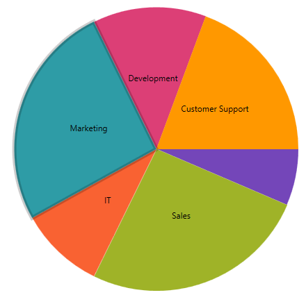
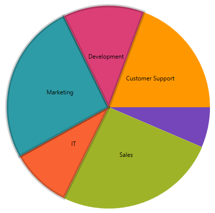

---
title: "選択"
slug: igpiechart-selection
---

# 選択

このトピックでは、`igPieChart`™ コントロールの選択機能の有効化および使用方法について説明します。 

### このトピックの内容

このトピックは、以下のセクションで構成されます。

-   [要件](#Requirements)
-   [概要](#Overview)
-   [選択の有効化](#EnablingSelection)
-   [選択モード](#SelectionModes)
-   [「その他」スライスの選択](#SelectingOthers)
-   [関連トピック](#RelatedTopics)


### <a id="Requirements"></a> 要件

このトピックは、ユーザーが[データ バインディング](igPieChart_DataBinding.html) トピックを既に読んでいることを前提とし、初めにそのコードを使用します。

### <a id="Overview"></a> 概要

デフォルトで、円チャートはマウス クリックによるスライス選択をサポートします。選択されたスライスは、'selectedItem' プロパティで取得します。以下の画像にあるように、選択されたスライスは強調表示されます。



### <a id="EnablingSelection"></a> 選択の有効化

円チャートのモードは `selectionMode` プロパティで設定します。デフォルトは Single です。選択機能を無効化するためにはプロパティを Manual に設定します。  

以下のコード例では、選択機能を無効化する方法を示します。

**JavaScript の場合:**

```
$(function () {
    $("#chart").igPieChart({
        dataSource: data, 
        dataValue: "Pop2008",
        dataLabel: "CountryName",
        labelsPosition: "bestFit",
        selectionMode: "manual",
    }
});
```

### <a id="SelectionModes"></a> 選択モード

円チャートは、選択モードを 3 つサポートします。  

-  Single
-  Multiple
-  Manual

### Single

Single モードに設定すると、一度に 1 つのスライスのみ選択します。他のスライスを選択すると、最初に選択したスライスは選択解除され、新しいスライスが選択されます。


### Multiple

Multiple モードに設定すると、一度に複数のスライスを選択します。スライスをクリックするとスライスが選択され、他のスライスをクリックすると、最初のスライスも、新しくクリックしたスライスも選択されます。



### Manual 

Manual モードに設定すると、選択は無効化されます。

### <a id="SelectionEvents"></a> セル イベント

円チャートには、選択機能に関連する 4 つのイベントがあります。

- `selectedItemChanging`
- `selectedItemChanged`
- `selectedItemsChanging`
- `selectedItemsChanged`

「Changing」で終わるイベントはキャンセル可能なイベントです。すなわち、イベント引数プロパティ Cancel を true に設定することで、スライスの選択を停止します。True に設定すると、関連付けられたプロパティは更新されず、その結果スライスは選択されません。この設定はたとえば、スライスのデータによって一定のスライスの選択を無効化する場合に使用します。

**JavaScript の場合:**

```
$(function () {
    $("#chart").igPieChart({
        dataSource: data, 
        dataValue: "Pop2008",
        dataLabel: "CountryName",
        labelsPosition: "bestFit",
        selectedItemChanging: function (evt, ui) {
            ui.cancel;
        }
    }
});
```


### <a id="SelectingOthers"></a> 「その他」スライスの選択

「その他」スライスをクリックすると、 `pieSliceOthersContext` オブジェクトが返されます。オブジェクトは、「その他」スライスに含まれるデータ項目のリストがあります。

### <a id="RelatedTopics"></a> 関連トピック

- [データ バインディング (igPieChart)](/controls/igpiechart/databinding): このトピックでは、さまざまなデータ ソースを `igPieChart`™ コントロールにバインドする方法を説明します。

- [jQuery および MVC API リファレンス リンク (igPieChart)](/controls/igpiechart/api-links): このトピックは、`igDataChart`™ の jQuery および &#123;environment:ProductNameMVC&#125; クラスのたえの API マニュアルへのリンクを提供します。

- [igPieChart にテーマを設定する](/controls/igpiechart/styling-themes): スタイルを用い、`igPieChart`™ にテーマを適用する方法を説明します。
