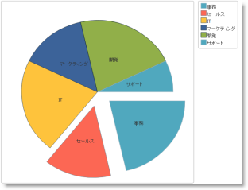
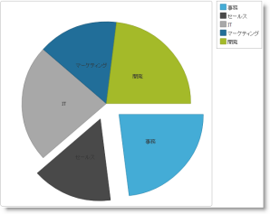

# igPieChart にテーマを設定する


## トピックの概要


### 目的

スタイルを用い、`igPieChart`™ にテーマを適用する方法を説明します。

### 必要な背景

**概念**

-   カスケード スタイル シート
-   リンクされた CCS ファイルの変更によるテーマの適用

**トピック**

-	[&#123;environment:ProductName&#125; のスタイル設定とテーマ設定](/deployment-guide-styling-and-theming): このトピックは、&#123;environment:ProductName&#125;™ ライブラリのスタイルとテーマの更新に関する一般情報とその手順を説明します。

**外部リソース**

- [jQuery UI](http://jqueryui.com/): jQuery UI ライブラリ ホーム ページ

- [jQuery UI のテーマ設定](http://docs.jquery.com/UI/Theming): jQuery UI のテーマについて採用したアプローチと内部構造の詳細説明です。

- [jQuery UI CSS Framework](http://docs.jquery.com/UI/Theming/API): jQuery UI CSS Framework について詳しく説明します。


### このトピックの構成

このトピックは、以下のセクションで構成されます。

-   [**概要**](#introduction)
-   [**テーマの概要**](#theme-summary)
-   [**必要なカスケード スタイル シート (CSS)**](#required-css)
    -   [必要な CSS の概要](#required-css-summary)
    -   [必要な CSS コード: HTML](#required-css-htm)
    -   [必要な CSS コード: ASPX](#required-css-aspx)

-   [**チャート スタイル参照**](#chart-style-reference)
-   [**円チャート スタイル設定オプション**](#pie-chart-style-options)
-   -   [概要](#options-introduction)
    -   [スタイル リファレンスの概要](#style-reference)
-   [**テーマを使用したチャート固有の視覚要素の変更**](#modify-chart-specific)
-   -   [概要](#chart-specific-introduction)
    -   [プレビュー](#chart-specific-preview)
    -   [要件](#chart-specific-requirements)
    -   [概要](#chart-specific-overview)
    -   [手順](#chart-specific-steps)
-   [**関連コンテンツ**](#related-content)
-   -   [トピック](#topics)
    -   [リソース](#resources)


## 概要

### テーマの紹介

igPieChart は、スタイルおよびテーマを適用するために jQuery UI CSS Framework を使用します。デフォルトでは、igPieChart は、その他のチャート固有のスタイルとともにアプリケーションで使用するため、インフラジスティックスが提供する jQuery UI テーマの一部である IG テーマを使用します。つまり、チャートの外観をカスタマイズするには一般の jQuery UI テーマでは不十分だということです。データ シリーズや軸などチャート固有の要素を変更するその他の style クラスを提供する必要があります。

`ThemeRoller` を使用してテーマをカスタマイズできます。`ThemeRoller` は jQuery UI が提供するツールで。これを使用すると、jQuery UI ウィジェットと互換性のあるカスタム テーマを簡単に作成できるようになります。数々のビルド済みテーマをご自分の Web サイトにダウンロードして使用できます。`igPieChart` コントロールは `ThemeRoller` のテーマの使用に対応しています。

&#123;environment:ProductName&#125; ライブラリでテーマを使用する方法の詳細については、「[スタイル設定とテーマ設定](/deployment-guide-styling-and-theming)」トピックをご覧ください。

>**注:** &#123;environment:ProductName&#125; のベース テーマはチャートには不要で、チャートのみ表示されたページでは省略できます。


## テーマの概要


### テーマの概要表

次の表は、`igPieChart` で使用できるテーマをまとめたものです。


テーマ
説明
IG テーマ
パス: &#123;IG CSS root&#125;/themes/Infragistics/ ファイル: infragistics.theme.css
このテーマは、すべての &#123;environment:ProductName&#125; コントロールの一般的なビジュアル機能を定義します。IG テーマの使用方法の詳細については、「<a href="Deployment-Guide-Styling-and-Theming.html" data-auto-update-caption="true">&#123;environment:ProductName&#125; のスタイル設定とテーマ設定</a>」トピックをご覧ください。
チャート構造
テーマ
説明
IG テーマ
パス: &#123;IG CSS root&#125;/themes/Infragistics/ ファイル: infragistics.theme.css
このテーマは、すべての &#123;environment:ProductName&#125; コントロールの一般的なビジュアル機能を定義します。IG テーマの使用方法の詳細については、「<a href="Deployment-Guide-Styling-and-Theming.html" data-auto-update-caption="true">&#123;environment:ProductName&#125; のスタイル設定とテーマ設定</a>」トピックをご覧ください。
チャート構造
パス: `&#123;IG CSS root&#125;/structure/modules/` ファイル: `infragistics.ui.chart.css`
このテーマは特定の視覚要素を定義します。
ファイル: `infragistics.ui.chart.css`
このテーマは特定の視覚要素を定義します。


## 必要なカスケード スタイル シート (CSS)


### 必要な CSS の概要

チャートを正しく描画するためには以下の CSS リソースが必要です。

-   `infragistics.theme.css` - IG テーマが含まれています。
-   `infragistics.ui.chart.css` - チャート構造が含まれています。

以下のコード スニペットでは、CSS リソースが Web サイトまたはアプリケーション ルート下の `Content/ig` フォルダーに保存されていることを前提としています。

>**注:** 以下のブロックは、手動で必要な CSS ファイルを組み込む場合の情報を提供しています。ただし、Infragistics Loader コントロールを使用してこれらのファイルをページに読み込むことをお勧めします。

### 必要な CSS コード: HTML

**HTML の場合:**

```html
<link href="Content/ig/themes/Infragistics/infragistics.theme.css" rel="Stylesheet" />
<link href="Content/ig/structure/modules/infragistics.ui.chart.css" rel="Stylesheet" />
```

### 必要な CSS コード: ASPX

**ASPX の場合:**

```csharp
<link href='<%= Url.Content("~/Content/ig/themes/Infragistics/infragistics.theme.css")%>'      rel="stylesheet" type="text/css" />
<link href='<%= Url.Content("~/Content/ig/structure/modules/infragistics.ui.chart.css")%>'      rel="stylesheet" type="text/css" />
```


## チャート スタイル参照

### スタイル リファレンスの概要

`igDataChart` コントロールのスタイルと機能の概要です。

プロパティ|説明
---|---
.ui-chart-palette-1 ~ .ui-chart-palette-N | データ シリーズ 1 の境界線と背景の色をデータ シリーズ N に設定します。アプリケーションで必要なだけ `ui-chart-palette` クラスを持つことができます。
.ui-chart-axis|チャート軸の境界線と背景の色を設定します。
.ui-chart-legend-items-list|チャートの凡例のすべてのスタイル設定オプションを設定します。
.ui-chart-legend-item-text|凡例項目のテキストのすべてのスタイル設定オプションを設定します。
.ui-chart-legend-item-badge|凡例項目のアイコンのすべてのスタイル設定オプションを設定します。
.ui-chart-tooltip|チャートのツールチップのすべてのスタイル設定オプションを設定します。


>**注:** すべての style クラスで、境界線の色設定は対応する要素のアウトラインを決定し、背景色の設定は要素の背景または塗りつぶしの色を決定します。


## 円チャート スタイル設定オプション


### 概要

`igPieChart` コントロールはビジュアル コンテンツ用で、チャートのレイアウトおよび色を変更するための多数のプロパティおよびスタイル設定オプションがあります。CSS を使用して以下を定義します。

-   データ項目の色、
-   凡例リスト項目、テキスト、およびアイコンの色、および
-   ツールチップのフォーマット用の色、網掛け、フォント、その他の CSS プロパティ。

**個々の円チャート コントロール オプションで、以下を定義できます。**

-   データ項目の色およびアウトラインおよび
-   スライス ラベル テキストのスタイル。

以下の参照テーブルは、チャート要素の色とその目的を変更するすべてのオプションをカタログ化しています。設定された円チャート オプションは CSS ファイルで定義された style クラスより優先されます。これらのオプションは、チャートの描画を実行時にプログラム的に変更します。

### スタイル リファレンスの概要

`igPieChart` スタイルの目的と機能の概要です。

プロパティ|説明
---|---
brushes|自動的に割り当てられたスライスの色を選択するパレットを定義します。
textStyle|ラベル レンダリング スタイルをオーバーライドします。
outlines|自動的に割り当てられたスライス アウトラインの色のパレットを定義します。


## テーマを使用したチャート固有の視覚要素の変更

### 概要

この手順は、チャート固有の `infragistics.ui.chart.css` ファイルのスタイルを変更することで `igPieChart` コントロールのさまざまな視覚要素のデフォルト設定を変更する方法を説明します。

この例では円チャートの作成手順を説明していないため、円チャートのある既存のページをご覧ください。この例では、円スライスの色を変更することでチャート スタイルを変更しています。

### プレビュー

以下のスクリーンショットはサンプル チャートのデフォルト ビューで、デフォルト スタイルとともに更新されたスライス カラーの例を示しています。

デフォルトのスライス カラー|更新されたスライス カラー
---|---
|


### 要件

-   この手順を実行するには、以下が必要です。
   -   既存の `igPieChart` コントロールがある HTML5 Web ページ

### 概要

カスタム チャート テーマを作成するための段階的な手順です。以下はプロセスの概念的概要です。

1.  [デフォルト チャート CSS ファイルをコピーする](#copy-css-style)
2.  [チャートの視覚要素のスタイルを変更する](#modify-styles)
3.  [デフォルト チャート CSS ファイルから変更されたファイルへのリンクを変更する](#change-default-style)
4.  [結果の検証](#observe-result)

### 手順

デフォルト IG Chart スタイルを好みの設定で変更する方法を紹介します。


1. <a id="copy-css-style"></a>デフォルト チャート CSS ファイルをコピーする 

	**チャート スタイルがデフォルトの CSS ファイル (`infragistics.ui.chart.css`) を &#123;environment:ProductName&#125; インストール フォルダーから Web サイトまたはアプリケーションの themes フォルダーにコピーします。**

	たとえば、アプリケーションで使用する CSS ファイルを保存している Web サイトまたはアプリケーションに Content/themes フォルダーがある場合、上記のデフォルト チャート CSS ファイルをコピーして `Content/themes/MyChartTheme/ig.ui.chart.custom.css` に貼り付けます。

2. <a id="modify-styles"></a>チャートの視覚要素のスタイルを変更する

	CSS ファイルのコピーを開き、目的のスタイル変更を行います。(個々の `igPieChart` スタイルの詳細については、[チャート スタイル参照](#chart-style-reference)のセクションを参照してください。)

	**CSS の場合:**

```css
	.ui-chart-palette-1
	{
	    border-color: rgb(35, 128, 168);
	    border-color: rgba(35, 128, 168, .8);
	    background-color: rgb(68, 172, 214);
	    background-color: rgba(68, 172, 214, .8);
	}
	.ui-chart-palette-2
	{
	    border-color: rgb(51, 51, 51);
	    border-color: rgba(51, 51, 51, .8);
	    background-color: rgb(73, 73, 73);
	    background-color: rgba(73, 73, 73, .8);
	}
	.ui-chart-palette-3
	{
	    border-color: rgb(128, 128, 128);
	    border-color: rgba(128, 128, 128, .8);
	    background-color: rgb(168, 168, 168);
	    background-color: rgba(168, 168, 168, .8);
	}
	.ui-chart-palette-4
	{
	    border-color: rgb(24, 81, 112);
	    border-color: rgba(24, 81, 112, .8);
	    background-color: rgb(33, 110, 153);
	    background-color: rgba(33, 110, 153, .8);
	}
	.ui-chart-palette-5
	{
	    border-color: rgb(135, 153, 34);
	    border-color: rgba(135, 153, 34, .8);
	    background-color: rgb(164, 186, 41);
	    background-color: rgba(164, 186, 41, .8);
	}
	.ui-chart-axis
	{
	    border-color: #989EA3;
	    background-color: #989EA3;
	}
	.ui-chart-legend-items-list
	{
	    padding: 10;
	    margin: 5px;
	}
	.ui-chart-legend-item-text
	{
	    vertical-align: text-bottom;
	}
	.ui-chart-legend-item-badge
	{
	    vertical-align: baseline;   
	}
	.ui-chart-tooltip
	{
	    -moz-box-shadow: 5px 5px rgba(0,0,0,0.5);
	    -webkit-box-shadow: 5px 5px rgba(0,0,0,0.5);
	    box-shadow: 5px 5px rgba(0,0,0,0.5);
	}
```

3. <a id="change-default-style"></a>デフォルト チャート CSS ファイルから変更されたファイルへのリンクを変更する

	デフォルト チャート CSS ファイルへのリンクを更新し、前のステップで変更された CSS ファイルをポイントします。

	**HTML の場合:**

```html
	<link href="/Content/themes/MyChartTheme/ig.ui.chart.custom.css"      rel="Stylesheet" type="text/css" />
```

	**ASPX の場合:**

```csharp
	<link href='<%= Url.Content("~/Content/themes/MyChartTheme/ig.ui.chart.custom.css")%>'      rel="stylesheet" type="text/css" />
```

4. <a id="observe-result"></a>(オプション) 結果を観察。

	チャートの色とスタイルが変更されたことを確認するには、Web ページを保存し、ブラウザーで開きます。


## 関連コンテンツ

### トピック

このトピックの追加情報については、以下のトピックも合わせてご参照ください。

- [igPieChart の概要](/igpiechart-overview): このトピックでは、`igPieChart` コントロールについての概念情報を提供します。これには、その主な機能、チャートとユーザー機能を使用するための最低要件が含まれます。

- [igPieChart の追加](/igpiechart-adding): このトピックでは、`igPieChart` をコントロールを作成して追加し、データにバインドする方法を紹介します。

### リソース

以下のサード パーティ資料には、このトピックに関連する追加情報を記載しています。

- [jQuery Themeroller](http://jqueryui.com/themeroller/): プレビューとダウンロードのため jQuery UI テーマを提供します。


 

 


