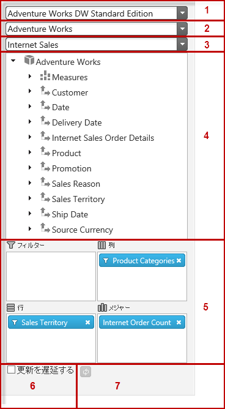

# igPivotDataSelector の概要

##トピックの概要

### 目的

このトピックは、主要機能、最小要件、ユーザー機能性など、`igPivotDataSelector`™ コントロールに関する概念的な情報を提供します。

### 前提条件

以下の表は、このトピックを理解するための前提条件として必要なトピックと概念の一覧です。

**トピック**

- [多次元 (OLAP) データ ソース コンポーネント](/multidimensional-data-source-components): このトピック グループでは、&#123;environment:ProductName&#125;™ スイートの多次元 (OLAP) データ ソース コンポーネントを説明します。

**外部リソース**

-   [XML for Analysis (XMLA)](http://msdn.microsoft.com/ja-jp/library/ms187178%28v=SQL.90%29.aspx)
-   [SQL Server Analysis Services](http://msdn.microsoft.com/ja-jp/library/ms175609%28v=sql.90%29.aspx)
-   [オンライン解析処理 (OLAP) との操作](http://msdn.microsoft.com/ja-jp/library/ms175367%28v=SQL.90%29.aspx)

### このトピックの内容

このトピックは、以下のセクションで構成されます。

-   [概要](#introduction)
-   [主要機能](#main-features)
-   [ユーザー インタラクションと操作性](#user-interaction)
-   [要件](#requirements)
-   [関連コンテンツ](#related-topics)
    -   [トピック](#topics)
    -   [サンプル](#samples)

##概要

### igPivotDataSelector の概要

`igPivotDataSelector` は、データが `igPivotGrid`™ で可視化されている場合にユーザーがデータ スライスを選択できるインタラクティブな UI コントロール (jQuery UI ウィジェット) です。 [データ ソース コンポーネント](/multidimensional-data-source-components)と連携する補完コントロールです。`igPivotDataSelector` コントロールは以下から構成されます。

-   データベース (1)、キューブ (2) およびメジャー グループ (3) ([igOlapXmlaDataSource](/igolapxmladatasource)™ を使用する場合のみ) を選択するためのドロップダウン
-   すべてのディメンジョン、メジャー、階層およびレベルを表示するメタデータ ツリー (4)
-   階層およびメジャーを選択するためのドロップ エリア (5)
-   遅延更新チェックボックス (6)
-   更新ボタン (7)

ユーザーが `igPivotDataSelector` コントロールを操作する典型的な方法です。ユーザーがデータベースおよびキューブをドロップダウンから選択すると、すべての使用可能ディメンジョンを持つメタデータ ツリーはそれぞれの階層およびメジャーと同様に読み込みます。[igOlapXmlaDataSource](/igolapxmladatasource) が使用されると、ツリーはユーザー選択時に読み込みます。[igOlapFlatDataSource](/igolapflatdatasource)™ が使用される、またはデータベースおよびキューブが事前に設定されていると、`igPivotDataSelector` が初期化される際にツリーに読み込みまれす。この方法で、`igPivotDataSelector` はインタラクティブな UI コンポーネントを提供し、接続するデータベース、データを抽出するキューブ、および使用するメジャー グループを選択します。

`igPivotDataSelector` は、多くのデータ ビジュアライゼーション コントロールと同様に div 要素を使用してページ上に直接配置されます。

##主要機能

### 主要な機能の概要表

以下の表で、`igPivotDataSelector` コントロールの主な機能を簡単に説明します。

機能|説明 
---|---
データ選択|データ ソースが与えられると、`igPivotDataSelector` は、接続するデータベース (データベースを使用する場合)、データを抽出するキューブ、およびメジャー グループのセットを選択するためのドロップダウンを提供します。
メタデータ ツリー|すべての使用可能なメジャーを持つリストに沿って各階層で使用可能なすべてのディメンジョンは、ユーザーがデータベース、キューブ、およびメジャー グループを選択するとツリー内に読み込まれます。ユーザーがメジャー グループを選択すると、メジャーはそれに応じてフィルタリングされます。何も選択されないと、すべてのメジャーはメタデータ ツリーで使用可能です。
スライス の相互作用|カスタム制限が適用されない限り、ツリーからのすべての使用可能な階層は行、列、フィルターのいずれかのエリアにドラッグ アンド ドロップできます。ツリーからのすべての使用可能なメジャーはメジャー エリアにドラッグ アンド ドロップできます。
遅延更新|`igPivotDataSelector` は、ユーザーコントロール内で変更を行った後にデータ ソースが更新されるときに基づいて 2 つのデータ ソース更新モードをサポートします。<ul><li>即時 - ユーザーがコントロール内で変更を行うと、変更は基本バックエンドでただちに実行されデータ ソースを更新します。ユーザーは、コントロールと再度対話するにはコントロールが新しい状態にリフレッシュされるまで待機しなければなりません。</li><li>遅延 - ユーザーが明示的にリフレッシュ操作 (更新ボタンで) を実行するまでシステムは更新されません。これにより、それぞれの変更後、コントロールがリフレッシュされるのを待機する必要が無く複数の変更を実行できます。</li></ul>遅延更新は、特に大容量のデータが関わる場合、システム リソースに負担をかけずにコントロールのパフォーマンスを改善します。`igPivotDataSelector` では、ユーザーは遅延更新」チェックボックスでリフレッシュ モードを制御できます。ボックスがチェックされている場合、更新ボタンを押すことで任意にデータ ソースを手動でリフレッシュします。 
その他の &#123;environment:ProductName&#125; コントロールとの操作のサポート|`igPivotDataSelector` は、`igPivotGrid` などその他の &#123;environment:ProductName&#125; コントロールと同じデータ ソース インスタンスを使用します。これにより、完全な OLAP データ ビジュアライゼーション アプリケーションを構築できます。(同様の目的を持つ `igPivotView` コントロールを使用できます)

##ユーザー インタラクションと操作性

### ユーザー インタラクションの概要表

以下の表で、`igPivotDataSelector` コントロールのユーザー相互作用機能を簡単に説明します。

目的|方法|詳細|クライアント/サーバー設定
---|---|---|---
データベース、キューブおよびメジャー グループ (`igOlapXmlaDataSource` のみ) を変更します。|データ選択ウィザードのコンボ ボックス|`igOlapXmlaDataSource` フレームワークの catalog プロパティ、cube プロパティおよび `measureGroup` プロパティを使用して最初にデータベース、キューブおよびメジャー グループをプログラム的にセットアップできます。|<ul><li>[igOlapXmlaDataSource の追加](/igolapxmladatasource-adding)</li></ul>
データ ソースのディメンションおよびメジャーを参照|メタデータ ツリー コントロール|ユーザーはすべての使用可能なディメンション、メジャー、階層およびレベルを参照できます。|
行、列およびフィルターの階層を選択します。|ツリーから行、列およびフィルターのエリアにドラッグ アンド ドロップします。|カスタム制限が設定されない限り、ユーザーはメタデータ ツリーで使用可能なすべての階層を行、列またはフィルターのいずれかのエリアにドラッグできます。|<ul><li>[ピボット グリッドの列、行、フィルター、メジャーの配列による結果セットの表形式ビューを構成します (igOlapFlatDataSource、 igOlapXmlaDataSource、igPivotDataSelector、igPivotGrid, igPivotView)](/configuring-the-tabular-view)</li></ul>
メジャーを選択します。|ツリーからメジャー エリアにドラッグ アンド ドロップします。|カスタム制限が設定されない限り、ユーザーはメタデータ ツリーで使用可能なすべてのメジャーをメジャー エリアにドラッグできます。|<ul><li>[ピボット グリッドの列、行、フィルター、メジャーの配列による結果セットの表形式ビューを構成します (igOlapFlatDataSource、 igOlapXmlaDataSource、igPivotDataSelector、igPivotGrid, igPivotView)](/configuring-the-tabular-view)</li></ul>
階層内のメンバーをフィルタリング|行、列またはフィルターに追加される各階層のフィルター メニューを使用する|項目がエリアに追加されると、ユーザーにより削除できます。階層の場合、フィルター メニューを使用でき、階層メンバーを展開/折りたたむ、または選択/選択解除することができます。そのため、メンバーを結果に追加できます、または結果から削除できます。|<ul><li>[ピボット グリッドの列、行、フィルター、メジャーの配列による結果セットの表形式ビューを構成します (igOlapFlatDataSource、 igOlapXmlaDataSource、igPivotDataSelector、igPivotGrid, igPivotView)](/configuring-the-tabular-view)</li></ul>
遅延更新を有効/無効にします。|遅延更新のチェックボックスをチェックする/チェックを外す|-|
遅延更新が有効になると、グリッドをオンデマンドで更新します。|[レイアウト更新] ボタン () をクリックすることにより|-|

##要件

### 要件の概要

`igPivotDataSelector` コントロールは jQuery UI ウィジェットであるため、jQuery と jQuery の UI ライブラリに依存します。Modernzr ライブラリは、内部的にブラウザーと装置の機能を検出するためにも使用されています。コントロールは、その機能のために通常いくつかの &#123;environment:ProductName&#125; 共有リソースを使用します。これらのリソースへの参照は、実際の jQuery または &#123;environment:ProductNameMVC&#125; が使用されているとしても必要となります。コントロールが ASP.NET MVC のコンテクスト内で使用されている場合、`Infragistics.Web.Mvc` アセンブリが必要です。

`igPivotDataSelector` コントロールを使用した必要なリソースの詳細なリストについては、「[igPivotDataSelector の HTML ページへの追加](/igpivotdataselector-adding-to-html-page)」を参照してください。

##関連コンテンツ

### トピック

このトピックの追加情報については、以下のトピックも合わせてご参照ください。

- [igPivotDataSelector の HTML ページへの追加](/igpivotdataselector-adding-to-html-page): このトピックは、`igPivotDataSelector` を HTML ページへ追加する方法を示します。

- [jQuery と MVC API リンク (igPivotDataSelector)](/igpivotdataselector-api-links): このトピックは、`igPivotDataSelector` と ASP.NET MVC ヘルパーに関する API ドキュメントへのリンクの一覧を示します。

### サンプル

このトピックについては、以下のサンプルも参照してください。

- [XMLA データ ソースにバインド](&#123;environment:SamplesUrl&#125;/pivot-grid/binding-to-xmla-data-source): このサンプルでは、`igPivotGrid` を `igOlapXmlaDataSource` にバインドし、データ選択のために `igPivotDataSelector` を使用します。

- [ASP.NET MVC ヘルパーと XMLA データ ソースの使用](&#123;environment:SamplesUrl&#125;/pivot-data-selector/using-the-asp-net-mvc-helper-with-xmla-data-source): このサンプルでは、`igOlapXmlaDataSource` に ASP.NET MVC ヘルパーを使用し、このデータ ソースを `igPivotDataSelector` および `igPivotGrid` に使用する方法を紹介します。

- [リモート XMLA プロバイダー](&#123;environment:SamplesUrl&#125;/pivot-grid/remote-xmla-provider): このサンプルは、`igOlapXmlaDataSource` のネットワーク トラフィックのより少ないリモート プロバイダー機能を使用するメリットのいずれかを示します。すべての要求は、クロス ドメインの問題を防止するためにサーバー アプリケーションを介してプロキシーされます。また、応答のサイズを小さくなるために、データが JSON に変換されます。

 

 

