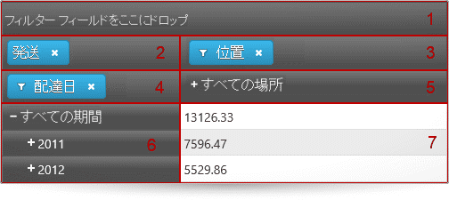

---
title: "igPivotGrid の概要"
slug: igpivotgrid-overview
---

# igPivotGrid の概要

##トピックの概要

### 目的

このトピックは、主要機能、最小要件、ユーザー機能性など、`igPivotGrid`™ コントロールに関する概念的な情報を提供します。

### 前提条件

以下の表は、このトピックを理解するための前提条件として必要なトピックと概念の一覧です。

**トピック**

- [多次元 (OLAP) データ ソース コンポーネント](/data-sources/olap/multidimensional-data-source-components): このトピック グループでは、&#123;environment:ProductName&#125;™ スイートの多次元 (OLAP) データ ソース コンポーネントを説明します。

**外部リソース**

-   [ピボット表](http://en.wikipedia.org/wiki/Pivot_table)
-   [オンライン分析処理](http://en.wikipedia.org/wiki/OLAP)

### このトピックの内容

このトピックは、以下のセクションで構成されます。

-   [概要](#introduction)
-   [主要機能](#main-features)
-   [ユーザー インタラクションと操作性](#user-interaction)
-   [要件](#requirements)
-   [関連コンテンツ](#related-content)
    -   [トピック](#topics)
    -   [サンプル](#samples)

##概要

### igPivotGrid の概要

`igPivotGrid` コントロールは、[ピボット テーブル](http://en.wikipedia.org/wiki/Pivot_table) にデータを表示するためのデータ プレゼンテーション コントロールです。ユーザーは提供されたデータで複雑な解析を実行できます。`igPivotGrid` は、オンライン解析処理 (OLAP) アプローチを使用して、分かりやすい方法で多次元クエリーの結果を表示します。`igPivotGrid` コントロールは、 `igOlapFlatDataSource`™ コンポーネントまたは  `igOlapXmlaDataSource`™ コンポーネントのインスタンスをデータ ソースとして使用します。

`igPivotGrid` コントロールは、以下の要素から構成されます。

-   **ドロップ エリア**。フィルター用 (1)、メジャー用 (2)、列用 (3) および行用 (4) で、ユーザーはここから階層およびメジャーを選択します。
-   **列ヘッダー エリア** (5)。ピボット表の列を形成する階層のメンバーを表示します。
-   **行ヘッダー エリア** (6)。ピボット表の行を形成する階層のメンバーを表示します。
-   **セル エリア** (7) 。セル値が表示されます。

あるドロップ エリアから別のドロップ エリアへ階層をドラッグ アンド ドロップすることにより、ユーザーは現在使用されている階層およびメジャーを変更し、階層エリアおよびセルに表示される結果セットの表のビューを変更できます。行と列のヘッダー エリアには、それぞれの階層のメンバーが表示され、メンバー (子メンバー ノードを持つもの) を展開および縮小できます。各セルにおいて、表示される値の意味は、それぞれの列および行のメンバーの意味の交差です (上記画像では、値7596.47 の意味は「すべての場所」 (列メンバーの名前) と「2011」 (行メンバーの名前)の交差により作成されます。言い換えると、「すべての場所における 2011 の全製品の配送料は以下の通りです」という意味です )。

これらの要素を操作すると、ユーザーは表示結果を見渡しデータの角度をより良くするよう分析観点を変更できます。これは最終的にはより効果的なデータの利用につながります。

`igPivotGrid` コントロールは OLAP キューブまたはフラットなデータ コレクションから得たデータをスライス、ダイス、ドリルダウン、ドリルアップおよび旋回できます。機能という武器を有し、`igPivotGrid` は洗練されたデータ駆動型のアプリケーショを構築できます。

`igPivotGrid` は &#123;environment:ProductName&#125; スイートからの別のコントロールを緊密に連携するよう設計されています -  [igPivotDataSelector](/controls/igpivotdataselector/igpivotdataselector)™。`igPivotDataSelector` コントロールは、`igPivotGrid` で表示するためにユーザーが使用可能なデータ ソースで使用可能なすべての階層およびメジャーを管理します。(igPivotGrid をそのままで使用すると、ユーザーはデータとの相互作用が現在ピボット グリッドで表示されているデータ スライスのみに制限されます)`igPivotDataSelector` をサイズ変更および縮小するため組み込み機能から恩恵を受ける 2 つのウィジェットでなく 1 つのウィジェットを望む場合、`igPivotGrid` と igPivotDataSelector の組み合わせでなく [igPivotView](/controls/igpivotview/igpivotview)™ を使用します。

##  主要機能

以下で、`igPivotGrid` コントロールの主な機能を簡単に説明します。

### データ管理

データ ソースのいずれかの階層が `igPivotGrid` 内で列、行またはフィルターとして使用できます。データ ソース メジャーは、対応する数値を表示するために使用されます。ユーザーはドラッグ アンド ドロップにより行と列の間に現在の階層を移動します。そのエリアの階層またはメジャーの正確な位置を指定することもできます。

以下の画像は、行のドロップ エリアから列のドロップ  エリア内の最後の位置に移動される 営業担当地域階層を示します。

>**注:** `igPivotGrid` のデータ管理機能は、表のビューですでに使用可能な階層に制限されます。現在グリッドに表示されていないものも含めすべての階層/メンバーをユーザーが使用できる必要がある場合、`igPivotGrid` と `igPivotDataSelector`  コントロールを一緒に使用する必要があります。

### 階層メンバーの展開/縮小

`igPivotGrid` は、階層データを表示するための標準 UI インターフェイスを公開します。メンバーを展開および折りたたむには +/- ボタンがあり、すべての現在の階層でユーザーは任意の表のビュー配置を表示できます。

以下の画像は、行に使用される階層のメンバーの展開状態と折りたたみ状態を比較しています。

#### 展開状態 

#### 折りたたみ状態

### フィルタリング

ユーザーは、解析に関係ないメンバーをフィルタリングして、どのメンバーを結果に表示するのか選択できます。フィルタリング条件は、フィルターのドロップダウン メニューに表示するメンバーをチェックすることで選択します。

### 並べ替え

`igPivotGrid` は 2 種類の並べ替えをサポートします。

-   値ベース - 1 つ以上の列内の値に基づいて行を並べ替えします。
-   キャプション ベース- メンバーのキャプションに基づいて特定のレベルに属する行または列の並べ替え

値ベースの並べ替えは、キャプション ベースの並べ替えが列階層のレベルに適用されるときにキャプション ベースと同時に使用できます。ただしキャプション ベースの並べ替えが行階層のレベル メンバーに適用される場合、値ベースの並べ替えを適用するとキャプション ベースの並べ替えをキャンセルします。同じトークンにより、値ベースの並べ替えが列に適用される場合、キャプション ベースの並べ替えを適用すると以前に適用された値ベースの並べ替えがキャンセルされます。

以下に、左側の画像は値ベースの並べ替えを示します。これは、昇順の並べ替えを適用した全製品列です。

右側の画像は、キャプション ベースの並べ替えを示したもので、この場合、全製品メンバーの子メンバーは左から右へアルファベット順 (昇順) に配置されます。

#### 列用の値ベースの並べ替え  

 

#### キャプション ベースの並べ替え

### 複数のレイアウト

`igPivotGrid` は、占めるスペースに関して表示するため行と列のヘッダーをどのように配置するかに基づいてレイアウトが異なります。サポートされるレイアウト:

-   **標準** - 行内のメンバーが展開されると、子メンバーが右側に表示されます。展開された列メンバーの場合、子メンバーが親メンバーの下に表示されます。
-   **コンパクト** - 行内のメンバーが展開されると、その子メンバーがそれぞれの親メンバーの上または下に表示され、右にインデントされるのみです (親の右側でなく)。展開された列メンバーの場合、その子メンバーは親メンバーの右側または左側に表示されます (親の下ではなく)。
-   **ツリー** (行のみに適用) - 行内のメンバーが展開されると、その子メンバーがそれぞれの親メンバーの上または下に表示され、右にインデントされるのみです (親の右側でなく)。また、行内のすべての階層がツリー構造で表示されます。複数の階層が追加されると、各階層のメンバーが一つ前の階層の各メンバーの上または下に一覧表示されます。

デフォルトでは、コンパクト レイアウトは行で有効にされ列には無効になっています。

以下の画像は、`igPivotGrid` の標準レイアウトとコンパクト レイアウトを比較しています。

#### 標準レイアウト

#### コンパクト レイアウト

#### ツリー レイアウト

### サポートされるデータ ソース

`igPivotGrid` コントロールは、`igOlapFlatDataSource` コンポーネントまたは `igOlapXmlaDataSource` コンポーネントのインスタンスをデータ ソースとして使用します。これらの 2 つのデータ ソース コンポーネントは、通常 `igPivotGrid` と共に使用されるコントロールの `igPivotDataSelector` にもサポートされます。

### 他のコントロールとの統合

`igPivotGrid` コントロールは `igPivotDataSelector` コントロールと統合します。この統合により、ピボット グリッドへ/から階層およびメジャーを追加/削除することが可能になります。

### igGrid の機能

`igPivotGrid` コントロールのコンテンツが `igGrid` コントロールにより描画されます。グリッドのオプションが [gridOptions](&#123;environment:jQueryApiUrl&#125;/ui.igPivotGrid#options:gridOptions) で設定できます。
igGrid の以下の機能は gridOptions.[features](&#123;environment:jQueryApiUrl&#125;/ui.igPivotGrid#options:gridOptions.features) オプションで有効にできます:
- サイズ変更
- ツールチップ

以下のサンプルは、igPivotGrid でサポートされるすべての igGrid 機能を有効にする方法を紹介します。

   [すべてのグリッド機能](&#123;environment:SamplesEmbedUrl&#125;/pivot-grid/all-grid-features)

## ユーザー インタラクションと操作性

### ユーザー インタラクションの概要表

以下の表で、`igPivotDataSelector` コントロールのユーザー相互作用機能を簡単に説明します。

目的|方法|詳細|クライアント/サーバー設定
---|---|---|---
行、列およびフィルターの現在選択されている階層を変更します。|ドロップ エリアのいずれかからドラッグ アンド ドロップします。|ユーザーは、列、フィルターおよび行のエリアの間で階層を移動できます。同じデータ ソースにバインドされる `igPivotDataSelector` がページ上で使用可能な場合、それに加えて、表のビューでそれぞれの影響を持つ`igPivotGrid` と `igPivotDataSelector` の間ですべての階層とメジャーがドラッグ アンド ドロップできます。|<ul><li>[igPivotDataSelector の HTML ページへの追加](/controls/igpivotdataselector/adding/adding-to-html-page)</li><li>[ピボット グリッドの列、行、フィルター、メジャーの配列による結果セットの表形式ビューを構成します (igOlapFlatDataSource, igOlapXmlaDataSource, igPivotDataSelector, igPivotGrid, igPivotView)](/data-sources/olap/flat/configuring-the-tabular-view)</li></ul>
階層のメンバーのドリルダウンとドリルアップ|ヘッダー セルの +/- ボタン|ユーザーは、任意の詳細レベルに進むため階層のメンバーを展開および折りたたむことができます。|
階層内のメンバーをフィルタリング|行、列またはフィルターに追加される各階層のフィルター メニュー|階層の場合、フィルター メニューが利用可能です (フィルター アイコンを介して ())。階層メンバーを選択/選択解除し、メンバーを結果に追加できます、または結果から削除できます。|<ul><li>[ピボット グリッドの列、行、フィルター、メジャーの配列による結果セットの表形式ビューを構成します (igOlapFlatDataSource、 igOlapXmlaDataSource、igPivotDataSelector、igPivotGrid, igPivotView)](/data-sources/olap/flat/configuring-the-tabular-view)</li></ul>
並べ替えの適用|並べ替えボタン。ユーザーは 1 つ以上の列の値を並べ替えしたり、特定のレベルのメンバーヘッダーを並べ替えできます。|ユーザーの並べ替えの他、特定のレベルに対する最初の並べ替え方向は [igPivotGrid プロパティ](&#123;environment:jQueryApiUrl&#125;/ui.igPivotGrid#options)を介して設定できます。|<ul><li> [並べ替え(サンプル)](&#123;environment:SamplesUrl&#125;/pivot-grid/sorting)</li></ul>

##要件

### 要件の概要

`igPivotGrid` コントロールは jQuery UI ウィジェットであるため、jQuery と jQuery の UI ライブラリに依存します。Modernzr ライブラリは、内部的にブラウザーと装置の機能を検出するためにも使用されています。コントロールは、その機能のために通常いくつかの &#123;environment:ProductName&#125; 共有リソースを使用します。これらのリソースへの参照は、実際の jQuery または &#123;environment:ProductNameMVC&#125; が使用されているとしても必要となります。コントロールが ASP.NET MVC のコンテクスト内で使用されている場合、`Infragistics.Web.Mvc` アセンブリが必要です。

`igPivotGrid` コントロールを使用した必要なリソースの詳細なリストについては、「[igPivotView の HTML ページへの追加](/controls/igpivotdataselector/adding/adding-to-html-page)」を参照してください。

##関連コンテンツ

### トピック

このトピックの追加情報については、以下のトピックも合わせてご参照ください。

- [igPivotGrid の HTML ページへの追加](/controls/igpivotgrid/adding/adding-to-an-html-page): このトピックは、`igPivotGrid` を HTML ページへ追加する方法を示します。

- [igPivotGrid の ASP.NET MVC アプリケーションへの追加](/controls/igpivotgrid/adding/adding-using-the-mvc-helper): このトピックは、 ASP.NET MVC ヘルパーを使用して ASP.NET MVC アプリケーションへ `igPivotGri` コントロールを追加する方法についての概念と詳しい手順を説明します。

### サンプル

このトピックについては、以下のサンプルも参照してください。

- [フラット データ ソースへのバインド](&#123;environment:SamplesUrl&#125;/pivot-grid/binding-to-flat-data-source): このサンプルでは、`igPivotGrid` を `igOlapFlatDataSource` にバインドし、データ選択のために `igPivotDataSelector` を使用します。

- [ASP.NET MVC ヘルパーと XMLA データ ソースの使用](&#123;environment:SamplesUrl&#125;/pivot-grid/using-the-asp-net-mvc-helper-with-xmla-data-source): このサンプルでは、ASP.NET MVC ヘルパーを使用して `igOlapXmlaDataSource` と `igPivotGrid` を使用する方法を紹介します。

- [並べ替え](&#123;environment:SamplesUrl&#125;/pivot-grid/sorting): このサンプルでは、`igPivotGrid` の並べ替えを有効にし、初期化で特定のレベルに並べ替えを適用する方法を紹介します。

- [レイアウト モード](&#123;environment:SamplesUrl&#125;/pivot-grid/layout-modes): このサンプルでは、コンパクト列と行ヘッダーが有効または無効な場合の `igPivotGrid` のレイアウトを比較します。

 

 

