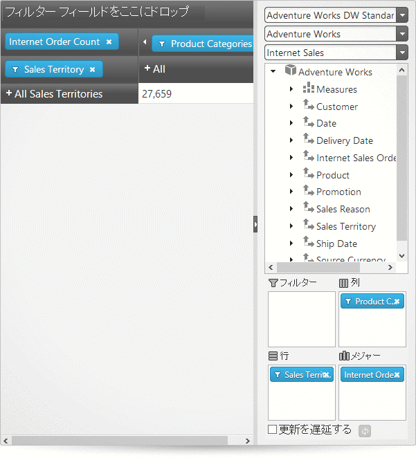

import ApiLink from 'docs-template/components/mdx/ApiLink.astro';

# igPivotView の HTML ページへの追加


##トピックの概要

### 目的

このトピックでは、 HTML ページへ `igPivotView` コンポーネントを追加する方法についての概念と詳しい手順を説明します。

### 前提条件

このトピックを理解するために、以下のトピックを参照することをお勧めします。

- [&#123;environment:ProductName&#125; で JavaScript リソースを使用](/deployment-guide-javascript-resources): このトピックでは、必要な JavaScript リソースを追加して &#123;environment:ProductName&#125; ライブラリからコントロールを使用する場合の全般的な説明をします。

- [igPivotView 概要](/igpivotview-overview): このトピックは、主要機能、最小要件およびユーザー機能性など、`igPivotView` コントロールに関する概念的な情報を提供します。


### このトピックの内容

このトピックは、以下のセクションで構成されます。

-   [igPivotView の追加 - 概要](#overview)
    -   [igPivotView 追加の概要](#summary)
    -   [要件](#requirements-summary)
    -   [手順](#steps-summary)
-   [igPivotView の追加 - 手順](#procedure)
    -   [概要](#procedure-introduction)
    -   [プレビュー](#procedure-preview)
    -   [前提条件](#procedure-prerequisites)
    -   [概要](#procedure-overview)
    -   [手順](#procedure-steps)
-   [**関連コンテンツ**](#related-content)
    -   [トピック](#topics)
    -   [サンプル](#samples)


##<a id="overview"></a>igPivotView の追加 - 概要

### <a id="summary"></a>igPivotView 追加の概要

`igPivotView` は、`igOlapFlatDataSource`™ または `igOlapXmlaDataSource`™ のインスタンスを使用して操作します。したがって、`igPivotView` を HTML ページに追加する場合、内部で作成できるように、事前に構成されたデータ ソース インスタンスを提供するか、必要なオプションを指定する必要があります。

データ ソースは、`igPivotView` の <ApiLink type="igPivotView" member="dataSource" section="options" label="dataSource" /> パラメータまたは <ApiLink type="igPivotView" member="dataSourceOptions" section="options" label="dataSourceOptions" /> プロパティを介して指定します。データ ソースの設定は、`igPivotView` の初期化時に唯一設定しなければならない強制オプションです。

### <a id="requirements-summary"></a>要件

次の表は、`igPivotView` コントロールを使用する際に必要な事項を要約したものです。


|  |  |  |
| --- | --- | --- |
| 要件/必要なリソース | 説明 | 必要な作業 |
| jQuery および jQuery UI JavaScript リソース | environment:ProductName™ は、これらのフレームワークの最上位にビルドされます。 [jQuery](http://jquery.com/) [jQuery UI](http://jqueryui.com/) | ページの `` セクションで両方のライブラリにスクリプト参照を追加します。 |
| Modernizr ライブラリ (オプション) | Modernizr ライブラリは、ブラウザとデバイス機能を検出するために igPivotView で使用されます。これは強制ではありませんが、含まれないとコントロールは HTML 互換ブラウザーで標準のデスクトップ環境であるかのように振る舞います。 [Modernizr](http://modernizr.com/) | ページの `` セクションでライブラリにスクリプト参照を追加します。 |
| 全般的な igPivotView JavaScript リソース | environment:ProductName ライブラリの igPivotView 機能性は、複数のファイルに渡って配布されます。必要なリソースは以下の方法で読み込むことができます。 **カスタム JavaScript ファイルを含む**: 推薦される environment:ProductName JavaScript ファイルの参照方法です。environment:ProductName コントロールの[カスタム ダウンロード](environment:SamplesUrl/download)を作成できます。 **Infragistics Loader の使用**: *Infragistics Loader* は、すべての Infragistics リソース (スタイルおよびスクリプト) を解決するために使用されます。 必要なリソースを手動で読み込みます。以下の表にリストされる依存関係を使用する必要があります。 以下の表は、igPivotView コントロール関連の environment:ProductName ライブラリの依存関係をリストします。これらのリソースは、リソースを手動で取り込むことを選択する場合は明示的に参照される必要があります (igLoader は使用しない)。 JavaScript リソース | 説明 |
| `infragistics.util.js`, `infragistics.util.jquery.js` | environment:ProductName ユーティリティ |  |
| (条件付き- `igOlapFlatDataSource` を使用する場合) `infragistics.datasource.js` | `igDataSource`™ コンポーネント |  |
| `infragistics.olapflatdatasource.js` または `infragistics.olapxmladatasource.js` | データ ソース フレームワーク |  |
| `infragistics.templating.js` | テンプレート エンジン (`igTemplate`™) |  |
| `infragistics.ui.shared.js` | environment:ProductName 共有コード |  |
| `infragistics.ui.scroll.js` | 内部仕様されるスクロール ヘルパー |  |
| `infragistics.ui.combo.js` | コンボ ボックス コントロール (`igCombo`™) |  |
| `infragistics.ui.splitter.js` | `igSplitter`™ コントロール |  |
| `infragistics.ui.tree.js` | `igTree`™ コントロール |  |
| `infragistics.ui.grid.framework.js` | `igGrid`™ コントロール |  |
| `infragistics.ui.grid.multicolumnheaders.js` | `igGrid` コントロール用のマルチ列ヘッダー機能 |  |
| `infragistics.ui.pivot.shared.js` | ピボット コンポーネント用の environment:ProductName 共有コード |  |
| `infragistics.ui.pivotgrid.js` | `igPivotGrid` コントロール |  |
| `infragistics.ui.pivotdataselector.js` | `igPivotDataSelector`™ コントロール |  |
| `infragistics.ui.pivotview.js` | `igPivotView`™ コントロール |  |
| IG テーマ (オプション) | このテーマには、&#123;environment:ProductName&#125; ライブラリ用のビジュアル スタイルが含まれます。テーマ ファイル: `&lt;IG CSS root&gt;/themes/Infragistics/infragistics.theme.css` |  |
| igPivotView CSS リソース ファイル | 以下の CSS ファイルからのスタイルは、コントロールの各種要素のレンダリングに使用されます。 `&lt;IG CSS root&gt;/structure/modules/infragistics.ui.shared.css`. `&lt;IG CSS root&gt;/structure/modules/infragistics.ui.combo.css`. `&lt;IG CSS root&gt;/structure/modules/infragistics.ui.splitter.css`. `&lt;IG CSS root&gt;/structure/modules/infragistics.ui.tree.css`. `&lt;IG CSS root&gt;/structure/modules/infragistics.ui.grid.css`. `&lt;IG CSS root&gt;/structure/modules/infragistics.ui.pivot.css` | ページのファイルにスタイル参照を追加します。 |


### <a id="steps-summary"></a>手順

`igPivotView` を HTML ページへ追加するための一般的な手順をおおまかに示すと、次のようになります。

1. 必要なリソースへの参照を追加する

2. `igPivotView` で必要な HTML マークアップを追加する

3. データ ソースを追加する

4. `igPivotView` を初期化する


##<a id="procedure"></a>igPivotView の追加 - 手順

### <a id="procedure-introduction"></a>概要

以下の手順は、Adventure Works サンプル データベースをビジュアル化する HTML アプリケーションに `igPivotView` コンポーネントを追加する方法をコード例を用いて説明します。プロシージャは Infragistics Loader (`igLoader`) を使用して、推奨オプションである必要なリソースを参照します。

### <a id="procedure-preview"></a>プレビュー

以下のスクリーンショットは最終結果のプレビューです。



### <a id="procedure-prerequisites"></a>前提条件

この手順を実行するには、以下のリソースが必要です。

-   Adventure Works サンプル データベース
-   `$.ig.OlapXmlaDataSource` オブジェクトまたは `$.ig.OlapFlatDataSource` オブジェクトのインスタンス

### <a id="procedure-overview"></a>概要

1. 必要なリソースへの参照を追加する

2. `igPivotView` で必要な HTML マークアップを追加する

3. データ ソースを追加する

4. `igPivotView` を初期化する

### <a id="procedure-steps"></a>手順

以下の手順では、jQuery  `igPivotView` を初期化する方法を紹介します。

1. 必要なリソースへの参照を追加します。

	1. 必要なファイルを構造化します。

		A. **jQuery、jQueryUI および Modernizr JavaScript のリソースを Web ページが置かれているディレクトリ内に Scripts  という名前のフォルダーに追加します。**

		B. **Content/ig という名前のフォルダーに &#123;environment:ProductName&#125; CSS ファイルを追加します (詳細は、[&#123;environment:ProductName&#125; のスタイル設定とテーマ設定](/deployment-guide-styling-and-theming)のトピックを参照してください)。**

		C. **&#123;environment:ProductName&#125; JavaScript ファイルを Web サイト　またはアプリケーション内の Scripts/ig という名前のフォルダーに追加します (詳細は 「[&#123;environment:ProductName&#125; での JavaScript リソースの使用](/deployment-guide-javascript-resources)」 トピックを参照)。**

	2. 必要な JavaScript ライブラリへの参照を追加します。**jQuery、jQuery UI および Modernizr ライブラリの参照**をページの `<head>` セクションに追加します。
	
		**HTML の場合:**
		
```html
		<script  type="text/javascript" src="Scripts/jquery.js"></script>
		<script  type="text/javascript" src="Scripts/jquery-ui.js"></script>
		<script  type="text/javascript" src="Scripts/modernizr.js"></script>
```
	
	3. `igLoader` への参照を追加します。**ページ内に `igLoader` スクリプトを含めます。**
	
		**HTML の場合:**
		
```html
		<script  type="text/javascript" src="Scripts/ig/infragistics.loader.js"></script>
```
	
	4. 必要なリソースをロードします。
	
		igLoader をインスタンス化します。
		
		**HTML の場合:**
		
```html
		<script type="text/javascript">
		    $.ig.loader({
		        scriptPath: "Scripts/ig/",
		        cssPath: "Content/ig/",
		        resources: “igPivotView,igOlapXmlaDataSource"
		    });
		<script>
```

2. `igPivotView` で必要な HTML マークアップを追加します。

	**HTML ページに “`dataSelector`” の `id` で `div` タグを作成します。**
	
	**HTML の場合:**
	
```html
	<div id="pivotView"></div>
```

3. データ ソースを追加します。

	igLoader の ready イベント ハンドラーでは、データ ソース宣言を追加します。
	
	**JavaScript の場合:**
	
```js
	var dataSource = new $.ig.OlapXmlaDataSource({
        serverUrl: "http://sampledata.infragistics.com/olap/msmdpump.dll",
        catalog: "Adventure Works DW Standard Edition",
        cube: "Adventure Works",
        measureGroup: "Internet Sales",
        rows: "[Sales Territory].[Sales Territory]",
        columns: "[Product].[Product Categories]",
        measures: "[Measures].[Internet Order Count],[Measures].[Internet Gross Profit Margin]"
    });
```
	
	このデータ ソースを IE で正しく操作するには、**データ ソース宣言を追加する前に**、jQuery クロスオリジン要求のサポートを true に設定する必要があります。
	
	**JavaScript の場合:**
	
```js
	$.support.cors = true;
```

4. `igPivotView` を初期化します。

	igPivotView をロードするには、データ ソースの宣言後に以下のコードを追加しなければなりません。
	
	**JavaScript の場合:**
	
```js
	$("#pivotView").igPivotView({
	dataSource: dataSource 
	});
```
	
	以下は、igPivotView の <ApiLink type="igPivotView" member="dataSourceOptions" section="options" label="dataSourceOptions" />プロパティを使用してデータ ソースを指定するオルタナティブな (直接の) 方法です。(「[igPivotView 追加の概要](#summary)」を参照)
	
	**JavaScript の場合:**
	
```js
	$("#dataSelector").igPivotView({
	      dataSourceOptions: {
	       xmlaOptions: {
	          serverUrl: " http://sampledata.infragistics.com/olap/msmdpump.dll ",
	          catalog: "Adventure Works DW Standard Edition ",
	          cube: "Adventure Works",
	          measureGroup: "Internet Sales",
	       }
	       rows: "[Sales Territory].[Sales Territory]",
	       columns: "[Product].[Product Categories]",
	       measures: "[Measures].[Internet Order Count],[Measures].[Internet Gross Profit Margin]"      
		}
	});
```
	

##<a id="related-content"></a>関連コンテンツ

### <a id="topics"></a>トピック

このトピックの追加情報については、以下のトピックも合わせてご参照ください。

- [igPivotView の ASP.NET MVC アプリケーションへの追加](/igpivotview-adding-using-the-mvc-helper): このトピックは、&#123;environment:ProductNameMVC&#125;を使用して ASP.NET MVC アプリケーションへ `igPivotView` コントロールを追加する方法についての概念と詳しい手順を説明します。

### <a id="samples"></a>サンプル

このトピックについては、以下のサンプルも参照してください。

- [フラット データ ソースへのバインド](&#123;environment:SamplesUrl&#125;/pivot-view/binding-to-flat-data-source): このサンプルでは、`igPivotView` を `igOlapFlatDataSource` にバインドする方法を紹介します。

- [XMLA にバインドした KPI の表示](&#123;environment:SamplesUrl&#125;/pivot-view/binding-to-xmla-data-source): このサンプルでは、`igPivotView` を `igOlapXmlaDataSource` にバインドする方法を紹介します。


 

 


