---
title: "igPivotView 概要"
slug: igpivotview-overview
---

# igPivotView 概要

##トピックの概要

### 目的

このトピックは、主要機能、最小要件、ユーザー機能性など、`igPivotView`™ コントロールに関する概念的な情報を提供します。

### 前提条件

以下の表は、このトピックを理解するための前提条件として必要なトピックと概念の一覧です。

**トピック**

- [多次元 (OLAP) データ ソース コンポーネント](/data-sources/olap/multidimensional-data-source-components): このトピック グループでは、&#123;environment:ProductName&#125;™ スイートの多次元 (OLAP) データ ソース コンポーネントを説明します。

- [igPivotGrid の概要](/controls/igbulletgraph/overview): このトピックは、主要機能、最小要件、ユーザー機能性など、`igPivotGrid`™ コントロールに関する概念的な情報を提供します。

- [igPivotDataSelector の概要](/controls/igbulletgraph/overview): このトピックは、主要機能、最小要件、ユーザー機能性など、`igPivotDataSelector`™ コントロールに関する概念的な情報を提供します。

- [igSplitter の概要](/controls/igbulletgraph/overview): このトピックでは、機能、ユーザー機能性など、`igSplitter`™ コントロールに関する概念的な情報を提供します。

**外部リソース**

-   [ピボット表](http://en.wikipedia.org/wiki/Pivot_table)
-   [オンライン分析処理](http://en.wikipedia.org/wiki/Olap)

### このトピックの内容

このトピックは、以下のセクションで構成されます。

-   [**概要**](#introduction)
-   [**主要機能**](#main-features)
    -   [主要機能の概要](#main-features-summary)
    -   [igPivotGrid の機能](#igPivotGrid-features)
    -   [igPivotDataSelector の機能](#igPivotDataSelector-features)
    -   [igSplitter の機能](#igSplitter-features)
    -   [igPivotView 特有の機能](#igPivotView-features)
-   [**ユーザー インタラクションと操作性**](#user-interaction)
-   [**要件**](#requirements)
-   [**関連コンテンツ**](#related-content)
    -   [トピック](#topics)
    -   [サンプル](#samples)

##概要

### igPivotView 概要

`igPivotView` は、ピボット グリッドと、スプリッターで区切られるデータ選択ウィザードを組み合わせる 2 パネル コントロールです。これは、[igPivotGrid](/controls/igpivotgrid/igpivotgrid)、[igPivotDataSelector](/controls/igpivotdataselector/igpivotdataselector) および igSplitter](igSplitter.html) の 3 つの個別コンポーネントのコンストラクションです。まとめてアセンブルし、ピボット グリッドで多次元 (OLAP) データを操作するために必要なすべてのツールを 1 か所で提供します。

`igPivotView` コントロールは以下から構成されます (番号は以下の図を示します)。

-   igPivotGrid (1)
-   igSplitter (2)
-   igPivotDataSelector (3)

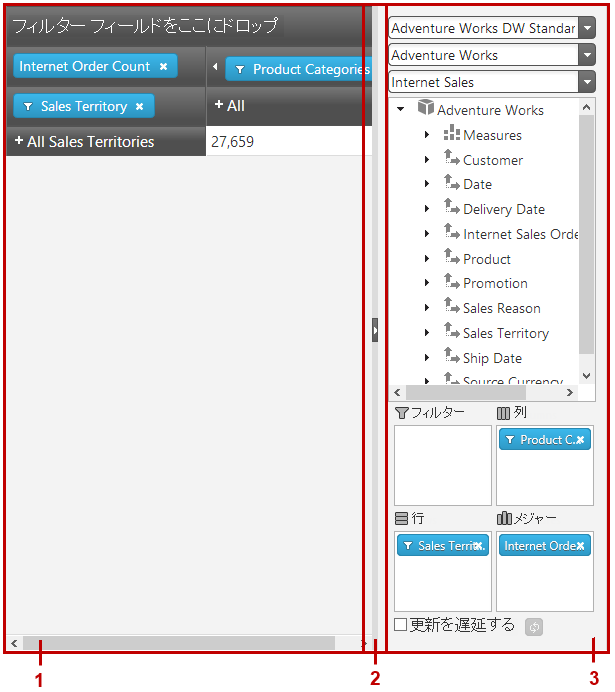

`igPivotView` コントロールは、[igOlapFlatDataSource](/data-sources/olap/flat/igolapflatdatasource)™ コンポーネントまたは[igOlapXmlaDataSource](/data-sources/olap/xmla/igolapxmladatasource)™ コンポーネントのインスタンスをデータ ソースとして使用します。`igPivotGrid` および igPivotDataSelector は、同じ OLAP データ ソース インスタンスにおいて操作され、いずれかのコンポーネントにおけるユーザー インタラクションは自動的に他へ伝達されます。

メタデータ ツリーからドロップ エリアの 1 つ (フィルター、列、行、メジャー) へ、またはドロップ エリア間で階層およびメジャーをドラッグ アンド ドロップすることにより、ユーザーは現在使用されている階層およびメジャーを変更し、階層エリアおよびセルに表示される結果セットの表のビューを変更できます。行と列のヘッダー エリアには、それぞれの階層のメンバーが表示され、メンバー (子メンバー ノードを持つもの) を展開および縮小できます。各セルにおいて、表示される値の意味は、それぞれの列および行のメンバーの意味の交差です (上記画像では、値 2127 の意味は「すべての製品」 (列メンバーの名前) と「2007」 (行と行メンバーの名前)の交差により作成されます。意味は「すべての場所における 2007 の全製品は以下の通りです」です )。

これらの要素を操作すると、ユーザーは表示結果を見渡しデータの角度をより良くするよう分析観点を変更できます。これは最終的にはより効果的なデータの利用につながります。

`igSplitter` により、ユーザーは `igPivotGrid` を表示するためより多くのスペースを許可するため `igPivotDataSelector` パネルをサイズ変更し折りたたむことができます。

`igPivotView` を構成するには、最小でもデータ ソース インスタンスを供給するか、必要なプロパティ (dataSourceOptions、データ ソースが内部作成されるように) を設定する必要があります。詳細は、「[**igPivotView の HTML ページへの追加**](/controls/igpivotview/adding/adding-to-html-page)」を参照してください。

すべての構成プロパティ (igPivotViewを構成する個々のコンポーネントに対する場合でも) は、 `igPivotView` 自体を介して設定されます。

##主要機能

### 主要機能の概要

`igPivotView` コントロールの機能は、構成されるコントロールの機能の集まりです。`igPivotGrid` および `igPivotDataSelector`、さらに `igPivotView` のみに特有のいくつかの機能があります。`igPivotView` の主な機能は、以下のカテゴリーにグループ化されます (詳細はリンクを参照)。

-   [igPivotGrid の機能](#igPivotGrid-features)
-   [igPivotDataSelector の機能](#igPivotDataSelector-features)
-   [igSplitter の機能](#igSplitter-features)
-   [igPivotView 特有の機能](#igPivotView-features)

### igPivotGrid の機能

以下で、`igPivotGrid` コントロールの主な機能を簡単に説明します。

#### データ管理

データ ソースのいずれかの階層が `igPivotGrid` 内で列、行またはフィルターとして使用できます。データ ソース メジャーは、対応する数値を表示するために使用されます。ユーザーはドラッグ アンド ドロップにより行と列の間に現在の階層を移動します。そのエリアの階層またはメジャーの正確な位置を指定することもできます。

以下の画像は、行のドロップ エリアから列のドロップ  エリア内の最後の位置に移動される 営業担当地域階層を示します。

>**注:** `igPivotGrid` のデータ管理機能は、表のビューですでに使用可能な階層に制限されます。現在グリッドに表示されていないものも含めすべての階層/メンバーをユーザーが使用できる必要がある場合、`igPivotGrid` と `igPivotDataSelector`  コントロールを一緒に使用する必要があります。

 

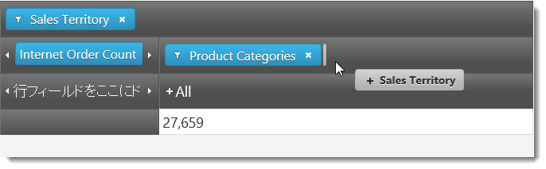

#### 階層メンバーの展開/縮小

`igPivotGrid` は、階層データを表示するための標準 UI インターフェイスを公開します。メンバーを展開および折りたたむには +/- ボタンがあり、すべての現在の階層でユーザーは任意の表のビュー配置を表示できます。

以下の画像は、行に使用される階層のメンバーの展開状態と折りたたみ状態を比較しています。

#### 展開状態 

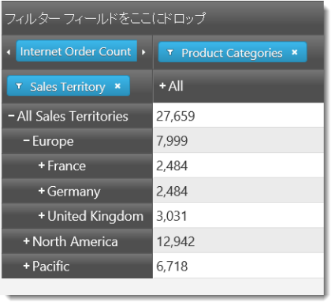

#### 折りたたみ状態

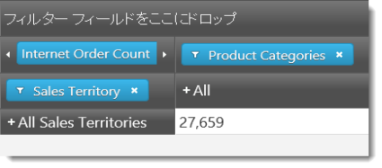

#### フィルタリング

ユーザーは、解析に関係ないメンバーをフィルタリングして、どのメンバーを結果に表示するのか選択できます。フィルタリング条件は、フィルターのドロップダウン メニューに表示するメンバーをチェックすることで選択します。

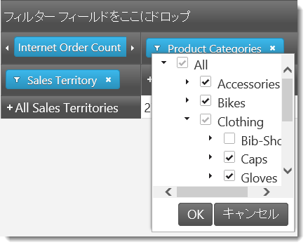

#### 並べ替え

`igPivotGrid` は 2 種類の並べ替えをサポートします。

-   **値ベース** - 1 つ以上の列内の値に基づいて行を並べ替えします。
-   **キャプション ベース**- メンバーのキャプションに基づいて特定のレベルに属する行または列の並べ替え

値ベースの並べ替えは、キャプション ベースの並べ替えが列階層のレベルに適用されるときにキャプション ベースと同時に使用できます。ただしキャプション ベースの並べ替えが行階層のレベル メンバーに適用される場合、値ベースの並べ替えを適用するとキャプション ベースの並べ替えをキャンセルします。同じトークンにより、値ベースの並べ替えが列に適用される場合、キャプション ベースの並べ替えを適用すると以前に適用された値ベースの並べ替えがキャンセルされます。

以下に、左側の画像は値ベースの並べ替えを示します。これは、昇順の並べ替えを適用した*全製品*列です。

右側の画像は、キャプション ベースの並べ替えを示したもので、この場合、*全製品*メンバーの子メンバーは左から右へアルファベット順 (昇順) に配置されます。

#### 列用の値ベースの並べ替え 

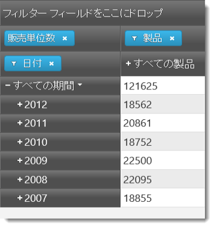 

#### キャプション ベースの並べ替え

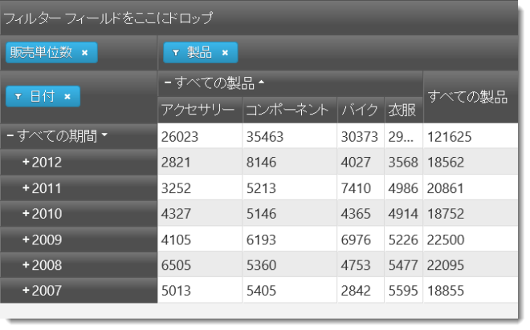

#### 複数のレイアウト

`igPivotGrid` は、占めるスペースに関して表示するため行と列のヘッダーをどのように配置するかに基づいてレイアウトが異なります。サポートされるレイアウト:

-   標準 - 行内のメンバーが展開されると、子メンバーが右側に表示されます。展開された列メンバーの場合、子メンバーが親メンバーの下に表示されます。
-   コンパクト - 行内のメンバーが展開されると、その子メンバーがそれぞれの親メンバーの上または下に表示され、右にインデントされるのみです (親の右側でなく)。展開された列メンバーの場合、その子メンバーは親メンバーの右側または左側に表示されます (親の下ではなく)。
-   ツリー (行のみに適用) - 行内のメンバーが展開されると、その子メンバーがそれぞれの親メンバーの上または下に表示され、右にインデントされるのみです (親の右側でなく)。また、行内のすべての階層がツリー構造で表示されます。複数の階層が追加されると、各階層のメンバーが一つ前の階層の各メンバーの上または下に一覧表示されます。

デフォルトでは、コンパクト レイアウトは行で有効にされ列には無効になっています。

以下の画像は、`igPivotGrid` の標準レイアウトとコンパクト レイアウトを比較しています。

**標準レイアウト**
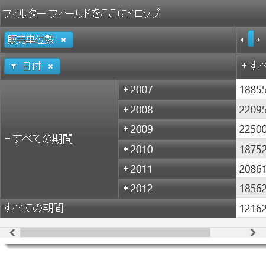

**コンパクト レイアウト**
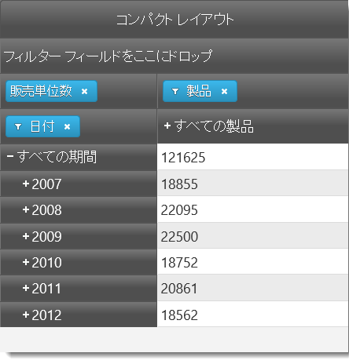

**ツリー レイアウト**

#### サポートされるデータ ソース

`igPivotGrid` コントロールは、`igOlapFlatDataSource` コンポーネントまたは `igOlapXmlaDataSource` コンポーネントのインスタンスをデータ ソースとして使用します。これらの 2 つのデータ ソース コンポーネントは、通常 igPivotGrid と共に使用されるコントロールの `igPivotDataSelector` にもサポートされます。

### igPivotDataSelector の機能

以下の表で、`igPivotDataSelector` コントロールの主な機能を簡単に説明します。

#### データ選択

データ ソースが与えられると、`igPivotDataSelector` は、接続するデータベース (データベースを使用する場合)、データを抽出するキューブ、およびメジャー グループのセットを選択するためのドロップダウンを提供します。

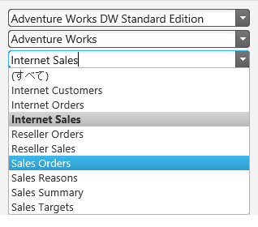

#### メタデータ ツリー

すべての使用可能なメジャーを持つリストに沿って各階層で使用可能なすべてのディメンジョンは、ユーザーがデータベース、キューブ、およびメジャー グループを選択するとツリー内に読み込まれます。

ユーザーがメジャー グループを選択すると、メジャーはそれに応じてフィルタリングされます。何も選択されないと、すべてのメジャーはメタデータ ツリーで使用可能です。

#### スライスの相互作用

カスタム制限が適用されない限り、ツリーからのすべての使用可能な階層は行、列、フィルターのいずれかのエリアにドラッグ アンド ドロップできます。ツリーからのすべての使用可能なメジャーはメジャー エリアにドラッグ アンド ドロップできます。

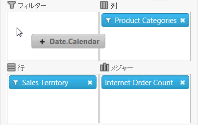

#### 遅延更新

`igPivotDataSelector` は、ユーザーコントロール内で変更を行った後にデータ ソースが更新されるときに基づいて 2 つのデータ ソース更新モードをサポートします。

-   即時 - ユーザーがコントロール内で変更を行うと、変更は基本バックエンドでただちに実行されデータ ソースを更新します。ユーザーは、コントロールと再度対話するにはコントロールが新しい状態にリフレッシュされるまで待機しなければなりません。
-   遅延 - ユーザーが明示的にリフレッシュ操作 (更新ボタンで) を実行するまでシステムは更新されません。これにより、それぞれの変更後、コントロールがリフレッシュされるのを待機する必要が無く複数の変更を実行できます。

遅延更新は、特に大容量のデータが関わる場合、システム リソースに負担をかけずにコントロールのパフォーマンスを改善します。

`igPivotDataSelector` では、ユーザーは遅延更新」チェックボックスでリフレッシュ モードを制御できます。ボックスがチェックされている場合、更新ボタンを押すことで任意にデータ ソースを手動でリフレッシュします。

### igSplitter の機能

以下の表で、`igPivotDataSelector` コントロールの主な機能を簡単に説明します。

#### パネルの状態 (展開/折りたたみ)

パネルには展開状態と折りたたみ状態があり、逆相関関係にあります。あるパネルが展開状態の場合、他のパネルは折り畳まれ、展開状態のパネルを折りたたむと折り畳まれていたパネルは展開されます。展開状態のパネルはコンテナー体を占め、折りたたみ状態のパネルは見えない状態になっています。一度に 1 つのパネルのみが展開状態または折りたたみ状態になることができます。

以下の画像は、左のパネルの展開状態と折りたたみ状態を比較しています。

#### 展開状態の左のパネル 

#### 折りたたみ状態の右のパネル

パネルは、ユーザーによって、または API メソッドを介してプログラムから折り畳む、または展開できます。展開/折りたたみが有効でない場合、展開/折りたたみボタンはスプリッターに表示されません。デフォルトでは、パネルは展開/折りたたみできません。

パネルが展開されている場合、スプリッターは他の (現在は折り畳まれている) パネルの方の側面に配置されます。スプリッターがそれ以外の位置にある場合、両方のパネルが表示されますが、２つのパネルがこの状態にあっても各々のパネルの状態には関係がありません。

#### 2 パネル レイアウト

`igSplitter` コントロールは、レイアウトを 2 つの区切られたパネルに分割しています。

#### サイズ変更可能なパネル

パネルは、スプリッター コントロール内でスプリッターを移動することで互いのサイズに対応してサイズ変更できます。スプリッターがどちらかのパネルの方向に移動されると、そのパネルのサイズは小さくなり、もう一方のパネルのサイズは大きくなります。デフォルトで、パネルはサイズ変更できます。

#### パネルのサイズ変更のためのドラッグのサポート

デフォルトでは、`igSplitter` コントロールはパネルをサイズ変更するためにマウスのドラッグをサポートします。ユーザーは、スプリッターをドラッグすることによりエリアのサイズを変更できます。ドラッグを移動した後にマウス ボタンをリリースすると、スプリッターの新しい位置に応じてパネルのサイズが変更されます。

### igPivotView 特有の機能

以下の表は、`igPivotView` コントロールに特有の機能をまとめたものです。

#### パネルの構成可能の相対的な位置 (左から右へ)

デフォルトのパネルの互いの相対的な位置は、左側にピボット グリッド、右側にセレクターです。`igPivotView` の [dataSelectorPanel](&#123;environment:jQueryApiUrl&#125;/ui.igPivotView#options:dataSelectorPanel) プロパティを使用してピボット グリッドとセレクターをスワップできます。

#### 右 

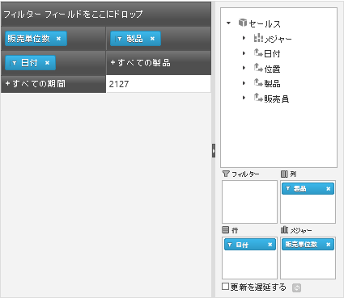 

#### 左

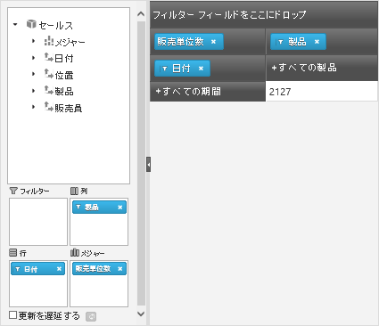

#### パネルのサイズ変更

パネルは、`dataSelectorPanel` オプションおよび `pivotGridPanel` オプションを使用してサイズ変更可能かどうか、または折りたたみ可能かどうかを指定できます。これらのオプションは、`igSplitter` のバー ハンドルまたはキーボードを使用してユーザーが `igPivotGrid` および `igPivotDataSelector` のパネルをサイズ変更できるかどうか、展開/折りたたみが可能かどうかを制御します。

`igPivotDataSelector` と `igPivotGrid` の間の自動同期。

`igPivotGrid` と `igPivotDataSelector` が同じ OLAP データ ソース コントロール インスタンス (`igFlatDataSource` または `igXmlaDataSource`) にバインドされるため、ユーザー インタラクションによってその状態は自動同期され、データ ソースが変更されます。

##ユーザー インタラクションと操作性

### ユーザー インタラクションの概要表

以下の表で、`igPivotView` コントロールのユーザー相互作用機能を簡単に説明します。

目的|方法|詳細|クライアント/サーバー設定
--- | --- | --- | ---
データベース、キューブおよびメジャー グループ (`igOlapXmlaDataSource` のみ) を変更します。|データ選択ウィザードのコンボ ボックス|`igOlapXmlaDataSource` フレームワークの `catalog` プロパティ、`cube` プロパティおよび `measureGroup` プロパティを使用して最初にデータベース、キューブおよびメジャー グループをプログラム的にセットアップできます。|<ul><li>[igOlapXmlaDataSource の追加](/data-sources/olap/xmla/add/igolapxmladatasource-adding)</li></ul>
データ ソースのディメンションおよびメジャーを参照|`igPivotDataSelectор` のメタデータ ツリー部分|ユーザーはすべての使用可能なディメンション、メジャー、階層およびレベルを参照できます。 | 
行、列およびフィルターの階層を選択します。|ツリーから行、列およびフィルターのエリアにドラッグ アンド ドロップします。|ユーザーは、`igPivotDataSelector` と `igPivotGrid` のドロップ エリアの間で階層をドラッグ アンド ドロップできます。さらに、すべての階層はメタデータ ツリーから列、行およびフィルターのドロップ エリアにドラッグ アンド ドロップできます。|<ul><li>[ピボット グリッドの列、行、フィルター、メジャーの配列による結果セットの表形式ビューを構成します (igOlapFlatDataSource、 igOlapXmlaDataSource、igPivotDataSelector、igPivotGrid, igPivotView)](/data-sources/olap/flat/configuring-the-tabular-view)</li></ul>
メジャーを選択します。|ツリーからメジャー エリアにドラッグ アンド ドロップします。|カスタム制限が設定されない限り、ユーザーはメタデータ ツリーで使用可能なすべてのメジャーをメジャー エリアにドラッグできます。|<ul><li>[ピボット グリッドの列、行、フィルター、メジャーの配列による結果セットの表形式ビューを構成します (igOlapFlatDataSource、 igOlapXmlaDataSource、igPivotDataSelector、igPivotGrid, igPivotView)](/data-sources/olap/flat/configuring-the-tabular-view)</li></ul>
遅延更新を有効/無効にします。|遅延更新のチェックボックスをチェックする/チェックを外す|-|
遅延更新が有効になると、グリッドをオンデマンドで更新します。|[レイアウト更新] ボタン () をクリックすることにより|-|
階層のメンバーのドリルダウンとドリルアップ|ヘッダー セルの +/- ボタン|ユーザーは、任意の詳細レベルに進むため階層のメンバーを展開および折りたたむことができます。|
階層内のメンバーをフィルタリング|行、列またはフィルターに追加される各階層のフィルター メニュー|階層の場合、フィルター メニューが利用可能です (フィルター アイコンを介して ())。階層メンバーを選択/選択解除し、メンバーを結果に追加できます、または結果から削除できます。|<ul><li>[ピボット グリッドの列、行、フィルター、メジャーの配列による結果セットの表形式ビューを構成します (igOlapFlatDataSource、 igOlapXmlaDataSource、igPivotDataSelector、igPivotGrid, igPivotView)](/data-sources/olap/flat/configuring-the-tabular-view)</li></ul>
並べ替えの適用|並べ替えボタン。ユーザーは 1 つ以上の列の値を並べ替えしたり、特定のレベルのメンバーヘッダーを並べ替えできます。|ユーザーの並べ替えの他、特定のレベルに対する最初の並べ替え方向は [igPivotGrid プロパティ](&#123;environment:jQueryApiUrl&#125;/ui.igPivotGrid#options)を介して設定できます。|<ul><li> [並べ替え(サンプル)](&#123;environment:SamplesUrl&#125;/pivot-grid/sorting)</li></ul>
igPivotDataSelector をサイズ変更します/折りたたみます。|`igSplitter` のハンドル|スプリッターのハンドルをドラッグすることにより、または展開/折りたたみボタン () をクリックすることにより、ユーザーは `igPivotDataSelector` のパネルのサイズを変更できます。|<ul><li>[dataSelectorPanel](&#123;environment:jQueryApiUrl&#125;/ui.igPivotGrid#options:dataSelectorPanel)</li></ul>

##要件

### 要件の概要

`igPivotView` コントロールは jQuery UI ウィジェットであるため、jQuery と jQuery の UI ライブラリに依存します。Modernizr ライブラリは、ブラウザーとデバイス機能を検出するために 内部使用されます。コントロールは、その機能のために通常いくつかの &#123;environment:ProductName&#125; 共有リソースを使用します。これらのリソースへの参照は、実際の jQuery または &#123;environment:ProductNameMVC&#125; が使用されているとしても必要となります。コントロールが ASP.NET MVC のコンテクスト内で使用されている場合、`Infragistics.Web.Mvc` アセンブリが必要です。

`igPivotView` コントロールを使用した必要なリソースの詳細なリストについては、「[igPivotView の追加](/controls/igpivotview/adding/adding)」を参照してください。

##関連コンテンツ

### トピック

このトピックの追加情報については、以下のトピックも合わせてご参照ください。

- [igPivotView の追加](/controls/igpivotview/adding/adding): これは、`igPivotView`™ コントロールを HTML ページと ASP.NET MVC アプリケーションへ追加する方法を示すトピックのグループです。

- [アクセシビリティ準拠 (igPivotView)](/controls/igpivotview/accessibility-compliance): このトピックは、igPivotView コントロールのユーザー補助機能を説明し、このコントロールを含むページに対してアクセシビリティ準拠を実現させる方法に関するアドバイスを提供します。

- [既知の問題と制限 (igPivotView)](/controls/igpivotview/known-issues-and-limitations): このトピックでは、`igPivotView` コントロールの既知の問題点および制限に関する情報を提供します。

- [jQuery と MVC API リンク (igPivotView)](/controls/igpivotview/api-links): このトピックでは、`igPivotView` コントロールと ASP.NET MVC ヘルパーに関する API ドキュメントへのリンクの一覧を示します。

### サンプル

このトピックについては、以下のサンプルも参照してください。

- [フラット データ ソースへのバインド](&#123;environment:SamplesUrl&#125;/pivot-view/binding-to-flat-data-source): このサンプルでは、`igPivotView` を `igOlapFlatDataSource` にバインドする方法を紹介します。

- [XMLA にバインドした KPI の表示](&#123;environment:SamplesUrl&#125;/pivot-view/binding-to-xmla-data-source): このサンプルでは、`igPivotView` を `igOlapXmlaDataSource` にバインドする方法を紹介します。

- [&#123;environment:ProductNameMVC&#125; とフラット データ ソースの使用](&#123;environment:SamplesUrl&#125;/pivot-view/using-the-asp-net-mvc-helper-with-flat-data-source): このサンプルでは、ASP.NET MVC ヘルパーを使用して `igOlapFlatDataSource` と `igPivotView` を使用する方法を紹介します。

- [&#123;environment:ProductNameMVC&#125; と XMLA データ ソースの使用](&#123;environment:SamplesUrl&#125;/pivot-view/using-the-asp-net-mvc-helper-with-xmla-data-source): このサンプルでは、ASP.NET MVC ヘルパーを使用して `igOlapXmlaDataSource` と `igPivotView` を使用する方法を紹介します。

 

 

