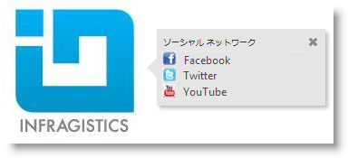
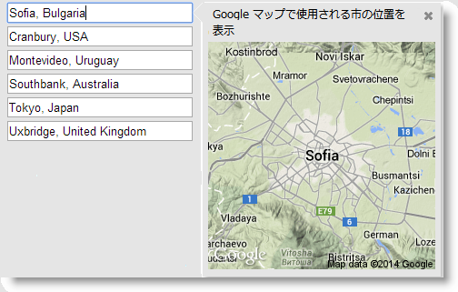
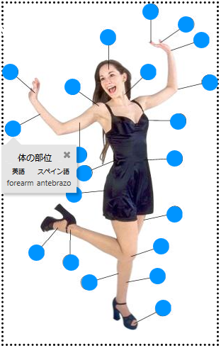

# igPopover の構成

## トピックの概要
### 目的

このトピックでは、`igPopover`™ コントロールのコンテンツの構成、アクティブ化、および配置する方法を説明します。

### 前提条件

このトピックを理解するために、以下のトピックを参照することをお勧めします。

- [igPopover の概要](/controls/igpopover/overview): このトピックでは、`igPopover` コントロールとその主な特長および機能の概要を説明します。

- [igPopover の追加](/controls/igpopover/adding-igpopover): このトピックでは、コード例を使用して、JavaScript または ASP.NET MVC で HTML ページに `igPopover` コントロールを追加する方法を説明します。


### このトピックの内容

このトピックは、以下のセクションで構成されます。

-   [**igPopover の構成 - 概要**](#overview)
    -   [igPopover 構成の概要](#summary)
    -   [igPopover 構成の概要表](#summary-chart)
-   [**ヘッダーの構成**](#config-header)
    -   [概要](#header-overview)
    -   [プロパティ設定](#header-settings)
    -   [例](#header-example)
-   [**本文の構成**](#config-body)
    -   [概要](#body-overview)
    -   [プロパティ設定](#body-settings)
    -   [例](#body-example)
-   [**アクティブ化の構成**](#config-activation)
    -   [概要](#activation-overview)
    -   [プロパティ設定](#activation-settings)
    -   [例](#activation-example)
-   [**配置の構成**](#config-positioning)
    -   [概要](#positioning-overview)
    -   [プロパティ設定](#positioning-settings)
    -   [例](#position-example)
-   [**コンテインメントの構成**](#config-containment)
    -   [概要](#containment-overview)
    -   [プロパティ設定](#containment-settings)
    -   [例](#containment-examples)
-   [**関連コンテンツ**](#related-content)
    -   [トピック](#topics)
    -   [サンプル](#samples)


## <a id="overview"></a>igPopover の構成 - 概要
### <a id="summary"></a>igPopover 構成の概要

`igPopover` コントロールはデフォルトの設定で十分に機能しますが、デフォルトの動作や外観をカスタマイズする場合に、ヘッダーや本文を構成できるプロパティのセットが提供されています。ポップオーバーのアクティブ化 (トリガーするイベント)、ディメンション、位置およびポインター矢印の表示を管理することもできます。

### <a id="summary-chart"></a>igPopover 構成の概要表

以下の表は、`igPopover` コントロールの構成可能な要素を簡単に説明し、それらを構成するプロパティにマップします。表の緑色で強調表示された要素は、このヘルプのコード例で詳細に紹介しています。

<table class="table table-bordered">
	<thead>
		<tr>
            <th colspan="2">構成可能な項目</th>
            <th>詳細</th>
            <th>プロパティ</th>
</tr>
	</thead>
	<tbody>
        <tr>
            <td>コンテンツ</td>
            <td>ヘッダー</td>
            <td>ヘッダーは構成できます。 ヘッダーのタイトルは、HTML 文字列または空です。空の場合、ヘッダーは表示されません。 ヘッダーにオプションで閉じるボタンを描画することもできます。</td>
            <td><ul> <li> [headerTemplate.title](&#123;environment:jQueryApiUrl&#125;/ui.igpopover#options:headerTemplate.title) </li> <li> [headerTemplate.closeButton](&#123;environment:jQueryApiUrl&#125;/ui.igpopover#options:headerTemplate.closeButton) </li> </ul></td>
</tr>

        <tr>
            <td></td>
            <td>ボディ</td>
            <td>igPopover コンテンツの本文は、カスタマイズできます。 以下に設定できます。 <ul> <li> HTML コンテンツ </li> <li> HTML コンテンツを描画する jQuery コード </li> <li> ポップオーバーの表示のたびに呼び出される関数 </li> </ul></td>
            <td><ul> <li> [contentTemplate](&#123;environment:jQueryApiUrl&#125;/ui.igpopover#options:contentTemplate) </li> </ul></td>
</tr>

        <tr>
            <td colspan="2">ターゲット</td>
            <td>デフォルトでは、igPopover はシングル要素で初期化されます。[selectors](&#123;environment:jQueryApiUrl&#125;/ui.igpopover#options:selectors) オプションに設定すると、マルチ ターゲットを構成できます。</td>
            <td><ul> <li> [selectors](&#123;environment:jQueryApiUrl&#125;/ui.igpopover#options:selectors) </li> </ul></td>
</tr>

        <tr>
            <td colspan="2">アクティブ化</td>
            <td>ポップオーバーを表示するイベントは構成できます。</td>
            <td><ul> <li> [showOn](&#123;environment:jQueryApiUrl&#125;/ui.igpopover#options:showOn) </li> </ul></td>
</tr>

        <tr>
            <td>配置</td>
            <td>方向</td>
            <td>ターゲット要素に対するポップオーバーの位置。 direction は、ポップオーバー コンテナーをターゲットのどちら側に表示するか指定します。</td>
            <td><ul> <li> [direction](&#123;environment:jQueryApiUrl&#125;/ui.igpopover#options:direction) </li> </ul></td>
</tr>

        <tr>
            <td></td>
            <td>位置</td>
            <td>ポップオーバーがターゲットより大きい場合のターゲット要素に対するポップオーバーの位置。ポップオーバーが小さい場合は、常に表示領域の中央に表示されます。</td>
            <td><ul> <li> [position](&#123;environment:jQueryApiUrl&#125;/ui.igpopover#options:position) </li> </ul></td>
</tr>

        <tr>
            <td></td>
            <td>コンテインメント</td>
            <td>コンテインメントは、ポップオーバーを表示できる領域を制限する、境界線が機能するオブジェクト (DIV コンテナーなど) を指定することにより機能します。</td>
            <td><ul> <li> [containment](&#123;environment:jQueryApiUrl&#125;/ui.igpopover#options:containment) </li> </ul></td>
</tr>

        <tr>
            <td colspan="2">サイズとディメンション</td>
            <td>ポップオーバーのコンテナーに対して事前定義された幅と高さを指定することができます。定義されていない場合、最大の幅と高さに設定されます。</td>
            <td><ul> <li> [width](&#123;environment:jQueryApiUrl&#125;/ui.igpopover#options:width) </li> <li> [height](&#123;environment:jQueryApiUrl&#125;/ui.igpopover#options:height) </li> <li> [maxWidth](&#123;environment:jQueryApiUrl&#125;/ui.igpopover#options:maxWidth) </li> <li> [maxHeight](&#123;environment:jQueryApiUrl&#125;/ui.igpopover#options:maxHeight) </li> </ul></td>
</tr>

        <tr>
            <td colspan="2">ポインター</td>
            <td colspan="2">ポップオーバー ポインターの矢印のサイズおよび色は構成できます。ポインターにはオプションがなく、CSS クラスで管理します。 <ul> <li> ui-icon </li> </ul> ボタン アイコンのサイズを構成します。 <ul> <li> ui-icon-closethick </li> </ul> ボタン アイコンの画像を構成します。 <ul> <li> ui-igpopover-close-button </li> </ul> ヘッダー テンプレートの閉じるボタンの位置を構成します。 詳細は、[igPopover のスタイル設定](/controls/igpopover/styling-igpopover)のトピックを参照してください。</td>
</tr>
    </tbody>
</table>

## <a id="config-header"></a>ヘッダーの構成
### <a id="header-overview"></a>概要

デフォルトでは、`igPopover` のヘッダーは表示されません。ヘッダーは、タイトルとして使用するように指定された文字列を表示します。また、オプションで閉じるボタンも表示します。ヘッダーは、HTML コンテンツを受け入れる [headerTemplate.title](&#123;environment:jQueryApiUrl&#125;/ui.igpopover#options:headerTemplate.title) プロパティを設定し管理します。CSS クラスを使用して、ヘッダーと閉じるボタンのルック アンド フィールをさらにカスタマイズできます ([igPopover のスタイル設定](/controls/igpopover/styling-igpopover)を参照)。

### <a id="header-settings"></a>プロパティ設定

以下の表は、任意の構成とそれを管理するプロパティ設定のマッピングを示します。

目的:|使用するプロパティ:|設定の選択肢:
---|---|---
ポップオーバーのタイトルの表示|[headerTemplate.title](&#123;environment:jQueryApiUrl&#125;/ui.igpopover#options:headerTemplate.title)|HTML の文字列として使用する値
閉じるボタンの表示|[headerTemplate.closeButton](&#123;environment:jQueryApiUrl&#125;/ui.igpopover#options:headerTemplate.closeButton)|true
閉じるボタンの非表示|[headerTemplate.closeButton](&#123;environment:jQueryApiUrl&#125;/ui.igpopover#options:headerTemplate.closeButton)|false

### <a id="header-example"></a>例

以下のスクリーンショットは、以下の設定の結果、`igPopover` の外観がどのようになるか示しています。

プロパティ|値
---|---
[headerTemplate.closeButton](&#123;environment:jQueryApiUrl&#125;/ui.igpopover#options:headerTemplate.closeButton)|true
[headerTemplate.title](&#123;environment:jQueryApiUrl&#125;/ui.igpopover#options:headerTemplate.title)|“We're social”




以下のコードはこの例を実装します。

**JavaScript の場合:**

```js
$( '#popoverTooltip' ).igPopover( {
    headerTemplate:{
        closeButton: true,
        title: 'We’re social'
    },
    closeOnBlur: false
} );
```


## <a id="config-body"></a>本文の構成
### <a id="body-overview"></a>概要

デフォルトでは、`igPopover` はターゲット要素のタイトル属性に設定される本文コンテンツのみを表示します。カスタマイズしたコンテンツを表示するには、`contentTemplate` オプションを使用します。以下に設定できます。

-   HTML 文字列
-   HTML コンテンツを描画する jQuery コード
-   ポップオーバーの表示のたびに呼び出される関数

これにより、コンテキスト メニュー、表、画像、動的コンテンツの提供など、広範な使用シナリオに対応できます。

### <a id="body-settings"></a>プロパティ設定

以下の表では、希望の構成をプロパティ設定にマップしています。

構成の目的:|使用するプロパティ:|設定の選択肢:
---|---|---
ポップオーバーの本文のコンテンツ|[contentTemplate](&#123;environment:jQueryApiUrl&#125;/ui.igpopover#options:contentTemplate)|以下のいずれか:<ul><li>HTML 文字列</li><li>HTML コンテンツを描画する jQuery コード</li><li>ポップオーバーの表示のたびに呼び出される関数</li></ul>

### <a id="body-example"></a>例

以下のスクリーンショットは、テンプレート データを置き換え、最終コンテンツを HTML 文字列として返すために、`igPopover` がそのコンテンツをテンプレートとターゲット DOM 要素の値属性を使用する関数に設定した結果として、外観がどのようになるか示しています。

プロパティ|値
---|---
[contentTemplate](&#123;environment:jQueryApiUrl&#125;/ui.igpopover#options:contentTemplate)|**JavaScript の場合:**<br/>`function contentFunction(){...}`
     


以下のコードはこの例を実装します。

**JavaScript の場合:**

```js
$( '#popoverTooltip' ).igPopover( {
    ..
    maxHeight: null,
    maxWidth: 260,
    contentTemplate: function contentFunction()
	{
	    var imgTemplate = "";
	    var data = [{ value: $( this )[0].value }];
	    return $.ig.tmpl( imgTemplate, data );
	}      
} );
```


## <a id="config-activation"></a>アクティブ化の構成
### <a id="activation-overview"></a>概要

ポップオーバーを表示するユーザー操作を構成できます。これは、当該イベントを [showOn](&#123;environment:jQueryApiUrl&#125;/ui.igpopover#options:showOn) プロパティの値として取り込むことで管理されます。規定値は 「mouseenter」 です。これにより、マウス ポインターをターゲット要素の上に置くと、ポップオーバーが表示されます。

>**注:** アクティブ化イベントは、タッチ環境で制御することができません。アクティブ化にどのイベントが設定されていても、コントロールは常にユーザーのタップ操作を表示します （つまり、[showOn](&#123;environment:jQueryApiUrl&#125;/ui.igpopover#options:showOn) オプションの設定は無視されます）。

### <a id="activation-settings"></a>プロパティ設定

以下の表では、希望の構成をプロパティ設定にマップしています。

ポップオーバーを表示するユーザー操作:|使用するプロパティ:|設定の選択肢:
---|---|---
マウス ポインターをターゲット要素の上に置く|[showOn](&#123;environment:jQueryApiUrl&#125;/ui.igpopover#options:showOn)|“mouseenter”
ターゲット要素をクリックする|[showOn](&#123;environment:jQueryApiUrl&#125;/ui.igpopover#options:showOn)|“click”
ターゲット要素にフォーカスを移動する|[showOn](&#123;environment:jQueryApiUrl&#125;/ui.igpopover#options:showOn)|“focus”


### <a id="activation-example"></a>例

以下のスクリーンショットは、以下の設定の結果、`igPopover` がどのように動作するかを示します。

プロパティ|値
---|---
[showOn](&#123;environment:jQueryApiUrl&#125;/ui.igpopover#options:showOn)|“focus”


&#123;/* image not found: Landing_page_%28igPopover%29_1.png */&#125;

以下のコードはこの例を実装します。

**JavaScript の場合:**

```js
$( '#popoverTooltip' ).igPopover( {                       
	selectors: "[title]",
	showOn: "focus"      
} );
```


## <a id="config-positioning"></a>配置の構成
### <a id="positioning-overview"></a>概要

ポップオーバーの配置は [direction](&#123;environment:jQueryApiUrl&#125;/ui.igpopover#options:direction) プロパティで管理されます。ターゲット要素の上下左右のセクションにポップオーバーを表示できます。

デフォルトの場合およびターゲット要素がポップオーバーより小さい場合、ポップオーバーは表示領域の中央に表示されます。

ポップオーバーがターゲット要素より大きい場合、ポップオーバーは、ターゲット要素の [direction](&#123;environment:jQueryApiUrl&#125;/ui.igpopover#options:direction) として設定された側に沿う始点、中間、または終点に配置できます。 

-   [direction](&#123;environment:jQueryApiUrl&#125;/ui.igpopover#options:direction) プロパティが 「left」または「right」に設定されている場合、ポップオーバーはターゲット要素の左側または右側の外側に配置されます。さらに配置する側に置く位置 （上、中、下） も指定できます。(ポップオーバーのポインターは、常にターゲット要素の中央を指しますが、ポップオーバー自体はポインターの上側、下側、または両側に描画されます。)
-   [direction](&#123;environment:jQueryApiUrl&#125;/ui.igpopover#options:direction) プロパティが 「top」または「bottom」に設定されている場合、ポップオーバーはターゲット要素の上側または下側の外側に配置されます。さらにその側のどこに置くかも指定できます(左端、中央、右端)。(ポップオーバーのポインターは、常にターゲット要素の中央を指しますが、ポップオーバー自体はポインターの左側、右側または両側にレンダリングされます。)

ターゲット要素の側に沿ったポップオーバー配置の微調整は、[position](&#123;environment:jQueryApiUrl&#125;/ui.igpopover#options:position) プロパティで管理されます。

### <a id="positioning-settings"></a>プロパティ設定

以下の表では、希望の構成をプロパティ設定にマップしています。

ポップオーバーの配置先:|使用するプロパティ:|設定の選択肢:
---|---|---
自動的に、ターゲット要素の表示領域のもっとも適した位置 (優先順位は下 > 右 > 上 > 左の順です。)|[direction](&#123;environment:jQueryApiUrl&#125;/ui.igpopover#options:direction)|“auto”
ターゲット要素の表示領域の左側|[direction](&#123;environment:jQueryApiUrl&#125;/ui.igpopover#options:direction)|"left"
ターゲット要素の表示領域の右側|[direction](&#123;environment:jQueryApiUrl&#125;/ui.igpopover#options:direction)|"right"
ターゲット要素の表示領域の上部|[direction](&#123;environment:jQueryApiUrl&#125;/ui.igpopover#options:direction)|“top”
ターゲット要素の表示領域の下部|[direction](&#123;environment:jQueryApiUrl&#125;/ui.igpopover#options:direction)|“bottom”
自動的 (「balanced」設定がもっともよく選択されます)ポップオーバーのサイズがターゲットより小さい場合は常にこの設定が適用されます。|[position](&#123;environment:jQueryApiUrl&#125;/ui.igpopover#options:position)|"auto"
ターゲット要素の direction として設定された側の中央|[position](&#123;environment:jQueryApiUrl&#125;/ui.igpopover#options:position)|“balanced”
ターゲット要素の direction として設定された側の始点(設定された側の始点とは、direction が「top」/「bottom」の場合は左側のセクション、「left」/「right」の場合は上部のセクションとみなされます。)|[position](&#123;environment:jQueryApiUrl&#125;/ui.igpopover#options:position)|“start”
ターゲット要素の direction として設定された側の終点(設定された側の終点とは、direction が「top」/「bottom」の場合は右側のセクション、「left」/「right」 の場合は下部のセクションとみなされます。)|[position](&#123;environment:jQueryApiUrl&#125;/ui.igpopover#options:position)|“end”

### <a id="position-example"></a>例

以下のスクリーンショットは、ターゲット要素より大きい `igPopover` を示します。ポップオーバーは、以下の設定の結果として、ターゲット入力フィールドの右側に表示するように設定され、DOM 要素の始点 (以下の場合は上部) に表示されます。

プロパティ|値
---|---
[direction](&#123;environment:jQueryApiUrl&#125;/ui.igpopover#options:direction)|"right"
[position](&#123;environment:jQueryApiUrl&#125;/ui.igpopover#options:position)|“start”


以下のコードはこの例を実装します。

**JavaScript の場合:**

```js
$( '#popoverTooltip' ).igPopover( {
    direction: "right",
    position: "start",
    headerTemplate:{
        closeButton: true,
        title: 'Location of the city using Google maps'
    },
    closeOnBlur: false,
    showOn: "focus"
} );
```

## <a id="config-containment"></a>コンテインメントの構成
### <a id="containment-overview"></a>概要

「コンテインメント」とは、指定された領域内にポップオーバーの配置を制限することを意味します。コンテインメントは、ポップオーバーを表示できる領域を制限する、境界線が機能するオブジェクト (DIV コンテナーなど) を指定することにより機能します。

### <a id="containment-settings"></a>プロパティ設定

以下の表では、希望の構成をプロパティ設定にマップしています。

目的:|使用するプロパティ:|設定の選択肢:
---|---|---
ポップオーバーを表示する領域の制限|[containment](&#123;environment:jQueryApiUrl&#125;/ui.igpopover#options:containment)|ポップオーバーが表示される領域を制限する要素の jQuery オブジェクト。

### <a id="containment-examples"></a>例

以下のスクリーンショットは、アンカー要素 (青色の円) に関連するコンテンツを表示するために構成されたポップオーバーを示します。ただし、ポップオーバーはコンテインメント `<div>` 要素の内側でのみ表示するように制限されているため (点線の境界で示す)、ターゲット要素の下に表示されます。以下の設定の結果を示します。

プロパティ|値
---|---
[containment](&#123;environment:jQueryApiUrl&#125;/ui.igpopover#options:containment)|`$( '#popoverContainment' )`




以下のコードはこの例を実装します。

**JavaScript の場合:**

```js
$( '#bodyParts' ).igPopover( {               
    direction: "auto",
    position: "auto",
    closeOnBlur: false,
    animationDuration: 150,
    maxHeight: 300,
    selectors: "a",
    containment: $("#bodyParts"),
    headerTemplate: {
        closeButton: true,
        title: "Body parts"
    },
    showOn: "mouseenter"
} );
```


## <a id="related-content"></a>関連コンテンツ
### <a id="topics"></a>トピック

このトピックの追加情報については、以下のトピックも合わせてご参照ください。

- [イベントの処理 (igPopover)](/controls/igpopover/handling-events): このトピックでは、`igPopover` コントロールのイベントを説明し、使用方法のコード例をいくつか紹介します。

- [igPopover のスタイル設定](/controls/igpopover/styling-igpopover): このトピックでは、コード例を使用して、CSS を使用した `igPopover` コントロールのルック アンド フィールを構成する方法を説明します。コンテンツの背景色、ポインターの表示と色、ヘッダーの色、および閉じるボタンの外観の設定が含まれます。

### <a id="samples"></a>サンプル

このトピックについては、以下のサンプルも参照してください。

- [基本的な使用方法](&#123;environment:SamplesUrl&#125;/popover/overview): このサンプルは、JavaScript による `igPopover` の基本的な初期化シナリオ (単一のターゲット要素および複数のターゲット要素) を紹介します。

- [ASP.NET MVC の使用方法](&#123;environment:SamplesUrl&#125;/popover/aspnet-mvc-helper): このサンプルは、ASP.NET MVC シナリオでの `igPopover` コントロールを紹介します。コントロールは、チェーン構文を使用して View で初期化されます。


 

 


