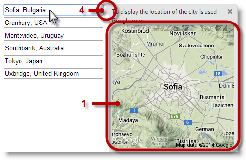
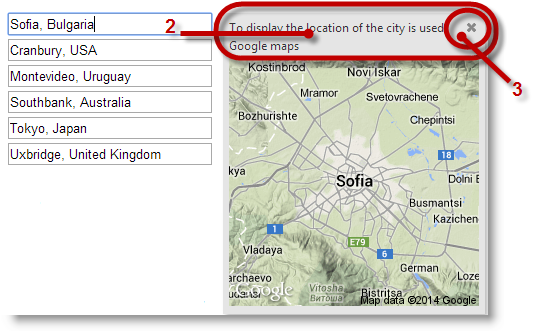
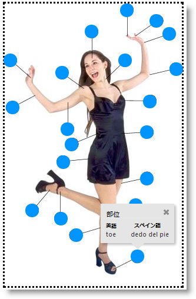
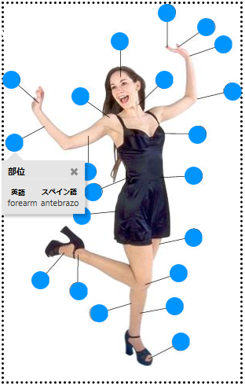
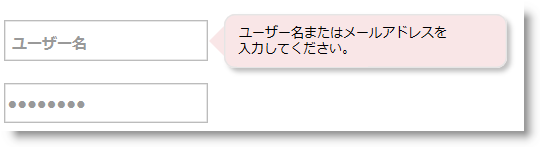
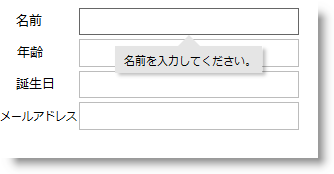

import ApiLink from 'docs-template/components/mdx/ApiLink.astro';

# igPopover の概要

## トピックの概要
### 目的

このトピックでは、`igPopover`™ コントロールおよびその主な特長および機能の概要を説明します。

### このトピックの内容

このトピックは、以下のセクションで構成されます。

-   [概要](#introduction)
-   [igPopover コントロールの視覚要素と関連プロパティ](#visual-elements)
    -   [視覚要素の概要](#visual-elements-summary)
    -   [視覚要素と関連プロパティ](#related-properties)
-   [主要機能](#main-features)
    -   [主要な機能の概要表](#main-features-chart)
    -   [構成可能な位置](#config-positioning)
    -   [カスタム コンテンツ](#custom-content)
    -   [構成可能なアクティブ化](#config-activation)
    -   [シングル/マルチ ターゲット](#single-multiple-targets)
    -   [構成可能なルック アンド フィール](#config-appearance)
-   [igPopover の構成 - 概要](#config-overview)
    -   [igPopover 構成の概要](#config-summary)
    -   [igPopover 構成の概要表](#config-summary-chart)
-   [igPopover のデフォルト構成](#default-config)
-   [関連コンテンツ](#related-content)
    -   [トピック](#topics)
    -   [サンプル](#samples)

## 概要
### igPopover の概要

`igPopover` コントロールは、ブラウザー ツールチップとして機能するポップアップ ウィンドウです。コンテキスト情報を提供する DOM 要素に表示されます。

`igPopover` コントロールはブラウザー ツールチップの拡張の代替として使用され、スタンドアロン ウィンドウとして動作できません。コンテンツと表示は、初期化されるターゲット要素に依存します。

`igPopover` は、コンテキスト メニュー、表、画像、動的コンテンツの提供など、幅広く利用されます (以下の図を参照)。

`igPopover` はブラウザー ツールチップと同様に実装され、補助的な情報を保持するコンテンツの小さなオーバーレイを要素に追加します。ツールチップとは異なり、ポップオーバーでコンテンツ、アクティブ化、位置を柔軟に構成できます。

`igPopover` コントロールの位置とアクティブ化 (表示するイベント) は構成することができます。`igPopover` は、マウスオーバー、クリックまたはターゲット要素がフォーカスされた場合に表示できます。

ポップオーバーのルック アンド フィールは CSS スタイルで設定します。

`igPopover` コントロールは、任意の DOM 要素 (「ターゲット要素」と呼ばれる) のオーバーレイ コンテナーとして実装されます。このコンテナーはデフォルトで DOM 要素の「title」属性を表示しますが、表示コンテンツをハード コーディングされた文字列形式、HTML コンテンツまたは HTML コンテンツを返す JavaScript 機能で構成することもできます。

次のスクリーンショットは、マウス ポイントによって画像要素 (Infragistics® のロゴ) の上に表示されたポップオーバーを示しています。 ここでポップオーバーは、オプションで選択できるコンテキスト メニューとして機能します。 閉じるボタンでポップオーバーを閉じることもできます。

`igPopover` コントロールはブラウザー ツールチップと同様に実装され、補助的な情報を保持するコンテンツの小さなオーバーレイを要素に追加します。ツールチップとは異なり、ポップオーバーでコンテンツ、アクティブ化、位置を柔軟に構成できます。

`igPopover` は、タッチ対応デバイスでサポーされています。

## igPopover コントロールの視覚要素と関連プロパティ
### 視覚要素の概要

以下のスクリーンショットは、`igPopover` コントロールの視覚要素を示しています。設定可能な要素を図の後に示します。

1 - 本文

2 - ヘッダー

3 - 閉じるボタン

4 - ポインター

### 視覚要素と関連プロパティ

以下の表は、`igPopover` コントロールとそれらを構成するプロパティの視覚要素をマップします。

視覚要素|プロパティ
---|---
ボディ|<ApiLink type="igpopover" member="contentTemplate" section="options" label="contentTemplate" />
ヘッダー|<ApiLink type="igpopover" member="headerTemplate.title" section="options" label="headerTemplate.title" />
閉じるボタン|<ApiLink type="igpopover" member="headerTemplate.closeButton" section="options" label="headerTemplate.closeButton" />

## 主要機能
### 主要な機能の概要表

以下の表で、`igPopover` コントロールの主な機能を簡単に説明します。詳細は、概要表の後に記載されています。

機能|説明
---|---
[**構成可能な位置**](#config-positioning)|ターゲット要素に対するポップオーバーの表示方向と位置は構成できます。
[**カスタム コンテンツ**](#custom-content)|ポップオーバーは、カスタム HTML コンテンツを表示するように設定できます。ポップオーバーにヘッダーを設定できます (オプション)。
[**構成可能なアクティブ化**](#config-activation)|ポップオーバーを表示するイベントを制御できます。
[**シングル/マルチ ターゲット**](#single-multiple-targets)|ポップオーバーをマルチ ターゲットに表示されるように構成できます。オプションの <ApiLink type="igpopover" member="selectors" section="options" label="selectors" /> を使用して、ポップオーバーを表示する要素を指定できます。
タッチ サポート|コントロールは、タッチ環境で完全に機能します。唯一の制限はアクティブ化イベントを構成できないことです。アクティブ化が設定されたイベントでも、タッチ対応デバイスでタップした場合は常にポップオーバーが表示されます。
[**構成可能なルック アンド フィール**](#config-appearance)|`igPopover` コントロールのスタイル設定は、CSS クラスに完全に依存します。ポップオーバーのルック アンド フィールを変更するには、ポップオーバー要素が依存するクラスをオーバーライドする必要があります。

### 構成可能な位置

ポップオーバーは、ターゲット要素のどちらの側にも表示できます。

ポップオーバーが表示されるターゲットの側面を「direction」と呼び、<ApiLink type="igpopover" member="direction" section="options" label="direction" /> オプションを設定して構成します。

ポップオーバーがターゲット要素よりも小さい場合は、常にターゲットである DOM 要素の表示領域の中央に表示されます。

ポップオーバーがターゲットよりも大きい場合は、ターゲットである DOM 要素に沿った位置に構成することもできます。これは <ApiLink type="igpopover" member="position" section="options" label="position" /> オプションで実行できます。

さらに、ポップオーバーを表示できる領域を制限する、境界線が機能するコンテナー (DIV 要素など) で、位置を制限することもできます。ポップオーバーを表示できる制限領域は、ポップオーバーの <ApiLink type="igpopover" member="containment" section="options" label="containment" /> で構成できます。

以下の画像は、ターゲットの円にマウスを置くと、本文の名称を英語とスペイン語で表示するポップオーバーを示します。ターゲット要素の下に、ポップオーバーを表示するように構成されています。ただし、ポップオーバーは、ドットで境界が示された DIV コンテナー の内側に表示されるように制限されています。下方の特定な要素の場合は、ポップオーバーを下に表示する十分なスペースがないため、コンテインメント規則に従って、ターゲット要素の上に表示されます。

### 関連トピック:

-   [igPopover の構成](/configuring-igpopover)

### カスタム コンテンツ

`igPopover` コントロール自体は、デフォルトでターゲット要素のタイトルを表示しますが、ハード コーディングされた文字列、HTML コンテンツ、または HTML コンテンツを返す JavaScript を設定することもできます。

ウィジェット `igPopover` のヘッダーを構成することもできます。テキスト文字列のみを指定でき、主に同じポップオーバーのマルチ ターゲットに共通のヘッダー (異なる本文コンテンツで、ヘッダー タイトルは同じ) を使用する場合に適用します。

さらに、ヘッダーに閉じるボタンを持たせることもできます。ヘッダーのボタンの位置は構成可能です。

### 関連トピック:

-   [igPopover の構成](/configuring-igpopover)

### 構成可能なアクティブ化

ポップオーバーを表示するイベントを制御できます。<ApiLink type="igpopover" member="showOn" section="options" label="showOn" /> オプションで制御します。`igPopover` でアクティブ化できるユーザー操作は以下のとおりです。

-   マウスオーバー (デフォルト)
-   クリック
-   フォーカス (ターゲット要素がユーザー操作によってフォーカスする)

### 関連トピック:

-   [igPopover の構成](/configuring-igpopover)
-   [igPopover のプロパティ リファレンス](./07_API Links/00_igPopover_Property_Reference.mdx)

### シングル/マルチ ターゲット

ポップオーバーをマルチ ターゲットに表示されるように構成できます。<ApiLink type="igpopover" member="selectors" section="options" label="selectors" /> オプションを使用して、ポップオーバーを表示する要素を指定できます。

以下の図に、画像要素 (青色の円) で表示される複数のアンカー ターゲットを示します。特定の円に関連付けらた本文部分の名称を表示するポップオーバーのコンテンツが、現在のターゲットと一致するように変更されます。

### 関連トピック:

-   [igPopover の構成 ](/configuring-igpopover)

### 構成可能なルック アンド フィール

`igPopover` コントロールのスタイル設定は、CSS クラスに完全に依存します。ポップオーバーのルック アンド フィールを変更するには、ポップオーバー要素が依存するクラスをオーバーライドする必要があります。以下の図は、`igPopover` コントロールのスタイル設定のサンプルを示します (メイン ポップオーバー コンテナーの丸みを付けた角、変更された背景色)。

### 関連トピック:

-   [igPopover の構成](/configuring-igpopover)

## igPopover の構成 - 概要
### igPopover 構成の概要

`igPopover` コントロールは、デフォルトの設定で十分に機能しますが、デフォルトの動作や外観をカスタマイズする場合に、ヘッダーや本文を構成できるプロパティ セットが提供されています。ポップオーバーのアクティブ化 (トリガーするイベント)、ディメンション、位置およびポインター矢印の表示を管理することもできます。

### igPopover 構成の概要表

以下の表は、`igPopover` コントロールの構成可能な要素を簡単に説明し、それらを構成するプロパティにマップします。表の緑色で強調表示された要素は、このヘルプのコード例で詳細に紹介しています。

<table class="table table-bordered">
	<thead>
		<tr>
            <th width="70" colspan="2">構成可能な項目</th>
            <th>詳細</th>
            <th>プロパティ</th>
</tr>
	</thead>
	<tbody>
        <tr>
            <td width="70">コンテンツ</td>
            <td>ヘッダー</td>
            <td>ヘッダーは構成できます。 ヘッダーのタイトルは、HTML 文字列または空です。空の場合、ヘッダーは表示されません。 ヘッダーにオプションで閉じるボタンを描画することもできます。</td>
            <td><ul> <li> <ApiLink type="igpopover" member="headerTemplate.title" section="options" label="headerTemplate.title" /> </li> <li> <ApiLink type="igpopover" member="headerTemplate.closeButton" section="options" label="headerTemplate.closeButton" /> </li> </ul></td>
</tr>

        <tr>
            <td width="70"></td>
            <td>ボディ</td>
            <td>igPopover コンテンツの本文は、カスタマイズできます。 以下に設定できます。 <ul> <li> HTML コンテンツ </li> <li> HTML コンテンツを描画する jQuery コード </li> <li> ポップオーバーの表示のたびに呼び出される関数 </li> </ul></td>
            <td><ul> <li> <ApiLink type="igpopover" member="contentTemplate" section="options" label="contentTemplate" /> </li> </ul></td>
</tr>

        <tr>
            <td width="70" colspan="2">ターゲット</td>
            <td>デフォルトでは、`igPopover` はシングル要素で初期化されます。<ApiLink type="igpopover" member="selectors" section="options" label="selectors" /> オプションに設定すると、マルチ ターゲットを構成できます。 option.</td>
            <td><ul> <li> <ApiLink type="igpopover" member="selectors" section="options" label="selectors" /> </li> </ul></td>
</tr>

        <tr>
            <td width="70" colspan="2">アクティブ化</td>
            <td>ポップオーバーを表示するイベントは構成できます。</td>
            <td><ul> <li> <ApiLink type="igpopover" member="showOn" section="options" label="showOn" /> </li> </ul></td>
</tr>

        <tr>
            <td width="70">配置</td>
            <td>方向</td>
            <td>ターゲット要素に対するポップオーバーの位置。direction は、ポップオーバー コンテナーをターゲットのどちら側に表示するか指定します。</td>
            <td><ul> <li> <ApiLink type="igpopover" member="direction" section="options" label="direction" /> </li> </ul></td>
</tr>

        <tr>
            <td width="70"></td>
            <td>位置</td>
            <td>ポップオーバーがターゲットより大きい場合のターゲット要素に対するポップオーバーの位置。ポップオーバーが小さい場合は、常に表示領域の中央に表示されます。</td>
            <td><ul> <li> <ApiLink type="igpopover" member="position" section="options" label="position" /> </li> </ul></td>
</tr>

        <tr>
            <td width="70"></td>
            <td>コンテインメント</td>
            <td>コンテインメントは、ポップオーバーを表示できる領域を制限する、境界線が機能するオブジェクト (DIV コンテナーなど) を指定することにより機能します。</td>
            <td><ul> <li> <ApiLink type="igpopover" member="containment" section="options" label="containment" /> </li> </ul></td>
</tr>

        <tr>
            <td width="70" colspan="2">サイズとディメンション</td>
            <td>ポップオーバーのコンテナーに設定可能な最大の幅および高さが指定されていない場合は、事前定義された幅および高さを指定することができます。</td>
            <td><ul> <li> <ApiLink type="igpopover" member="width" section="options" label="width" /> </li> <li> <ApiLink type="igpopover" member="height" section="options" label="height" /> </li> <li> <ApiLink type="igpopover" member="maxWidth" section="options" label="maxWidth" /> </li> <li> <ApiLink type="igpopover" member="maxHeight" section="options" label="maxHeight" /> </li> </ul></td>
</tr>

        <tr>
            <td width="70" colspan="2">ポインター</td>
            <td colspan="2">ポップオーバー ポインターの矢印のサイズおよび色は構成できます。ポインターにはオプションがなく、CSS クラスで管理します。 <ul> <li> ui-icon </li> </ul> ボタン アイコンのサイズを構成します。 <ul> <li> ui-icon-closethick </li> </ul> ボタン アイコンの画像を構成します。 <ul> <li> ui-igpopover-close-button </li> </ul> ヘッダー テンプレートの閉じるボタンの位置を構成します。 詳細は、[igPopover のスタイル設定](/styling-igpopover)のトピックを参照してください。</td>
</tr>
    </tbody>
</table>

## igPopover のデフォルト構成
### igPopover のデフォルト構成の概要

デフォルトでは、`igPopover` はターゲット要素のタイトル属性に設定される本文コンテンツのみを表示します。コントロールのヘッダーは表示されません。

デフォルトでは、`igPopover` はターゲット要素にマウスをホバーするとアクティブになります。

>**注:** タッチ対応デバイスでは、アクティブ化することはできません。

ポップオーバーが表示するターゲット要素に対する <ApiLink type="igpopover" member="direction" section="options" label="direction" /> と <ApiLink type="igpopover" member="position" section="options" label="position" /> も構成できます。

デフォルトで、ポップオーバーの位置はターゲット要素の下部中央です。下部に場所がない場合、表示方向の順は下 > 右 > 上 > 左です。

`igPopover` デフォルト プロパティの設定については、[igPopover プロパティ リファレンス](./07_API Links/00_igPopover_Property_Reference.mdx)のトピックを参照してください。

### 関連トピック:

-   [igPopover の構成 ](/configuring-igpopover)

## 関連コンテンツ
### トピック

このトピックの追加情報については、以下のトピックも合わせてご参照ください。

- [igPopover の追加](/adding-igpopover): このトピックでは、コード例を使用して、JavaScript または ASP.NET MVC で HTML ページに `igPopover` コントロールを追加する方法を説明します。

- [igPopover の構成](/configuring-igpopover): このトピックでは、`igPopover` コントロールの機能および動作を構成する方法を説明します。

- [イベントの処理 (igPopover)](/igpopover-handling-events): このトピックでは、`igPopover` コントロールのイベントを説明し、使用方法のコード例をいくつか紹介します。

- [igPopover のスタイル設定](/styling-igpopover): このトピックでは、コード例を使用して、CSS を使用した `igPopover` コントロールのルック アンド フィールを構成する方法を説明します。コンテンツの背景色、ポインターの表示と色、ヘッダーの色、および閉じるボタンの外観の設定が含まれます。

- [アクセシビリティ準拠 (igPopover)](/igpopover-accessibility-compliance): このトピックでは、`igPopover` コントロールのアクセシビリティ機能について説明し、コントロールを含むページに対するアクセシビリティの準拠を実現する方法を紹介します。

- [既知の問題と制限事項 (igPopover)](/igpopover-known-issues-and-limitations): このトピックでは、`igPopover` コントロールの既知の問題と制限事項および回避策についての情報を提供します。

- [jQuery と MVC API リンク (igPopover)](./07_API Links/~igPopover_ASP_NET_MVC_Helper_API.mdx): このトピックでは、`igPopover` コントロールの jQuery および ASP.NET MVC ヘルパー クラスの API 参照ドキュメントへのリンクを提供します。

- [プロパティ リファレンス (igPopover)](./07_API Links/00_igPopover_Property_Reference.mdx): このトピックでは、`igPopover` コントロールのプロパティについて説明し、デフォルト値の一覧を示します。

### サンプル

このトピックについては、以下のサンプルも参照してください。

- [基本的な使用方法](&#123;environment:SamplesUrl&#125;/popover/overview): このサンプルは、JavaScript による `igPopover` の基本的な初期化シナリオ (単一のターゲット要素および複数のターゲット要素) を紹介します。

- [ASP.NET MVC の使用方法](&#123;environment:SamplesUrl&#125;/popover/aspnet-mvc-helper): このサンプルは、ASP.NET MVC シナリオでの `igPopover` コントロールを紹介します。コントロールは、チェーン構文を使用して View で初期化されます。

 

 

