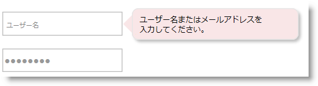

import ApiLink from 'docs-template/components/mdx/ApiLink.astro';

# igPopover のスタイル設定


## トピックの概要
### 目的

このトピックでは、コード例を使用して、CSS を使用した `igPopover`™ コントロールのルック アンド フィールを構成する方法を説明します。コンテンツの背景色、ポインターの表示と色、ヘッダーの色、および閉じるボタンの外観の設定が含まれます。

### 前提条件

このトピックを理解するために、以下のトピックを参照することをお勧めします。

- [igPopover の概要](/igpopover-overview): このトピックでは、`igPopover` コントロールとその主な特長および機能の概要を説明します。

- [igPopover の追加](/adding-igpopover): このトピックでは、コード例を使用して、JavaScript または ASP.NET MVC で `igPopover` コントロールをHTML ページに追加する方法を説明します。


### このトピックの内容

このトピックは、以下のセクションで構成されます。

-   [**概要**](#introduction)
    -   [igPopover のスタイル設定の概要](#summary)
    -   [igPopover のスタイル設定の概要表](#summary-chart)
-   [**コード例の概要**](#example-summary)
    -   [コード例: メイン ポップオーバー コンテナの色と角の変更](#main-popover-container)
    -   [コード例: ポップオーバー ポインターの削除](#popover-pointer)
-   [**関連コンテンツ**](#related-content)
    -   [トピック](#topics)
    -   [サンプル](#samples)


## <a id="introduction"></a>概要
### <a id="summary"></a>igPopover のスタイル設定の概要

`igPopover` コントロールのスタイル設定は、CSS クラスに完全に依存します。ポップオーバーのルック アンド フィールを変更するには、ポップオーバー要素が依存するクラスをオーバーライドする必要があります。以下の図は、`igPopover` コントロールのスタイル設定のサンプルを示します (メイン ポップオーバー コンテナーの丸みを付けた角、変更された背景色)



### <a id="summary-chart"></a>igPopover のスタイル設定の概要表

以下の表は、`igPopover` コントロールのスタイル設定要素ろそれらを構成する CSS クラスを示します。詳細は、表の後に記載されています。


| スタイル設定要素 | 詳細 | CSS クラス |
| --- | --- | --- |
| 本文の領域 | 本文の領域は、メイン ポップオーバー コンテナと同じです。 | ui-widget ui-igpopover |
| ヘッダー | ヘッダー コンテナに適用されるクラスは、ヘッダーがオプションで定義されている場合にのみ有効です (<ApiLink type="igpopover" member="headerTemplate.title" section="options" label="headerTemplate.title" /> プロパティが設定されている場合など)。 | ui-igpopover-title |
| ポインター | ポップオーバー ポインターの矢印のサイズおよび色は構成できます。 | ui-igpopover-arrow すべての種類のポインターに適用されるメイン クラス ui-igpopover-arrow- 行列式 ( ui-igpopover-arrow-top、 ui-igpopover-arrow-left など) |
| 閉じるボタン | 閉じるボタンのアイコンのサイズ、閉じるボタンのアイコンの画像、およびヘッダーのボタンの位置は構成できます。 これらのスタイル設定要素を個別に構成する単独のクラスがあります。 | ui-icon ボタン アイコンのサイズを構成します。 ui-icon-closethick ボタン アイコンの画像を構成します。 ui-igpopover-close-button ヘッダー テンプレートの閉じるボタンの位置を構成します。 |


## <a id="example-summary"></a>コード例の概要
### コード例の概要表

以下の表は、このトピックで使用したコード例をまとめたものです。

例|説明
---|---
[メイン ポップオーバー コンテナの色と角の変更](/styling-igpopover#main-popover-container)|例では、`igPopover` コンテナに丸みを付けた角を適用し、ポップオーバーの背景色を変更します。
[ポップオーバー ポインターの削除](/styling-igpopover#popover-pointer)|例では、`igPopover` のポインターの矢印を削除し、ポップオーバーをツールチップのような外観にします。


## <a id="main-popover-container"></a>コード例: メイン ポップオーバー コンテナの色と角の変更
### 説明

例では、`igPopover` コンテナに丸みを付けた角を適用し、ポップオーバーの本文のコンテンツ領域 (メイン コンテナ) の背景色を変更します。そのためには、矢印 (左、右、上、下) およびタイトルの背景色を変更する必要があります。


### コード

以下のコードはこの例を実装します。

**HTML の場合:**

```html
<style type="text/css">
.ui-igpopover > .ui-widget-content {
    background-color: #f9e6e7;
    -moz-border-radius: 8px;
    -webkit-border-radius: 8px;
    border-radius: 8px;
 }
.ui-igpopover-arrow-left {
    border-right-color: #f9e6e7;
}
.ui-igpopover-arrow-top {     
    border-bottom-color: #f9e6e7;
}
.ui-igpopover-arrow-bottom {     
    border-top-color: #f9e6e7;
}
.ui-igpopover-arrow-right {     
    border-left-color: #f9e6e7;
}
.ui-igpopover-title {  
    background-color: #f9e6e7;
 }
</style>
```


## <a id="popover-pointer"></a>コード例: ポップオーバー ポインターの削除
### 説明

この例は、ポップオーバーの矢印を削除する方法を示します。ポップオーバーのツールチップのような外観を実現する場合に便利です。

そのためには、ポインターの矢印の境界線の幅をゼロに設定する必要があります。

### コード

以下のコードはこの例を実装します。

**HTML の場合:**

```html
<style type="text/css">
.ui-igpopover-arrow {
            border-width: 0px;
        }
</style>
```


## <a id="related-content"></a>関連コンテンツ
### <a id="topics"></a>トピック

このトピックの追加情報については、以下のトピックも合わせてご参照ください。

- [igPopover の構成](/configuring-igpopover): このトピックでは、`igPopover` コントロールのコンテンツの構成、アクティブ化、および配置する方法を説明します。

### <a id="samples"></a>サンプル

このトピックについては、以下のサンプルも参照してください。

- [基本的な使用方法](&#123;environment:SamplesUrl&#125;/popover/overview): このサンプルは、ASP.NET MVC シナリオでの `igPopover` コントロールを紹介します。コントロールは、チェーン構文を使用して View で初期化されます。

- [ASP.NET MVC の使用方法](&#123;environment:SamplesUrl&#125;/popover/aspnet-mvc-helper): このサンプルは、JavaScript による `igPopover` の基本的な初期化シナリオ (単一のターゲット要素および複数のターゲット要素) を紹介します。


 

 


