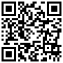

# igQRCodeBarcode

## このグループのトピックについて
### 概要

このグループのトピックでは、`igQRCodeBarcode`™ コントロールとその使用方法を説明します。

`igQRCodeBarcode` コントロールは、Web アプリケーションで使用する QR (Quick Response) バーコード画像を生成します。以下のスクリーンショットは、*http://www.infragistics.com* データをエンコードした `igQRCodeBarcode` コントロールのサンプルを示します。

### トピック

- [igQRCodeBarcode の概要](/igqrcodebarcode-overview): このトピックでは、主要機能、最小要件など、`igQRCodeBarcode` コントロールの概念的情報を提供します。

- [igQRCodeBarcode の追加](/igqrcodebarcode-adding): このトピック グループでは、`igQRCodeBarcode` コントロールを HTML ページと ASP.NET MVC アプリケーションに追加する方法を説明します。

- [igQRCodeBarcode の構成](/igqrcodebarcode-configuring): このトピック グループでは、`igQRCodeBarcode` コントロールのディメンション、文字エンコード、QR コード固有の設定を構成する方法を説明します。

- [igQRCodeBarcode のスタイル設定](/igqrcodebarcode-styling): このトピックでは、`igQRCodeBarcode` コントロールのルック アンド フィール、バーコードの色、背景色、および境界線の色と太さを設定する方法を説明します。

- [アクセシビリティの遵守 (igQRCodeBarcode)](/igqrcodebarcode-accessibility-compliance): このトピックは、`igQRCodeBarcode` コントロールのアクセシビリティ機能を説明し、バーコードを含むページのアクセシビリティ遵守を実現する方法を説明します。

- [既知の問題と制限 (igQRCodeBarcode)](/igqrcodebarcode-known-issues-and-limitations): このトピックでは、`igQRCodeBarcode` コントロールの既知の問題と制限に関する情報を提供します。

- [jQuery および MVC API リファレンス リンク (igQRCodeBarcode)](/igqrcodebarcode-api-links): このトピックでは、`igQRCodeBarcode` コントロールと ASP.NET MVC ヘルパーに関する API 参照ドキュメントへのリンクを提供します。

 

 

