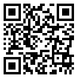

---
title: "igQRCodeBarcode の概要"
slug: igqrcodebarcode-overview
---

# igQRCodeBarcode の概要

## トピックの概要
### 目的

このトピックでは、主要機能、最小要件など、`igQRCodeBarcode` コントロールの概念的情報を提供します。

### 前提条件

このトピックを理解するためには、以下の概念を理解しておく必要があります。

-   [QR バーコード](http://en.wikipedia.org/wiki/QR_code)

### このトピックの内容

このトピックは、以下のセクションで構成されます。

-   [概要](#introduction)
-   [主要機能](#main-features)
    -   [主要機能の概要](#main-features-summary)
    -   [主要な機能の概要表](#main-feature-summary-chart)
-   [最低必要条件](#minimum-requirements)
-   [デフォルト設定](#default-settings)
-   [関連コンテンツ](#related-content)
    -   [トピック](#topics)
    -   [サンプル](#samples)

## 概要
### igQRCodeBarcode の概要

`igQRCodeBarcode` コントロールは、Web アプリケーションで使用する QR (Quick Response) バーコード画像を生成します。以下のスクリーンショットは、*http://www.infragistics.com* データをエンコードした `igQRCodeBarcode` コントロールのサンプルを示します。

このコントロールは、業界標準エンコーディングに対応し、生成された QR バーコードのサイズ設定、配置、読みやすさの最適化を図るためのオプションがいくつかあります。

## 主要機能
### 主要機能の概要

`igQRCodeBarcode` コントロールの QR コード固有の設定およびルック アンド フィール (背景色、境界線の色、太さ) は構成可能です。詳細は、[主要な機能の概要表](#main-feature-summary-chart)を参照してください。

### 主要な機能の概要表

以下の表で、`igQRCodeBarcode` コントロールの主な機能を簡単に説明しています。詳細は、[igQRCodeBarcode の構成](/igqrcodebarcode-configuring)のトピック グループを参照してください。

<table class="table">
	<thead>
		<tr>
            <th colspan="2">機能</th>
            <th>説明</th>
</tr>
	</thead>
	<tbody>
        <tr>
            <td rowspan="4">\*\*サイズ調整、ストレッチ、塗りつぶし\*\*</td>
            <td>設定可能な寸法</td>
            <td>[width](&#123;environment:jQueryApiUrl&#125;/ui.igQRCodeBarcode#options:width) および [height](&#123;environment:jQueryApiUrl&#125;/ui.igQRCodeBarcode#options:height) プロパティが `igQRCodeBarcode` コントロールに設定されていない場合、コンテナーのサイズ (定義されている場合) に基づきサイズが設定されます。高さと幅を設定すると、QR バーコード マトリックスが表示される長方形領域が作成されます。</td>
</tr>

        <tr>
            <td>設定可能な最小サイズ要素:</td>
            <td>マトリックスの最小サイズ要素の幅によって、マトリックス自体のサイズが決まります。この幅は、コンテナー内の使用可能なスペースと、QR バーコードをデコードする技術 (携帯電話など) にも関係があります。 最小サイズ要素のサイズは、[xDimension](&#123;environment:jQueryApiUrl&#125;/ui.igQRCodeBarcode#options:xDimension) プロパティにより管理されます。</td>
</tr>

        <tr>
            <td>構成可能なストレッチ</td>
            <td>[stretch](&#123;environment:jQueryApiUrl&#125;/ui.igQRCodeBarcode#options:stretch) は、コントロールのコンテナー内での QR バーコード マトリックスの水平・垂直方向の広がりを管理します。</td>
</tr>

        <tr>
            <td>構成可能な塗りつぶし</td>
            <td>バーコード マトリックスから構成される各種のバーは、論理グリッド内で可視化されます。 `igQRCodeBarcode` コントロールの [barsFillMode](&#123;environment:jQueryApiUrl&#125;/ui.igQRCodeBarcode#options:barsFillMode) プロパティは、バーを含む論理グリッドがコントロールのサイズを塗りつぶす方法を定義します。デフォルトでは、グリッドは `igQRCodeBarcode` コントロールが使用できるスペースをすべて塗りつぶします。</td>
</tr>

        <tr>
            <td rowspan="6">\*\*QR コード固有\*\*</td>
            <td>構成可能なエラー修正レベル</td>
            <td>`igQRCodeBarcode` コントロールは、バーコードが損傷したり汚れた場合、エンコードされたデータを復元することができます。許容誤差は、[errorCorrectionLevel](&#123;environment:jQueryApiUrl&#125;/ui.igQRCodeBarcode#options:errorCorrectionLevel) プロパティを使用して管理します。</td>
</tr>

        <tr>
            <td>構成可能なサイズ バージョン</td>
            <td>`igQRCodeBarcode` コントロールでは、適切なサイズ バージョンを選択して、そのモジュールの数を指定できます。 プロパティの値は、組み込まれており、データに対応するための最小バージョン (未定義) から、177x177 モジュールのようにサイズの大きなバージョンまでさまざまなサイズがあります。</td>
</tr>

        <tr>
            <td>構成可能なエンコード モード</td>
            <td>`igQRCodeBarcode` コントロールは、[data](&#123;environment:jQueryApiUrl&#125;/ui.igQRCodeBarcode#options:data) 文字のタイプに応じて、圧縮することで大量の文字をエンコードできます。JIS 漢字もサポートされます。その場合は、[encodingMode](&#123;environment:jQueryApiUrl&#125;/ui.igQRCodeBarcode#options:encodingMode) プロパティの Kanji 値を使用します。</td>
</tr>

        <tr>
            <td>構成可能な Extended Channel Interpretation (ECI) 番号</td>
            <td>`igQRCodeBarcode` コントロールは、既定の UTF-8 または ISO-8859-1 以外の文字セットのデータをエンコードできます。この機能は [eciNumber](&#123;environment:jQueryApiUrl&#125;/ui.igQRCodeBarcode#options:eciNumber) プロパティにより管理します。</td>
</tr>

        <tr>
            <td>構成可能な FNC1 モード</td>
            <td>`igQRCodeBarcode` コントロールは、エンコードされたデータのさまざまな書式または FNC1 モード (AIM Inc.によって合意された特定の業種アプリケーションに従ってフォーマットされたデータを対象とした GS1 (GS1 一般仕様に基づく) モードおよび業種モード) をサポートします。</td>
</tr>

        <tr>
            <td>構成可能なアプリケーション インジケーター</td>
            <td>`igQRCodeBarcode` コントロールの FCN1 モードを Industry に設定すると、アプリケーション インジケーターのプロパティを使用して、AIM Inc.の関連仕様を識別することができます。</td>
</tr>

        <tr>
            <td rowspan="3">\*\*ルック アンド フィール\*\*</td>
            <td>構成可能なバーコードのバーの色</td>
            <td>バーコードの色を設定できます。</td>
</tr>

        <tr>
            <td>構成可能な背景色</td>
            <td>バーコードのバーの背景領域の色を指定できます。</td>
</tr>

        <tr>
            <td>構成可能な境界線の太さと色</td>
            <td>バーコードの境界線の太さと色をカスタマイズできます。</td>
</tr>
    </tbody>
</table>

## 最低必要条件

コントロールを操作可能にするために必要な `igQRCodeBarcode` の最小構成では、サイズ (width および height) を指定し、data オプションに値を設定して、コントロールにデータを供給します。

>**注:** エンコードするデータのタイプによっては、追加のエンコーディング ファイルを読み込み、`eciNumber` を設定する必要があります (詳細は、[文字エンコードの構成 (igQRCodeBarcode)](/igqrcodebarcode-configuring-the-character-encoding) を参照してください)。

## デフォルト設定

width および height オプションが `igQRCodeBarcode` コントロールに設定されていない場合、コンテナーのサイズ (定義されている場合) に基づきサイズが設定されます。

デフォルトでは、コントロールを描画するのに利用できるスペースの縦横比が、その内容の縦横比と異なるときは、ネイティブな縦横比 (1:1) を保ちながら、指定先の寸法に収まるように、内容のサイズは変更されます (stretch プロパティのデフォルト値は uniform)。

バーコード マトリックスから構成される各種のバーは、論理グリッド内で可視化されます。デフォルトで、グリッドは `igQRCodeBarcode` コントロールで利用可能なすべてのスペースを塗りつぶします (`barsFillMode = "fillSpace"`)。

デフォルトの構成では、損傷した記号の 15% をデータ復元レベルとして指定します (`errorCorrectionLevel = "medium"`)。

QR コードのバーコード マトリックスのサイズ バージョンが明示的に設定されていない場合は、データを格納する最小サイズのバージョンが使用されます (`sizeVersion = "undefined"`)。

エンコード ロジックが書き込まれているファイルのサイズを最小に抑えるために、以下の 2 つのプロパティのデフォルト値は、選択されたエンコード方式に応じて異なります。

-   `encodingMode` は Shift_JIS エンコードの場合、undefined、それ以外のエンコードの場合、byte で解決します。
-   `eciNumber` は、ISO-8859-1 文字セットが読み込まれている場合この文字セットを表す「3」、それ以外の場合は UTF-8を表す「26」になります。

## 関連コンテンツ
### トピック

このトピックの追加情報については、以下のトピックも合わせてご参照ください。

- [igQRCodeBarcode の追加](/igqrcodebarcode-adding): このトピック グループでは、`igQRCodeBarcode` コントロールを HTML ページと ASP.NET MVC アプリケーションに追加する方法を説明します。

- [igQRCodeBarcode の構成](/igqrcodebarcode-configuring): このトピック グループでは、`igQRCodeBarcode` コントロールのディメンション、文字エンコード、QR コード固有の設定を構成する方法を説明します。

- [igQRCodeBarcode のスタイル設定](/igqrcodebarcode-styling): このトピックでは、`igQRCodeBarcode` コントロールのルック アンド フィール、バーコードの色、背景色、および境界線の色と太さを設定する方法を説明します。

- [アクセシビリティの遵守 (igQRCodeBarcode)](/igqrcodebarcode-accessibility-compliance): このトピックは、`igQRCodeBarcode` コントロールのアクセシビリティ機能を説明し、バーコードを含むページのアクセシビリティ遵守を実現する方法を説明します。

- [既知の問題と制限 (igQRCodeBarcode)](/igqrcodebarcode-known-issues-and-limitations): このトピックでは、`igQRCodeBarcode` コントロールの既知の問題と制限に関する情報を提供します。

- [jQuery および MVC API リファレンス リンク (igQRCodeBarcode)](/igqrcodebarcode-api-links): このトピックでは、`igQRCodeBarcode` コントロールと ASP.NET MVC ヘルパーに関する API 参照ドキュメントへのリンクを提供します。

### サンプル

このトピックについては、以下のサンプルも参照してください。

- [QR コード固有の設定の構成](&#123;environment:SamplesUrl&#125;/barcode/configuring-the-qr-code-specific-settings): このサンプルでは、QR コード固有の設定の構成について紹介します。

- [QR バーコードのサイズ設定](&#123;environment:SamplesUrl&#125;/barcode/qr-barcode-dimensions): このサンプルは、`igQRCodeBarcode` コントロールのサイズ設定を構成する方法を紹介します。

- [色の構成](&#123;environment:SamplesUrl&#125;/barcode/configuring-colors): このサンプルは、バーコードで使用する色を構成して `igQRCodeBarcode` コントロールをスタイル設定する方法を紹介します。

 

 

