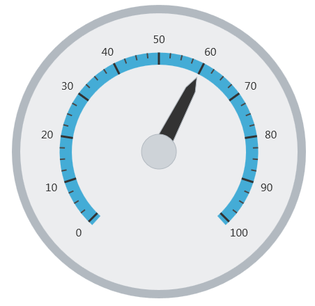
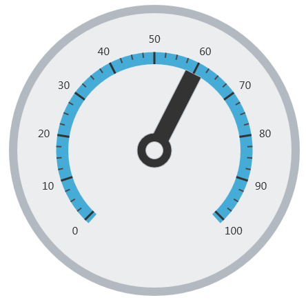

# 針の構成 (igRadialGauge)

## トピックの概要
### 目的

このトピックでは、`igRadialGauge`™ コントロールを使用した針の概念的な概要を提供します。針のプロパティについて説明し、針の構成方法の例も示します。

### 前提条件

このトピックを理解するために、以下のトピックを参照することをお勧めします。

- [igRadialGauge](/igradialgauge): このセクションでは、`igRadialGauge`™ コントロールおよびその主要機能の概要を説明します。

- [igRadialGauge の追加](/igradialgauge-getting-started-with-igradialgauge): このトピックではコード例を使用して、`igRadialGauge`™ コントロールをページに追加する方法を説明します。


### このトピックの内容

このトピックは、以下のセクションで構成されます。

-   [針の概要](#overview)
-   [プレビュー](#preview)
-   [針のプロパティ](#needle-properties)
-   [針の構成](#config-needle)
-   [関連コンテンツ](#related-content)


##<a id="overview"></a>針の概要 

### 針の概要

ゲージの針は、ゲージの設定値を表すために使用される視覚要素で、針キャップのオーバーレイまたはアンダーレイなどのゲージの針のピボット ポイントで構成されます。サポートされている針の図形とキャップは、`needleShape` と `needlePivotShape` プロパティで設定します。さまざまな針の図形やピボット図形の表示については、針のサンプルを参照してください。

### <a id="preview"></a>プレビュー

以下の画像は、value プロパティを 60 に設定した場合の `igRadialGauge` コントロールのプレビューです。




## <a id="needle-properties"></a>針のプロパティ
### 針のプロパティの概要

以下の表で、`igRadialGauge` コントロールの針に関連したプロパティを簡単に説明します。


| プロパティ名 | プロパティ タイプ | 説明 |
| --- | --- | --- |
| `value` | `double` | 針が指すゲージの値を決定します。 |
| `needleStartExtent` | `double` | ゲージの中心から測定される、針の開始位置を決定します。このプロパティの値の範囲は -1 から 1 です。 |
| `needleEndExtent` | `double` | ゲージの中心から測定される、針の終了位置を決定します。このプロパティの値の範囲は -1 から 1 です。 |
| `needleStartWidthRatio` | `double` | 針のポイント部分の幅を決定します。このプロパティの値の範囲は 0 から 1 です。 |
| `needleEndWidthRatio` | `double` | 針の基部の部分の幅を決定します。このプロパティの値の範囲は 0 から 1 です。 `needleShape` プロパティの以下のいずれかの値が設定されていない限り、効果は表示されません。 rectangle trapezoid rectangleWithBulb trapezoidWithBulb |
| `needleShape` | `radialGaugeNeedleShape` | 事前定義された針の図形から使用する図形を決定します。 rectangle triangle trapezoid rectangleWithBulb triangleWithBulb needleWithBulb trapezoidWithBulb |
| `needlePivotShape` | `radialGaugePivotShape` | 針に使用するピボットの形を決定します。 以下に設定できます。 circle circleWithHole circleOverlay circleOverlayWithHole circleUnderlay circleUnderlayWithHole |
| `needleBrush` | `brush` | ゲージの針のブラシを決定します。 |
| `needleOutline` | `brush` | アウトラインの針に使用するブラシを決定します。 |
| `needlePivotBrush` | `brush` | 針のピボット図形の塗りブラシを決定します。このピボット ブラシは、オーバーレイまたはアンダーレイを描画するピボット図形にのみ適用されます。この設定はそれ以外のピボット図形には効果がありません。 |
| `needlePivotOutline` | `brush` | 針のピボット図形のアウトラインのブラシを決定します。このピボット ブラシは、オーバーレイまたはアンダーレイを描画するピボット図形にのみ適用されます。この設定はそれ以外のピボット図形には効果がありません。 |


##<a id="config-needle"></a>針の構成 

### 例

以下のスクリーンショットは、以下の設定の結果、針のプロパティを使用した `igRadialGauge` コントロールの外観がどのようになるか示しています。

プロパティ|値
---|---
`value`|60
`needleEndExtent`|0.5
`needleShape`|rectangle
`pivotShape`|circleWithHole




以下のコードはこの例を実装します。

 **JavaScript の場合:**
 
```js                                                                                                                           $("#gauge").igRadialGauge({                                                   
	width: "400px",
	height: "400px",        
	value: 60,                                       
	endExtent: 0.5,
	needleShape: "rectangle",
	needlePivotShape: "circleWithHole"                                  
});                                                                  
```


## <a id="related-content"></a>関連コンテンツ
### トピック

このトピックの追加情報については、以下のトピックも合わせてご参照ください。

- [igRadialGauge の追加](/igradialgauge-getting-started-with-igradialgauge): このトピックではコード例を使用して、`igRadialGauge`™ コントロールを &#123;environment:PlatformName&#125; アプリケーションに追加する方法を説明します。

- [背景の構成 (igRadialGauge)](/igradialgauge-configuring-the-backing): このトピックでは、`igRadialGauge`™ コントロールのバッキング機能の概念的な概要を提供します。バッキング領域のプロパティについて説明し、実装例を提供します。

- [ラベルの構成 (igRadialGauge)](/igradialgauge-configuring-labels): このトピックでは、`igRadialGauge`™ コントロールを使用したラベルの概念的な概要を提供します。ラベルのプロパティについて説明し、ラベルの構成方法の例も示します。

- [範囲の構成 (igRadialGauge)](/igradialgauge-configuring-ranges): このトピックでは、`igRadialGauge`™ コントロールの範囲の概念的な概要を提供します。範囲のプロパティについて説明し、範囲をラジアル ゲージに追加する方法の例も示します。

- [スケールの構成 (igRadialGauge)](/igradialgauge-configuring-the-scales): このトピックでは、`igRadialGauge`™ コントロールのスケールの概念的な概要を提供します。スケールのプロパティについて説明し、スケールの実装方法の例も示します。

- [目盛の構成 (igRadialGauge)](/igradialgauge-configuring-tick-marks): このトピックでは、`igRadialGauge`™ コントロールを使用した目盛の概念的な概要を提供します。目盛のプロパティについて説明し、目盛の実装方法の例を示します。


### サンプル

このトピックについては、以下のサンプルも参照してください。

- [API の使用](&#123;environment:SamplesUrl&#125;/radial-gauge/api-usage): ボタンおよび API ビューアーが `igRadialGauge` の針のメソッドを紹介します。ボタンをクリックすると、ランタイムで針の値を変更するか、針の現在値を取得できます。

- [ゲージのアニメーション](&#123;environment:SamplesUrl&#125;/radial-gauge/motion-framework): このサンプルは、`transitionDuration` プロパティを設定してラジアル ゲージを簡単にアニメーション化する方法を紹介します。

- [ゲージ針](&#123;environment:SamplesUrl&#125;/radial-gauge/gauge-needle): ポインターとして表示される針は、スケールで単一の値を示します。以下のオプション ペインでラジアル ゲージコントロールの針を操作できます。

- [ラベル設定](/igradialgauge-configuring-labels#lable-example): このサンプルは、ラジアル ゲージ コントロールのラベル設定の方法を紹介します。スライダーを使用して、`labelInterval` および `labelExtent` プロパティのラベルへの影響を確認できます。

- [針のドラッグ](&#123;environment:SamplesUrl&#125;/radial-gauge/drag-needle): このサンプルは、isNeedleDraggingEnabled プロパティを使用してラジアル ゲージ コントロールの針をドラッグする方法を紹介します。

- [範囲](&#123;environment:SamplesUrl&#125;/radial-gauge/range): 範囲は、スケールで値の指定した領域を強調表示する視覚的な要素です。オプション ペインを使用してラジアルゲージコントロールの Range プロパティを設定できます。

- [スケールの設定](&#123;environment:SamplesUrl&#125;/radial-gauge/scale-settings): スケールは、ラジアル ゲージで値の範囲を定義します。オプション ペインを使用してラジアルゲージコントロールの Scale プロパティを設定できます。

- [目盛](&#123;environment:SamplesUrl&#125;/radial-gauge/tickmarks): ゲージの目盛をユーザーが指定した間隔で表示できます。オプション ペインを使用してラジアル ゲージ コントロールの目盛プロパティを設定できます。


 

 


