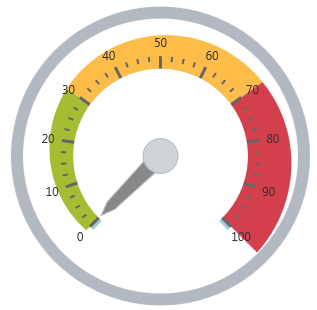
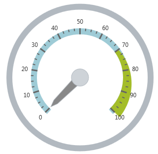

---
title: "範囲の構成 (igRadialGauge)"
slug: igradialgauge-configuring-ranges
---

# 範囲の構成 (igRadialGauge)


## トピックの概要
### 目的

このトピックでは、`igRadialGauge`™ コントロールの範囲の概念的な概要を提供します。範囲のプロパティについて説明し、範囲をラジアル ゲージに追加する方法の例も示します。

### 前提条件

このトピックを理解するために、以下のトピックを参照することをお勧めします。

- [igRadialGauge](/controls/igradialgauge/igradialgauge): このセクションでは、`igRadialGauge`™ コントロールおよびその主要機能の概要を説明します。

- [igRadialGauge の追加](/controls/igradialgauge/getting-started-with-igradialgauge): このトピックではコード例を使用して、`igRadialGauge`™ コントロールをページに追加する方法を説明します。

### このトピックの内容

このトピックは、以下のセクションで構成されます。

-   [範囲の概要](#overview)
-   [プレビュー](#preview)
-   [範囲のプロパティ](#range-properties)
-   [範囲の構成](#config-range)
-   [関連コンテンツ](#RelatedContent)


##<a id="overview"></a>範囲の概要 

### 範囲の概要

範囲は、ゲージ スケール上の指定された最小値と最大値によってバインドされた、連続した値のセットを強調表示します。複数のブラシを指定し、開始と終了の値に沿って複数の範囲をスケールに追加できます。範囲を `igRadialGauge` コントロールに追加するには、`radialGaugeRange` オブジェクトを作成して Ranges コレクションに追加します。

### <a id="preview"></a>プレビュー

以下の画像は、3 つの範囲 (0-30; 30-70 および 70-100) を追加した場合の `igRadialGauge` コントロールのプレビューです。




## <a id="range-properties"></a>範囲のプロパティ
### 範囲のプロパティの概要

以下の表で、`radialGaugeRange` のプロパティを簡単に説明します。

プロパティ名|プロパティ タイプ|説明
---|---|---
`brush`|brush|範囲に割り当てられた色
`startValue`|double|範囲が始まる開始の値
`endValue`|double|範囲が終る終了の値
`innerStartExtent`|double|範囲の内部スイープの描画を開始するゲージの中心からの距離 (通常は、0 から 1)。ゲージの標準の半径より拡張させるために、0.5 より大きい値を使用します。
`innerEndExtent`|double|範囲の内部スイープの描画を終了するゲージの中心からの距離 (通常は、0 から 1)。ゲージの標準の半径より拡張させるために、0.5 より大きい値を使用します。
`outerStartExtent`|double|範囲の外部スイープの描画を開始するゲージの中心からの距離 (通常は、0 から 1)。ゲージの標準の半径より拡張させるために、0.5 より大きい値を使用します。
`outerEndExtent`|double|範囲の外部スイープの描画を終了するゲージの中心からの距離 (通常は、0 から 1)。ゲージの標準の半径より拡張させるために、0.5 より大きい値を使用します。


##<a id="config-range"></a>範囲の構成 

### 例

以下のスクリーンショットは、以下の `igRadialGaugeRange` 構成を使用して、`igRadialGauge` コントロールが描画する方法を示します。

プロパティ|値
---|---
`brush`|Blue
`startValue`|70
`endValue`|100
`outerStartExtent`|0.55
`outerEndExtent`|0.65




以下のコードはこの例を実装します。

 **JavaScript の場合:**  
 
```js                                                                                                                                  $("#gauge").igRadialGauge({             
	width: "400px",
	height: "400px",
	ranges: [{ 
		name: "range1",
		brush: "rgba(164, 189, 41, 1)",  
		startValue: 70,
		endValue: 100,
		outerStartExtent: 0.55,   
		outerEndExtent: 0.65    
	}]                                      
});                                                                  
```


## <a id="RelatedContent"></a>関連コンテンツ
### トピック

このトピックの追加情報については、以下のトピックも合わせてご参照ください。

- [igRadialGauge の追加](/controls/igradialgauge/getting-started-with-igradialgauge): このトピックではコード例を使用して、`igRadialGauge`™ コントロールを &#123;environment:PlatformName&#125; アプリケーションに追加する方法を説明します。

- [背景の構成 (igRadialGauge)](/controls/igradialgauge/configuring/configuring-the-backing): このトピックでは、`igRadialGauge`™ コントロールのバッキング機能の概念的な概要を提供します。バッキング領域のプロパティについて説明し、実装例を提供します。

- [ラベルの構成 (igRadialGauge)](/controls/igradialgauge/configuring/configuring-labels): このトピックでは、`igRadialGauge`™ コントロールを使用したラベルの概念的な概要を提供します。ラベルのプロパティについて説明し、ラベルの構成方法の例も示します。

- [針の構成 (igRadialGauge)](/controls/igradialgauge/configuring/configuring-needles): このトピックでは、`igRadialGauge`™ コントロールを使用した針の概念的な概要を提供します。針のプロパティについて説明し、針の構成方法の例も示します。

- [スケールの構成 (igRadialGauge)](/controls/igradialgauge/configuring/configuring-the-scales): このトピックでは、`igRadialGauge`™ コントロールのスケールの概念的な概要を提供します。スケールのプロパティについて説明し、スケールの実装方法の例も示します。

- [目盛の構成 (igRadialGauge)](/controls/igradialgauge/configuring/configuring-tick-marks): このトピックでは、`igRadialGauge`™ コントロールを使用した目盛の概念的な概要を提供します。目盛のプロパティについて説明し、目盛の実装方法の例を示します。


### サンプル

このトピックについては、以下のサンプルも参照してください。

- [API の使用](&#123;environment:SamplesUrl&#125;/radial-gauge/api-usage): ボタンおよび API ビューアーが `igRadialGauge` の針のメソッドを紹介します。ボタンをクリックすると、ランタイムで針の値を変更するか、針の現在値を取得できます。

- [ゲージのアニメーション](&#123;environment:SamplesUrl&#125;/radial-gauge/motion-framework): このサンプルは、`transitionDuration` プロパティを設定してラジアル ゲージを簡単にアニメーション化する方法を紹介します。

- [ゲージ針](&#123;environment:SamplesUrl&#125;/radial-gauge/gauge-needle): ポインターとして表示される針は、スケールで単一の値を示します。以下のオプション ペインでラジアル ゲージコントロールの針を操作できます。

- [ラベル設定](/controls/igradialgauge/configuring/configuring-labels#lable-example): このサンプルは、ラジアル ゲージ コントロールのラベル設定の方法を紹介します。スライダーを使用して、`labelInterval` および `labelExtent` プロパティのラベルへの影響を確認できます。

- [針のドラッグ](&#123;environment:SamplesUrl&#125;/radial-gauge/drag-needle): このサンプルは、Mouse イベントを使用してラジアル ゲージ コントロールの針をドラッグする方法を紹介します。

- [範囲](&#123;environment:SamplesUrl&#125;/radial-gauge/range): 範囲は、スケールで値の指定した領域を強調表示する視覚的な要素です。オプション ペインを使用してラジアルゲージコントロールの Range プロパティを設定できます。

- [スケールの設定](&#123;environment:SamplesUrl&#125;/radial-gauge/scale-settings): スケールは、ラジアル ゲージで値の範囲を定義します。オプション ペインを使用してラジアルゲージコントロールの Scale プロパティを設定できます。

- [目盛](&#123;environment:SamplesUrl&#125;/radial-gauge/tickmarks): ゲージの目盛をユーザーが指定した間隔で表示できます。オプション ペインを使用してラジアル ゲージ コントロールの目盛プロパティを設定できます。


 

 


