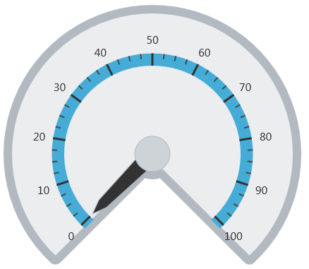
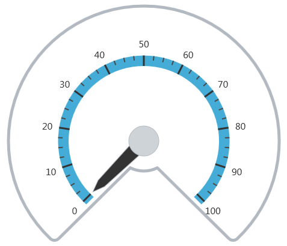

---
title: "背景の構成 (igRadialGauge)"
slug: igradialgauge-configuring-the-backing
---

# 背景の構成 (igRadialGauge)

## (igRadialGauge) トピックの概要
### 目的

このトピックでは、`igRadialGauge`™ コントロールの背景機能の概念的な概要を提供します。背景領域のプロパティについて説明し、実装例を提供します。

### 前提条件

このトピックを理解するために、以下のトピックを参照することをお勧めします。

- [igRadialGauge](/igradialgauge): このセクションでは、`igRadialGauge`™ コントロールおよびその主要機能の概要を説明します。

- [igRadialGauge の追加](/igradialgauge-getting-started-with-igradialgauge): このトピックではコード例を使用して、`igRadialGauge`™ コントロールをページに追加する方法を説明します。


### このトピックの内容

このトピックは、以下のセクションで構成されます。

-   [概要](#overview)
-   [プレビュー](#preview)
-   [背景機能プロパティ](#properties)
-   [背景の構成](#config-background)
-   [関連コンテンツ](#related-content)


##<a id="overview"></a>背景機能の概要 

### 背景機能の概要

円で表示される `igRadialGauge` コントロールの背景セクションには、ゲージに追加される針や目盛など、さまざまな要素があります。

この領域は、`backingShape` プロパティの設定で円形またフィットのいずれかにカスタマイズできます。円形の場合は 360 度の円形のゲージが作成されますが、一方フィット図形の場合はスケールの範囲を円弧として塗りつぶされた円のセグメントが作成されます。

### <a id="preview"></a>プレビュー

以下の画像は、フィットで構成した背景に描画された `igRadialGauge` コントロールのプレビューです。




## <a id="properties"></a>背景機能プロパティ
### 背景機能プロパティの概要

以下の表で、背景領域に関連した `igRadialGauge` コントロールの背景に関連するプロパティを簡単に説明します。

プロパティ名|プロパティ タイプ|説明
---|---|---
`backingBrush`|brush|このプロパティは、ゲージの背景をブラシで塗りつぶす設定に使用します。
`backingCornerRadius`|double|フィット スケールの背景に使用する角丸の半径を決定します。ゲージがフィット背景の図形を使用する場合に、このプロパティを使用して背景の角丸を指定します。
`backingInnerExtent`|double|ゲージの背景の内側範囲を決定します。フィット背景の図形を使用する場合のみ適用されます。
`backingOuterExtent`|double|ゲージの背景の外側範囲を決定します。フィット背景の図形を使用する場合のみ適用されます。
`backingOutline`|brush|背景のアウトラインに使用するブラシを決定します。
`backingOversweep`|double|フィット背景に適用されるオーバースイープまたはアンダースイープの角度を決定します。このプロパティを使用すると、スペースを追加して背景図形をスケールの開始および終了より大きくすることができます。
`backingShape`|`radialGaugeBackingShape`|このプロパティを使用すると、ゲージの背景図形を事前定義された図形に設定できます。背景の形状は、円形またはフィットです。フィット図形の場合は、スケールの範囲を円弧として塗りつぶされた円のセグメントが作成されます。
`backingStokeThickness`|double|背景アウトラインのストロークの太さを決定します。


##<a id="config-background"></a>背景の構成 

### 例

以下のスクリーンショットは、以下の背景のプロパティの構成を使用して `igRadialGauge` コントロールを描画する方法を示します。

プロパティ|値
---|---
`backingBrush`|white
`backingShape`|fitted
`backingCornerRadius`|10
`backingOuterExtent`|0.9
`backingInnerExtent`|0.2
`backingOversweep`|4
`backingStrokeThickness`|5




以下のコードはこの例を実装します。

 **JavaScript の場合:**
 
```js
$("#gauge").igRadialGauge({        
	width: "400px",
	height: "400px",
	minimumValue: 0, 
	maximumValue: 0,  
	value: 1,
	backingShape: "fitted",
	backingBrush: "white",
	backingCornerRadius: 10,
	backingOuterExtent: 0.9, 
	backingInnerExtent: 0.2,
	backingOversweep: 4, 
	backingSrokeThickness:5
});                                                                  
```


## <a id="related-content"></a>関連コンテンツ
### トピック

このトピックの追加情報については、以下のトピックも合わせてご参照ください。

- [igRadialGauge の追加](/igradialgauge-getting-started-with-igradialgauge): このトピックではコード例を使用して、`igRadialGauge`™ コントロールを &#123;environment:PlatformName&#125; アプリケーションに追加する方法を説明します。

- [ラベルの構成 (igRadialGauge)](/igradialgauge-configuring-labels): このトピックでは、`igRadialGauge`™ コントロールを使用したラベルの概念的な概要を提供します。ラベルのプロパティについて説明し、ラベルの構成方法の例も示します。

- [針の構成 (igRadialGauge)](/igradialgauge-configuring-needles): このトピックでは、`igRadialGauge`™ コントロールを使用した針の概念的な概要を提供します。針のプロパティについて説明し、針の構成方法の例も示します。

- [範囲の構成 (igRadialGauge)](/igradialgauge-configuring-ranges): このトピックでは、`igRadialGauge`™ コントロールの範囲の概念的な概要を提供します。範囲のプロパティについて説明し、範囲をラジアル ゲージに追加する方法の例も示します。

- [スケールの構成 (igRadialGauge)](/igradialgauge-configuring-the-scales): このトピックでは、`igRadialGauge`™ コントロールのスケールの概念的な概要を提供します。スケールのプロパティについて説明し、スケールの実装方法の例も示します。

- [目盛の構成 (igRadialGauge)](/igradialgauge-configuring-tick-marks): このトピックでは、`igRadialGauge`™ コントロールを使用した目盛の概念的な概要を提供します。目盛のプロパティについて説明し、目盛の実装方法の例を示します。


### サンプル

このトピックについては、以下のサンプルも参照してください。

- [API の使用](&#123;environment:SamplesUrl&#125;/radial-gauge/api-usage): ボタンおよび API ビューアーが `igRadialGauge` の針のメソッドを紹介します。ボタンをクリックすると、ランタイムで針の値を変更するか、針の現在値を取得できます。

- [ゲージのアニメーション](&#123;environment:SamplesUrl&#125;/radial-gauge/motion-framework): このサンプルは、`transitionDuration` プロパティを設定してラジアル ゲージを簡単にアニメーション化する方法を紹介します。

- [ゲージ針](&#123;environment:SamplesUrl&#125;/radial-gauge/gauge-needle): ポインターとして表示される針は、スケールで単一の値を示します。以下のオプション ペインでラジアル ゲージコントロールの針を操作できます。

- [ラベル設定](/igradialgauge-configuring-labels#lable-example): このサンプルは、ラジアル ゲージ コントロールのラベル設定の方法を紹介します。スライダーを使用して、`labelInterval` および `labelExtent` プロパティのラベルへの影響を確認できます。

- [針のドラッグ](&#123;environment:SamplesUrl&#125;/radial-gauge/drag-needle): このサンプルは、Mouse イベントを使用してラジアル ゲージ コントロールの針をドラッグする方法を紹介します。

- [範囲](&#123;environment:SamplesUrl&#125;/radial-gauge/range): 範囲は、スケールで値の指定した領域を強調表示する視覚的な要素です。オプション ペインを使用してラジアルゲージコントロールの Range プロパティを設定できます。

- [スケールの設定](&#123;environment:SamplesUrl&#125;/radial-gauge/scale-settings): スケールは、ラジアル ゲージで値の範囲を定義します。オプション ペインを使用してラジアルゲージコントロールの Scale プロパティを設定できます。

- [目盛](&#123;environment:SamplesUrl&#125;/radial-gauge/tickmarks): ゲージの目盛をユーザーが指定した間隔で表示できます。オプション ペインを使用してラジアル ゲージ コントロールの目盛プロパティを設定できます。


 

 


