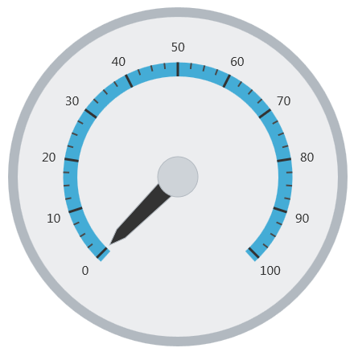
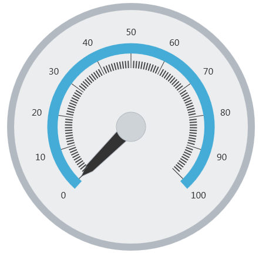

# 目盛の構成 (igRadialGauge)


## トピックの概要
### 目的

このトピックでは、`igRadialGauge`™ コントロールを使用した目盛の概念的な概要を提供します。目盛のプロパティについて説明し、目盛の実装方法の例を示します。

### 前提条件

このトピックを理解するために、以下のトピックを参照することをお勧めします。

- [igRadialGauge](/igradialgauge): このセクションでは、`igRadialGauge`™ コントロールおよびその主要機能の概要を説明します。

- [igRadialGauge の追加](/igradialgauge-getting-started-with-igradialgauge): このトピックではコード例を使用して、`igRadialGauge`™ コントロールをページに追加する方法を説明します。

### このトピックの内容

このトピックは、以下のセクションで構成されます。

-   [目盛の概要](#overview)
-   [プレビュー](#preview)
-   [目盛のプロパティ](#mark-properties)
-   [目盛の構成](#config-tick-marks)
-   [関連コンテンツ](#related-content)


## 目盛の概要
### 目盛の概要

ラジアル ゲージの目盛は、指定された間隔の線でゲージに表示される視覚要素です。

目盛には、主目盛および補助目盛の 2 種類があります。`minorTickCount` プロパティを使用して、隣接する 2 つの主目盛間の補助目盛の数を指定します。

### プレビュー

以下の画像は、主目盛および補助目盛が追加された `igRadialGauge` のプレビューです。




## 目盛のプロパティ
### 目盛のプロパティの概要

以下の表で、`igRadialGauge` コントロールの目盛のプロパティを簡単に説明します。

プロパティ名|プロパティ タイプ|説明
---|---|---
`interval`|Double|主目盛を配置する間隔を決定します。
`tickStartExtent`|Double|ゲージの中心から測定される、主目盛の開始位置を決定します。このプロパティの値の範囲は 0 から 1 です。主目盛にのみ影響があります。補助目盛の範囲を変更するには、`minorTickStartExtent` プロパティを使用します。
`tickEndExtent`|Double|ゲージの中心から測定される、主目盛の終了位置を決定します。このプロパティの値の範囲は 0 から 1 です。主目盛にのみ影響があります。補助目盛の範囲を変更するには、`minorTickExtentCount` プロパティを使用します。 
`tickStrokeThickness`|Double|主目盛のストロークの太さを決定します。
`minorTickStartExtent`|Double|ゲージの中心から計測される、0 から 1 の値で補助目盛の描画を開始する位置を決定します。ゲージの標準の半径より拡張させるために、1 より大きい値を使用します。
`minorTickEndExtent`|Double|ゲージの中心から計測される、0 から 1 の値で補助目盛の描画を終了する位置を決定します。ゲージの標準の半径より拡張させるために、1 より大きい値を使用します。
`minorTickCount`|Double|隣接する 2 つの主目盛間の補助目盛の数を決定します。
`minorTickStrokeThickness`|Double|補助目盛の太さを決定します。
`tickBrush`|Brush|主目盛のブラシを決定します。このプロパティは、ゲージ スケールの主目盛のブラシを変更するために使用されます。
`minorTickBrush`|Brush|補助目盛に使用するブラシを決定します。このプロパティは、ゲージ スケールの補助目盛のブラシを変更するために使用されます。


## 目盛の構成
### 例

以下のスクリーンショットは、以下のように構成された主目盛を使用した `igRadialGauge` の描画方法を示しています。

プロパティ|値
---|---
`tickStartExtent`| 0.4
`tickEndExtent`| 0.5
`tickStrokeThickness`| 1
`minorTickStartExtent`| 0.4
`minorTickEndExtent`| 0.45
`minorTickCount`| 10




以下のコードはこの例を実装します。

 **JavaScript の場合:**   
 
```js
    $("#gauge").igRadialGauge({ 
		width: "400px",
		height: "400px",
		tickStartExtent: 0.4, 
		tickEndExtent:   0.5,
		tickStrokeThickness: 1,
		minorTickStartExtent: 0.4, 
		minorTickEndExtent: 0.45,   
		minorTickCount: 10                                  
	});                                                                  
```

## 関連コンテンツ
### トピック

このトピックの追加情報については、以下のトピックも合わせてご参照ください。

- [igRadialGauge の追加](/igradialgauge-getting-started-with-igradialgauge): このトピックではコード例を使用して、`igRadialGauge`™ コントロールを &#123;environment:PlatformName&#125; アプリケーションに追加する方法を説明します。

- [背景の構成 (igRadialGauge)](/igradialgauge-configuring-the-backing): このトピックでは、`igRadialGauge`™ コントロールのバッキング機能の概念的な概要を提供します。バッキング領域のプロパティについて説明し、実装例を提供します。

- [ラベルの構成 (igRadialGauge)](/igradialgauge-configuring-labels): このトピックでは、`igRadialGauge`™ コントロールを使用したラベルの概念的な概要を提供します。ラベルのプロパティについて説明し、ラベルの構成方法の例も示します。

- [針の構成 (igRadialGauge)](/igradialgauge-configuring-needles): このトピックでは、`igRadialGauge`™ コントロールを使用した針の概念的な概要を提供します。針のプロパティについて説明し、針の構成方法の例も示します。

- [範囲の構成 (igRadialGauge)](/igradialgauge-configuring-ranges): このトピックでは、`igRadialGauge`™ コントロールの範囲の概念的な概要を提供します。範囲のプロパティについて説明し、範囲をラジアル ゲージに追加する方法の例も示します。

- [スケールの構成 (igRadialGauge)](/igradialgauge-configuring-the-scales): このトピックでは、`igRadialGauge`™ コントロールのスケールの概念的な概要を提供します。スケールのプロパティについて説明し、スケールの実装方法の例も示します。

### サンプル

このトピックについては、以下のサンプルも参照してください。

- [API の使用](&#123;environment:SamplesUrl&#125;/radial-gauge/api-usage): ボタンおよび API ビューアーが `igRadialGauge` の針のメソッドを紹介します。ボタンをクリックすると、ランタイムで針の値を変更するか、針の現在値を取得できます。

- [ゲージのアニメーション](&#123;environment:SamplesUrl&#125;/radial-gauge/motion-framework): このサンプルは、`transitionDuration` プロパティを設定してラジアル ゲージを簡単にアニメーション化する方法を紹介します。

- [ゲージ針](&#123;environment:SamplesUrl&#125;/radial-gauge/gauge-needle): ポインターとして表示される針は、スケールで単一の値を示します。以下のオプション ペインでラジアル ゲージコントロールの針を操作できます。

- [ラベル設定](/igradialgauge-configuring-labels#lable-example): このサンプルは、ラジアル ゲージ コントロールのラベル設定の方法を紹介します。スライダーを使用して、`labelInterval` および `labelExtent` プロパティのラベルへの影響を確認できます。

- [針のドラッグ](&#123;environment:SamplesUrl&#125;/radial-gauge/drag-needle): このサンプルは、Mouse イベントを使用してラジアル ゲージ コントロールの針をドラッグする方法を紹介します。

- [範囲](&#123;environment:SamplesUrl&#125;/radial-gauge/range): 範囲は、スケールで値の指定した領域を強調表示する視覚的な要素です。オプション ペインを使用してラジアルゲージコントロールの Range プロパティを設定できます。

- [スケールの設定](&#123;environment:SamplesUrl&#125;/radial-gauge/scale-settings): スケールは、ラジアル ゲージで値の範囲を定義します。オプション ペインを使用してラジアルゲージコントロールの Scale プロパティを設定できます。

- [目盛](&#123;environment:SamplesUrl&#125;/radial-gauge/tickmarks): ゲージの目盛をユーザーが指定した間隔で表示できます。オプション ペインを使用してラジアル ゲージ コントロールの目盛プロパティを設定できます。


 

 


