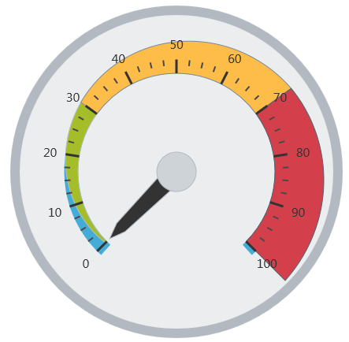

---
title: "igRadialGauge"
slug: igradialgauge
---

# igRadialGauge

## このグループのトピックについて
### 概要

このグループのトピックでは、`igRadialGauge`™ コントロールとその使用方法を説明します。

`igRadialGauge`™ コントロールは、ゲージを表示するデータ ビジュアライゼーション ツールです。スケール、目盛、ラベル、針、範囲などの複数の視覚要素が含まれます。

### トピック

- [igRadialGauge の概要](/igradialgauge-igradialgauge-overview): このトピックでは、`igRadialGauge`™ コントロールおよびその主要機能の概要を説明します。

- [igRadialGauge の追加](/igradialgauge-getting-started-with-igradialgauge): このトピックでは、`igRadialGauge` コントロールを &#123;environment:PlatformName&#125; アプリケーションに追加する方法を説明します。

- [igRadialGauge の構成](/igradialgauge-using-igradialgauge): このトピック グループは、向きや方向および視覚要素を含む `igRadialGauge`™ コントロールのさまざまな要素を構成する方法を説明します。

- [jQuery と MVC API リファレンス リンク (igRadialGauge)](/igradialgauge-igradialgauge-api-reference): このトピックでは、`igRadialGauge` コントロールに関連するキー クラスやプロパティに関する参考情報を提供します。

- [アクセシビリティ準拠](/igradialgauge-accessibility-compliance): このトピックでは、`igRadialGauge` コントロールのアクセシビリティ遵守に関する情報を提供します。

- [既知の問題と制限 (igRadialGauge)](/igradialgauge-known-issues-and-limitations): このトピックでは、`igRadialGauge` コントロールの既知の問題点および制限に関する情報を提供します。

 

 

