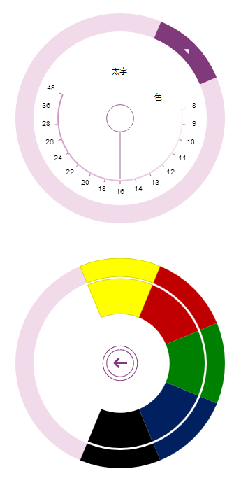

# ASP.NET MVC アプリケーションへの igRadialMenu の追加

import ApiLink from 'docs-template/components/mdx/ApiLink.astro';

# ASP.NET MVC アプリケーションへの igRadialMenu の追加

## トピックの概要
### 目的

このトピックでは、コード例を使用して、\{environment:ProductNameMVC\} で ASP.NET MVC アプリケーションに <ApiLink type="igRadialMenu" label="igRadialMenu" />™ を追加する方法を説明します。

### 前提条件

以下の表は、このトピックを理解するための前提条件として必要な概念とトピックの一覧です。

概念

-   jQuery
-   jQuery UI
-   ASP.NET MVC
-   ASP.NET MVC HTML ヘルパー


**トピック**

- [コントロールを MVC プロジェクトに追加](../../../01_General-and-Getting-Started/00_Adding IgniteUI Controls to an MVC Project.mdx): このトピックでは、ASP.NET MVC アプリケーションで \{environment:ProductName\}™ コンポーネントを使用した作業の開始方法を説明します。

- [igRadialMenu の機能](/igradialmenu-features): このトピックでは、このコントロールでサポートする機能を開発者の観点から説明します。

- [igRadialMenu の視覚要素](/igradialmenu-visual-elements): このトピックでは、コントロールの視覚要素についての概要を紹介します。


### このトピックの内容

このトピックは、以下のセクションで構成されます。 

-   [ASP.NET MVC アプリケーションへの igRadialMenu の追加 - 概念的な概要](#overview)
-   [ASP.NET MVC アプリケーションへの igRadialMenu の追加 - 手順](#procedure)
-   [関連コンテンツ](#related-content)


## <a id="overview"></a>ASP.NET MVC アプリケーションへの igRadialMenu の追加 - 概念的な概要
### igRadialMenu の追加の概要

`igRadialMenu` コントロールは、\{environment:ProductNameMVC\} HTML ヘルパーを使用して ASP.NET MVC View に追加できます。

`igRadialMenu` コントロールのインスタンスを作成する場合、基本的な描画に設定する必要がある、いくつかのヘルパー メソッドがあります。以下のメソッドが含まれます。

ヘルパー メソッド|目的
---|---
`Width()`| `igRadialMenu` の幅を設定します。
`Height()`| `igRadialMenu` の高さを設定します。
`Items()`|`igRadialMenu` の項目を追加するために使用します。


### 要件

この手順を実行するには、以下が必要です。

-   ASP.NET MVC アプリケーション
-   アプリケーション プロジェクトに追加される `Infragistics.Web.Mvc.dll` アセンブリに対する参照。詳細は、「MVC プロジェクトへのコントロールの追加」のトピックを参照してください。
-   ビューの依存関係:
-   -   ASP.NET MVC ビューに追加される Infragistics.Web.Mvc 名前空間

        **ASPX の場合:**

```csharp
        <%@ Import Namespace="Infragistics.Web.Mvc" %>
```

    -   すべてのデータ ビジュアライゼーション コントロール用の結合された Java Script ファイル、および ASP.NET MVC ビューの &lt;head&gt; タグに追加された必要な CSS ファイルへの参照

        **ASPX の場合:**

```csharp
        <%@ Import Namespace="Infragistics.Web.Mvc" %>
        <!DOCTYPE html>
        <html>
        <head>
        <title>BulletGraph</title>
        <link href="<%=Url.Content("~/Scripts/css/themes/infragistics/infragistics.theme.css")%>" rel="stylesheet"></link>
        <link href="<%=Url.Content("~/Scripts/css/structure/infragistics.css")%>" rel="stylesheet"></link>
        <script src="<%=Url.Content("~/Scripts/jquery.min.js")%>" type="text/javascript"></script>
        <script src="<%=Url.Content("~/Scripts/jquery-ui.min.js")%>" type="text/javascript"></script>
        <script src="<%=Url.Content("~/Scripts/js/infragistics.core.js")%>" type="text/javascript"></script>
        <script src="<%=Url.Content("~/Scripts/js/infragistics.dv.js")%>" type="text/javascript"></script>
```

さらに、`igRadialMenu` を追加するいくつかの方法があります。

-   Infragistics Loader (igLoader コンポーネント) を使用する方法
-   「[HTML ページへの igRadialMenu の追加](/igradialmenu-adding-html-page)」のトピックで説明するように、すべての `igRadialMenu` 関連のファイルを明示的に含める方法

### 手順

`igRadialMenu` を ASP.NET MVC アプリケーションに追加するための一般的な手順を簡単に示すと、以下のようになります。

1. ASP.NET MVC ヘルパーの追加

2. 基本的な描画オプションを構成する `igRadialMenu` コントロールのインスタンスの作成

3. ボタン項目の追加 (オプション)

4. 色項目の追加 (オプション)

5. 数値ゲージ項目の追加 (オプション)


## <a id="procedure"></a>ASP.NET MVC アプリケーションへの igRadialMenu の追加 - 手順
### 概要

この手順は、ASP.NET MVC ヘルパーを使用して、`igRadialMenu` のインスタンスを ASP.NET MVC アプリケーションに追加し、ディメンションの管理と構成を行い、いくつかのメニュー項目を含めます。

### プレビュー

以下のスクリーンショットは、すべてのオプション手順が完了した結果のプレビューです。



### 前提条件

「`igBulletGraph` の ASP.NET MVC アプリケーションへの追加」の手順にある前提条件に定義されている、必要な JavaScript ファイル、CSS ファイルおよび ASP.NET MVC アセンブリで構成される ASP.NET MVC アプリケーション

### 手順

この手順では、\{environment:ProductNameMVC\} HTML ヘルパーを使用して、ASP.NET MVC アプリケーションに `igRadialMenu` のインスタンスを作成する方法を示します。

1. ASP.NET MVC ヘルパーの追加

	ヘルパーを ASP.NET ページの本文に追加します。
	
	**ASPX の場合:**
	
```csharp
	<body>
	@(Html.Infragistics().RadialMenu()
		.Render()
	)
	</body>
```

2. 基本的な描画オプションを構成する `igRadialMenu` コントロールのインスタンスの作成

	`igRadialMenu` コントロールのインスタンスを作成します。すべての \{environment:ProductNameMVC\} コントロールと同様に、Render メソッドを呼び出して HTML と JavaScript をビューに描画します。
	
	**ASPX の場合:**
	
```csharp
	<body>
	@(
		Html.Infragistics().RadialMenu()
		.Width("300px")
		.Height("300px")
		.Render()
	)
	</body>
```

3. ボタン項目の追加 (オプション)

	`igRadialMenu` でボタン項目を定義します。
	
	**ASPX の場合:**
	
```csharp
	<body>
	@(Html.Infragistics().RadialMenu()
	…
		.Items(i =>
		{
			i.Item("button1")
			.Header("Bold")
			.ClientEvent(new Dictionary<string, string>() {
			  { "click", "function(evt, ui) { alert('Bold clicked'); }" }
			  });
		})
	.Render()
	)
	</body>
```

4. 色項目の追加 (オプション)

	`igRadialMenu` で色項目およびカラー ウェルのサブ項目を定義します。
	
	**ASPX の場合:**
	
```csharp
	<body>
	@(Html.Infragistics().RadialMenu()
		…
		.Items(i =>
		{
			i.ColorItem("colorItem1")
			.Header("Color")
			.Items(si =>
			{
				si.ColorWell().Color("#FFFF00");
				si.ColorWell().Color("#C00000");
				si.ColorWell().Color("#008000");
				si.ColorWell().Color("#002060");
				si.ColorWell().Color("#000000");
			});
		})
		.Render()
		)
	</body>
```

5. 数値ゲージ項目の追加 (オプション)

	`igRadialMenu` で数値ゲージ項目を定義します。
	
	**ASPX の場合:**
	
```csharp
	<body>
	@(Html.Infragistics().RadialMenu()
	…
		.Items(i =>
		{
			i.NumericGauge("numGauge1")
			.WedgeSpan(5)
			.Ticks(new double[] {8,9,10,11,12,13,14,16,18,20,22,24,26,28,36,48})
			.Value(16);
		})
		.Render()
	)
	</body>
```


### 全コード

以下は、この手順の完全なコードです。

**ASPX の場合:**

```csharp
<%@ Import Namespace="Infragistics.Web.Mvc" %>
<!DOCTYPE html>
<html>
<head>
	<title>BulletGraph</title>
	<link href="<%=Url.Content("~/Scripts/css/themes/infragistics/infragistics.theme.css")%>" rel="stylesheet"></link>
	<link href="<%=Url.Content("~/Scripts/css/structure/infragistics.css")%>" rel="stylesheet"></link>
	<script src="<%=Url.Content("~/Scripts/jquery.min.js")%>" type="text/javascript"></script>
	<script src="<%=Url.Content("~/Scripts/jquery-ui.min.js")%>" type="text/javascript"></script>
	<script src="<%=Url.Content("~/Scripts/js/infragistics.core.js")%>" type="text/javascript"></script>
	<script src="<%=Url.Content("~/Scripts/js/infragistics.dv.js")%>" type="text/javascript"></script>
</head>
<body>
<%=
Html.Infragistics().RadialMenu()
.ID("rMenu")
.Width("300px")
.Height("300px")
.Items(i =>
{
  i.Item("button1")
    .Header("Bold")
    .ClientEvents(new Dictionary<string, string>() {
      { "click", "function(evt, ui) { alert('Bold clicked'); }" }
    });
          
  i.ColorItem("colorItem1")
    .Header("Color")
    .Items(si =>
    {
      si.ColorWell().Color("#FFFF00");
      si.ColorWell().Color("#C00000");
      si.ColorWell().Color("#008000");
      si.ColorWell().Color("#002060");
      si.ColorWell().Color("#000000");
    });
                    
  i.NumericGauge("numGauge1")
    .WedgeSpan(5)
    .Ticks(new double[] {8,9,10,11,12,13,14,16,18,20,22,24,26,28,36,48})
    .Value(16);
})
.Render()
%>
</body>
</html>
```


## <a id="related-content"></a>関連コンテンツ
### トピック

このトピックの追加情報については、以下のトピックも合わせてご参照ください。

- [igRadialMenu の HTML ページへの追加](/igradialmenu-adding-html-page): このトピックでは、コード例を使用して、igRadialMenu を HTML ページに追加する方法を説明します。

- [igRadialMenu の構成の概要](/igradialmenu-configuration-overview): このトピックでは、igRadialMenu コントロールを構成する方法を説明します。


 

 


