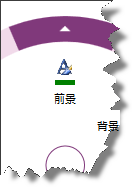
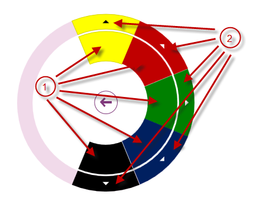
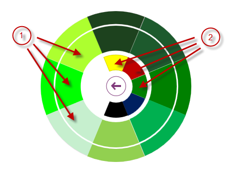

import ApiLink from 'docs-template/components/mdx/ApiLink.astro';

# 色項目の構成 (igRadialMenu)

## トピックの概要
### 目的

このトピックでは、<ApiLink type="igRadialMenu" label="igRadialMenu" />™ の色項目について説明します。

### 前提条件

このトピックを理解するために、以下のトピックを参照することをお勧めします。

- [igRadialMenu の機能](/igradialmenu-features): このトピックでは、このコントロールでサポートする機能を開発者の観点から説明します。

- [igRadialMenu の視覚要素](/igradialmenu-visual-elements): このトピックでは、コントロールの視覚要素についての概要を紹介します。

- [項目 / サブ項目の構成 - 概要](/igradialmenu-items-sub-items-configuration-overview): このトピックでは、メニュー項目およびその共通構成プロパティの概要を説明します。

- [ボタン項目の構成](/igradialmenu-configuring-button-items): このトピックでは、`igRadialMenu` のボタン項目について説明します。

### このトピックの内容

このトピックは、以下のセクションで構成されます。

-   [色項目の構成の概要](#configuration)
-   [色項目](#color-items)
-   [カラーウェル](#color-well)
-   [関連コンテンツ](#related-content)

## 色項目の構成の概要
### 色項目の構成の概要表

`igRadialMenu` は、色の値を確認し設定する色項目をサポートします。詳細は、表の後に記載されています。

| 色項目 | 説明 | タイプによる表示 |
| --- | --- | --- |
| [色項目](#color-items) | ヘッダー テキストを表示します。 アイコンを表示します。 関連付けられた色を表示します。 | `coloritem` |
| [カラーウェル](#color-well) | 項目領域および外部リングの両方に関連付けられた色を表示します。 | `colorwell` |

## 色項目
### 概要

ボタン項目で提供されるヘッダー テキストやアイコンに加え、色項目には関連付けられたカラー長方形があります。

次のスクリーンショットは、緑色に関連付けられた長方形を示します。

### プロパティ設定

以下の表は、主な構成とそれを管理するプロパティ設定のマップを示します。

目的:|使用するオプション / イベント:|操作:
---|---|---
項目に関連付けられた色の値の設定 / 取得|`color`|値を設定または読み取ります。
関連付けられた色の値の変更についての通知|`colorChanged`|イベント ハンドラーにアタッチします。

## カラーウェル
### 概要

`igRadialMenu` カラーウェルは、項目領域と外部リングの両方に関連付けられた色を表示します。カラーウェルのサブ項目にナビゲートする場合、親のカラーウェルおよびその兄弟が中央ボタンと項目領域の間に表示されます。

>**注:** カラーウェルをクリックすると、color オプションがクリックされたカラーウェルの色に設定されるように、直接の親のカラーウェルまたは色項目の設定が変更されます。

次のスクリーンショットは、さまざまな色で描画されたサブ項目を持つカラーウェルを示しています。

1.  さまざまな色のカラーウェル (現在のレベル)
2.  矢印は、これらのカラーウェルの下にサブ項目があることを示しています。

 
次のスクリーンショットは、親の緑色のカラーウェルのサブ項目へのナビゲートを示しています。親の緑色のカラーウェルとその兄弟は、中央ボタンと項目領域の間に表示されています。

1.  現在のレベルのカラーウェル
2.  親のカラーウェル

### プロパティ設定

以下の表は、主な構成とそれを管理するプロパティ設定のマップを示します。

目的:|使用するオプション / イベント:|操作:
---|---|---
項目に関連付けられた色の値の設定 / 取得|`color`|値を設定または読み取ります。
関連付けられた色の値の変更についての通知|`colorChanged`|イベント ハンドラーにアタッチします。

## 関連コンテンツ
### トピック

このトピックの追加情報については、以下のトピックも合わせてご参照ください。

- [数値項目の構成](/igradialmenu-configuring-numeric-items): このトピックでは、`igRadialMenu` の数値項目について説明します。

### サンプル

以下のサンプルでは、このトピックに関連する情報を提供しています。

- [色項目](&#123;environment:SamplesUrl&#125;/radial-menu/color-items): このサンプルでは、色ドリルダウン選択を許可するために色項目およびカラー ウェルを定義して使用する方法を紹介します。

 

 

