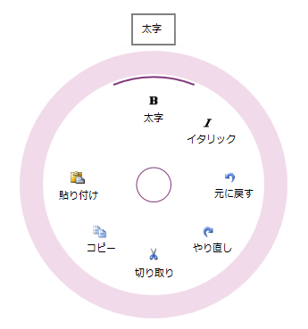

# igRadialMenu

import ApiLink from 'docs-template/components/mdx/ApiLink.astro';

# igRadialMenu

## このグループのトピックについて
### 概要

このグループのトピックでは、<ApiLink type="igRadialMenu" label="igRadialMenu" />™ コントロールとその使用方法について説明します。

`igRadialMenu` コントロールは、中央ボタンの周りに項目を表示するコンテキスト メニューです。項目を円形に配置することで項目をすばやく選択できます。各項目は中央に対して均等に配置されます。`igRadialMenu` は、数値、色値、または操作を実行する項目タイプをサポートします。サブ項目もサポートします。

### トピック

- [igRadialMenu の概要](/igradialmenu-overview): このグループのトピックでは、`igRadialMenu` コントロールの機能、視覚要素とその操作について説明します。

- [igRadialMenu の追加](/igradialmenu-adding): このトピックでは、`igRadialMenu` を短時間で起動、実行するために役立つ詳細な操作方法を紹介します。

- [igRadialMenu の構成](/igradialmenu-configuring): このセクションのトピックでは、`igRadialMenu` の構成について追加の情報を提供します。

- [jQuery と MVC API リファレンス リンク (igRadialMenu)](/igradialmenu-api-reference): このトピックでは、`igRadialMenu` コントロールと ASP.NET MVC ヘルパーに関する API ドキュメントへのリンクを提供します。

 

 

