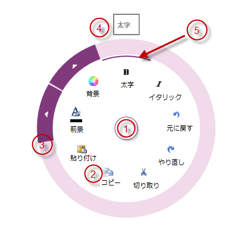

# igRadialMenu の視覚要素

import ApiLink from 'docs-template/components/mdx/ApiLink.astro';

# igRadialMenu の視覚要素

## トピックの概要
### 目的

このトピックでは、<ApiLink type="igRadialMenu" label="igRadialMenu" />™ コントロールの視覚要素についての概要を紹介します。

### 前提条件

このトピックを理解するためには、以下のトピックを理解しておく必要があります:

- [igRadialMenu の機能](/igradialmenu-features): このトピックでは、このコントロールでサポートする機能を開発者の観点から説明します。

### このトピックの内容

このトピックは、以下のセクションで構成されます。

-   [igRadialMenu コントロールの視覚要素と関連プロパティ](#visual-elements)
-   [関連コンテンツ](#related-content)

## igRadialMenu コントロールの視覚要素と関連プロパティ
### 視覚要素の概要

以下のスクリーンショットは、`igRadialMenu` コントロールの視覚要素を示しています。設定可能な要素を図の後に示します。

**構成可能な視覚要素:**

1.  中央ボタン - `igRadialMenu` のオープンおよびクローズ、または前のレベルのメニュー項目にアクセスできます。
2.  項目領域 - 現在のレベルのメニュー項目を表示します。
3.  外部リング - `igRadialMenu` のもっとも外側の部分で、サブ項目へのアクセスの矢印が含まれる場合があります。
4.  ツールチップ - 現在選択されているメニュー項目を示します。
5.  選択円弧 - 現在選択されているメニュー項目およびそのチェックボックスの状態が強調表示されます。

### 視覚要素と関連プロパティ

以下の表は、`igRadialMenu` コントロールの視覚要素とそれらを構成するプロパティにマップします。

| 視覚要素 | 構成できる主な項目 |
| --- | --- |
| 中央ボタン | `CenterButtonBackTemplate` `CenterButtonContent` `CenterButtonFill` `CenterButtonStroke` |
| 項目領域 | `Items` `ItemsSource` `MinWedgeCount` `RotationInDegrees` `WedgeIndex` `WedgeSpan` |
| 外部リング | `OuterRingFill` `OuterRingStroke` `OuterRingThickness` `OuterRingStrokeThickness` |
| ツールチップ | `IsToolTipEnabled` `ToolTip` `ToolTipTemplate` |
| 選択円弧 | `IsChecked` |

## 関連コンテンツ
### トピック

以下のトピックでは、このトピックに関連する追加情報を提供しています。

- [ユーザー相互作用と操作性](/igradialmenu-user-interaction): このトピックでは、ユーザーが実行できる操作を紹介します。

 

 

