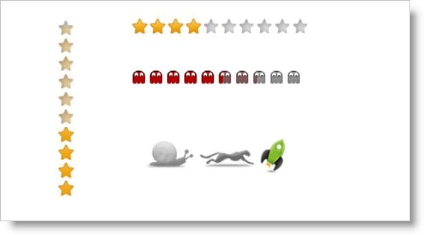

# igRating の概要


## jQuery Rating コントロールについて
jQuery Rating コントロールまたは igRating を使用すると、指定された値の範囲から項目を選択し評価できます。簡単なコントロールに見えますが、igRating は非常に柔軟です。外観と動作を変更する豊富な API を備えていて、クライアント操作に応じてコントロールを動的に変更できます。このトピックでは、すべての機能をリストし、簡単な igRating コントロールを作成する方法を説明します。

jQuery Rating コントロールは、クライアント側専用のコントロールを含む \{environment:ProductName\} パッケージの一部です。これによって、開発者は、jQuery Rating を使用して開発の際に複数の実装オプションを柔軟に選択できます。レーティング コントロールは、特定のサーバー バックエンドを使用せずに構成できる豊富な jQuery API を公開します。また、Microsoft® ASP.NET MVC フレームワークを使用する開発者は、レーティングのサーバー側ラッパーを活用して、好きな .NET™ 言語を使ってコントロールを構成できます。

jQuery Rating はそれ自体をスタイルできるので、コントロールのルック アンド フィールを変更できます。jQuery Rating をスタイリングすることによって、すべてのサポート対象のブラウザーに一貫性のある外観を提供できます。jQuery Rating は、既存のスタイル シートを活用でき、さらに jQuery UI の ThemeRoller を使用してスタイルすることもできます。



## 機能
-   jQuery Rating は縦または横に配置できます
-   選択の方向は、右から左またはその逆、上から下またはその逆が可能です
-   カスタムの項目カウントを選択可能です
-   選択中およびホバー中に精度レベルを変更できます
-   小数位を表示します
-   全体のテーマをサポートします
-   異なる項目ごとに個別のスタイルを設定できます
-   キーボードをサポートします
-   検証
-   JavaScript クライアント API

## jQuery Rating の Web ページへの追加
以下の手順は、jQuery クライアント コードまたは ASP.NET MVC サーバー コードを使用して Web ページに jQuery Rating の基本的な実装を作成する方法を示しています。

どの実装を選択するかについて詳細は、[「\{environment:ProductName\} の概要」](/igniteui-for-jquery-overview)を参照してください。次のスクリーンショットはデフォルトの Rating ビューを示しています。


[基本的な使用方法](\{environment:SamplesUrl\}/rating/basic-usage)

1.  最初に、プロジェクトまたは Web サイトに必要なローカライズ済みのリソースを含めます。組み込むリソースの詳細は、「[\{environment:ProductName\} で JavaScript リソースを使用](/deployment-guide-javascript-resources)」ヘルプ トピックをご覧ください。
2.  ご自分の HTML ページまたは ASP.NET MVC View で、必要な JavaScript ファイル、CSS ファイル、および ASP.NET MVC アセンブリを参照してください。

    ### クライアント コード

    **HTML の場合:**

```html
    <link type="text/css" href="/css/themes/infragistics/infragistics.theme.css" rel="stylesheet" />
    <link type="text/css" href="/css/structure/infragistics.css" rel="stylesheet" />
    <script type="text/javascript" src="/Scripts/jquery-1.4.4.min.js"></script>
    <script type="text/javascript" src="/Scripts/jquery-ui.min.js"></script>
    <script type="text/javascript" src="/Scripts/Samples/infragistics.core.js"></script><script type="text/javascript" src="/Scripts/Samples/infragistics.lob.js"></script>
```

    ### サーバー コード

    **ASPX の場合:**

```csharp
    <%@ Import Namespace="Infragistics.Web.Mvc" %>

    <link type="text/css" href="<%= Url.Content("~/css/themes/infragistics/infragistics.theme.css") %>" rel="stylesheet" />
    <link type="text/css" href="<%= Url.Content("~/css/structure/infragistics.css") %>" rel="stylesheet" />

    <script type="text/javascript" src="<%= Url.Content("~/Scripts/jquery-1.4.4.min.js") %>"></script>
    <script type="text/javascript" src="<%= Url.Content("~/Scripts/jquery-ui.min.js") %>"></script>
    <script type="text/javascript" src="<%= Url.Content("~/Scripts/Samples/infragistics.core.js") %>"></script><script type="text/javascript" src="<%= Url.Content("~/Scripts/Samples/infragistics.lob.js") %>"></script>
```

    **Razor の場合:**

```csharp
    @using Infragistics.Web.Mvc;

    <link type="text/css" href="@Url.Content("~/css/theme/infragistics/infragistics.theme.css")" rel="stylesheet" />
    <link type="text/css" href="@Url.Content("~/css/structure/infragistics.css")" rel="stylesheet" />

    <script type="text/javascript" src="@Url.Content("~/Scripts/jquery-1.4.4.min.js")"></script>
    <script type="text/javascript" src="@Url.Content("~/Scripts/jquery-ui.min.js")"></script>
    <script type="text/javascript" src="@Url.Content("~/Scripts/Samples/infragistics.core.js")"></script><script type="text/javascript" src="@Url.Content("~/Scripts/Samples/infragistics.lob.js")"></script>
```

3.  jQuery の実装では、HTML 内のターゲット要素として div を定義します。ASP.NET MVC の実装では、この手順はオプションです。

    ### クライアント コード

    **HTML の場合:**

```html
    <div id="igRating1"></div>
```

4.  上の手順が完了したら、ID、投票の高さ、値の表示などのオプションの設定を開始します。ASP.NET MVC View では、すべてのその他のオプションを設定した後で Render メソッドを呼び出す必要があります。

    ### クライアント コード

    **jQuery の場合:**

```js
    <script type="text/javascript">
        $("#igRating1").igRating({
            voteCount: 10,
            valueAsPercent: false,
            value: 4,
            precision: "exact"
        });
    </script>
```

    ### サーバー コード

    **ASPX の場合:**

```csharp
    <%= Html.Infragistics().Rating()
        .ID("igRating1")
        .VoteCount(10)
        .ValueAsPercent(false)
        .Value(4)
        .Precision(RatingPrecision.Exact)
        .Render() %>
```

    **Razor の場合:**

```csharp
    @(  Html.Infragistics().Rating()
        .ID("igRating1")
        .VoteCount(10)
        .ValueAsPercent(false)
        .Value(4)
        .Precision(RatingPrecision.Exact)
        .Render() 
    )
```

5.  Web ページを実行すると、基本的なレーティング コントロールが表示されます。

## 関連リンク
-   [基本的な使用方法](\{environment:SamplesUrl\}/rating/basic-usage)
-   [\{environment:ProductName\} の概要](/igniteui-for-jquery-overview)
-   [\{environment:ProductName\} で JavaScript リソースを使用](/deployment-guide-javascript-resources)

 

 


