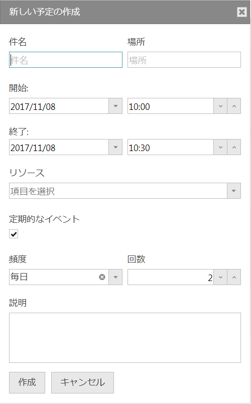

# 繰り返しの構成 (igScheduler)

## 目的

このセクションのトピックでは、`igScheduler` コントロールの定期的な予定の概念について説明します。

## 概要

アクティビティの定期的な予定は特定の定期的なパターンでアクティビティを繰り返す場合に使用します。

繰り返しを作成するには、以下の手順を実行します。
1.	スケジュールの月表示などからアクティビティの日を選択し、ポップアップから [予定の作成] ボタンを選択します。
2.	[新しい予定の作成] ダイアログで新しい予定のインスタンスで使用される必須フィールドを入力します。
3.	[定期的なイベント] チェックボックスをチェックし、頻度および回数を設定します。
4.	[作成] ボタンを押します。



## 繰り返しオブジェクトのプロパティ

以下の表は、繰り返しのプロパティとその使用目的を示します。

プロパティ|	目的
---|---
recurrence | 繰り返しのルート アクティビティの繰り返しパターンを取得または設定します。 例: `FREQ=DAILY;INTERVAL=1;COUNT=2;WKST=MO`
isRecurrenceRoot | アクティビティが繰り返しのルート アクティビティであるかどうかを示すブール値プロパティ。
recurrenceRoot | ルートの定期的なアクティビティを返します。アクティビティが定期的な予定と関連付けされていない場合は `null`。
recurrenceId | ルートの定期的なアクティビティの ID を返します。アクティビティが定期的な予定と関連付けされていない場合は `null`。

### コード例

以下のコードは、月ごとの定期的なアイテムのルールと 5 回繰り返される定期的な予定を作成する例です。


```javascript
var recurrence = new $.ig.scheduler.DateRecurrence();
	recurrence.frequency($.ig.scheduler.DateRecurrenceFrequency.weekly);
	recurrence.count(5);


var dentistAppointment = {
            "start": new Date(2017, 9, 18, 15, 30),
            "end": new Date(2017, 9, 19, 0, 0),
            "subject": "Dentist appointment",
            "location": "Sofia, Iztok, str. Tintyava 28",
            "description": "Bring all the papers",
            "resourceId": 8,
            "recurrence": recurrence
        };

$("#scheduler").igScheduler("createAppointment", dentistAppointment);
```
*注:*
定期的な予定フィールドのデータの形式は `'FREQ=MONTHLY;INTERVAL=1;COUNT=2;WKST=MO'` です。開始および終了フィールドに JavaScript 日付オブジェクトまたは `'2018/10/18'` などの文字列が必要です。

## 関連トピック

トピック | 目的
---|---
[予定の構成 (igScheduler)](/igscheduler-configure-appointments) | このトピックは、`igScheduler` の Appointments DataSource リストを設定して構成する方法を紹介します。
[ビューの構成 (igScheduler)](/igscheduler-configure-views) | このセクションのトピックは、予定表のデータを表示する `igScheduler` コントロールで使用されるビューについての情報を提供します。