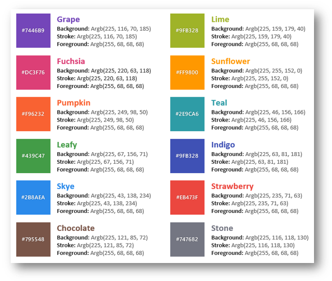

# リソースの構成 (igScheduler)

## 目的

このセクションのトピックでは、`igScheduler` コントロールのリソース概念について説明します。

## 概要

アクティビティのオーナーを識別するために、`igScheduler` コントロールが Resources をサポートします。リソースは、アクティビティを 1 つ以上所有する人などのエンティティです。各リソースに一意の ID があります。

## リソース オブジェクト プロパティ

以下の表は、Resource の主なプロパティおよび目的を説明します。

プロパティ|	目的
---|---
id|リソースの ID がすべてのリソースで一意です。
displayName |表示名は、アプリケーションのユーザー インターフェイスでリソースを識別します。
colorScheme |色スキーマは、このリソースと関連するアクティビティを強調表示するために使用されます。色スキーマはオプションで、設定されていない場合に自動的に生成されます。色スキーマを `$.ig.scheduler.ScheduleResourceColorScheme` 列挙体を使用して設定できます。

## リソースの色スキーマ
12 色の定義済みリソースの色スキーマが使用できます。`Stone` 色は、予定と関連するリソースがなく、手動的に設定できない場合のみに適用されます。 



### コード例

リソース コレクションは `resources` オプションに割り当てられます。

```javascript
var resources = [
	{ id: 1, displayName: "Trina Friesen" },
	{ id: 2, displayName: "Mack Koch" },
	{ id: 3, displayName: "Burney O'Kon" },
	{ id: 4, displayName: "Dawson Rohan" },
	{ id: 5, displayName: "Cain Schmidt" },
	{ id: 6, displayName: "Jesenia Rogahn" },
	{ id: 7, displayName: "Tod Heller" },
	{ id: 8, displayName: "Rhonda Cormier" },
	{ id: 9, displayName: "Hayden Lockman" },
	{ id: 10, displayName: "Tierra Witting" },
	{ id: 11, displayName: "Roderic Considine" }
],

$("#scheduler").igScheduler({
    height: "650px",
    width: "100%",
    resources: resources
});

```

*注:*
`colorScheme` が使用される場合、これは `id` と関連付けられている色をオーバーライドします。

```
{ id: 1, displayName: "Trina Friesen", colorScheme: $.ig.scheduler.ScheduleResourceColorScheme.fuchsia }
```

## 関連トピック

トピック|目的
---|---
[予定の構成 (igScheduler)](/igscheduler-configure-appointments)|このトピックは、`igScheduler` の Appointments DataSource リストを設定して構成する方法を紹介します。
[ビューの構成 (igScheduler)](/igscheduler-configure-views)|このセクションのトピックは、予定表のデータを表示する `igScheduler` コントロールで使用されるビューについての情報を提供します。
