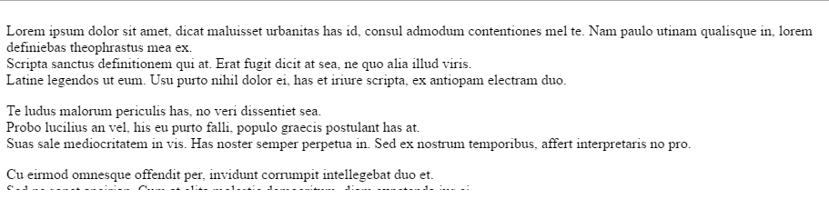
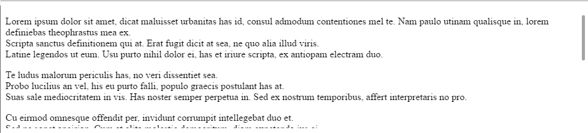
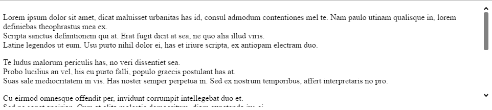
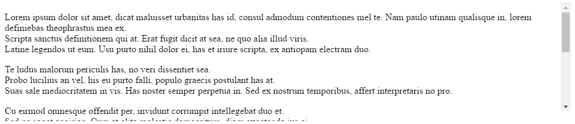
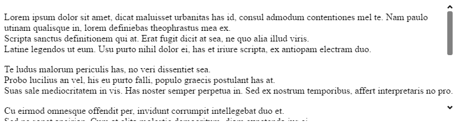
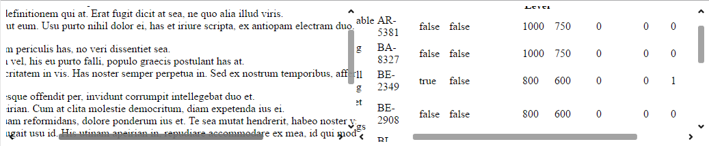

import ApiLink from 'docs-template/components/mdx/ApiLink.astro';

# igScroll の概要

### このトピックの内容

このトピックは、以下のセクションで構成されます。

- [igScroll について](#about-igScroll)
- [動作と可視化](#behavior-igScroll)
- [DOM 構造](#structure-igScroll)
- [igScroll を Web ページへ追加](#adding-igScroll)
- [複数のコンテナーを一度にスクロール](#multi-scrolling)
- [キーボード操作](#keyaboard-interactions)
- [関連コンテンツ](#related)


## igScroll について
igScroll は、デスクトップ、ハイブリッド、およびモバイル環境でカスタム スクロールバーを有効にするスタンドアロン jQuery UI ウィジェットです。
すべてのデバイスですべてのスクロール コンテナーの間に一貫性があるスクロール エクスペリエンスを作成できます。 
igScroll は、2 つの異なる表示タイプ (ネイティブとカスタム) を指定でき、ネイティブ スクロールバーまたはカスタムに作成するかによって選択できます。設定オプション。<ApiLink type="igscroll" member="scrollbarType" section="options" label="scrollbarType" /> オプション。

カスタム スクロールバーには 3 つの状態があります。

1. 非表示 - ユーザーがコンテナーやスクロールバーを操作していない場合、スクロールバーは非表示です。 

	

2. デフォルト (thin) スクロールバー - ユーザーがスクロール可能なコンテナーやタッチ インタラクション使用時など、スクロール可能なコンテンツ操作時にデフォルト (thin) スクロールバーが表示されます。水平または垂直の矢印はなく、マウスまたはタッチで操作できません。
   
	

3. デスクトップ (big) スクロールバー - ユーザーがスクロールバーをホバーしたときに表示されます。デフォルトのスクロールバーより大きく、矢印ボタンがありマウスを使用して操作できます。
   
	   
	
	ネイティブ スクロールバーが有効な場合、特定のブラウザーと環境でデフォルト スクロールバーが表示されます。
	
	
		
スクロールはこの場合も igScroll で手動で処理され、igScroll のオプションで設定できます。
   
	
## 動作と可視化

環境が違う場合、スクロールに異なる可視化およびメソッドを提供します。igScroll は、以下の環境をサポートします。

1. デスクトップ - マウスでスクロールバーを移動、あるいはスクロールバーの矢印をクリックまたはマウス スクロールによってスクロールできます。

2. モバイル - タッチ入力でのみスクロールできます (スマートフォン、タブレット)。

3. ハイブリッド - マウス入力とタッチ入力の両方をサポート (タッチモニター サポート付きデスクトップおよびラップトップ、Surface など)。

このセクションでは、igScroll の環境に固有な可視化と動作について説明します。

### モバイルでの igScroll

モバイル デバイスでは、スクロールバーの表示にデフォルト スクロールバーが使用されます。
モバイルではタッチ操作でスクロールします。スワイプによってコンテンツがスクロールされ、スクロールバーがそれに応じて同期されます。 
デフォルトで慣性が有効なため、最初はコンテンツを速くスクロールし、その後徐々にスピードが遅くなり、最後には停止します。この動作を <ApiLink type="igscroll" member="inertiaDuration" section="options" label="inertiaDuration" /> オプションで変更できます。

スクロールバーは以下の場合に表示されます。
- ページが初めて読み込まれるとき。 
	ユーザーにスクロール可能な領域を知らせるためにスクロールバーが短い時間表示されます。その後ユーザーが操作しない限り非表示のままになります。
- ユーザーがスクロール可能なコンテンツ領域をタッチまたはスワイプしたとき。
	スクロールバーが表示されてユーザーがコンテンツを操作する間表示されたままになります。ユーザーが操作をやめると非表示になります。
	
	

### igScroll デスクトップで使用

デスクトップには、幅の細いスクロールバーと大きなサイズのスクロールバーを表示できます。 
スクロール可能なコンテンツを操作 (マウス ホイールによるホバー、スクロール) する場合、幅の細いスクロールバーが表示されます。

実際のスクロールバー領域をホバーすると詳細な操作が可能な大きなスクロールバーが表示されます。 

大きなスクロールバーの操作可能な要素:

- 矢印ボタン 

	クリックして小さくスクロール、または長押しで継続的に同じ方向へスクロールできます。
- トラック パッド (つまみと矢印ボタンの間の領域)。

	トラック パッドをクリックして関連する方向へ大きくスクロールできます。
- スクロールのつまみ要素

	コンテンツをスクロールするためにつまみをドラッグアンドドロップできます。 

大きなスクロールバーは、操作中は表示されたままになります。操作を停止すると非表示になり、幅の細いスクロールバーのみ表示されます。コンテンツ上をホバーしている間は幅の細いスクロールバーは表示されたままになります。
スクロール可能な領域で操作またはホバーを停止した場合、すべてのスクロールバーが非表示になります。

### ハイブリッドで igScroll を使用

ハイブリッド デバイスではタッチとマウスの両方がサポートされるため、キーボード サポートも上記 2 セクションで説明されたすべての操作で有効です。

## DOM 構造

igScroll はデフォルトで DOM 構造を変更し、その他の CSS クラスに適用してスクロールバーのスタイルを設定します。

以下は DOM の初期構造です。

**HTML の場合:**

```html
<body>
	<div id='scrollContent' style='width:600px; height: 400px; overflow:hidden;'>
		<h1> Some Title </h1>
		&lt;p&gt; Paragraph </p>
		<table> ... </table>
		...
	</div>
</body>
```
 
 div 要素 ( $("#scrollContent").igScroll() ) で igScroll を初期化した後に DOM は以下のようになります。
 
```html
<body>
	<div id="scrollContent" style="width:600px; height: 400px; overflow:hidden;" class="igscroll-scrollable">
      <div id="scrollContent_container" class="igscroll-container" style="width: 600px; height: 400px;">
          <div id="scrollContent_content" class="igscroll-content">
              <h1> Some Title </h1>
              &lt;p&gt; Paragraph </p>
              <table>...</table>
              ...
          </div>
      </div>
    </div>
</body>
```

 igScroll による DOM 操作は <ApiLink type="igscroll" member="modifyDOM" section="options" label="modifyDOM" /> プロパティを false に設定して無効にできます。 
 その場合、igScroll を正しく動作させるために同様の DOM 階層を作成し、コンテンツ要素で初期化してください。

**HTML の場合:**

```html
<body>
<div>
   <div id='containerWrapper' style="width:600px; height:400px; overflow:hidden; position:relative;">
		<div id='scrContainer' style="width:600px; height:400px; overflow:hidden; position:absolute;">
			<div id='scrollContent' style="position:absolute;">
				  <h1> Some Title </h1>
				  &lt;p&gt; Paragraph </p>
				  <table>...</table>
				  ...
			</div>
		</div>
	</div>
</body>
```
 
 以下は igScroll を scrContainer 要素で初期化する例です。
 
 **JavaScript の場合:**

```js
$(function () {
    $("#scrContainer").igScroll({
    modifyDOM: false
    });
});
```

## igScroll を Web ページへ追加

次のステップは、いずれかの jQuery クライアント コードを使用して、ウェブページで igScroll ウィジェットを実装する基本的な方法を示します。

最初に、アプリケーションに必要なローカライズ済みのリソースを含めます。組み込むリソースの詳細は、「[&#123;environment:ProductName&#125; で JavaScript リソースを使用](/deployment-guide-javascript-resources)」ヘルプ トピックをご覧ください。

1.  HTML ページに**必要な JavaScript および CSS ファイルを参照**してください。

	**HTML の場合:**

```html
	<script src="scripts/jquery.js" type="text/javascript"></script>
	<script src="scripts/jquery-ui.js" type="text/javascript"></script>
	<script src="scripts/infragistics.core.js" type="text/javascript"></script>
	<script src="scripts/infragistics.lob.js" type="text/javascript"></script>
	<link href="css/themes/infragistics/infragistics.theme.css" rel="stylesheet" type="text/css" />
	<link href="css/structure/infragistics.css" rel="stylesheet" type="text/css" />
```

2. 次に簡単なスクロール可能なりょいきを作成します。この例では、スクロール可能な長いテキストを含む div DOM 要素を作成します。

	**HTML の場合:**

```html
	<div id="scrollableContent" style="height:200px; width: 600px; overflow: hidden;">
		<div>
			<p>
			Lorem ipsum dolor sit amet, dicat maluisset urbanitas has id, consul admodum contentiones mel te. Nam paulo utinam qualisque         in, lorem definiebas theophrastus mea ex. <br/>
			Scripta sanctus definitionem qui at. Erat fugit dicit at sea, ne quo alia illud viris. <br/>
			Latine legendos ut eum. Usu purto nihil dolor ei, has et iriure scripta, ex antiopam electram duo. <br/>
			</p>
			Te ludus malorum periculis has, no veri dissentiet sea. <br/>
			Probo lucilius an vel, his eu purto falli, populo graecis postulant has at. <br/>
			Suas sale mediocritatem in vis. Has noster semper perpetua in. Sed ex nostrum temporibus, affert interpretaris no pro. <br/>
			<p>
			Cu eirmod omnesque offendit per, invidunt corrumpit intellegebat duo et. <br/>
			Sed ne sonet apeirian. Cum at clita molestie democritum, diam expetenda ius ei. <br/>
			In est sale tamquam reformidans, dolore ponderum ius et. Te sea mutat hendrerit, habeo noster vis ad. <br/>
			Quem feugiat feugait usu id. His utinam apeirian in, repudiare accommodare ex mea, id qui modo mazim eleifend. <br/>
			</p>
			Cum elitr ludus ut. Eu mel aliquando conceptam adolescens. <br/>
			Malis vitae labore vis ea, eam an error accumsan. <br/>
			Ceteros sapientem assentior mel at, graeco ancillae moderatius ea eum. <br/>
			Ei nam delenit admodum deterruisset. <br/>
			<p>
			Cum ad animal oblique, sensibus reprehendunt his te, quo ignota dictas no. <br/>
			Eu congue lucilius mei, has ei invenire platonem. Cu nonumy tamquam moderatius cum. <br/>
			At lucilius deterruisset vis, omnis minimum complectitur ea his. <br/>
			</p>
		</div>
	</div>
```

3. 上記を設定後にオプションを使用またはデフォルト設定し、スクロール可能な領域で igScroll ウィジェットを初期化できます。
	
	**JavaScript の場合:**

```js
	$(function () {
		$("#scrollableContent").igScroll();
	});
```

4. Web ページを実行します。igScroll が初期化されてカスタム スクロールバーを表示します。

     

## 複数のコンテナーを一度にスクロール

igScroll が複数コンテナーのリンクを許可し、1 つスクロールされた場合に他も合わせてスクロールされます。
同期要素を指定する 2 つのオプションがあります。
- <ApiLink type="igscroll" member="syncedElemsV" section="options" label="syncedElemsV" /> - メイン コンテンツ コンテナーに垂直にリンクされる要素の設定を許可します。コンテンツが Y 軸でスクロールされる場合、それに応じてリンク要素が上下にスクロールします。
 
- <ApiLink type="igscroll" member="syncedElemsH" section="options" label="syncedElemsH" /> - メイン コンテンツ コンテナーに水平にリンクされる要素の設定を許可します。コンテンツが X 軸でスクロールされる場合、それに応じてリンク要素が左右にスクロールします。

以下の手順は、いずれかの jQuery クライアント コードを使用して、一度に複数のコンテナーをスクロール可能な igScroll ウィジェットを実装する基本的な方法を示します。

手順:

1. 上記の [igScroll を Web ページへ追加](#adding-igScroll)セクションを説明します。 

2. スクロール可能なコンテナーの追加

	最初のコンテナーを左に配置します。

	**HTML の場合:**

```html
	<div style="width: 50%; float:left; position: relative;">
		&lt;div id='scrContainerLeft' style="height:200px; overflow: hidden;"&gt;	
			<div style="width:900px; height: 400px;">
				<p>
				Lorem ipsum dolor sit amet, dicat maluisset urbanitas has id, consul admodum contentiones mel te. Nam paulo utinam qualisque in, lorem definiebas theophrastus mea ex. <br/>
				Scripta sanctus definitionem qui at. Erat fugit dicit at sea, ne quo alia illud viris. <br/>
				Latine legendos ut eum. Usu purto nihil dolor ei, has et iriure scripta, ex antiopam electram duo. <br/>
				</p>
				Te ludus malorum periculis has, no veri dissentiet sea. <br/>
				Probo lucilius an vel, his eu purto falli, populo graecis postulant has at. <br/>
				Suas sale mediocritatem in vis. Has noster semper perpetua in. Sed ex nostrum temporibus, affert interpretaris no pro. <br/>
				<p>
				Cu eirmod omnesque offendit per, invidunt corrumpit intellegebat duo et. <br/>
				Sed ne sonet apeirian. Cum at clita molestie democritum, diam expetenda ius ei. <br/>
				In est sale tamquam reformidans, dolore ponderum ius et. Te sea mutat hendrerit, habeo noster vis ad. <br/>
				Quem feugiat feugait usu id. His utinam apeirian in, repudiare accommodare ex mea, id qui modo mazim eleifend. <br/>
				</p>
				Cum elitr ludus ut. Eu mel aliquando conceptam adolescens. <br/>
				Malis vitae labore vis ea, eam an error accumsan. <br/>
				Ceteros sapientem assentior mel at, graeco ancillae moderatius ea eum. <br/>
				Ei nam delenit admodum deterruisset. <br/>
				<p>
				Cum ad animal oblique, sensibus reprehendunt his te, quo ignota dictas no. <br/>
				Eu congue lucilius mei, has ei invenire platonem. Cu nonumy tamquam moderatius cum. <br/>
				At lucilius deterruisset vis, omnis minimum complectitur ea his. <br/>
				</p>
			</div>
		</div>
	</div>
```
	2 つ目のコンテナーを右に配置します。

	**HTML の場合:**

```html
	<div style="width: 50%; float:right; position: relative;" >
		<div id="scrContainerRight" style="height:200px;overflow: hidden;">
		
|  |  |  |  |  |  |  |  |  |  |  |  |
| --- | --- | --- | --- | --- | --- | --- | --- | --- | --- | --- | --- |
| 1 | Adjustable Race | AR-5381 | false | false |  | 1000 | 750 | 0 | 0 | 0 | 3/11/2004 |
| 2 | Bearing Ball | BA-8327 | false | false |  | 1000 | 750 | 0 | 0 | 0 | 3/11/2004 |
| 3 | BB Ball Bearing | BE-2349 | true | false |  | 800 | 600 | 0 | 0 | 1 | 3/11/2004 |
| 4 | Headset Ball Bearings | BE-2908 | false | false |  | 800 | 600 | 0 | 0 | 0 | 3/11/2004 |
| 316 | Blade | BL-2036 | true | false |  | 800 | 600 | 0 | 0 | 1 | 3/11/2004 |
| 317 | LL Crankarm | CA-5965 | false | false | Black | 500 | 375 | 0 | 0 | 0 | 3/11/2004 |
| 318 | ML Crankarm | CA-6738 | false | false | Black | 500 | 375 | 0 | 0 | 0 | 3/11/2004 |
| 319 | HL Crankarm | CA-7457 | false | false | Black | 500 | 375 | 0 | 0 | 0 | 3/11/2004 |
| 320 | Chainring Bolts | CB-2903 | false | false | Silver | 1000 | 750 | 0 | 0 | 0 | 3/11/2004 |
| 321 | Chainring Nut | CN-6137 | false | false | Silver | 1000 | 750 | 0 | 0 | 0 | 3/11/2004 |
| 322 | Chainring | CR-7833 | false | false | Black | 1000 | 750 | 0 | 0 | 0 | 3/11/2004 |
| 323 | Crown Race | CR-9981 | false | false |  | 1000 | 750 | 0 | 0 | 0 | 3/11/2004 |

		</div>
	</div>
```

3. 次に 2 つの igScrolls (各スクロール可能なコンテナー) を初期化し、<ApiLink type="igscroll" member="syncedElemsV" section="options" label="syncedElemsV" /> および <ApiLink type="igscroll" member="syncedElemsH" section="options" label="syncedElemsH" /> プロパティを各スクロールに設定します。
	
	**JavaScript の場合:**

```js
	$(function(){
		$("#scrContainerRight").igScroll({
			syncedElemsV: [$("#scrContainerLeft")],
			syncedElemsH: [$("#scrContainerLeft")]
		});
		
		$("#scrContainerLeft").igScroll({
			syncedElemsV: [$("#scrContainerRight")],
			syncedElemsH: [$("#scrContainerRight")]
		});
	});
```

	両コンテナーで同期スクロールが有効になります。コンテナーの 1 つがスクロールされると他のコンテナーも同じ方向へ同じ量スクロールされます。

4.  ブラウザーで結果を確認します。

	 
     
> **注**: <ApiLink type="igscroll" member="modifyDOM" section="options" label="modifyDOM" /> を false に設定して実装した場合、`syncedElemsV`/`syncedElemsH` オプションのターゲット要素は、コンテナーラッパー要素ではなくコンテナー要素である必要があります。このトピックの [DOM 構造](#structure-igScroll) セクションの `modifyDOM`:false の DOM 構造の例を参照してください。
	
## キーボード操作

> **注**: キーボード インタラクションを動作させるには、メイン ターゲット要素に `tabIndex` 属性を設定しフォーカス可能にする必要があります。

スクロール要素にフォーカスがある場合: 

- 上/下矢印: 上下のスクロール

- 右/左矢印: 右左のスクロール 

- 上/下矢印: 上下の継続スクロール

- 右/左矢印: 左右の継続スクロール

- スペース: 上方向へ大きくスクロール

- SHIFT+スペース: 下方向へ大きくスクロール

- PAGE UP/ PAGE DOWN: 上下方向へ大きくスクロール 

## 関連コンテンツ

### トピック
-   [igScroll の構成](Configuring-igScroll.html)

### サンプル
-   [基本的な使用方法](&#123;environment:SamplesUrl&#125;/scroll/basic-usage)
-   [構成オプション](&#123;environment:SamplesUrl&#125;/scroll/configuration-options)
-   [複数のコンテナーを一度にスクロール](&#123;environment:SamplesUrl&#125;/scroll/scrolling-multiple-containers)
