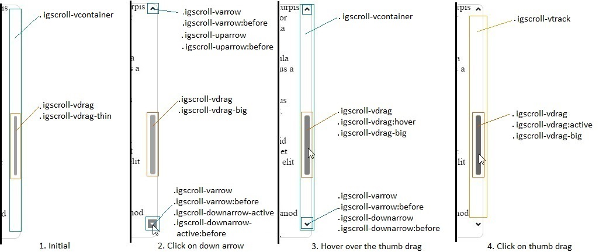
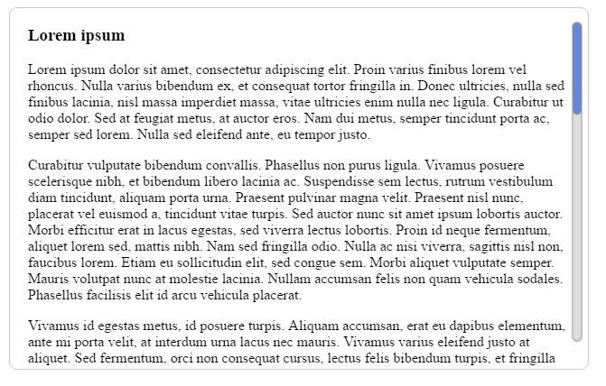
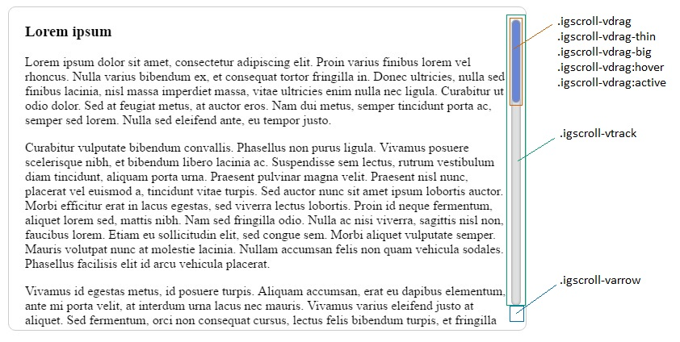

import ApiLink from 'docs-template/components/mdx/ApiLink.astro';

# igScroll を使用したスタイル設定

## 目的

このトピックでは、コード例を使用して igScroll スクロールバーのスタイルを設定し、さまざまなエンド ユーザー エクスペリエンスを提供する方法について説明します。

### このトピックの内容

このトピックは、以下のセクションで構成されます。

- [スタイル設定の概要](#summary)
    - [スクロールバー コンテナーのスタイル設定](#container)
    - [トラック エリアのスタイル設定](#track)
    - [スクロールつまみのスタイル設定](#thumbDrag)
    - [矢印のスタイル設定](#arrows)
- [スタイル設定の例](#example)
- [関連コンテンツ](#related)

## <a id="summary"></a>スタイル設定の概要
&#123;environment:ProductName&#125;™ Scroll (または `igScroll`) は、他の jQuery ウィジェットと同様に、特定の UI 要素に適用される複数の CSS クラスを提供します。各 CSS クラスは、igScroll が描画する DOM 要素のルックアンドフィールを定義します。

以下は、垂直方向のカスタム スクロールバーに関連する CSS クラスの一覧です。

* その他すべてをラップする 1 番外側のコンテナー: `igscroll-vcontainer`
* トラック エリア: `igscroll-vtrack`
* 一般の垂直方向の矢印: `igscroll-varrow`
* 上方向の矢印: `igscroll-uparrow`
* アクティブ状態の上方向の矢印: `igscroll-uparrow-active`
* 下方向の矢印: `igscroll-downarrow`
* アクティブ状態の下方向の矢印: `igscroll-downarrow-active`
* 一般のスクロールつまみのスタイル: `igscroll-vdrag`
* 細い状態のスクロールのつまみ: `igscroll-vdrag-thin`
* 拡大状態のスクロールのつまみ: `igscroll-vdrag-big`


使用されている要素ごとの CSS クラスは、次の図を参照してください。
デフォルトのカスタム スクロールバーに含まれる 4 つの異なるシナリオ、およびシナリオで適用される各クラスが表示されます。



### <a id="container"></a> スクロールバー コンテナーのスタイル設定

コンテナーのスタイルを変更し、位置の変更などには、`igscroll-vcontainer` クラスのみ変更します。上記の図では、コンテナーが垂直カスタムス クロールバーを構成するすべての要素をラップすることを示します。
たとえば、その要素の背景色を設定すると、すべての要素が新しい背景色を持ち、要素の上に配置されます。

### <a id="track"></a>トラック エリアのスタイル設定

トラック エリアをスタイル設定するには、`igscroll-vtrack` クラスのみを変更する必要があります。トラック エリアは、スクロールつまみのコンテナーで、スクロールつまみがそこへ移動します。エリアは上記のスクリーンショットにも表示されています。上方向と下方向の矢印の間にあります。

### <a id="thumbDrag"></a>スクロールつまみのスタイル設定

1. 初期状態

    スクリーンショットでは、デフォルトで細い状態のスクロールつまみのみが表示されることが分かります。 
    適用されているクラスは `igscroll-vdrag` および `igscroll-vdrag-thin` です。

    最初のクラスでは、背景色、境界線のスタイルなどのスクロールつまみの全体的な外観を設定します。2 つめのクラスでは、スクロールつまみが細い状態である場合の外観を設定します。一般的にこのクラスは、親要素に対するつまみの幅と左オフセットを設定するために使用されます。

2. スクロールバー エリアのホバー

    2 番目のシナリオでは、スクロールバーのエリアがホバーされているため、スクロールつまみは大きい状態にあります。
    適用されているクラスも多少変わっています。
    
    最初のクラス、 `igscroll-vdrag` は、前の状態と同じです。今では、`igscroll-vdrag-thin` は使用されず、代わりに `igscroll-vdrag-big` が適用されています。この場合は、サイズの差を補うために、幅がより大きく、左のオフセットがより小さくなります。

3. スクロールつまみのスクロール

    スクロールつまみをホバーすると、`igscroll-vdrag` の上に `：hover` 擬似セレクターが使用され、スクロールバーの色が変更されます。
    これは、スクロールつまみがホバーされていることを示します。それ以外は、 `:hover` 状態と同じです。 
    これは 3 番目のシナリオで示しています。

4. スクロールつまみのクリック

    スクロールつまみをクリックすると、 `:active` 疑似セレクターがアクティブになります。それ以外のクラスは、スクロールつまみが表示され、ホバーされていない状態と同じです。`igscroll-vdrag` のアクティブ セレクターでは、つまみがクリックされた時の外観を設定します。それ以外のクラスは、大きいスクロールつまみが表示され、ホバーされていない状態と同じです。

### <a id="arrows"></a>矢印のスタイル設定

1. 初期状態

    最初の例は、細いスクロールつまみが表示され、矢印が表示されない状態を示しています。 
    矢印を常に表示するためには、`igscroll-varrow` を変更して不透明度を 1 に設定する必要があります。

2. スクロールバー エリアのホバー

    矢印に動作を加えないが、マウスでスクロールバーのエリアをホバーしする場合、 `igscroll-varrow`、`igscroll-varrow:before`、`igscroll-downarrow` および `igscroll-downarrow:before` が使用されます。
    
    `igscroll-varrow` は背景色を定義し、2 つ目のクラスは背景色の上に配置される背景画像を定義します。この場合、背景色は設定されず透明になります。画像のみが表示されます。`:before` 擬似セレクターでは、背景画像の回転および背景画像に関連するその他の変換のみを設定します。

3. 矢印のホバー

    矢印をホバーする場合、適用されるクラスに変更はありません。`igscroll-varrow` クラスの上に `:hover` 疑似セレクターが適用されるのみです。 
    このように矢印をさらにスタイル設定できます。例えば、ホバー時に背景色を変更する必要がある場合、`:hover` 疑似セレクターに、使用される新しい背景色を含ませる必要があります。

4. 矢印のクリック

    下方向の矢印をホバーする場合、`igscroll-varrow`、`igscroll-varrow:active`、`igscroll-varrow:before`、`igscroll-downarrow-active` および `igscroll-downarrow-active:before` のクラスが適用されます。
    上記の 2 つめのスクリーンショットでこのシナリオを示しています。 

    最初のクラスは、上方向の矢印および下方向の矢印の両方に適用される、全体のデフォルト プロパティを定義するために使用されます。
    `:Active` 疑似セレクターは、クリックしたときの矢印の背景色を定義するために使用します。
    `:Before` 疑似セレクターは背景画像を指定し、そのプロパティを設定するために使用します。背景画像は背景色の上に配置されます。セレクターが背景画像を正しく配置するために使用される前にサイズや位置などを設定します。

    クラス `igscroll-downarrow-active` および `:before` 疑似セレクターは下矢印がアクティブなときのスタイルを指定するために使用します。クラスは下矢印に関して全般プロパティに使用されます。
    `:Before` 疑似セレクターは `igscroll-varrow:before` のように使用されて背景画像が変更されます。デフォルトのカスタム スクロールバーも矢印が下を向くように背景画像を回転するために使用されます。

> **注**: 同じようなクラスが水平スクロールバーに使用されます。名前については <ApiLink type="igscroll" label="igScroll API" /> を参照してください。

## <a id="example"></a>スタイル設定の例

この例では、以下のような画像の垂直スクロールバーのスタイルを設定する方法について説明します。コンテンツ領域をホバーしないときに非表示にせず、サイズも変更しません。最小限にするために矢印を非表示にすることもできます。 



1. igScroll の初期化

    igScroll は、数段落を持つ要素 `div` で初期化されます。`Div` で上に境界線を表示するよう設定しました。スタイル設定するスクロールバーを常に表示するために、igScroll  の alwaysVisible オプションを true に設定します。初期化は全体として次のようになります:

```javascript
    $("#loremText").igScroll({
        alwaysVisible: true,
        scrollbarType: "custom"
    });
```

    実際の html の body のサンプルは次のようになります:

```html
    <div id="loremText" tabindex="1">
        <h3> Lorem ipsum </h3>
        <p>..</p>
        ...
        <p>..</p>
    </div>
```

    div 要素が以下のスタイルを適用します。

```css
    #loremText {
        height:400px;
        width: 600px;
        overflow: hidden;
        border: 1px solid #ccc;
        border-radius: 9px;
        padding-right: 20px;
        padding-left: 20px;
    }
```

    パディングを追加し、スクロールバーが右側のテキスト領域を覆わないように注意します。幅と高さは、表示されるテキストの表示領域を指定します。

    ここまでで igScroll を初期化が完了しました。次は実際のスクロールバーのスタイル設定します。
    使用するクラスと適用する場所は次のスクリーンショットを確認してください。

    

2. 垂直スクロール バーの矢印のスタイル設定

    上矢印と下矢印を常に非表示にするには、`igscroll-varrow`クラスを使用し、visibility: hidden に設定します。これで両方の矢印が非表示になります。

3. トラック エリアのスタイル設定

    トラックエリアのスタイル設定は、`Igscroll-vtrack` クラスを使用します。使用する CSS:

```css
    .igscroll-vtrack {
        background-color: #dfdfdf;
        border-radius: 30px;
        width: 12px;
        box-shadow: inset 0px 0px 5px #888888;			
    }
```

    このクラスで背景色をグレーに設定し、`border-radius` で角丸にして、更にボックス シャドーを追加しました。
    幅は、スクロールつまみと同じ 12px に設定します。

4. スクロールつまみのスタイル設定

    垂直スクロールつまみのスタイル設定は、クラスをいくつか変更します。最初のクラスは main クラスの `igscroll-vdrag` です。主にスクロールバーのスタイル設定に使用します。このクラスでは初期の背景色を指定し、`border-radius` を設定してトラックエリアと統一します。更に `box-shadow` と `border` を追加してより際立たせます。

    クラスの CSSは 次のようになります:

```css
    .igscroll-vdrag {
        border-radius: 6px;
        border: 1px solid #ccc;
        box-shadow: inset 0px 0px 5px #888888;
        background-color: #587adb;
    }
```

    基本スタイルを設定しました。次に幅を設定してトラックエリアと統一させます。スクロールバーを正しく配置するために左オフセットを設定する必要があります。それには `igscroll-vdrag-thin` および `igscroll-vdrag-big` を両方設定する必要があります。これにより、スクロールバー領域をホバーしていないときもスクロールバーが幅を変更せずに同じサイズのままとなります。 

```css
    .igscroll-vdrag-thin {
        width: 10px;
        left: 0px;
    }
    
    .igscroll-vdrag-big {
        width: 10px;
        left: 0px;
    }
```

    スクロールバーの仕上げとして、main クラス `igscroll-vdrag` の `hover` および `active` セレクターを変更して、ホバーまたはクリック時にスクロールつまみの色を変更します。次のように背景色を同じ色のより暗い色に変更します:

```css
    .igscroll-vdrag:hover {
        background-color: #4c69ba;
    }
    
    .igscroll-vdrag:active {
        background-color: #3f58a0;
    }
```

## <a id="related"></a> 関連コンテンツ

### トピック
-   [igScroll の概要](/igscroll-overview)
-   [igScroll の構成](Configuring-igScroll.html)

### サンプル
-   [静的スクロールバーをスタイル設定](&#123;environment:SamplesUrl&#125;/scroll/styling-static)
-   [動的スクロールバーのスタイル設定](&#123;environment:SamplesUrl&#125;/scroll/styling-dynamic)