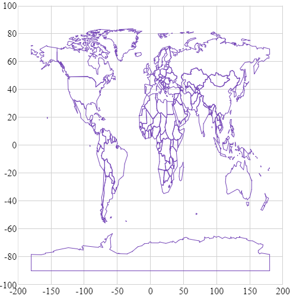
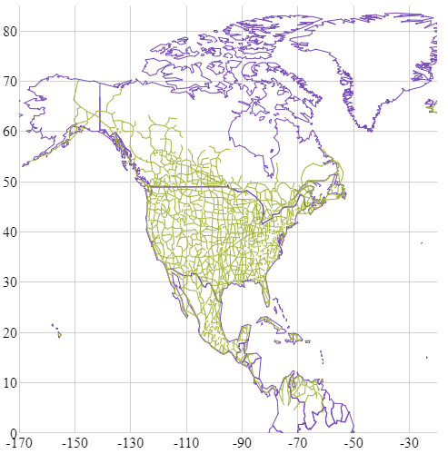

---
title: "シェープファイル データにバインド (igShapeChart)"
slug: shapechart-binding-shapefile-data
---

# シェープファイル データにバインド (igShapeChart)

このトピックは、コード例を示して、igShapeChart コントロールをシェープファイル データにバインドする方法を説明します。

### 前提条件

本トピックの理解を深めるために、以下のトピックを参照することをお勧めします。

- [igShapeChart の概要](shapechart-binding-to-shapefile-data.html): このトピックは、主要機能、最小要件およびユーザー機能性など、igShapeChart コントロールの概念的な情報を提供します。
- [igShapeChart を使用した作業の開始](shapechart-binding-to-shapefile-data.html): このトピックでは、コード例を使用して igShapeChart をアプリケーションに追加する方法を説明します。


### このトピックの内容
- [概要](#Overview)
- [igShapeChart をシェープ ファイルにバインド](#CodeExampleSingle)
- [igShapeChart を複数のシェープ ファイルにバインド](#CodeExampleMulti)
- [関連コンテンツ](#Related)
- [サンプル](#Samples)

<a id="Overview" />
### 概要

igShapeChart コントロールはシェープ ファイルをバインドして表示できます。シェープ データを可視化する場合に便利です。たとえば、以下のコード例のように地理データなどを可視化する場合、または座席チャートを表示する場合などに igShapeChart を使用できます。

igShapeChart の dataSource プロパティを ShapeDataSource レコードの配列にバインドするか、チャートの databaseSource および shapeDataSource プロパティをバインドすると実装できます。単一のシェープ ファイルまたは複数のシェープ ファイルにバインドするかどうかに基づいて方法を選択できます。以下コード例で詳細に説明します。 

これを実行するには、web でホストされる .shp および .dbf ファイルが必要であることに注意してください。

<a id="CodeExampleSingle" />
### igShapeChart をシェープ ファイルにバインド

単一のシェープ ファイルにバインドする場合、databaseSource および shapeDataSource プロパティを .dbf ファイルおよび .shp ファイルに参照する URL にそれぞれ設定します。

以下のコード例は、実装方法を示します。

**HTML の場合:**
```html
<script>
    $(function () {
        $("#shapeChart").igShapeChart({     
            width: "500px",
            height: "500px",				                                           
            databaseSource: 'https://www.igniteui.com/data-files/shapes/world_countries_reg.dbf',
            shapeDataSource: 'https://www.igniteui.com/data-files/shapes/world_countries_reg.shp'                        
        });
    });
</script>
```

上記の手順を実行すると、igShapeChart コントロールは以下のようになります。



<a id="CodeExampleMulti" />
### igShapeChart を複数のシェープ ファイルにバインド

igShapeChart は現在 URL の配列にバインドできませんが、一度に複数のシェープ ファイルを表示する機能はサポートされます。バインドする各 .shp および .dbf ペアのための ShapeDataSource 要素を作成し、igShapeChart の dataSource プロパティを ShapeDataSource のレコードの配列にバインドする必要があります。

ShapeDataSource のレコードが非同期で読み込まれます。そのため、すべての ShapeDataSource の準備が整ったときに ShapeDataSource のコールバック関数と各レコードのブール フラグ変数を使用して同期させます。igShapeChart の dataSource を初期化して設定します。

以下のコード例は、igShapeChart を ShapeDataSource のペアにバインドする方法を紹介します。北アメリカのアウトラインおよび主な道路を表示します。

**HTML の場合:**
```html
<script>           
    	
    var ds1Ready = false;
    var ds2Ready = false;
    var ds1 = null;
    var ds2 = null;

    function checkReady() {
        if (ds1Ready && ds2Ready) {
            var arr = [
                ds1.converter().records(),
                ds2.converter().records()
            ];

            $("#shapeChart").igShapeChart({     
                width: "500px",
                height: "500px",				                                        
                xAxisMinimumValue: -170,
                xAxisMaximumValue: -20,
                yAxisMaximumValue: 85,
                yAxisMinimumValue: 0,                    
                dataSource: arr
            });
        }
    }

    $(function () {
        ds1 = new $.ig.ShapeDataSource({
            shapefileSource: "https://www.igniteui.com/data-files/shapes/world_countries_reg.shp",
            databaseSource: "https://www.igniteui.com/data-files/shapes/world_countries_reg.dbf",
            callback: function() {
                ds1Ready = true;
                checkReady();   
            }
        }).dataBind();

        ds2 = new $.ig.ShapeDataSource({
            shapefileSource: "https://www.igniteui.com/data-files/shapes/north_america_primary_roads.shp",
            databaseSource: "https://www.igniteui.com/data-files/shapes/north_america_primary_roads.dbf",
            callback: function() {
                ds2Ready = true;
                checkReady();   
            }
        }).dataBind();

    });

</script>
```

上記の手順を実行すると、igShapeChart は以下のようになります。



<a id="Related" />
### 関連コンテンツ

- [損益分岐点データにバインド](shapechart-binding-break-even-data.html)
- [凡例の使用](/shapechart-using-legend-with-shapechart)

<a id="Samples" />
### サンプル

このトピックについて、以下のサンプルも参照してください。

-	[シェープ ファイルのバインド](&#123;environment:SamplesUrl&#125;/shape-charts/binding-shapefile-single): このサンプルは、`igShapeChart` コントロールを単一のシェープ ファイルにバインドする方法を紹介します。
-	[複数シェープ ファイルのバインド](&#123;environment:SamplesUrl&#125;/shape-charts/binding-shapefile-multi): このサンプルは、`igShapeChart` コントロールを複数のシェープ ファイルにバインドする方法を紹介します。
