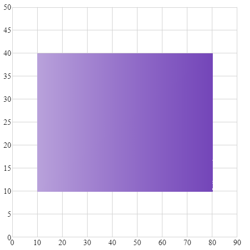
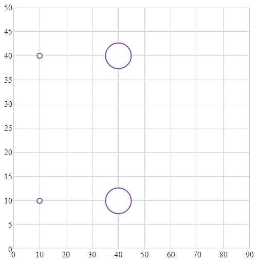
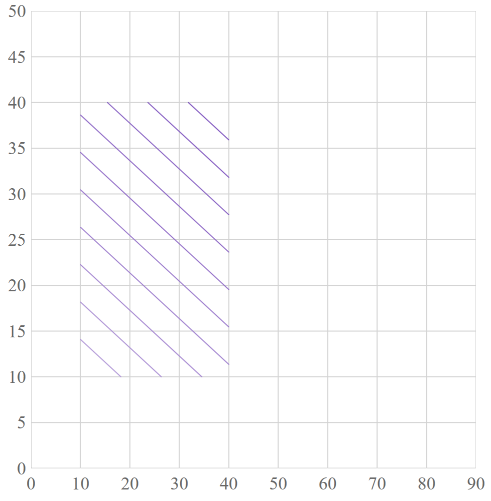
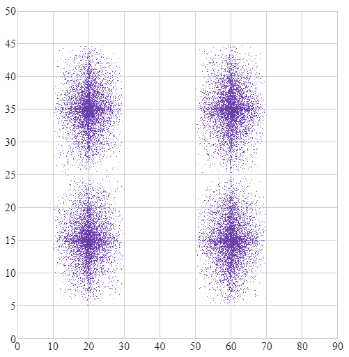
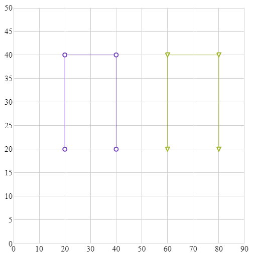
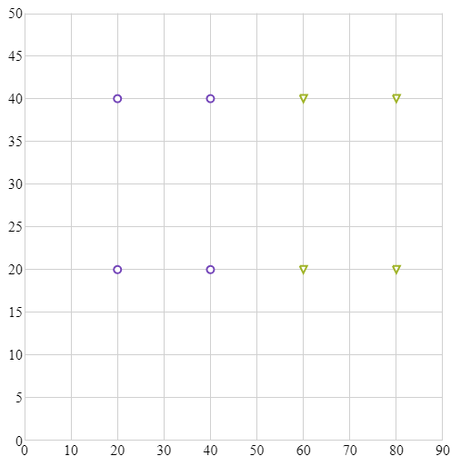
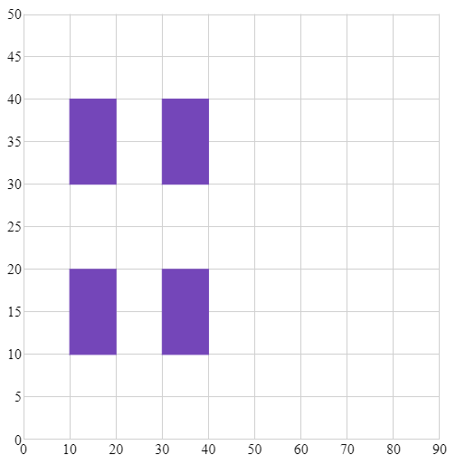
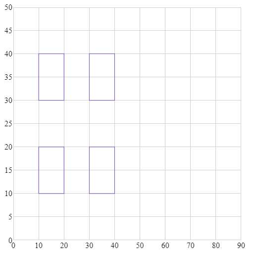
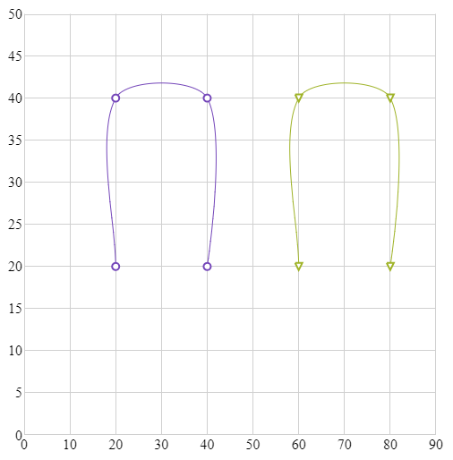

---
title: "チャート タイプ"
slug: shapechart-chart-types
---

# チャート タイプ 

## 概要

データの表示方法は、チャートの chartType プロパティで設定します。
以下は、シェープ チャートでサポートされるすべてのタイプです。

特別なケースにプロパティの `Auto` 設定があります。`Auto` を使用した場合、チャートがデータを分析し、最適なチャート タイプを割り当てます。

このプロパティのデフォルト値は、カテゴリ チャートにバインドされる基本の ItemsSource のサイズに基づいて決定されます。   

## サポートされるチャート タイプ

    
|  |  |  |
| --- | --- | --- |
| プロパティ値 | 説明 | 例 |
| `Area` | 各ポイントに割り当てられた数値の X/Y データによる三角測量に基づいて色付きのサーフェスを含むエリア チャートを指定します。 |  |
| `Bubble` | X/Y データに相対マーカーを使用するバブル チャートを指定します。 |  |
| `Contour` | 各ポイントに割り当てられた数値の X/Y データによる三角測量に基づいて色付きの線を含むエリア チャートを指定します。 |  |
| `HighDensity` | 隣接するポイントの密度に基づいて、X/Y データに色付きのビットマップ ピクセルの高密度チャートを指定します。 |  |
| `Line` | X/Y データに線で接続される小さいマーカーを使用した折れ線チャートを指定します。 |  |
| `Point` | X/Y データに小さいマーカーを使用するポイント チャートを指定します。 |  |
| `Polygon` | X/Y データにより定義される多角形を持つ多角形チャートを指定します。 |  |
| `Polyline` | X/Y データにより定義されるポリラインを持つポリライン チャートを指定します。 |  |
| `Spline` | X/Y データにスプラインで接続される小さいマーカーを使用したスプライン チャートを指定します。 |  |
| `Auto` | 内部データ アダプターの候補に基づいてチャート タイプの自動選択を指定します。 |  |

**関連トピック:** 

- [はじめに](/shapechart-getting-started-with-shapechart)
- [シリーズ要件](/shapechart-series-requirements)
- [シェープ ファイル データのバインド](/shapechart-binding-shapefile-data)

**サンプル:**

- [シェープ チャートのタイプ](&#123;environment:SamplesUrl&#125;/shape-charts/shape-chart-types):  このサンプルは様々な `igShapeChart` の `chartType` を表示します。
