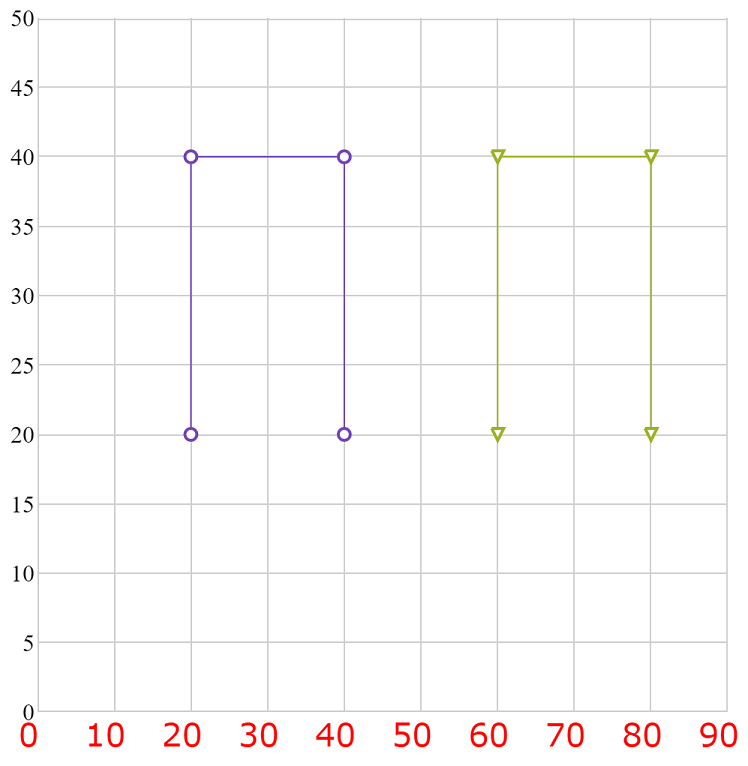

# 軸ラベルの構成 (igShapeChart)

`igShapeChart` は、チャートの構成、書式設定、ラベルのスタイル設定などを詳細に制御することが可能です。デフォルトでは、ラベルを明示的に設定する必要はありません。シェープ チャートは、データ内で最初の適切な文字列プロパティを使用し、ラベルに使用します。

### このトピックの内容

このトピックは、以下のセクションで構成されます。


- [ラベル設定](#ConfigureLabelSettings)
* [スタイル設定](#ConfigureStyling)
* [関連コンテンツ](#RelatedContent)
- [サンプル](#Samples)

<a id="ConfigureLabelSettings" />
### ラベル設定

igShapeChart コントロールでは、以下のプロパティで x 軸および y 軸のラベルの回転角度、マージン、水平/垂直の配置、不透明度、パディングと表示を変更できます。

プロパティ名|プロパティ タイプ|説明
---|---
`xAxisLabelAngle`, <br/> `yAxisLabelAngle`|number|x 軸と y 軸のラベルの回転角度を決定します。
`xAxisLabelHorizontalAlignment`, <br/> `yAxisLabelHorizontalAlignment`|enumeration|x 軸と y 軸のラベルの水平方向の配置を決定します。
`xAxisLabelVerticalAlignment`, <br/> `yAxisLabelVerticalAlignment`|enumeration|x 軸と y 軸のラベルの垂直方向の配置を決定します。
`xAxisLabelLeftMargin`, <br/> `yAxisLabelLeftMargin`|number|x 軸と y 軸のラベルに適用する左マージンを決定します。
`xAxisLabelTopMargin`, <br/> `yAxisLabelTopMargin`|number|x 軸と y 軸のラベルに適用する上マージンを決定します。
`xAxisLabelRightMargin`, <br/> `yAxisLabelRightMargin`|number|x 軸と y 軸のラベルに適用する右マージンを決定します。
`xAxisLabelBottomMargin`, <br/> `yAxisLabelBottomMargin`|number|x 軸と y 軸のラベルに適用する下マージンを決定します。

<a id="ConfigureStyling" />
### スタイル設定

シェープ チャートの x 軸および y 軸のラベルのルックアンドフィールのスタイルを設定できます。主にフォント タイプ、フォント サイズ、フォントの太さなど異なるフォント スタイルをラベルに適用できます。以下のプロパティを使用します。

プロパティ名|プロパティ タイプ|説明
---|---
`xAxisLabelTextStyle`, <br/> `yAxisLabelTextStyle`|string|x 軸と y 軸のラベルのテキスト スタイルを決定します。
`xAxisLabelTextColor`, <br/> `yAxisLabelTextColor`|string|x 軸と y 軸のラベルのテキストの色を決定します。
`xAxisFormatLabel`, <br/> `xAxisFormatLabel`|object|コンテキスト オブジェクトを取得し、X 軸ラベルまたは Y 軸ラベルの書式付きラベルを返す関数を取得または設定します。


### コード スニペット
以下のコード例は、スタイル プロパティを使用して x 軸のラベルをスタイル設定します。

**HTML の場合:**

```html
$(function () {
            $("#chart").igShapeChart({
                dataSource: data,
                xAxisLabelTextStyle: "16pt Verdana",
                xAxisLabelRightMargin: "14",
                xAxisLabelTextColor: "red"
            });
        });
```

以下のスクリーンショットは、x 軸ラベルをスタイル設定した igShapeChart コントロールを示します。



## 関連トピック:

- [ShapeChart を使用した作業の開始](/shapechart-getting-started-with-shapechart)

- [シェープファイル データにバインド](/shapechart-binding-shapefile-data)


<a id="Samples" />
### サンプル

以下のサンプルでは、このトピックに関連する情報を提供しています。

-	[軸ラベルの構成](&#123;environment:SamplesUrl&#125;/shape-charts/axis-labels): このサンプルでは、`igShapeChart` コントロールの軸ラベルを構成する方法を紹介します。
