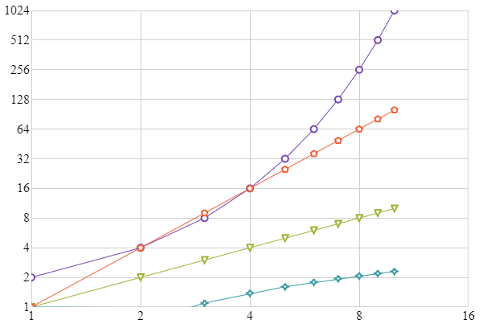

---
title: "軸スケールの構成"
slug: shapechart-configuring-axis-scales
---

# 軸スケールの構成

### 概要

このトピックは、igShapeChart コントロールの軸スケール モードを紹介します。

- [概要](#intro)
- [プロパティの設定](#propsettings)
- [コード例](#codeexample)
- [関連コンテンツ](#related)

<a id="intro" />
## 概要

igShapeChart コントロールでは、両方の軸が数値軸により組み込みスケーラーを使用してデータ値をスケーリングできます。チャートで各軸の `isLogarithmic` プロパティで設定します。特定の軸でこのプロパティを設定することにより、軸スケーラーをリニアまたは対数モードに設定します。　

<a id="propsettings" />
## プロパティの設定

以下の表は、igShapeChart コントロールの軸のスケールに影響するプロパティを示します。

プロパティ名|プロパティ型| 説明
---|---|---
`xAxisIsLogarithmic`, <br/> `yAxisIsLogarithmic`|bool|相対する軸がリニア スケールの代わりに対数目盛を使用するかどうかを取得または設定します。　
`xAxisLogarithmBase`, <br/> `yAxisLogarithmBase`|number|相対する軸にデータ項目の位置をマップするときに log 関数で使用する基本値を取得または設定します。このプロパティは、軸の `IsLogarithmic` プロパティが true に設定されている場合のみ有効です。

<a id="codeexample" />
## コード例

以下のコードは、igShapeChart コントロールでプロットされたスケール データ値に組み込み軸スケーラを使用する方法を示します。　

**HTML の場合:**

```html
$(function () {
    $("#shapeChart").igShapeChart({                
            dataSource: data,
            xAxisIsLogarithmic: true,
            xAxisLogarithmBase: 2,
            yAxisIsLogarithmic: true,
            yAxisLogarithmBase: 2                                                           
        });
    });
```

上記のコードを使用すると、データ項目の指数、リニア、二次、および対数セットの場合に igShapeChart が以下のような結果になります。



<a id="related" />
### 関連コンテンツ

- [ShapeChart で凡例の使用](/controls/igshapechart/shapechart-using-legend-with-shapechart)