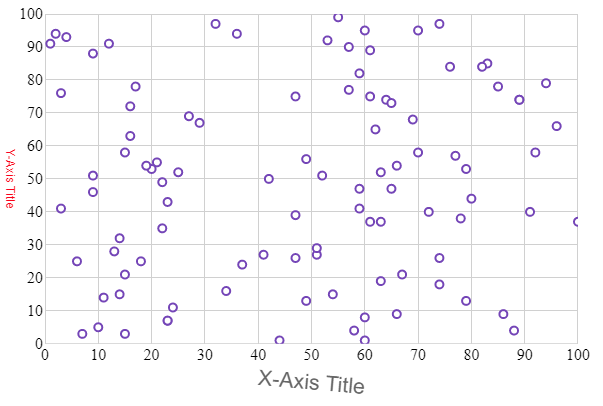

# 軸タイトルの構成

### 目的

このトピックでは、igShapeChart コントロールで x 軸および y 軸のタイトルを構成する方法を説明します。

### このトピックの内容

このトピックは、以下のセクションで構成されます。

- [プロパティの設定](#propertysettings)
- [コード スニペット](#codesnippet)
- [関連コンテンツ](#relatedtopics)

<a id="propertysettings" />
## プロパティの設定

`igShapeChart` コントロールは、x 軸および y 軸のタイトルのフォント スタイル、マージン、配置などを変更してルックアンドフィールをカスタマイズできます。以下のプロパティを使用します。

プロパティ名|プロパティ型|説明
---|---|---
`xAxisTitle`, <br/> `yAxisTitle`|string|X 軸の下または Y 軸の左に表示するテキストを取得または設定します。
`xAxisTitleAlignment`, <br/> `yAxisTitleAlignment`|enumeration|x 軸タイトルの水平方向の配置または y 軸タイトルの垂直方向の配置を取得または設定します。
`xAxisTitleAngle`, <br/> `yAxisTitleAngle`|number|相対する軸タイトルの回転の角度を取得または設定します。
`xAxisTitleBottomMargin`, <br/> `yAxisTitleBottomMargin`|number|相対する軸のタイトルの下マージンを取得または設定します。
`xAxisTitleLeftMargin`, <br/> `yAxisTitleLeftMargin`|number|相対する軸のタイトルの左マージンを取得または設定します。
`xAxisTitleMargin`, <br/> `yAxisTitleMargin`|number|相対する軸のタイトルの周りのマージンを取得または設定します。
`xAxisTitleRightMargin`, <br/> `yAxisTitleRightMargin`|number|相対する軸のタイトルの右マージンを取得または設定します。
`xAxisTitleTextColor`, <br/> `yAxisTitleTextColor`|string|相対する軸のタイトルの色を取得または設定します。
`xAxisTitleTextStyle`, <br/> `yAxisTitleTextStyle`|string|相対する軸のタイトルに CSS フォント プロパティを取得または設定します。
`xAxisTitleTopMargin`, <br/> `yAxisTitleTopMargin`|number|相対する軸のタイトルの上マージンを取得または設定します。

<a id="codesnippet" />
## コード スニペット
以下のコード例は、上記のプロパティを使用して igShapeChart 軸のタイトルをスタイル設定する方法を紹介します。

**HTML の場合:**

```html
$(function () {
    $("#shapeChart").igShapeChart({                
            dataSource: data,
            xAxisTitle: "X-Axis Title",
            xAxisTitleTextStyle: "16pt Arial",                    
            xAxisTitleAngle: 5,
            yAxisTitle: "Y-Axis Title",
            yAxisTitleTextColor: "Red",
            yAxisTitleAngle: 90,
        });
    });
```

以下の画像は、上記のコード スニペットを使用してタイトルをスタイル設定した igShapeChart コントロールを表示します。



<a id="relatedtopics" />
### 関連コンテンツ

- [ShapeChart を使用した作業の開始](/shapechart-getting-started-with-shapechart)

- [シェープファイル データにバインド](/shapechart-binding-shapefile-data)