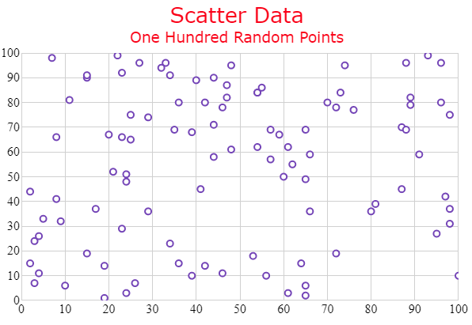

# チャートのタイトルとサブタイトル

### 目的

igShapeChart コントロールのタイトルおよびサブタイトルの機能では、チャートの上セクションに情報を追加することができます。

チャート コントロールにタイトルまたはサブタイトルを追加すると、タイトルとサブタイトルの情報に応じて、チャートの内容が自動的にサイズ変更されます。

### 前提条件

このトピックは、以下のセクションで構成されます。

- [プロパティの設定](#propertysettings)
- [コード スニペット](#codesnippet)
- [関連コンテンツ](#relatedcontent)

<a id="propertysettings" />
## プロパティの設定

igShapeChart コントロールのタイトルとサブタイトルのフォント スタイル、マージン、配置などを変更してルックアンドフィールをカスタマイズできます。以下のプロパティを使用します。

プロパティ名|プロパティ型| 説明
---|---|---
`title`|string|プロット エリアの上に表示するテキストを取得または設定します。
`titleAlignment`|enumeration|コントロールの左右端に相対するタイトルの配置を決定する水平配置を取得または設定します。
`titleBottomMargin`|number|チャート タイトルの下マージンを取得または設定します。
`titleLeftMargin`|number|チャート タイトルの左マージンを取得または設定します。
`titleRightMargin`|number|チャート タイトルの右マージンを取得または設定します。
`titleTextColor`|string|チャート タイトルの色を取得または設定します。
`titleTextStyle`|string|チャート タイトルの CSS フォント プロパティを取得または設定します。
`titleTopMargin`|number|チャート タイトルの上マージンを取得または設定します。

<a id="codesnippet" />
## コード スニペット

以下のコード例は、igShapeChart コントロールでタイトルとサブタイトルをカスタマイズします。

**HTML の場合:**

```html
$(function () {
    $("#shapeChart").igShapeChart({                
            dataSource: data,
            title: "Scatter Data",
            titleTextColor: "Red",
            titleTextStyle: "20pt Verdana",
            subtitle: "One Hundred Random Points",         
            subtitleTextColor: "Red",
            subtitleTextStyle: "14pt Verdana",
        });
    });
```

上記のコードは以下のような igShapeChart になります。



<a id="relatedcontent" />
### 関連コンテンツ

- [ShapeChart を使用した作業の開始](/shapechart-getting-started-with-shapechart)

- [シェープファイル データにバインド](/shapechart-binding-shapefile-data)