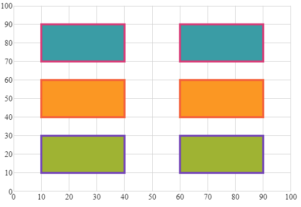
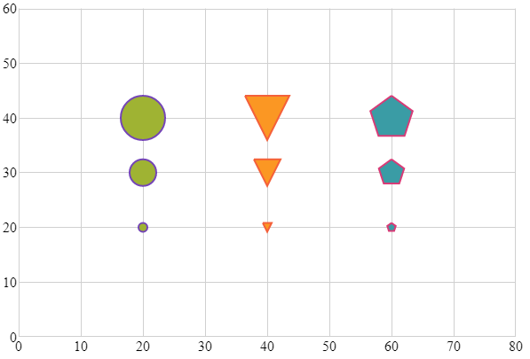

---
title: "シリーズ ブラシの構成 (igShapeChart)"
slug: shapechart-configuring-series-brushes
---

# シリーズ ブラシの構成 (igShapeChart)

このトピックではコード例を使用して、igShapeChart コントロールのブラシ プロパティを構成する方法を説明します。

### 前提条件

本トピックの理解を深めるために、以下のトピックを参照することをお勧めします。

- [igShapeChart の概要](shapechart-binding-to-shapefile-data.html): このトピックは、主要機能、最小要件およびユーザー機能性など、igShapeChart コントロールの概念的な情報を提供します。
- [igShapeChart を使用した作業の開始](shapechart-binding-to-shapefile-data.html): このトピックでは、コード例を使用して igShapeChart をアプリケーションに追加する方法を説明します。

### このトピックの内容

- [プロパティの設定](#PropSettings)
- [シリーズ ブラシのコード例](#CodeExampleSeries)
- [マーカー ブラシのコード例](#CodeExampleMarkers)
- [関連コンテンツ](#Related)

<a id="PropSettings" />
## プロパティの設定

igShapeChart コントロールには、チャートのシリーズ ブラシおよびシリーズのマーカーを設定するためのプロパティが複数あります。以下はプロパティの詳細です。

プロパティ名|説明
---|---
`Brushes`|主シリーズ塗りつぶしや線のパレットの決定に使用されるブラシ コレクションを取得または設定します。
`Outlines`|チャートのシリーズ アウトラインのパレットの決定に使用されるブラシ コレクションを取得または設定します。このコレクションは、Polyline を使用する際にプライマリ シリーズの色を決定するか、Polygon `ChartType` 列挙体のストローク色を決定する場合に便利です。
`MarkerBrushes`|チャートのシリーズに表示されるマーカー パレットの決定に使用されるブラシ コレクションを取得または設定します。Bubble や Point などのマーカー専用 `ChartType` 列挙体は、このブラシ コレクションがシリーズの原色を構成します。
`MarkerOutlines`|チャートの各シリーズに表示されるマーカーのアウター ストロークのパレットの決定に使用されるブラシ コレクションを取得または設定します。Bubble や Point などのマーカー専用 `ChartType` 列挙体は、このブラシ コレクションがシリーズのアウターストロークを構成します。

<a id="CodeExampleSeries" />
## シリーズ ブラシのコード例

以下は、多角形 `ChartType` で `Brushes` および `Outlines` プロパティを使用したコード例です。以下のコレクションはコード スニペットのデータソースとして使用されます。

**HTML の場合:**
```html
<script>
    
    var data = [[GetRectShapes(10, 10)], [GetRectShapes(10, 40)], [GetRectShapes(10, 70)]];

    $(function () {
        $("#shapeChart").igShapeChart({
            chartType: "polygon",
            dataSource: data,
            brushes: ["#9FB328", "#FF9800", "#2E9CA6"],
            outlines: ["#7446B9", "#F96232", "#DC3F76"],
            thickness: 4,
            width: "600px",
            height: "400px",
            xAxisMinimumValue: 0,
            xAxisMaximumValue: 100,
            yAxisMinimumValue: 0,
            yAxisMaximumValue: 100,
        });
    });

    function GetRectShapes(x, y) {             
        x = x || 0;
        y = y || 0;
        var shapes = [
        { "value": 5, "radius": 5, "x": x + 10, "y": y + 10, "points": [getRectPoints(x, y)] },
        { "value": 50, "radius": 50, "x": x + 40, "y": y + 10, "points": [getRectPoints(x + 50, y)] }];                

        return shapes;
    }

    function getRectPoints(x, y) {
        return [
        { "x": x, "y": y },
        { "x": x + 30, "y": y },
        { "x": x + 30, "y": y + 20 },
        { "x": x, "y": y + 20 },
        { "x": x, "y": y }];
    }

</script>
```

上記の手順を実行すると、igShapeChart コントロールは以下のようになります。




<a id="CodeExampleMarkers" />
## マーカー ブラシのコード例

以下は、バブル `ChartType` で `MarkerBrushes` および `MarkerOutlines` プロパティを使用したコード例です。以下のコレクションはコード スニペットのデータソースとして使用されます。

**HTML の場合:**
```html
<script>

    var data = [[GetBubbleData(20, 20, 10)], [GetBubbleData(40, 20, 10)], [GetBubbleData(60, 20, 10)]];

    $(function () {
        $("#shapeChart").igShapeChart({
            chartType: "bubble",
            dataSource: data,
            markerBrushes: ["#9FB328", "#FF9800", "#2E9CA6"],
            markerOutlines: ["#7446B9", "#F96232", "#DC3F76"],
            thickness: 4,
            width: "600px",
            height: "400px",
            xAxisMinimumValue: 0,
            xAxisMaximumValue: 80,
            yAxisMinimumValue: 0,
            yAxisMaximumValue: 60,
        });
    });

    function GetBubbleData(x, y, r)
    {
        var list = [
        { "X": x, "Y": y, "Radius": r },
        { "X": x, "Y": y+10, "Radius": r + 15 },
        { "X": x, "Y": y+20, "Radius": r + 30 }];

        return list;
    };

</script>
```

上記の手順を実行すると、igShapeChart コントロールは以下のようになります。



<a id="Related" />
### 関連コンテンツ

- [凡例の使用](/controls/igshapechart/shapechart-using-legend-with-shapechart)
