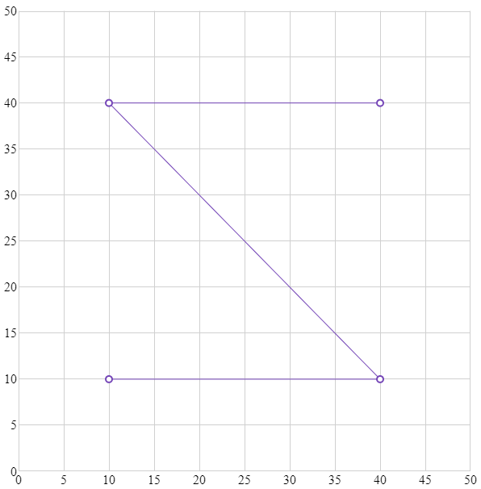

---
title: "igShapeChart を使用した作業の開始"
slug: shapechart-getting-started-with-shapechart
---

# igShapeChart を使用した作業の開始

### 目的

このトピックでは、コード例を使用して igShapeChart コントロールをアプリケーションに追加する方法を説明します。

### このトピックの内容

このトピックは、以下のセクションで構成されます。

- [概要](#Introduction)
- [プレビュー](#Preview)
- [概要](#Overview)
- [手順](#Steps)
- [関連コンテンツ](#Related)

<a id="Introduction" />
### 概要

以下の手順は、igShapeChart コントロールをアプリケーションに追加する方法を示します。

<a id="Preview" />
### プレビュー

以下は igShapeChart の画像です。



<a id="Overview" />
### 概要

1. igShapeChart コントロールを保存するターゲット要素を作成します。
2. データ ソースを追加します。
3. igShapeChart のインスタンスを作成し、データ ソースにバインドします。
4. 結果を検証します。

<a id="Steps" />
### 手順

以下では igShapeChart をページに追加するために必要な手順を示します。

**igShapeChart を保存するターゲット要素の作成。**

HTML 本文内に igShapeChart コントロールをインスタンス化する &lt;div&gt; 要素を作成します。

**HTML の場合:**
```html
<body>
    <div id="shapeChart"></div>
</body>
```

**データ ソースを追加します。**

igShapeChart を作成するには、最初にバインドするデータが必要になります。以下のコード スニペットは、シンプルなデータソースを作成する方法を示します。

**HTML の場合:**
```html
<script>
    var data = [
    { "X": 10, "Y": 10 },
    { "X": 40, "Y": 10 },
    { "X": 10, "Y": 40 },
    { "X": 40, "Y": 40 }];
</script>
```

**igShapeChart のインスタンスを作成し、データ ソースにバインドします。**

手順 1 で定義したターゲット &lt;div&gt; 要素のセレクターを使用して、igShapeChart コントロールのインスタンスを作成します。data プロパティを手順 2 で作成したデータ ソースに設定します。以下のコードはコントロールをインスタンス化してデータへバインドし、幅、高さ、およびデータ ソースに基づいて x 軸および y 軸の最小値と最大値を設定します。

**HTML の場合:**
```html
<script>
    $(function () {
        $("#shapeChart").igShapeChart({                
            dataSource: data,
            width: "600px",
            height: "600px",
            xAxisMinimumValue: 0,
            yAxisMinimumValue: 0,
            xAxisMaximumValue: 50,
            yAxisMaximumValue: 50,
        });
    });
</script>
```

**結果を確認します。**

結果を確認するために、プロジェクトをビルドして実行します。以上の手順を正しく実装した場合、igShapeChart は上記のプレビュー セクションで示したように表示されます。

### 関連コンテンツ

- [シェープ ファイル データのバインド](/controls/igshapechart/shapechart-binding-shapefile-data)
- [損益分岐点データのバインド](shapechart-binding-break-even-data.html)
