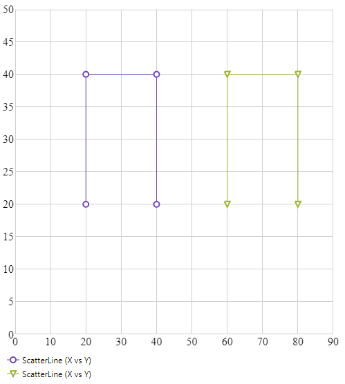

# 凡例の使用 (igShapeChart)

このトピックは、コード例を示して、凡例を igShapeChart コントロールにドックする方法を説明します。

### 前提条件

本トピックの理解を深めるために、以下のトピックを参照することをお勧めします。

- [igShapeChart の概要](shapechart-binding-to-shapefile-data.html): このトピックは、主要機能、最小要件およびユーザー機能性など、igShapeChart コントロールの概念的な情報を提供します。
- [igShapeChart を使用した作業の開始](shapechart-binding-to-shapefile-data.html): このトピックでは、コード例を使用して igShapeChart をアプリケーションに追加する方法を説明します。

### このトピックの内容
- [概要](#Introduction)
- [プレビュー](#Preview)
- [コード例](#CodeExample)
- [関連コンテンツ](#Related)
- [サンプル](#Samples)

<a id="Introduction" />
### 概要

igShapeChart コントロールで凡例の表示がサポートされますが現在デフォルトではチャート シリーズの凡例を表示しません。シェープ チャートで共有の凡例を表示するには、チャートの legend オプションを設定します。

作成する凡例要素はチャートでプロットされるシリーズの Title プロパティから項目の名前を取得します。シリーズ名は "Series Type (XMemberPath vs YMemberPath)" の書式で表示されます。凡例に表示される名前は、SeriesAdded イベントで書式設定できます。このイベントのイベント引数から追加されたシリーズを取得でき、そのシリーズの Title を変更できます。

<a id="Preview" />
### プレビュー

以下は、コード例を使用した igShapeChart のレビューです。



<a id="CodeExample" />
### コード例

以下のコード例は、igShapeChart コントロールでプロットされる複数のシリーズの凡例を使用する方法を紹介します。

**HTML の場合:**
```html
<div id="shapeChart"></div>
<div id="legend"></div>

<script>
    var list1 = [
    { "X": 20, "Y": 20 },
    { "X": 20, "Y": 40 },
    { "X": 40, "Y": 40 },
    { "X": 40, "Y": 20 }];

    var list2 = [
    { "X": 60, "Y": 20 },
    { "X": 60, "Y": 40 },
    { "X": 80, "Y": 40 },
    { "X": 80, "Y": 20 }];

    var data = [[list1], [list2]];
            
    $(function () {
        $("#shapeChart").igShapeChart({                
            dataSource: data,
            width: "500px",
            height: "500px",
            xAxisMinimumValue: 0,
            yAxisMinimumValue: 0,
            xAxisMaximumValue: 90,
            yAxisMaximumValue: 50,
            legend: { element: "legend", type: "legend" },
        });
    });
</script>
```

<a id="Related" />
### 関連コンテンツ

- [シェープ ファイル データのバインド](/shapechart-binding-shapefile-data)
- [損益分岐点データのバインド](shapechart-binding-break-even-data.html)

<a id="Samples" />
### サンプル

以下のサンプルでは、このトピックに関連する情報を提供しています。

-	[凡例の使用](&#123;environment:SamplesUrl&#125;/shape-charts/using-legend): このサンプルでは、`igShapeChart` コントロールで凡例を使用する方法を紹介します。
