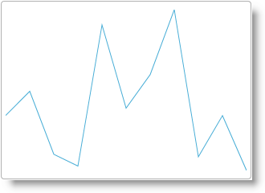

import ApiLink from 'docs-template/components/mdx/ApiLink.astro';

# igSparkline を ASP.NET MVC ビューに追加

## トピックの概要
### 目的

このトピックでは、ASP.NET MVC ビューでの <ApiLink type="igSparkline.html" label="igSparkline" />™ インスタンス作成とオブジェクトの .NET コレクションへのバインドを見てみます。

### 前提条件

以下の表は、このトピックを理解するための前提条件として必要な概念とトピックの一覧です。

-   jQuery
-   jQuery UI
-   ASP.NET MVC
-   ASP.NET MVC HTML ヘルパー

トピック

- [コントロールを MVC プロジェクトに追加](../../../01_General-and-Getting-Started/00_Adding IgniteUI Controls to an MVC Project.mdx): このトピックでは、ASP.NET MVC アプリケーションで &#123;environment:ProductName&#125;® コンポーネントを使用した作業の開始方法を説明します。

 
#### このトピックの内容

このトピックは、以下のセクションで構成されます。

-   [**igSparkline を ASP.NET MVC ビューに追加**](#adding-sparkline-mvc)
    -   [概要](#introduction)
    -   [プレビュー](#preview)
    -   [前提条件](#prerequisites)
    -   [概要](#overview)
    -   [手順](#steps)


## <a id="adding-sparkline-mvc"></a>igSparkline を ASP.NET MVC View に追加 - 概要

`igSparkline` は、ASP.NET MVC ヘルパーを使用して ASP.NET MVC View に追加できます。`igSparkline` はデータ バインドされたコントロールであるため、データはサーバー上で生成されコントローラー `ActionMethod `内でビューに渡されます。

Invoice モデル オブジェクトには、注文数を含む `ExtendedPrice` と、購入注文日を含む `OrderDate` フィールドが含まれます。`igSparkline` の `ValueMemberPath` は `ExtendedPrice` に設定され、`LabelMemberPath` は `OrderDate` に設定されます。

### 要件

「[コントロールの MVC プロジェクトへの追加](../../../01_General-and-Getting-Started/00_Adding IgniteUI Controls to an MVC Project.mdx)」トピックで説明されるとおり、必要な JavaScript ファイル、CSS ファイルおよび ASP.NET MVC アセンブリで構成される ASP.NET MVC アプリケーション


## igSparkline を ASP.NET MVC ビューに追加
### <a id="introduction"></a>概要

このトピックでは、ASP.NET MVC ビューでの `igSparkline` インスタンス作成とオブジェクトの .NET コレクションへのバインドを検討します。

### <a id="preview"></a>プレビュー

以下のスクリーンショットは結果のプレビューです。



### <a id="prerequisites"></a>前提条件

この手順を実行するには、以下のリソースが必要です。

-   JavaScript および CSS リソースを含む ASP.NET MVC アプリケーションと ASP.NET MVC アセンブリ
-   ASP.NET MVC View のインデックスを返す Index Action メソッドのある ASP.NET MVC HomeController

### <a id="overview"></a>概要

以下はプロセスの概念的概要です。

1. `Infragistics.Web.Mvc.dll` への参照を追加します

2. ビューの依存関係を構成します。

3. データ収集を定義します。

4. Sparkline をインスタンス化します。

完全な ASPX View コードのリスト

### <a id="steps"></a>手順

以下のステップは、ASP.NET MVC ヘルパーを使用して ASP.NET MVC View に `igSparkline` を追加するものです。


1. `Infragistics.Web.Mvc.dll` への参照を追加する

	まだ実行していない場合は、ASP.NET アプリケーションで `Infragistics.Web.Mvc.dll` に参照を追加します。このアセンブリを追加する作業の詳細は、「[コントロールを MVC プロジェクトに追加](../../../01_General-and-Getting-Started/00_Adding IgniteUI Controls to an MVC Project.mdx)」トピックを参照してください。

2. ビューの依存関係を構成する

	1. Infragistics.Web.Mvc 名前空間をインポートします
	
		ASP.NET MVC ヘルパーを使用するには、Infragistics.Web.Mvc 名前空間をビューにインポートします。
		
		**ASPX の場合:**
		
```csharp
		<%@ Import Namespace="Infragistics.Web.Mvc" %>
```

	2. すべての必要な JavaScript ファイルと CSS ファイルのすべてに参照を追加します。

		ASP.NET MVC View の HEAD タグに以下のファイル参照を追加します。
		
		**ASPX の場合:**
		
```csharp
		<link href="<%= Url.Content("~/infragistics/css/themes/infragistics/infragistics.theme.css") %>" rel="stylesheet" />
		<link href="<%= Url.Content("~/infragistics/css/structure/infragistics.css") %>" rel="stylesheet" />
		<script src="<%= Url.Content("~/js/jquery.js") %>"></script>
		<script src="<%= Url.Content("~/js/jquery-ui.js") %>"></script>
		<script src="<%= Url.Content("~/js/modernizr.js") %>"></script>
		<script src="<%= Url.Content("~/infragistics/js/infragistics.core.js") %>"></script>
		<script src="<%= Url.Content("~/infragistics/js/infragistics.dv.js") %>"></script>
```

3. データ収集を定義する

	1. モデル オブジェクト請求書を定義します。

		アプリケーションに基本的な請求書オブジェクトを定義してデータ収集に使用します。
		
		**C# の場合:**
		
```csharp
		using System;
		public class Invoice
		{
		    public Nullable<System.DateTime> OrderDate { get; set; }
		    public Nullable<decimal> ExtendedPrice { get; set; }
		}
```

		>**注:** この定義は、クラスの名前空間を指定しません。クラスに名前空間を使用する場合、 Import ステートメントを ASP.NET ASPX ビューに追加して残りの例をコンパイルします。

	2. コントローラーのアクション メソッドで  Invoice  オブジェクトのジェネリック リストを作成し、ビューで返します。

 		**C# の場合:**
		
```csharp
		using System;
		using System.Collections.Generic;
		using System.Web.Mvc;
		public class HomeController : Controller
		{
		    //
		    // GET: /Home/
		    public ActionResult Index()
		    {
		        List<Invoice> invoices = new List<Invoice>
		            {
		                new Invoice{OrderDate = new DateTime(2012,8,23), ExtendedPrice = 356.89m },
		                new Invoice{OrderDate = new DateTime(2012,8,23), ExtendedPrice = 500.98m },
		                new Invoice{OrderDate = new DateTime(2012,8,23), ExtendedPrice = 125.98m },
		                new Invoice{OrderDate = new DateTime(2012,8,24), ExtendedPrice = 56.23m },
		                new Invoice{OrderDate = new DateTime(2012,8,24), ExtendedPrice = 895.60m },
		                new Invoice{OrderDate = new DateTime(2012,8,24), ExtendedPrice = 400.56m },
		                new Invoice{OrderDate = new DateTime(2012,8,25), ExtendedPrice = 600.25m },
		                new Invoice{OrderDate = new DateTime(2012,8,25), ExtendedPrice = 986.30m },
		                new Invoice{OrderDate = new DateTime(2012,8,26), ExtendedPrice = 111.26m },
		                new Invoice{OrderDate = new DateTime(2012,8,26), ExtendedPrice = 356.25m },
		                new Invoice{OrderDate = new DateTime(2012,8,26), ExtendedPrice = 29.65m },
		            };
		        return View(invoices);
		    }
		}
```

4. `igSparkline` をインスタンス化する

ASP.NET MVC ヘルパーを使用して `igSparkline` をインスタンス化し基本的なオプションを設定します。

ASP.NET ビューの本文では、ASP.NET MVC ヘルパーを使用して `igSparkline` をインスタンス化します。

Sparkline メソッド Sparkline&lt;Invoice&gt; にタイプを提供することにより、基本モデル オブジェクトから離れて lambda 式を使用して `LabelMemberPath` および `ValueMemberPath` ベースを定義できるメリットを得られます。

`igSparkline` をインスタンス化する場合、以下を含む基本的な描画に設定すべき複数のヘルパー メソッドがあります。

ヘルパー メソッド|目的
---|---
DataSource()|`igSparkline` 用のデータ収集を承諾します。この場合、ビュー用にモデルとして設定する請求書のリストです。
Height()|`igSparkline` の文字列高さを設定します。
Width()|`igSparkline` の文字列幅を設定します。
ValueMemberPath()|`igSparkline` が各項目に対して垂直軸上に描画する値を示す Invoice メンバーにこのヘルパー メソッドを設定します。
LabelMemberPath()|水平軸値を表す Invoice メンバーにこのヘルパー メソッドを設定します。

最終的に、すべての &#123;environment:ProductNameMVC&#125; コントロールと同様に、Render メソッドを呼び出して HTML と JavaScript をビューに描画します。

**ASPX の場合:**

```csharp
<body>
    <%= Html.Infragistics().Sparkline<Invoice>(Model)
        .DataSource(Model)
        .Height("200px")
        .Width("300px")
        .LabelMemberPath(m => m.OrderDate)
        .ValueMemberPath(m => m.ExtendedPrice)
        .Render()%>
</body>
```

完全な ASPX View コードのリスト

**ASPX の場合:**

```csharp
<%@ Page Language="C#" Inherits="System.Web.Mvc.ViewPage<IEnumerable<Invoice>>" %>
<%@ Import Namespace="Infragistics.Web.Mvc" %>
<!DOCTYPE html>
<html>
<head>
    <title></title>
    <link href="<%= Url.Content("~/infragistics/css/themes/infragistics/infragistics.theme.css") %>" rel="stylesheet" />
    <link href="<%= Url.Content("~/infragistics/css/structure/infragistics.css") %>" rel="stylesheet" />
    <script src="<%= Url.Content("~/js/jquery.js") %>"></script>
    <script src="<%= Url.Content("~/js/jquery-ui.js") %>"></script>
    <script src="<%= Url.Content("~/js/modernizr.js") %>"></script>
    <script src="<%= Url.Content("~/infragistics/js/infragistics.core.js") %>"></script>
    <script src="<%= Url.Content("~/infragistics/js/infragistics.dv.js") %>"></script>
</head>
<body>
    <%= Html.Infragistics().Sparkline<Invoice>(Model)
        .DataSource(Model)
        .Height("200px")
        .Width("300px")
        .LabelMemberPath(m => m.OrderDate)
        .ValueMemberPath(m => m.ExtendedPrice)
        .Render()%>
</body>
</html>
```


## 関連コンテンツ
### トピック

このトピックの追加情報については、以下のトピックも合わせてご参照ください。

- [jQuery と MVC API リンク (igSparkline)](/igsparkline-jquery-and-aspnet-mvc-api): このトピックでは、`igSparkline` コントロールのための jQuery と ASP.NET MVC ヘルパー クラスのAPIドキュメントへのリンクを提供します。

- [igSparkline を HTML ドキュメントに追加](/igsparkline-adding-igsparkline-to-an-html-document): このトピックでは、`igSparkline` を HTML ページに追加し JavaScript 配列へバインドする方法を説明します。

### サンプル

以下のサンプルでは、このトピックに関連する情報を提供しています。

- [コレクションにバインド](&#123;environment:SamplesUrl&#125;/sparkline/bind-collection): このサンプルでは、ASP.NET MVC ヘルパーとのバインドについて示します。


 

 


