import ApiLink from 'docs-template/components/mdx/ApiLink.astro';

# igSparkline の概要

## トピックの概要
### 目的

このトピックでは、<ApiLink type="igSparkline.html" label="igSparkline" />™ コントロール、そのメリットおよびサポートされるチャート タイプの概要を示します。

### 前提条件

このトピックを理解するために、以下のトピックを参照することをお勧めします。

- [&#123;environment:ProductName&#125;® の概要](/igniteui-for-jquery-overview): このトピックは、&#123;environment:ProductName&#125; 製品の主な機能とメリットを説明します。

### このトピックの内容

このトピックは、以下のセクションで構成されます。

-   [igSparkline タイプ](#sparkline-types)
-   [igSparkline 機能の概要](#features-summary)
-   [マーカー](#markers)
-   [トレンド ライン](#trend-line)
-   [標準範囲](#normal-range)
-   [不明な値の補間](#interpolating-unknown-values)
-   [軸](#axes)
-   [ツールチップ](#tooltip)
-   [関連コンテンツ](#related-content)

## igSparkline タイプ
### Sparkline のタイプの概要

以下の表はサポートされている　`igSparkline`　チャート タイプを示します。

タイプ|説明
---|---
折れ線|数値データを持つ折れ線チャートのスパークラインを表示し、データ ポイントは線分でつながっています。スパークラインにデータをビジュアル化するためには少なくとも 2 つのデータ ポイントを提供する必要があります。
エリア|数値データを持つ面チャートのスパークラインを表示します。これは折れ線チャートと似ていますが、各線を描画した後に面を閉じるという手順が加わっています。スパークラインにデータをビジュアル化するためには少なくとも 2 つのデータ ポイントを提供する必要があります。
柱状|数値データを持つ柱状チャートのスパークラインを表示します。縦棒と表現される場合もあります。このタイプは単一データ ポイントを描画できますが、Sparkline に最小の値範囲プロパティ (Minimum) を指定する必要があるので、供給される単一データ ポイントは表示可能です。そうでなければ、値は最小値として取り扱われ、表示されません。
WinLoss|このタイプは、外観は柱状チャートに似ています。各列の値はデータ セットの正の最大値 (正の値の場合) または負の最小値 (負の値の場合) に等しくなります。ウィンまたはロス シナリオを示すのが目的です。 Win/Loss チャートを正しく表示するには、データ セットには正の値と負の値がなければなりません。

#### 折れ線

&#123;/* image not found: igSparkline_%28landing%29_1.png */&#125;

#### エリア

&#123;/* image not found: igSparkline_%28landing%29_2.png */&#125;

#### 柱状

&#123;/* image not found: igSparkline_%28landing%29_3.png */&#125;

#### WinLoss

&#123;/* image not found: igSparkline_%28landing%29_4.png */&#125;

## igSparkline 機能の概要
### 機能概要チャート

以下の表で、`igSparkline` コントロールの主な機能を簡単に説明します。機能の詳細は、表に続くテキスト ブロックで説明しています。

<table class="table">
	<thead>
		<tr>
            <th colspan="2">\*\*機能\*\*</th>
            <th>\*\*説明\*\*</th>
</tr>
	</thead>
	<tbody>
        <tr>
            <td>[マーカー](#markers)</td>
            <td>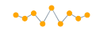</td>
            <td>マーカーは、X/Y 座標に基づいて個別のデータ ポイントを示すために、スパークライン上にオーバーレイ表示されたシンボルです。</td>
</tr>

        <tr>
            <td>[トレンド ライン](#trend-line)</td>
            <td>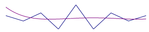</td>
            <td>近似曲線は、始点から終点まで描画された線で、シリーズのトレンド性と動向を示します。その結果、データの傾向を評価し、過去の値、未来の値、不明な値を頭の中で予想できます。</td>
</tr>

        <tr>
            <td>[標準範囲](#normal-range)</td>
            <td>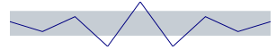</td>
            <td>標準範囲は、データを視覚化しているときに、あらかじめ定義された意味のある範囲を表す水平方向に延びる背景の縞模様です。</td>
</tr>

        <tr>
            <td>[不明な値の補間](#interpolating-unknown-values)</td>
            <td>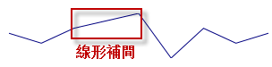</td>
            <td>`igSparkline` は不明な値 (null または double.NaN) を検出し、指定された補間アルゴリズムを通して不明な値のスペースを描画できます。</td>
</tr>

        <tr>
            <td>[軸](#axes)</td>
            <td>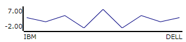</td>
            <td>`igSparkline` では、X 軸と Y 軸 (両方またはいずれか) を、対応するラベルとともに表示できます。</td>
</tr>

        <tr>
            <td>[ツールチップ](#tooltip)</td>
            <td>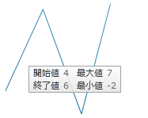</td>
            <td>`igSparkline` では、マウスをスパークラインの上に置いたときに、ヒントを表示できます。</td>
</tr>
    </tbody>
</table>

## マーカー
### マーカーの概要

マーカーは単一のデータ ポイントの上に重なり合ったシンボルで、X/Y 座標に基づいてチャートにプロットされた個々のデータ ポイントを示します。

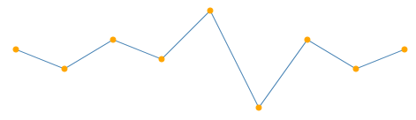

`igSparkline` のマーカーは、データまたはデータ ポイントの位置に基づいてデータ ポイントを識別する場合に指定します。

### マーカー タイプ

以下の表は、サポートされているマーカー タイプを表示します。

<table class="table">
	<thead>
		<tr>
            <th colspan="2">\*\*マーカー タイプ\*\*</th>
            <th>\*\*説明\*\*</th>
</tr>
	</thead>
	<tbody>
        <tr>
            <td>すべてのデータ ポイント</td>
            <td>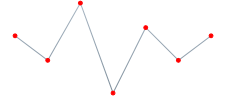</td>
            <td>すべてのデータ ポイント上のマーカーを表示します。</td>
</tr>

        <tr>
            <td>最初および最後のデータ ポイント</td>
            <td>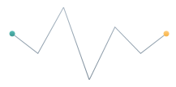</td>
            <td>最初のデータ ポイントと最後のデータ ポイント上に 2 つのマーカーを表示します。</td>
</tr>

        <tr>
            <td>上および下のデータ ポイント</td>
            <td>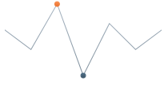</td>
            <td>一番高いデータ ポイントと一番低いデータ ポイントの上に 2 つのマーカーを表示します。</td>
</tr>

        <tr>
            <td>負のデータ ポイント</td>
            <td>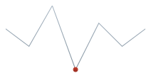</td>
            <td>負のデータ ポイントでマーカーを表示します。負のデータ ポイントが複数存在する場合は、それらすべてがマークされます。</td>
</tr>
    </tbody>
</table>

### 関連サンプル:

-   [ツールチップとマーカー](&#123;environment:SamplesUrl&#125;/sparkline/tooltips-and-markers)

## トレンド ライン
### 近似曲線の概要

近似曲線は、始点から終点まで描画された線で、シリーズのトレンド性と動向を示します。その結果、データの傾向を評価し、過去の値、未来の値、不明な値を頭の中で予想できます。

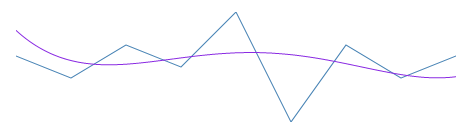

近似曲線機能により、トレンド性向ラインを生成する複数の数式を選択できます。`trendLineType` オプションを使用するために数式を指定します。シリーズ データがいつでも見えるよう、近似曲線はそのデータの前に描画されます。

### サポートされている近似曲線のタイプ

以下の表は、サポートされている近似曲線のタイプを表示します。各近似曲線は、そのタイプの計算式に基づいて描画されます。

<table class="table">
	<thead>
		<tr>
            <th colspan="2">\*\*近似曲線タイプ\*\*</th>
            <th colspan="2">\*\*説明\*\*</th>
            <th>`trendLineType` \*\*オプションの設定\*\*</th>
</tr>
	</thead>
	<tbody>
        <tr>
            <td>\*\*単純平均\*\*</td>
            <td>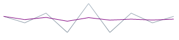</td>
            <td colspan="2">単純平均は数のセットです。それぞれが対応するデータ ポイントのサブセットの平均値です。単純移動平均とも呼ばれています。</td>
            <td>`simpleAverage`</td>
</tr>

        <tr>
            <td>\*\*修正平均\*\*</td>
            <td>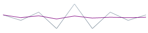</td>
            <td colspan="2">修正平均は、設定された期間の移動平均を示します。トレンドの方向を強調し、変動を滑らかにする場合に使用します。</td>
            <td>`modifiedAverage`</td>
</tr>

        <tr>
            <td>\*\*指数平均\*\*</td>
            <td>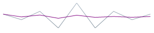</td>
            <td colspan="2">指数平均は、加重ファクターの追加された単純な平均に似ています。このタイプの平均は、最近の近似曲線の変更より速く反応します。</td>
            <td>`exponentialAverage`</td>
</tr>

        <tr>
            <td>\*\*累加平均\*\*</td>
            <td>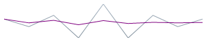</td>
            <td colspan="2">累加平均は、現在のポイントまでのすべてのデータの平均を計算し、データ ポイントを並べたものです。</td>
            <td>`cumulativeAverage`</td>
</tr>

        <tr>
            <td>\*\*加重平均\*\*</td>
            <td>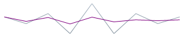</td>
            <td colspan="2">加重平均は、異なる場所にあるデータに重みを与える乗率を持つ任意の平均です。</td>
            <td>`weightedAverage`</td>
</tr>

        <tr>
            <td>\*\*キュービック フィット\*\*</td>
            <td colspan="2">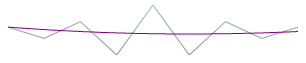</td>
            <td>多項式数学関数を使用して、キュービック フィット近似曲線をシリーズで指定します。</td>
            <td>`cubicFit`</td>
</tr>

        <tr>
            <td>\*\*指数フィット\*\*</td>
            <td colspan="2">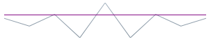</td>
            <td>指数数学関数を使用して、指数フィット近似曲線をシリーズで指定します。</td>
            <td>`exponentialFit`</td>
</tr>

        <tr>
            <td>\*\*ライン フィット\*\*</td>
            <td colspan="2">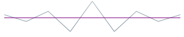</td>
            <td>最もフィットした直線の近似曲線です。</td>
            <td>`lineFit`</td>
</tr>

        <tr>
            <td>\*\*対数フィット\*\*</td>
            <td colspan="2">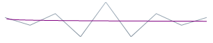</td>
            <td>最もフィットした曲線です。データの変化率が素早く増減し、平均になった場合に使用されます。このタイプの近似曲線は、データば十分ある場合に非常に便利です。</td>
            <td>`logarithmicFit`</td>
</tr>

        <tr>
            <td>\*\*べき乗フィット\*\*</td>
            <td colspan="2">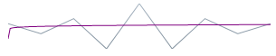</td>
            <td>べき乗近似曲線は、べき関数で線を描画する曲線です。べき関数ではゼロ点は有効でないため、ゼロ (0) 点を避けるのが良いでしょう。スパークラインはエラーを起こすことなくゼロ点をプロットしますが、べき乗近似曲線の視点から見ると、結果は正確でなくなります。べき乗近似曲線は、特定の率で増加する測定値を比較するデータ セットに便利です。</td>
            <td>`powerLowFit`</td>
</tr>

        <tr>
            <td>\*\*二次フィット\*\*</td>
            <td colspan="2">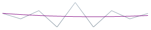</td>
            <td>二次方程式を使用して、近似曲線を導出し、線形曲線の精度で、高データ ポイントと低データ ポイントの効果全体を示します。</td>
            <td>`quadraticFit`</td>
</tr>

        <tr>
            <td>\*\*四次フィット\*\*</td>
            <td colspan="2">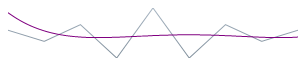</td>
            <td>四次フィットを使用して、シリーズの近似曲線を指定します。</td>
            <td>`quarticFit`</td>
</tr>

        <tr>
            <td>\*\*五次フィット\*\*</td>
            <td colspan="2">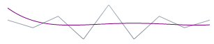</td>
            <td>五次フィットを使用して、シリーズの近似曲線を指定します。</td>
            <td>`quinticFit`</td>
</tr>
    </tbody>
</table>

#### 関連サンプル:

-   [標準範囲およびトレンドライン](&#123;environment:SamplesUrl&#125;/sparkline/normal-range-and-trend-lines)

## 標準範囲
### 標準範囲の概要

標準範囲は、データを視覚化しているときに、あらかじめ定義された意味のある範囲を表す水平方向に延びる背景の縞模様です。

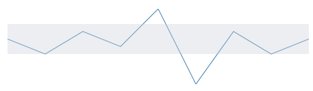

標準範囲は一般的に、どの値が正常または良好と見なされるか示す場合に使用します。たとえば、スパークラインが時間の経過とともに人の鼓動を表している場合、1 分間当たり 60 ～ 100 拍の標準範囲が標準として強調表示されるため、この範囲外のデータ ポイントは簡単に識別できます。

`normalRangeMinimum` オプションと `normalRangeMaximum` オプションにより、範囲の幅と位置が決まります。

#### 関連サンプル:

-   [標準範囲およびトレンドライン](&#123;environment:SamplesUrl&#125;/sparkline/normal-range-and-trend-lines)

## 不明な値の補間
### 不明な値の補間の概要

`igSparkline` は不明な値を検出し、指定された補間アルゴリズムを通して不明な値のスペースを描画できます。

データに欠けている値がある場合 (通常、データに見られる「不明な」値は null および NaN)、`igSparkline` は線形補間により不明な値のあるスペースに描画できます。以下の表は、Unknown Values Plotting を使用した場合と使用しない場合の、(欠けている値を含む) 同じデータ セットからプロットされたスパークラインの違いを示しています。

不明な値のプロットを適用したか?|プレビュー
---|---
いいえ|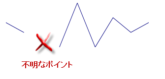
はい|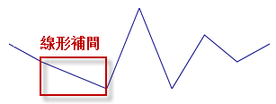

`unknownValuePlotting` オプションを介してこの機能を管理します。指定できる値は `dontPlot` および `linearInterpolate` です。

#### サポートされる Sparkline のタイプ

以下のスパークライン タイプが不明な値のプロットをサポートしています。

-   エリア
-   折れ線

柱状型と Win/Loss 型は不明な値を補間しません。これらのスパークライン タイプは常に、不明な値が存在するブランク スペースを表示します。

## 軸
### 軸の概要

スパークラインでは、1 または X 軸と Y 軸の両方を対応するラベルで表示できます。

|  |  |  |
| --- | --- | --- |
| 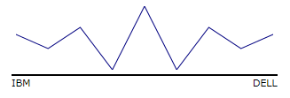 | 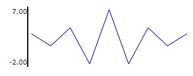 | 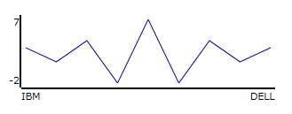 |

X 軸と Y 軸が有効な場合 (既定では表示されない)、スパークラインはそのサイズを縮小して、軸とラベルのスペースを確保します。スパークラインがグリッド セルに常駐している場合、セルのサイズを調整しなければならない場合があります。

### 軸のカスタマイズ

`igSparkline` コントロール軸の以下の要素はカスタマイズできます。

-   可視性

それぞれの `horizontalAxisVisibility` オプションと `verticalAxisVisibility` オプションを使用して、X 軸と Y 軸の可視性をそれぞれ管理できます。片方の軸または両方の軸を表示できます。

-   ラベル
    -   ラベル テキスト

記述的なラベルを X 軸に追加できます。`labelMemberPath` オプションはこれらのオプションを管理します。

## ツールチップ
### ツールチップの概要

`igSparkline` では、マウスをスパークラインの上にホバーしたときに、ヒントを表示できます。ヒントは、高、低、最初、および最後の各データ ポイントを表示するよう設計されています。

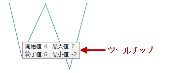

toolTip オプションはツールチップを管理します。

### ツールチップのカスタマイズ

`igSparkline` のツールチップは、以下の点でカスタマイズできます。

-   ラベル テキスト
-   ラベルのフォント
-   ラベルの色
-   フォント サイズ

#### 関連サンプル:

-   [ツールチップとマーカー](&#123;environment:SamplesUrl&#125;/sparkline/tooltips-and-markers)

## 関連コンテンツ
### トピック

以下のトピックでは、このトピックに関連する追加情報を提供しています。

- [jQuery と MVC API リンク (igSparkline)](/igsparkline-jquery-and-aspnet-mvc-api): このトピックでは、`igSparkline` コントロールのための jQuery と ASP.NET MVC ヘルパー クラスのAPIドキュメントへのリンクを提供します。

### サンプル

このトピックについては、以下のサンプルも参照してください。

- [ツールチップとマーカー](&#123;environment:SamplesUrl&#125;/sparkline/tooltips-and-markers): このサンプルは、`igSparkline` でツールチップとマーカーを有効にする例を示します。

- [標準範囲およびトレンドライン](&#123;environment:SamplesUrl&#125;/sparkline/normal-range-and-trend-lines): このサンプルは標準範囲およびトレンドライン機能を紹介します。

 

 

