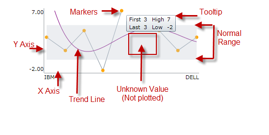

# igSparkline のビジュアル要素

import ApiLink from 'docs-template/components/mdx/ApiLink.astro';

# igSparkline のビジュアル要素

## トピックの概要
### 目的

このトピックは、<ApiLink type="igSparkline.html" label="igSparkline" />™ 視覚要素を説明する概要と画像を提供します。

### 前提条件

このトピックを理解するためには、以下のトピックを理解しておく必要があります:

- [igSparkline の概要](/igsparkline-overview): このトピックは、`igSparkline` コントロールの概要、その利点、およびサポートされるチャート タイプを提供します。

## 概要
### igSparkline 視覚要素と機能の紹介

`igSparkline` コントロールには複数の視覚要素と、これらの要素を構成およびカスタマイズするために対応する機能があります。他のチャート コントロールと比較したスパークラインの利点は、グリッド セルなどの限られたスペースに、そのすべてのビジュアル要素を表示できることです。そのために、スパークラインではデータ ポイントのすべてのラベルを表示できません。Y 軸上には最大値と最小値のみを表示でき、X 軸には最初の値と最後の値のみを表示できます。

スパークラインには、最高、最低、最初、最後、そして負の値を示す楕円形のアイコンによってデータ ポイントをマークする機能があります。図形、色、画像などでマーカーをカスタマイズします。更に、スパークラインは、x 軸および Y 軸と関連するラベルを描画するために必要なスペースを確保するためにチャートのサイズを小さくします。

## igSparkline の構成可能な視覚要素と関連プロパティ
### 構成可能な視覚要素の概要

以下のスクリーンショットは、`igSparkline` コントロールの視覚要素を描画します。以下の要素は、プロパティで構成できます。既定では、これらの視覚要素のいずれも表示されません。

**構成可能な視覚要素:**

- マーカー

- トレンド ライン

- 標準範囲

- 不明な値

- 軸

- ツールチップ

### 構成可能な視覚要素および関連オプション

以下の表は、`igSparkline` コントロールの視覚要素とそれらを構成するオプションの関係を示しています。

視覚要素|オプション
---|--- 
マーカー|`markerVisibility`
トレンド ライン|`trendLineType`
標準範囲|`normalRangeVisibility`
プロットされたまたはプロットされていない不明な値|`unknownValuePlotting`
軸|`horizontalAxisVisibility` `verticalAxisVisibility`
ツールチップ|`tooltipTemplate`

## 関連コンテンツ
### トピック

以下のトピックでは、このトピックに関連する追加情報を提供しています。

- [jQuery と MVC API リンク (igSparkline)](/igsparkline-jquery-and-aspnet-mvc-api): `igSparkline` は、ASP.NET MVC ヘルパーが付属する jQuery UI ウィジェットとして構築されます。各 API の詳細については、以下の API マニュアルへのリンクを参照してください。

### サンプル

このトピックについては、以下のサンプルも参照してください。

- [標準範囲およびトレンドライン](\{environment:SamplesUrl\}/sparkline/normal-range-and-trend-lines): このサンプルは標準範囲およびトレンドライン機能を紹介します。標準範囲を設定するには、`normalRangeMinimum` および `normalRangeMaximum` 値を設定し、`normalRangeVisibility` を設定します。トレンドラインの複数のスタイルのいずれかを選択できます。トレンドラインを有効にするには、アプリケーションに適切なトレンドライン タイプを選択して `trendLineType` オプションを設定します。

- [ツールチップとマーカー](\{environment:SamplesUrl\}/sparkline/tooltips-and-markers): ツールチップおよびマーカーを有効にするには、`toolTipVisibility` および `markerVisibility` オプションを visible に設定します。

 

 

