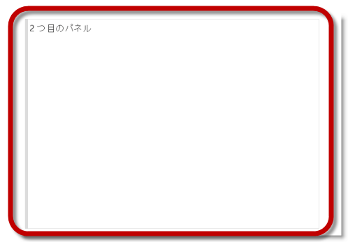
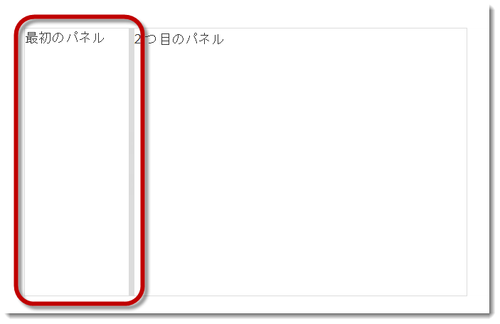
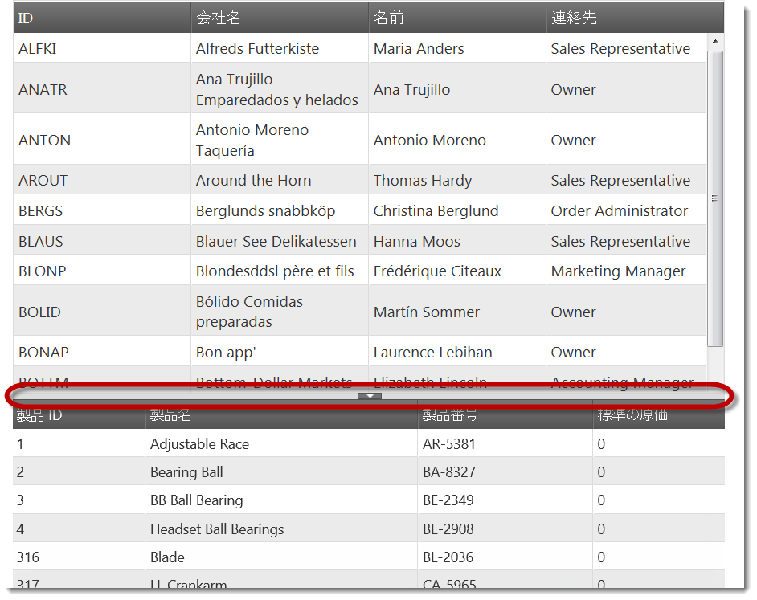

---
title: "igSplitter の構成"
slug: configuring-igsplitter
---

# igSplitter の構成


## トピックの概要
### 目的

このトピックは、`igSplitter`™ コントロールの異なる機能とビヘイビアーの構成方法を説明します。

### 前提条件

このトピックを理解するために、以下のトピックを参照することをお勧めします。

- [igSplitter の概要](/igsplitter-overview): このトピックでは、機能、ユーザー機能性など、`igSplitter` コントロールに関する概念的な情報を提供します。

- [igSplitter の追加](/adding-igsplitter): このトピックは、JavaScript および ASP.NET MVC のいずれかで `igSplitter` コントロールを HTML ページへ追加する方法をコード例を用いて説明します。

### このトピックの内容

このトピックは、以下のセクションで構成されます。

-   [igSplitter 構成の概要](#overview)
    -   [igSplitter 構成の概要](#summary)
    -   [igSplitter 構成の概要表](#config-summary-chart)
-   [パネルの初期状態の構成 (折りたたみ/展開)](#config-initial-states)
    -   [概要](#initial-state-overview)
    -   [プロパティ設定](#initial-state-settings)
    -   [例](#initial-state-example)
-   [パネルの初期状態の構成](#initial-size)
    -   [概要](#initial-size-overview)
    -   [プロパティ設定](#initial-size-settings)
    -   [例](#initial-size-example)
-   [パネルのサイズ変更制限の構成](#resizing-limits)
    -   [概要](#resizing-limits-overview)
    -   [プロパティ設定](#resizing-limits-settings)
    -   [例](#resizing-limits-example)
-   [スプリッターの方向の構成](#splitter-orientation)
    -   [概要](#orientation-overview)
    -   [プロパティ設定](#orientation-settings)
    -   [例](#orientation-example)
-   [ユーザー インタラクション機能の構成](#user-interaction-capabilities)
    -   [概要](#user-interaction-overview)
    -   [プロパティ設定](#user-interaction-settings)
    -   [例](#user-interaction-example)
-   [関連コンテンツ](#related-content)
    -   [トピック](#topics)
    -   [サンプル](#samples)


## <a id="overview"></a>igSplitter 構成の概要
### <a id="summary"></a>igSplitter 構成の概要

`igSplitter` コントロールを構成すると、スプリッターの方向を指定し、コンテナーとパネルのサイズを設定し、一部のデフォルト設定を構成し、ユーザーがコントロールと対話する機能を制御できます (ユーザーによる展開/縮小、またはパネルのサイズ変更を許可/禁止する)。詳細は、「[igSplitter 構成の構成表](#config-summary-chart)」を参照してください。

### <a id="config-summary-chart"></a>igSplitter 構成の概要表

以下の表は、 `igSplitter` コントロールの構成可能な要素を簡単に説明し、それらを構成するプロパティにマップします。詳細は、表の後に記載されています。


| 構成可能な項目 | 詳細 | プロパティ |
| --- | --- | --- |
| サイズ | コンテナーのサイズは構成可能です。2 つのディメンション (幅と高さ) はそれぞれ独立して構成されます。デフォルトでは、コンテナーのサイズは設定されません。 この場合 igSplitter は、ブラウザー ウィンドウ全体を占めます。このため、まさにこれが望んでいる通りの状態である場合を除き、コンテナーの幅と高さを設定して igSplitter を任意のサイズに構成しなければなりません。 | [height](environment:jQueryApiUrl/ui.igsplitter#options:height) [width](environment:jQueryApiUrl/ui.igsplitter#options:width) |
| [パネルの初期状態](#config-initial-states) | パネルの初期状態は構成可能です。 | [collapsed](environment:jQueryApiUrl/ui.igsplitter#options:collapsed) |
| [パネルの初期サイズ](#initial-size) | パネルの初期サイズは構成可能です。 | [size](environment:jQueryApiUrl/ui.igsplitter#options:size) |
| [パネルのサイズ変更の上限](#resizing-limits) | スプリッターバーをユーザーが動かすことができる上限は構成可能です。 | [min](environment:jQueryApiUrl/ui.igsplitter#options:min) [max](environment:jQueryApiUrl/ui.igsplitter#options:max) |
| [スプリッターの方向](#splitter-orientation) | スプリッターの向きは、専用プロパティを介して管理されます。 | [orientation](environment:jQueryApiUrl/ui.igsplitter#options:orientation) |
| [ユーザー インタラクション機能](#user-interaction-capabilities) | ユーザーのインタラクション機能は構成可能です。これは、ユーザーのサイズ変更やパネルの展開/折りたたみを許可したり禁止したりすることができることを意味します。 | [collapsible](environment:jQueryApiUrl/ui.igsplitter#options:collapsible) [resizable](environment:jQueryApiUrl/ui.igsplitter#options:resizable) |
| ドラッグ デルタ | スプリッターのドラッグ移動を開始するには、マウス ポインターをその位置から特定の距離だけ移動する必要があります。実際のドラッグ開始後の、この距離の制限は「ドラッグデルタ」と呼ばれます。 ドラッグ デルタにより、スプリッターの偶発的なドラッグを回避できます。デフォルトのドラッグ デルタは 3 ピクセルです。ドラッグ デルタは、専用プロパティを介して構成可能です | [dragDelta](environment:jQueryApiUrl/ui.igsplitter#options:dragDelta) |


## <a id="config-initial-states"></a>パネルの初期状態の構成 (折りたたみ/展開)
### <a id="initial-state-overview"></a>概要

パネルの初期状態 (折りたたみ/展開) は、パネルのいずれかの **collapsed** プロパティを介して構成できます。このプロパティを設定すると、各パネルを任意の状態に構成し、別のパネルを逆の状態に構成できます。いずれかのパネルのみに対してプロパティを設定する必要があります。両方のパネルのプロパティが設定されると、左/上のパネルの設定は、右/下のパネルの設定を上書きします。(このため、たとえば、両方のパネルが縮小されていると、左/上のパネルは縮小され、右/下のパネルは展開されます。

既定値は false です。

### <a id="initial-state-settings"></a>プロパティ設定

以下の表では、各プロパティ設定の構成です。いずれかのパネルの **collapsed** プロパティを設定することにより同じ結果を得られるのでご注意ください。

<table class="table">
	<thead>
		<tr>
            <th>目的:</th>
            <th>使用するプロパティ:</th>
            <th>このパネルのうち:</th>
            <th>設定の選択肢:</th>
</tr>
	</thead>
	<tbody>
        <tr>
            <td rowspan="3">左/上のパネルを縮小済みとし、右/下のパネルを展開済みとして設定します。(プロパティは、1 つのパネルに対してのみ設定しなければなりません)</td>
            <td>\*\*collapsed\*\*</td>
            <td>左/上パネル</td>
            <td>true</td>
</tr>

        <tr>
            <th colspan="3">または</th>
</tr>

        <tr>
            <td>\*\*collapsed\*\*</td>
            <td>右/下パネル</td>
            <td>false</td>
</tr>

        <tr>
            <td rowspan="3">右/下のパネルのパネルを縮小済みとして、左/上のパネルを展開済みとして設定します。(プロパティは、1 つのパネルに対してのみ設定しなければなりません)</td>
            <td>\*\*collapsed \*\*</td>
            <td>右/下パネル</td>
            <td>true</td>
</tr>

        <tr>
            <th colspan="3">または</th>
</tr>

        <tr>
            <td>\*\*collapsed\*\*</td>
            <td>左/上パネル</td>
            <td>false</td>
</tr>
    </tbody>
</table>


### <a id="initial-state-example"></a>例

以下のスクリーンショットは、以下の設定を行った後の、縮小された左のパネルと展開された右のパネルを示しています。

プロパティ|このパネルのうち:|値
---|---|---
collapsed|左/上パネル|true




以下のコードはこの例を実装します。

**JavaScript の場合:**

```js
$("#splitter").igSplitter({
	 width: 700,
	 panels: [{ collapsed: true }] 
});
```


## <a id="initial-size"></a>パネルの初期状態の構成
### <a id="initial-size-overview"></a>概要

パネルの初期サイズは、各パネルの **size** プロパティを介して構成できます。このプロパティを設定すると、それぞれのパネルを任意の幅 (スプリッターが垂直の場合) または高さ (スプリッターが水平の場合) にピクセル単位で構成し、その他のパネルは残りのスペースを `igSplitter` コンテナーの縁まで占有します。いずれかのパネルのみに対してプロパティを設定する必要があります。両方のパネルのプロパティが設定されると、左/上のパネルの設定は、右/下のパネルの設定を上書きします。(このため、たとえば、どちらのパネルも `igSplitter` インスタンスで 100 ピクセル幅/高さに設定されると、左/上のパネルは 100 ピクセルにサイズが決まり、右/下のパネルはスプリッターとコンテナーの縁の間の残りのスペースを占有します。パネルのサイズ設定は、コンテナーの関連ディメンジョンのサイズを超えてはなりません (垂直スプリッターを持つ幅と水平スプリッターを持つ高さ)。値の有効な形式は整数ナンバーです (ピクセルまたはパーセンテージを示します)。

デフォルトでは、パネルは設定されるサイズがなく、`igSplitter` コンテナーの場合は中央に位置するスプリッターを持つサイズに等しくなります。

### <a id="initial-size-settings"></a>プロパティ設定

以下の表では、任意の構成とプロパティ設定のマップを示します。

<table class="table">
	<thead>
		<tr>
            <th>目的:</th>
            <th>使用するプロパティ:</th>
            <th>このパネルのうち:</th>
            <th>設定の選択肢:</th>
</tr>
	</thead>
	<tbody>
        <tr>
            <td rowspan="3">サイズ パネルを設定します。</td>
            <td>\*\*size \*\*</td>
            <td>左/上パネル</td>
            <td>ピクセルの任意のパネルのサイズ</td>
</tr>

        <tr>
            <th colspan="3">または</th>
</tr>

        <tr>
            <td>\*\*size\*\*</td>
            <td>右/下パネル</td>
            <td>ピクセルの任意のパネルのサイズ</td>
</tr>
    </tbody>
</table>


### <a id="initial-size-example"></a>例

以下のスクリーンショットは、以下の設定の結果として左パネルを 100 ピクセル幅に設定し、右パネルを 600 ピクセル幅にする `igSplitter` コントロールをデモします。

プロパティ|のうち:|値
---|---|---
**size**|左パネル|100
**width**|コンテナー|700




以下のコードはこの例を実装します。

**JavaScript の場合:**

```js
$("#splitter").igSplitter({    width: 700,    panels: [{ size: 100 }]                 });
```


## <a id="resizing-limits"></a>パネルのサイズ変更制限の構成
### <a id="resizing-limits-overview"></a>概要

スプリッターバーをユーザーが動かすことができる上限は構成可能です。サイズ変更の制限は、スプリッターがコンテナー内の任意の位置に移動できないようにする必要があります。たとえば、サイズ変更制限を設定して、パネルのコンテンツがビューで全体的に非表示にならないようにするようにします。

サイズ変更の制限は、スプリッターの瞬間的な位置と相対的にピクセルで定義されます。(瞬間的な位置とは、制限が強制される瞬間にスプリッターがある位置です)2 つのサイズ変更制限があります。1 つは、スプリッターが移動できる各方向で、もう 1 つは実装するいくつかの対応プロパティです。

-   左/上のサイズ変更制限は、スプリッターの瞬間的な位置と相対的な左/上に対するアウトセットとして定義されます。この制限により、アウトセットがバーの瞬間的な位置から左/上にある限り、ユーザーはスプリッターを移動できます。左/上のサイズ変更制限は、いずれかのパネルの min プロパティを設定することにより実装されます。
-   右/下のサイズ変更制限は、スプリッターの瞬間的な位置と相対的な右/下に対するアウトセットとして定義されます。この制限により、アウトセットがバーの瞬間的な位置から右/下にある限り、ユーザーはスプリッターを移動できます。右/下のサイズ変更制限は、パネルの max プロパティを設定することにより実装されます。

サイズ変更制限を構成する場合、パネルの1 つのみの **min** プロパティと **max** プロパティを設定する必要があります。両方のパネルのプロパティが設定されると、左/上のパネルの設定は、右/下のパネルの設定を上書きします。

デフォルトでは、設定されるサイズ変更の制限はありません。

### <a id="resizing-limits-settings"></a>プロパティ設定

以下の表では、任意の構成とプロパティ設定のマップを示します。


| 目的: | 使用するプロパティ: | 設定の選択肢: |
| --- | --- | --- |
| 両方のサイズ変更制限を設定します。 | min max | 任意の値 (ピクセル) |
| 左/上のサイズ変更制限のみを設定します。 | min | 任意の値 (ピクセル) |
| 右/下のサイズ変更制限のみを設定します。 | max | 任意の値 (ピクセル) |


### <a id="resizing-limits-example"></a>例

以下のコードは、ユーザーがスプリッターを 400 ピクセルの範囲で移動できる構成をデモします (スプリッター (コンテナーの中央に位置) のデフォルト位置と相対的に左に 100 ピクセルで右に 300 ピクセル)。この構成は、以下の設定で得られます。

プロパティ|値
---|---
**min**|100
**max**|300


以下のコードはこの例を実装します。

**JavaScript の場合:**

```js
$("#splitter").igSplitter({     panels: [{ min: 100, max: 300 }]              });
```


## <a id="splitter-orientation"></a>スプリッターの方向の構成
### <a id="orientation-overview"></a>概要

スプリッターの向きは、専用プロパティを介して管理されます。

### <a id="orientation-settings"></a>プロパティ設定

以下の表は、各プロパティ設定の任意の構成をマップします。

目的:|使用するプロパティ:|設定の選択肢:
---|---|---
スプリッターの水平向きの構成|**orientation**|horizontal
スプリッターの垂直向きの構成|**orientation**|vertical


### <a id="orientation-example"></a>例

以下のスクリーンショットは、以下の設定の結果として、igSplitter  コントロールがどのように表示されるかを示しています。

プロパティ|値
---|---
**orientation**|horizontal




以下のコードはこの例を実装します。

**JavaScript の場合:**

```js
$("#splitter").igSplitter({                     
	orientation: "horizontal"
});
```


## <a id="user-interaction-capabilities"></a>ユーザー インタラクション機能の構成
### <a id="user-interaction-overview"></a>概要

ユーザーのインタラクション機能は構成可能です。これは、ユーザーのサイズ変更やパネルの展開/縮小を許可したり禁止したりするという意味です。デフォルトでは、展開/縮小は無効であり、サイズ変更が有効になります。

サイズ変更が無効であると、ユーザーは `igSplitter` のコンテナー内でスプリッターを移動できません。

展開/縮小が無効であると、ユーザーは `igSplitter` のパネルを展開/縮小できず、展開/折りたたみボタンはスプリッターで使用できません。

それぞれ **resizable** と **collapsible** のパネル プロパティで、ユーザーを有効/無効にし、パネルを展開/縮小します。いずれかのパネルのみに対してプロパティを設定する必要があります。両方のパネルのプロパティが設定されると、左/上のパネルの設定は、右/下のパネルの設定を上書きします。

### <a id="user-interaction-settings"></a>プロパティ設定

以下の表では、目的の構成をプロパティ設定にマップしています。
<table class="table">
	<thead>
		<tr>
            <th>目的:</th>
            <th>使用するプロパティ:</th>
            <th>このパネルのうち:</th>
            <th>設定の選択肢:</th>
</tr>
	</thead>
	<tbody>
        <tr>
            <td rowspan="3">パネルのサイズ変更を無効にします。</td>
            <td>\*\*resizable\*\*</td>
            <td>左/上パネル</td>
            <td>false</td>
</tr>

        <tr>
            <th colspan="3">または</th>
</tr>

        <tr>
            <td>\*\*resizable\*\*</td>
            <td>右/下パネル</td>
            <td>false</td>
</tr>

        <tr>
            <td rowspan="3">パネルのサイズ変更を有効にします。</td>
            <td>\*\*resizable\*\*</td>
            <td>左/上パネル</td>
            <td>true</td>
</tr>

        <tr>
            <th colspan="3">または</th>
</tr>

        <tr>
            <td>\*\*resizable\*\*</td>
            <td>右/下パネル</td>
            <td>true</td>
</tr>

        <tr>
            <td rowspan="3">パネルの展開/折りたたみを無効にします。</td>
            <td>\*\*collapsible\*\*</td>
            <td>左/上パネル</td>
            <td>false</td>
</tr>

        <tr>
            <th colspan="3">または</th>
</tr>

        <tr>
            <td>\*\*collapsible\*\*</td>
            <td>右/下パネル</td>
            <td>false</td>
</tr>

        <tr>
            <td rowspan="3">パネルの展開/折りたたみを有効にします。</td>
            <td>\*\*collapsible\*\*</td>
            <td>左/上パネル</td>
            <td>true</td>
</tr>

        <tr>
            <th colspan="3">または</th>
</tr>

        <tr>
            <td>\*\*collapsible\*\*</td>
            <td>右/下パネル</td>
            <td>true</td>
</tr>
    </tbody>
</table>


### <a id="user-interaction-example"></a>例

以下のコードは、以下の設定の結果として、サイズ変更を無効にした `igSplitter`  コントロールがどのように表示されるかを示しています。

プロパティ|このパネルのうち:|値
---|---|---
resizable|左パネル|false


以下のコードはこの例を実装します。

**JavaScript の場合:**

```js
$("#splitter").igSplitter({ 
     panels: [{          
		resizable: false     
 	}]
});
```


## <a id="related-content"></a>関連コンテンツ
### <a id="topics"></a>トピック

このトピックの追加情報については、以下のトピックも合わせてご参照ください。

- [イベント処理 (igSplitter)](/igsplitter-handling-events): トピックは、`igSplitter` コントロールの処理イベントに関する情報と例を提供します。

- [アクセシビリティの遵守 (igSplitter)](/igsplitter-accessibility-compliance): このトピックは、`igSplitter` コントロールのアクセシビリティ機能を説明し、このコントロールを含むページに対してアクセシビリティ準拠を実現させる方法に関するアドバイスを提供します。

- [既知の問題と制限 (igSplitter)](/igsplitter-known-issues-and-limitations): このトピックでは、`igSplitter` コントロールの既知の問題と制限に関する情報を提供します。

- [jQuery と MVC API リンク (igSplitter)](/igsplitter-jquery-and-asp.net-mvc-helper-api-links): このトピックでは、`igSplitter` コントロールの jQuery および ASP.NET MVC ヘルパー クラスの API ドキュメントへのリンクを提供します。


### <a id="samples"></a>サンプル

このトピックについては、以下のサンプルも参照してください。

- [ベーシック垂直スプリッター](&#123;environment:SamplesUrl&#125;/splitter/basic-vertical-splitter): このサンプルでは、スプリッター コントロールを使用してページの垂直レイアウトを管理する方法を紹介します。最初のコンテナーは大陸および国を含むツリー コントロールを表示します。左の垂直パネルはサイズ変更の最大値および最小値があります。ノードをクリックすると、選択した項目の説明が右パネルに表示されます。

- [ベーシック水平スプリッター](&#123;environment:SamplesUrl&#125;/splitter/basic-horizontal-splitter): このサンプルでは、スプリッター コントロールを使用して水平レイアウトのマスター/詳細グリッドを管理する方法を紹介します。最初のコンテナーは顧客データを含むマスター グリッドを含みます。マスター グリッドの行がクリックした後に 2 つ目のコンテナーにこの顧客の注文を含むグリッドを表示します。

- [ネスト スプリッター](&#123;environment:SamplesUrl&#125;/splitter/nested-splitters): このサンプルでは、ネスト スプリッターのレイアウトを管理する方法を紹介します。パネルは大陸、国、および都市を含むツリーを表示します。ノードをクリックすると、2 つ目のスプリッターにあるマップはノードの座標によって中央揃えます。国が選択した場合、その国の都市を含むグリッドはマップの下に表示されます。パネルはデフォルトでサイズ変更できません。

- [ASP.NET MVC の基本的な使用方法](&#123;environment:SamplesUrl&#125;/splitter/aspnet-mvc-helper-splitter): このサンプルでは、 `igSplitter` の ASP.NET MVC ヘルパーを使用する方法を紹介します。

- [スプリッター API およびイベント](&#123;environment:SamplesUrl&#125;/splitter/api-events-splitter): このサンプルでは、`igSplitter` コントロールのイベントを処理する方法を紹介し、API を使用する方法を紹介します。


 

 


