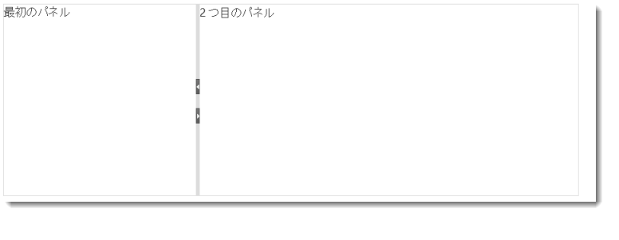

---
title: "igSplitter"
slug: igsplitter
---

# igSplitter

## このグループのトピックについて
### 概要

このグループのトピックでは、`igSplitter` コントロールとその使用方法について説明します。

`igSplitter` は、レイアウトを 2 つの異なるパネルに分けることにより HTML5 Web アプリケーションおよびサイトでレイアウトを管理するためのコンテナー コントロールです。

### トピック

- [igSplitter の概要](/igsplitter-overview): このトピックでは、機能、ユーザー機能性など、`igSplitter` コントロールに関する概念的な情報を提供します。

- [igSplitter の追加](/adding-igsplitter): このトピックは、JavaScript および ASP.NET MVC のいずれかで `igSplitter` コントロールを HTML ページへ追加する方法をコード例を用いて説明します。

- [igSplitter の構成](/configuring-igsplitter): このトピックは、`igSplitter` コントロールの構成方法をコード例を用いて説明します。

- [イベント処理 (igSplitter)](/igsplitter-handling-events): このトピックは、イベント ハンドラーを `igSplitter` にアタッチする方法をコード例を用いて説明します。

- [アクセシビリティの遵守 (igSplitter)](/igsplitter-accessibility-compliance): このトピックは、`igSplitter` コントロールのアクセシビリティ機能を説明し、このコントロールを含むページに対してアクセシビリティ準拠を実現させる方法に関するアドバイスを提供します。

- [既知の問題と制限 (igSplitter)](/igsplitter-known-issues-and-limitations): このトピックでは、`igSplitter` コントロールの既知の問題と制限に関する情報を提供します。

- [jQuery と MVC API リンク (igSplitter)](/igsplitter-jquery-and-asp.net-mvc-helper-api-links): このトピックでは、`igSplitter` コントロールの jQuery および ASP.NET MVC ヘルパー クラスの API ドキュメントへのリンクを提供します。

 

 

