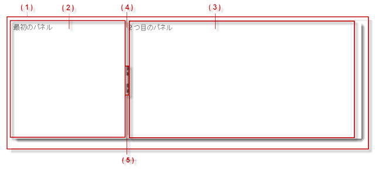
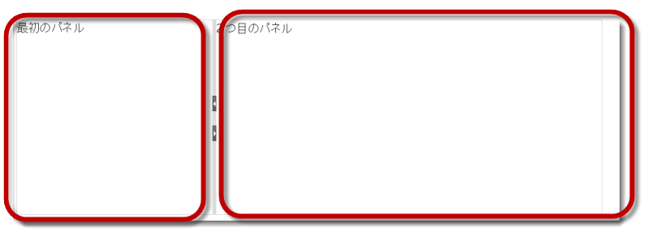
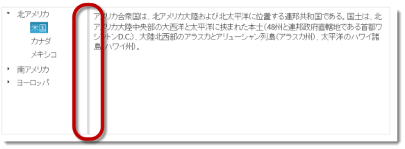
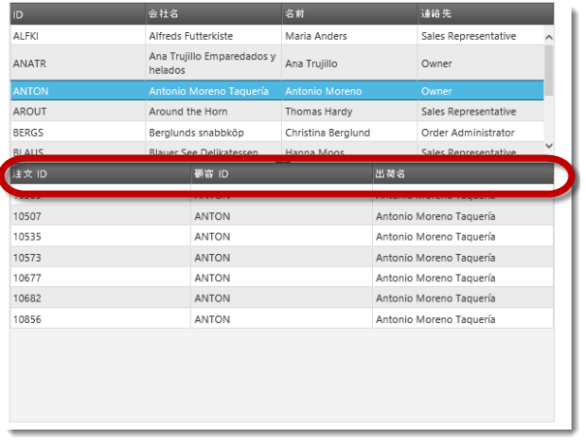
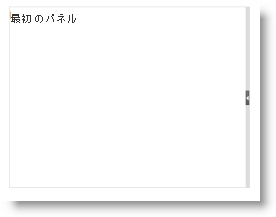
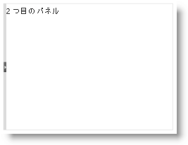
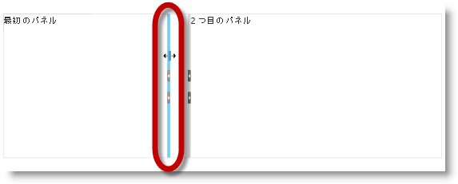

---
title: "igSplitter の概要"
slug: igsplitter-overview
---

# igSplitter の概要

## トピックの概要
### 目的

このトピックでは、機能、ユーザー機能性など、`igSplitter`™ コントロールに関する概念的な情報を提供します。

### このトピックの内容

このトピックは、以下のセクションで構成されます。

-   [概要](#introduction)
-   [主要機能](#main-features)
    -   [2 パネル レイアウト](#two-panel-layout)
    -   [スプリッターの向き (垂直/水平)](#splitter-orientation)
    -   [パネルの状態 (展開/折りたたみ)](#panels-states)
    -   [サイズ変更可能なパネル](#resizable-panels)
    -   [パネルのサイズ変更のためのドラッグのサポート](#panel-resizing)
-   [タッチ サポート](#touch-suport)
-   [ユーザー インタラクションと操作性](#user-interaction)
-   [要件](#requirements)
-   [igSplitter 構成の概要](#config-overview)
-   [関連コンテンツ](#related-content)
    -   [トピック](#topics)
    -   [サンプル](#samples)

## 概要
### igSplitter の概要

`igSplitter` は、レイアウトを 2 つの異なるパネルに分けることにより HTML5 Web アプリケーションおよびサイトでレイアウトを管理するためのコンテナー コントロールです。

&#123;environment:ProductName&#125;® コントロールは、それらのパネルの内部に配置でき、そのためサイズ変更可能かつ折りたたみ可能なパネルで動的なレイアウトを作成できます。

igSplitter 表示レイアウトは、コンテナー (1) に配置される 2 つのパネル (2) と (3) から構成されます(番号は以下の図に対応)。パネルはスプリッター (4) で分割されます。デフォルトでは、スプリッターにはパネルを展開および折りたたむためのボタン (5) があります。以下の図は、空の (配置されているコントロールが他にない) `igSplitter` コントロールを示します。

以下の図は、`igSplitter` の左のパネルに igTree &#123;environment:ProductName&#125; コントロールを持つ `igSplitter` を示します。ツリーに対してノードが選択された後、そのノードに対応するテキストが右のパネルに配置されます。

ユーザーは、スプリッターを移動することによりパネルをサイズ変更したり、パネルを折りたたむ/展開することができます。(詳細は、[ユーザー インタラクションと操作性](#user-interaction)を参照。)

## 主要機能

以下の表は、`igSplitter` コントロールの主な機能についてまとめています。これら機能の詳細については、この概要表の下をご覧ください。

機能|説明
---|---
[2 パネル レイアウト](#two-panel-layout)|igSplitter コントロールは、レイアウトを 2 つの区切られたパネルに分割しています。
[スプリッターの向き (垂直/水平)](#splitter-orientation)|サポートされるスプリッターの向きは、垂直と水平です。
[パネルの状態 (展開/折りたたみ)](#panels-states)|パネルには展開状態と折りたたみ状態があり、逆相関関係にあります。あるパネルが展開状態の場合、他のパネルは折り畳まれ、展開状態のパネルを折りたたむと折り畳まれていたパネルは展開されます。
[サイズ変更可能なパネル](#resizable-panels)|パネルは、スプリッター コントロール内でスプリッターを移動することで互いのサイズに対応してサイズ変更できます。
[パネルのサイズ変更のためのドラッグのサポート](#panel-resizing)|デフォルトでは、`igSplitter` コントロールはパネルをサイズ変更するためにマウスのドラッグをサポートします。
キーボード ナビゲーション|ユーザーは、キーボードからスプリッターを移動したりパネルを展開/折りたたんだりすることができます。詳細は、「[ユーザー インタラクションと操作性](#user-interaction)」を参照してください。

### 2 パネル レイアウト

`igSplitter` コントロールは、レイアウトを 2 つの区切られたパネルに分割しています。

### スプリッターの向き (垂直/水平)

サポートされるスプリッターの向きは、垂直と水平です。垂直方向では、スプリッターは垂直に配置され、エリアを 2 つのパネルに分割して隣同士に配置します。水平方向では、スプリッターは水平に配置され、エリアを 2 つのパネルに分割して片方を下にもう片方をその上に配置します。

#### 垂直方向のスプリッター

 

#### 水平方向のスプリッター

スプリッターのデフォルトの方向は垂直です。

### パネルの状態 (展開/折りたたみ)

パネルには展開状態と折りたたみ状態があり、逆相関関係にあります。あるパネルが展開状態の場合、他のパネルは折り畳まれ、展開状態のパネルを折りたたむと折り畳まれていたパネルは展開されます。展開状態のパネルはコンテナー体を占め、折りたたみ状態のパネルは見えない状態になっています。一度に 1 つのパネルのみが展開状態または折りたたみ状態になることができます。

以下の画像は、左のパネルの展開状態と折りたたみ状態を比較しています。

#### 展開状態の左のパネル 

#### 折りたたみ状態の右のパネル

パネルは、ユーザーによって、または API メソッドを介してプログラムから折り畳む、または展開できます。展開/折りたたみが有効でない場合、展開/折りたたみボタンはスプリッターに表示されません。デフォルトでは、パネルは展開/折りたたみできません。

パネルが展開されている場合、スプリッターは他の (現在は折り畳まれている) パネルの方の側面に配置されます。スプリッターがそれ以外の位置にある場合、両方のパネルが表示されますが、２つのパネルがこの状態にあっても各々のパネルの状態には関係がありません。

### サイズ変更可能なパネル

パネルは、スプリッター コントロール内でスプリッターを移動することで互いのサイズに対応してサイズ変更できます。スプリッターがどちらかのパネルの方向に移動されると、そのパネルのサイズは小さくなり、もう一方のパネルのサイズは大きくなります。デフォルトで、パネルはサイズ変更できます。

### パネルのサイズ変更のためのドラッグのサポート

デフォルトでは、`igSplitter` コントロールはパネルをサイズ変更するためにマウスのドラッグをサポートします。ユーザーは、スプリッターをドラッグすることによりエリアのサイズを変更できます。ドラッグを移動した後にマウス ボタンをリリースすると、スプリッターの新しい位置に応じてパネルのサイズが変更されます。

## タッチ サポート

タッチ対応デバイスの場合、特別なクラスがスプリッターに追加され、タッチ イベントが処理されます。タッチ対応デバイスでは、スプリッターは標準のデバイス (幅 6 ピクセル)より少し広め(幅 16 ピクセル)になっており、タッチ環境でのユーザーのスプリッター操作を簡単にしています。詳細は、「[&#123;environment:ProductName&#125; のタッチ サポート](/general-and-getting-started/touch-support-for-igniteui-for-jquery-controls)」を参照してください。

## ユーザー インタラクションと操作性

以下の表は、`igSplitter` コントロールのユーザー操作機能を要約したものです。

| 目的 | 方法 | 詳細 | クライアント/サーバー設定 |
| --- | --- | --- | --- |
| スプリッターを動かしてパネルのサイズを変更 | マウス ドラッグ ドラッグ(タッチ デバイスのみ) キーボード | **マウス** スプリッターをドラッグすると (垂直バーの場合は水平に、水平バーの場合は垂直に)、任意の向きに移動します。マウス ボタンを放すと、パネルはスプリッターの新しい位置に応じてサイズ変更されます。 **タッチ デバイス** スプリッターをドラッグすると、スプリッターが移動します。指を画面から話すと、パネルはスプリッターの新しい位置に応じてサイズ変更されます。 **キーボード** 矢印キーを押す (垂直バーの場合は左右、水平バーの場合は上下)と、事前に設定されたステップ 10 ピクセルだけ移動します。(ステップのサイズはハード コーディングされており構成できません。) バーの任意の位置に到達すると、ユーザーは Enter/Tab/Space を押して、スプリッターの現在の位置に従ってパネルをサイズ変更します。ESC キーは、アクションを移動しバーを元の位置 (矢印キーが最初に押される前のスプリッターの位置) に戻すスプリッターをキャンセルします。 |  詳細は、[構成トピック](/controls/igsplitter/configuring-igsplitter)を参照してください。 |
| パネルを展開/折りたたみます。 | スプリッターのボタン キーボード | **キーボード** CTRL+矢印キーを押すと、任意の向きでパネルを折りたたみ/展開します。 **Ctrl+Left/Right** 矢印キーは、垂直のスプリッターでパネルを折りたたみ/展開します。 **Ctrl+Up/Down** 矢印キーは、水平のスプリッターでパネルを折りたたみ/展開します。 |  パネルの展開/折りたたみは、明示的に有効にする必要があります。 詳細は、[構成トピック](/controls/igsplitter/configuring-igsplitter)を参照してください。 |

## 要件

`igSplitter` コントロールは jQuery UI ウィジェットであるため、jQuery と jQuery の UI ライブラリに依存します。Modernzr ライブラリは、内部的にブラウザーと装置の機能を検出するためにも使用されています。これらのリソースへの参照は、実際の jQuery または &#123;environment:ProductNameMVC&#125; が使用されているとしても必要となります。コントロールが ASP.NET MVC のコンテクスト内で使用されている場合、Infragistics.Web.Mvc の組立が必要になります。

完全な要件の一覧については、「[トピックの追加](/controls/igsplitter/adding-igsplitter)」を参照してください。

## igSplitter 構成の概要

以下の表は、 `igSplitter` コントロールの構成可能な要素を簡単に説明し、それらを構成するプロパティにマップします。詳細は、「[構成](/controls/igsplitter/configuring-igsplitter)」を参照してください。

| 構成可能な項目 | 詳細 | プロパティ |
| --- | --- | --- |
| サイズ | コンテナーのサイズは構成可能です。2 つのディメンション (幅と高さ) はそれぞれ独立して構成されます。デフォルトでは、コンテナーのサイズは設定されません。 この場合 igSplitter は、ブラウザー ウィンドウ全体を占めます。このため、まさにこれが望んでいる通りの状態である場合を除き、コンテナーの幅と高さを設定して igSplitter を任意のサイズに構成しなければなりません。 | [height](environment:jQueryApiUrl/ui.igsplitter#options:height) [width](environment:jQueryApiUrl/ui.igsplitter#options:width) |
| [パネルの初期状態](/controls/igsplitter/configuring-igsplitter#config-initial-states) | パネルの初期状態は構成可能です。 | [collapsed](environment:jQueryApiUrl/ui.igsplitter#options:collapsed) |
| [パネルの初期サイズ](/controls/igsplitter/configuring-igsplitter#initial-size) | パネルの初期サイズは構成可能です。 | [size](environment:jQueryApiUrl/ui.igsplitter#options:size) |
| [パネルのサイズ変更の上限](/controls/igsplitter/configuring-igsplitter#resizing-limits) | スプリッターバーをユーザーが動かすことができる上限は構成可能です。 | [min](environment:jQueryApiUrl/ui.igsplitter#options:min) [max](environment:jQueryApiUrl/ui.igsplitter#options:max) |
| [スプリッターの方向](/controls/igsplitter/configuring-igsplitter#splitter-orientation) | スプリッターの向きは、専用プロパティを介して管理されます。 | [orientation](environment:jQueryApiUrl/ui.igsplitter#options:orientation) |
| [ユーザー インタラクション機能](/controls/igsplitter/configuring-igsplitter#user-interaction-capabilities) | ユーザーのインタラクション機能は構成可能です。これは、ユーザーのサイズ変更やパネルの展開/折りたたみを許可したり禁止したりすることができることを意味します。 | [collapsible](environment:jQueryApiUrl/ui.igsplitter#options:collapsible) [resizable](environment:jQueryApiUrl/ui.igsplitter#options:resizable) |
| ドラッグ デルタ | スプリッターのドラッグ移動を開始するには、マウス ポインターをその位置から特定の距離だけ移動する必要があります。実際のドラッグ開始後の、この距離の制限は「ドラッグデルタ」と呼ばれます。 ドラッグ デルタにより、スプリッターの偶発的なドラッグを回避できます。デフォルトのドラッグ デルタは 3 ピクセルです。ドラッグ デルタは、専用プロパティを介して構成可能です | [dragDelta](environment:jQueryApiUrl/ui.igsplitter#options:dragDelta) |

## 関連コンテンツ
### トピック

このトピックの追加情報については、以下のトピックも合わせてご参照ください。

- [igSplitter の追加](/controls/igsplitter/adding-igsplitter): このトピックは、JavaScript および ASP.NET MVC のいずれかで `igSplitter` コントロールを HTML ページへ追加する方法をコード例を用いて説明します。

- [igSplitter の構成](/controls/igsplitter/configuring-igsplitter): このトピックは、`igSplitter` コントロールの構成方法をコード例を用いて説明します。

- [イベント処理 (igSplitter)](/controls/igsplitter/handling-events): このトピックは、イベント ハンドラーを `igSplitter` にアタッチする方法をコード例を用いて説明します。

- [アクセシビリティの遵守 (igSplitter)](/controls/igsplitter/accessibility-compliance): このトピックは、`igSplitter` コントロールのアクセシビリティ機能を説明し、このコントロールを含むページに対してアクセシビリティ準拠を実現させる方法に関するアドバイスを提供します。

- [既知の問題と制限 (igSplitter)](/controls/igsplitter/known-issues-and-limitations): このトピックでは、`igSplitter` コントロールの既知の問題と制限に関する情報を提供します。

- [jQuery と MVC API リンク (igSplitter)](/controls/igsplitter/jquery-and-aspnet-mvc-helper-api-links): このトピックでは、`igSplitter` コントロールの jQuery および ASP.NET MVC ヘルパー クラスの API ドキュメントへのリンクを提供します。

### サンプル

このトピックについては、以下のサンプルも参照してください。

- [ベーシック垂直スプリッター](&#123;environment:SamplesUrl&#125;/splitter/basic-vertical-splitter): このサンプルでは、スプリッター コントロールを使用してページの垂直レイアウトを管理する方法を紹介します。最初のコンテナーは大陸および国を含むツリー コントロールを表示します。左の垂直パネルはサイズ変更の最大値および最小値があります。ノードをクリックすると、選択した項目の説明が右パネルに表示されます。

- [ベーシック水平スプリッター](&#123;environment:SamplesUrl&#125;/splitter/basic-horizontal-splitter): このサンプルでは、スプリッター コントロールを使用して水平レイアウトのマスター/詳細グリッドを管理する方法を紹介します。最初のコンテナーは顧客データを含むマスター グリッドを含みます。マスター グリッドの行がクリックした後に 2 つ目のコンテナーにこの顧客の注文を含むグリッドを表示します。

- [ネスト スプリッター](&#123;environment:SamplesUrl&#125;/splitter/nested-splitters): このサンプルでは、ネスト スプリッターのレイアウトを管理する方法を紹介します。パネルは大陸、国、および都市を含むツリーを表示します。ノードをクリックすると、2 つ目のスプリッターにあるマップはノードの座標によって中央揃えます。国が選択した場合、その国の都市を含むグリッドはマップの下に表示されます。パネルはデフォルトでサイズ変更できません。

- [ASP.NET MVC の基本的な使用方法](&#123;environment:SamplesUrl&#125;/splitter/aspnet-mvc-helper-splitter): このサンプルでは、 `igSplitter` の ASP.NET MVC ヘルパーを使用する方法を紹介します。

- [スプリッター API およびイベント](&#123;environment:SamplesUrl&#125;/splitter/api-events-splitter): このサンプルでは、`igSplitter` コントロールのイベントを処理する方法を紹介し、API を使用する方法を紹介します。

 

 

