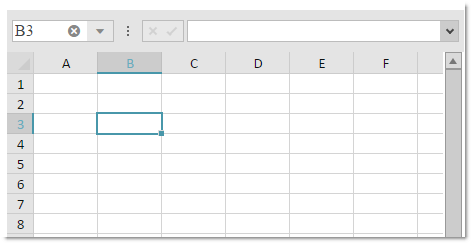

import ApiLink from 'docs-template/components/mdx/ApiLink.astro';

# igSpreadsheet のアクティベーションとナビゲーションのインタラクション

## 概要

このトピックでは、ワークシートのセルをナビゲートする場合にユーザーが実行できる操作を説明します。

### 前提条件

このトピックを理解するために [Infragistics JavaScript Excel Library](../../../09_JavaScript Excel Library/~JavaScript_Excel_Library.mdx) の概念とトピックは前提条件です。

### このトピックの内容

このトピックは、以下のセクションで構成されます。

-   [アクティブ化](#activation)
-   [スプレッドシートのペイン](#spreadsheet_panes)
-   [ナビゲーション](#navigation)
- 	[ユーザー インタラクションと操作性](#user_interactions_and_usability)
- 	[関連リンク](#related_link)

## アクティブ化

`igSpreadsheet` コントロールのアクティブ セルは、ユーザーが操作できるセルです。このアクティブ セルは、追加の境界線で強調表示されます。行と列も、他の背景色で強調表示されます。

以下のスクリーンショットは、アドレス B3 のセルがアクティブ化された `igSpreadsheet` コントロールを示します。

## スプレッドシートのペイン

`igSpreadsheet` コントロールは、シート ペインをサポートします。各シート ペインは、現在選択されているワークシートの列の領域と行の領域の共通部分です。スプレッドシートのペインは、以下の場合に形成されます。

- 行　/　列をフリーズ
- 分割の作成

一度にアクディブになるシート ペインは 1 つです。アクティブになっているのは、フォーカスを持つシート ペインです。また、このペインにはアクティブ セルが含まれます。

>**注:**  各シート ペインは、選択情報を維持し、表示されている行と列に関する情報を提供します。

## ナビゲーション

選択されているワークシートのアクティブ ペインのセルにナビゲートできます。キーボードまたはマウスを使用してアクティブ セルを変更できます。また、水平および垂直スクロール バーを使用して、アクティブなシート ペインの表示されている列と行を変更することもできます。

>**注:** アクティブ セルは、アクティブ ペインの選択の一部です。

また、標準のナビゲーション動作に追加して `igSpreadsheet` コントロールは「終了モード」ナビゲーションをサポートします。このモードで、矢印キーでデータを含む隣のセルに移動します。

## ユーザー インタラクションと操作性

以下の表では、`igSpreadsheet` コントロールの主なユーザー インタラクション機能を簡単に説明します。

| 目的 										| 方法     																	| 詳細								|
| ------------- 										|-------------																	| -----   								|
| 特定のシートのセルのアクティブ化   					| 特定のセルにクリック / 矢印キーを使用して、特定のセルにナビゲートする	| 特定のセルがアクティブ化されます  |
| 最初の列のセルのアクティブ化						| <kbd>Home</kbd> を押す															| 現在の行の最初のセルがアクティブ化されます。エンド モードが選択されている場合は、データを持つ最後のセルがアクティブ化されます。  |
| 最初の行と列に位置するセルのアクティブ化 | <kbd>Ctrl</kbd> + <kbd>Home</kbd> を押す											| 現在の列の最初のセルがアクティブ化されます。    			   |
| 最後に使用されたセルへの移動 								| <kbd>Ctrl</kbd> + <kbd>End</kbd> キーを押す											| 現在のシート ペインで、値を持つ最後のセルにアクティブ セルを移動します。 |
| 1 つ上のセルにナビゲート									| <kbd>&uarr;</kbd>	を押す														| 現在アクティブなセルの上のセルがアクティブ化されます。				   |
| 1 つ下のセルにナビゲート								| <kbd>&darr;</kbd>	を押す														| 現在アクティブなセルの下のセルがアクティブ化されます。 				   |
| 左のセルにナビゲート 								| <kbd>&larr;</kbd> を押す / <kbd>Shift</kbd>+<kbd>Tab</kbd> を押す					| 現在アクティブなセルの左のセルがアクティブ化されます。		 |
| 右のセルにナビゲート								| <kbd>&rarr;</kbd> を押す / <kbd>Tab</kbd> を押す	 								| 現在アクティブなセルの右のセルがアクティブ化されます。		  |
| ページを上にナビゲート										| <kbd>Page Up</kbd> キーを押す															| シート ペインに表示されている行と同数のセルの分だけ、アクティブ セルを上に移動します |
| ページを下にナビゲート									| <kbd>Page Down</kbd> キーを押す													| シート ペインに表示されている行と同数のセルの分だけ、アクティブ セルを下に移動します |
| ページを左にナビゲート									| <kbd>Alt</kbd>+<kbd>Page Up</kbd>	を押す										| シート ペインに表示されている列と同数のセルの分だけ、アクティブ セルを左に移動します |
| ページを右にナビゲート									| <kbd>Alt</kbd>+<kbd>Page Down</kbd> を押す											| シート ペインに表示されている列と同数のセルの分だけ、アクティブ セルを右に移動します |
| 特定数の列を上または下にナビゲート			| 垂直スクロール バーを使用してスクロールする												| これにより、現在のアクティブ セルを変更せずに、現在のシート ペインに表示される行を変更できます	   |
|特定数の列を左または右にナビゲート	| 水平スクロール バーを使用してスクロールする										| これにより、現在のアクティブ セルを変更せずに、現在のシート ペインに表示される列を変更できます |
| エンド モード ナビゲーションの開始 / 終了						| <kbd>End</kbd> キーを押す																| これは、エンド モード ナビゲーションを切り替えます	|

その操作を構成できません。

>**注:** ユーザーが 2 つ以上のワークシートを選択してアクティブ セルを変更すると、新しいアクティブ セルはすべての選択したワークシート間で同期されます。

## 関連リンク

-   [igSpreadsheet の概要](/igspreadsheet-overview)
-   [igSpreadsheet の構成](configuring-igspreadsheet.html)
-   <ApiLink type="igspreadsheet" label="igSpreadsheet API" />